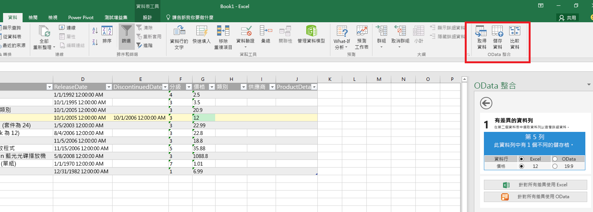
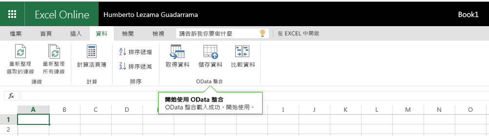

# Excel、Word 和 PowerPoint 的增益集命令

增益集命令是可擴充 Office UI 並啟動增益集中之動作的 UI 元素。您可將功能區的按鈕或項目新增至操作功能表。當使用者選取增益集命令時，這些命令就會啟始動作，例如執行 JavaScript 程式碼，或顯示工作窗格中的增益集頁面。增益集命令協助使用者尋找和使用增益集，使得增益集的採用及重複使用得以提升，並且提高消費者忠誠度。

如需功能的概觀，請參閱影片[Office 功能區中的增益集命令](https://channel9.msdn.com/events/Build/2016/P551)。

**內含在 Excel Desktop** 
中執行之命令的增益集

**內含在 Excel Online ** 
中執行之命令的增益集

## 命令的功能
目前支援下列命令功能。

**擴充點**

- 功能區索引標籤 - 擴充內建索引標籤，或新建自訂索引標籤。
- 操作功能表 - 擴充選取操作功能表。 

**控制項類型**

- 簡單的按鈕 - 觸發特定動作。
- 功能表 - 包含多個可觸發動作的按鈕。

**動作**

- ShowTaskpane - 顯示一或多個其中載入自訂 HTML 頁面的窗格。
- ExecuteFunction - 載入隱藏的 HTML 頁面，接著執行其中的 JavaScript 函式。 若要顯示函式中的 UI (例如：錯誤、進度及其他輸入等)，您可以使用 [displayDialog](http://dev.office.com/reference/add-ins/shared/officeui) API。  

## 支援的平台
目前在下列平台上支援增益集命令︰

- Office for Windows Desktop 2016 (組建 16.0.6769.0000 或更新版本)
- 使用個人帳戶的 Office Online
- 使用工作/學校帳戶 (預覽) 的 Office Online

將支援更多平台。

## 開始使用增益集命令

如需如何在資訊清單中指定增益集命令的資訊，請參閱[在資訊清單中定義增益集命令](http://dev.office.com/docs/add-ins/outlook/manifests/define-add-in-commands)。

若要開始使用增益集命令，請參閱 GitHub 上的 [Office 增益集命令範例](https://github.com/OfficeDev/Office-Add-in-Commands-Samples/)。

