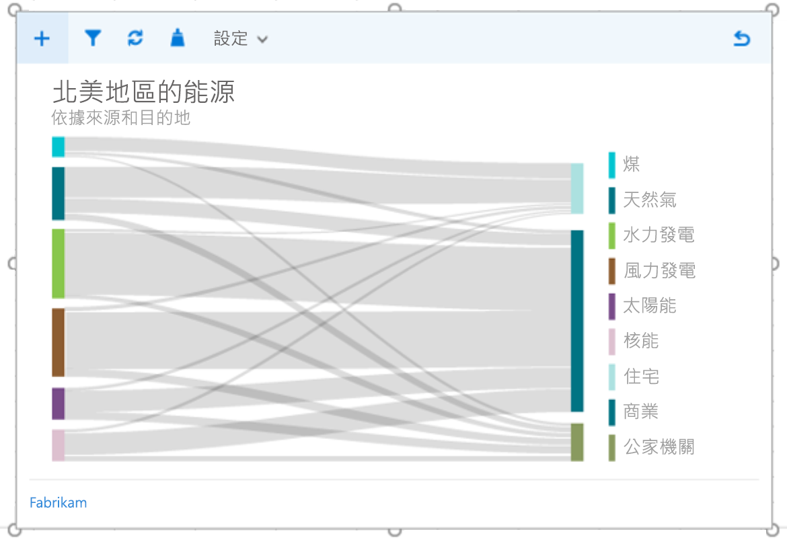
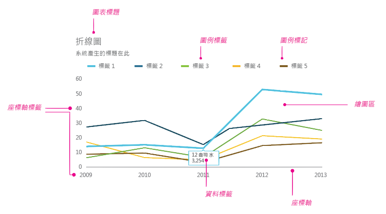
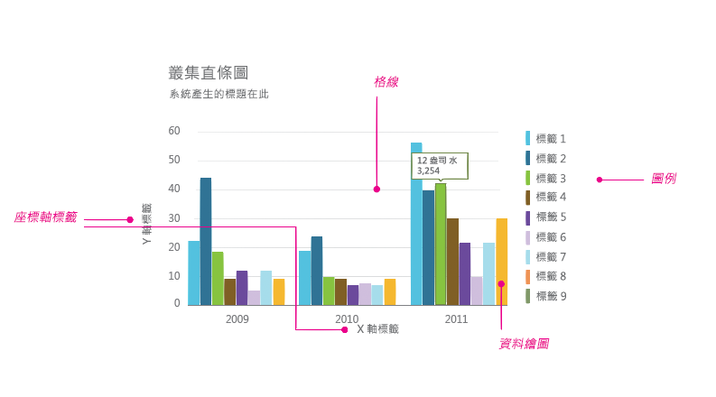
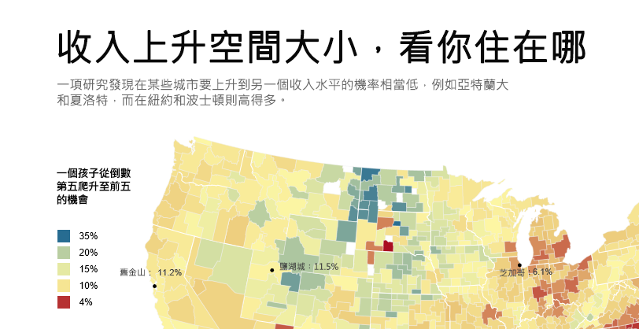
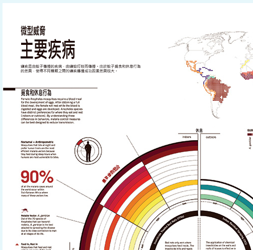
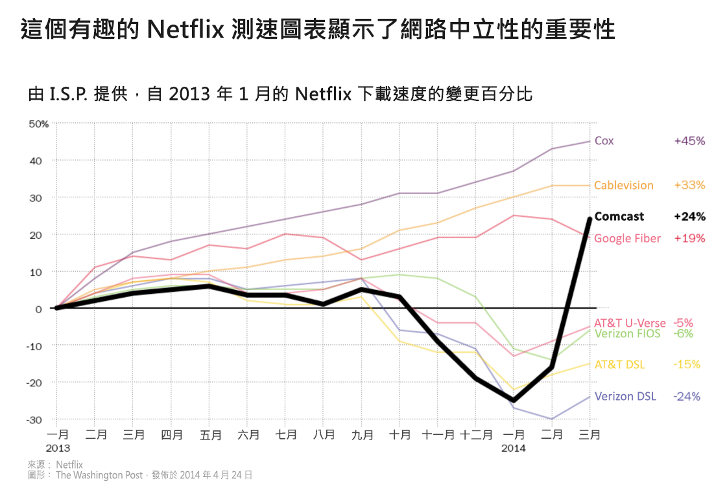

# Office 增益集的資料視覺效果樣式指導方針

良好的資料視覺效果可以協助使用者在他們的資料中尋找深入資訊。 他們可以使用這些深入資訊訴說通知和勸說的故事。 本文提供指導方針以協助您在 Excel 和其他 Office 應用程式的增益集中設計有效的資料視覺效果。

建議您使用 [Office UI Fabric](http://dev.office.com/fabric) 來建立資料視覺效果的組件區塊。 Office UI Fabric 包含樣式和元件，順暢地與 Office 的外觀整合。 

<!--The following figure shows a data visualization in an add-in that uses Fabric.

 

-->

## 資料視覺效果元素

資料視覺效果共用一般架構和一般視覺和互動式元素，包括標題、標籤和資料繪圖，如下圖所示。



### 圖表標題

遵循圖表標題的指導方針：

- 讓您的圖表標題簡單易讀。 放置它們，以建立與其餘圖表相對的清楚視覺階層。
- 一般而言，使用句子大寫 (第一個單字大寫)。 若要建立對比，或加強階層，您可以全部使用大寫，但全部大寫應該謹慎使用。
- 合併 [Office UI Fabric 類型坡形](http://dev.office.com/fabric/styles#typography)，讓您的圖表與使用 Segoe 的 Office UI 一致。 您也可以使用不同的字體來區分 UI 的圖表內容。
- 您可以使用新細明體字體與大型的計數器。

下列範例會顯示在圖表標題中使用的細明體和新細明體字體。 請注意比例對比和如何有效地使用空白字元，建立強式的視覺階層。



### 座標軸標籤

請座標軸標籤夠濃，可以很明顯地讀取，具有文字及背景色彩之間足夠的對比比例。 請確定它們不是那麼濃，而與資料筆跡競爭。

淺灰色對於座標軸標籤最有效。 如果您使用 Fabric，請參閱[中性色彩調色盤](http://dev.office.com/fabric/styles#colors)。

### 資料筆跡

像素，代表圖表中實際資料參考做為資料筆跡。 這應該是視覺效果的中央焦點。 避免使用下拉式陰影、濃厚的外框，或歪曲或與資料競爭的不必要設計元素。 只有當資料值繫結至色彩值時使用漸層。 除非可以測量的目標值繫結至第三個維度，否則請避免立體圖表。

### 色彩

選擇遵循作業系統或應用程式主題的色彩，而不是硬式編碼色彩。 同時，請確定您所套用的色彩不會資料失真。 資料視覺效果色彩的誤用可能會導致資料失真的情況，以及不正確的讀取資訊。

如需在資料視覺效果中使用色彩的最佳作法，請參閱下列各項︰

- [彩虹色彩為什麼不是資料視覺效果的最佳選項](http://www.poynter.org/2013/why-rainbow-colors-arent-always-the-best-options-for-data-visualizations/224413/)
- [Color Brewer 2.0：製圖的色彩建議](http://colorbrewer2.org/)
- [我想要色調](http://tools.medialab.sciences-po.fr/iwanthue/)

### 格線

格線通常是精確地讀取圖表所需，但應呈現為次要的視覺化元素，增強資料筆跡，不與其競爭。 讓靜態格線細和淺，除非它們特別針對高對比設計。 您也可以使用互動，在使用者與圖表互動時，於內容中建立動態、及時顯示的格線。

淺灰色對於格線最有效。 如果您使用 Fabric，請參閱[中性色彩調色盤](http://dev.office.com/fabric/styles#color)。

下圖顯示使用格線的資料視覺效果。

### 圖例

如有必要，請新增圖例︰

- 區分系列
- 顯示比例或值的變更

請確定您的圖例會增強資料筆跡，而且不會與其競爭。 放置圖例：

- 如果所有圖例項目適合於圖表上，根據預設清除繪圖區左上方。
- 在繪圖區右上方，如果所有圖例項目不適合在圖表上，視需要讓它可捲動。

若要針對可讀性和協助工具最佳化，請將圖例標記對應至相關的圖表圖形。 例如，對於散佈圖和泡泡圖圖例使用圓形圖例標記。 對於折線圖使用線條區段圖例標記。

### 資料標籤和工具提示

請確定資料標籤和工具提示有適當的空白字元和類型變數。 使用演算法來最小化閉塞以及衝突。 例如，工具提示預設可能會出現在資料點右側，但如果偵測到右邊緣則出現在左側。

## 設計原則

Office 設計小組建立下列設計原則集合，我們會在設計 Office 產品套裝程式的新的資料視覺效果時，使用這些集合。

## 視覺化設計原則

- 視覺效果應該接受和增強資料，使其易於瞭解。 反白顯示資料，只有在必須提供內容時，新增支援的元素。 避免不必要的裝飾 (下拉式陰影、外框等等)、圖表垃圾或資料扭曲。
- 視覺效果應鼓勵探索，方法是提供豐富的視覺回饋。 使用建立良好的互動模式、介面控制項和清晰系統意見反應。
- 實現傳統的設計原則。 使用已建立的印刷樣式和視覺化通訊設計原則來增強表單、可讀性和意義。

## 互動設計原則

- 設計以允許探索。
- 允許與物件的直接互動，該物件會顯示新的深入資訊 (例如，透過拖曳排序)。
- 使用簡單、直接、熟悉的互動模型。

如需有關如何設計方便使用的互動式資料視覺效果的詳細資訊，請參閱 [UI 要件及陷阱](http://uitraps.com/)。

## 動作設計原則

動作會遵循刺激物。 視覺化元素應該以相同的速率朝相同的方向移動。 適用於：

- 圖表建立
- 從一個圖表類型轉換為其他圖表類型
- 篩選
- 排序
- 新增或減少資料
- 塗刷或切割資料
- 調整圖表大小

建立原因的認知。 演示動畫時︰

- 一次演示一件事。 
- 在變為為資料筆跡之前，演示座標軸的變更。
- 如果物件以相同的速度朝相同的方向移動，則將物件演示和以動畫顯示為群組。
- 以不超過 4-5 個物件的群組演示資料元素。 檢視器對於獨立追蹤超過 4-5 個物件有困難。

動作新增意義。

- 動畫會增加使用者對於資料變更的理解、提供內容，並且做為非語言表達註解圖層。
- 動作應該發生在視覺效果的有意義座標空間中。
- 調整視覺動畫。 
- 避免不必要的動畫。

動作會遵循資料。

- 保留資料對應。 如果區域繫結到量值，維持該轉換中的區域。
- 維護一致的動畫設計語言。 如果可行的話，將資料視覺效果動畫對應至現有的 Office 動作設計語言。 對於類似圖表類型使用類似動畫。

## 資料視覺效果中的協助工具

- 請勿使用色彩做為傳達資訊的唯一方法。 色盲的人將無法解譯結果。 儘可能使用形狀、大小和色彩之外的方式來傳達資訊。
- 製作所有互動元素，例如按鈕，或挑選清單，可以從鍵盤存取。
- 傳送協助工具事件至螢幕助讀程式，以宣告焦點變更、工具提示等等。

## 其他資源 

- [資料 + 設計：準備和視覺化資訊的簡單介紹](https://infoactive.co/data-design)
- [建置資料視覺效果的五個最佳程式庫](http://www.fastcompany.com/3029760/the-five-best-libraries-for-building-data-vizualizations)
- [量化資訊的視覺顯示](https://www.edwardtufte.com/tufte/books_vdqi)
