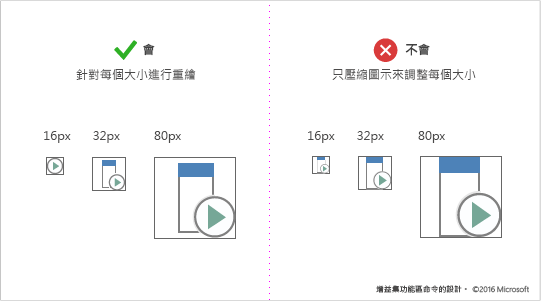
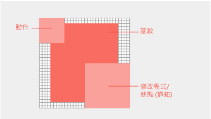

# 設計增益集命令的設計圖示

[增益集命令](add-in-commands.md)加入按鈕、文字和圖示至 Office UI 中。您的增益集命令按鈕必須提供有意義的圖示和標籤，而這會在使用者使用命令時，清楚識別使用者所要採取的動作。這篇文章提供樣式和實際執行的指導方針，協助您設計與 Office完美整合的圖示。 

## Office 圖示設計原則

Office 桌面用戶端的 Office 2013 年版本包含重新整理的圖解。覆寫的字型變更會減少。新的圖示僅包含基本的通訊元素。包括 [遠近景深]、[漸層] 和 [光源] 的非必要項目已移除。簡化的圖示支援更快速剖析的命令和控制項。請遵循此樣式，以符合使用 Office。

Office 圖示根據下列的設計原則︰ 

- Office 圖示集合的現代解譯 
- 新穎但也熟悉  
- 簡單、清楚，而且直接 

下圖顯示套用的現代設計原則的圖示。

## 圖示指導方針
當您建立圖示時，請遵循下列指導方針： 

- 保持 1px 方格，並使用點陣圖來編輯工具，以達到最佳結果。  
- 重繪，不要調整大小。在您調整圖示的大小時，請花一些時間重繪裁剪、邊角和圓邊來放大行的清晰度。 
- 移除讓您的圖示看起來有點混亂的成品。
- 不要重複使用的 Office 功能區或內容功能表中的 Office UI Fabric 圖示。結構圖示會依風格而有所不同，且不會符合。 
- 請避免如同增益集命令一般，依賴您的標誌或品牌以進行通訊。品牌標記不一定在較小的圖示和套用修飾詞時可辨識。品牌標記通常會和 Office 功能區的圖示樣式衝突，且會在飽和的環境中彼此競爭，以吸引使用者的注意。
- 使用協助工具來白色填滿。在您的圖示中的大部分的物件，將需要白色的背景來穿透 Office UI 主題和高對比模式。  
- 使用具有透明背景的 PNG 格式。 
- 避免在您的圖示中有可當地語系化的內容，包括印刷樣式的字元，未對齊段落的指示和問號。 
- 不要對不同的命令重複使用視覺化的隱喻。對不同動作使用相同圖示可能會造成混淆。 
- 讓您的按鈕標籤清楚且簡潔。使用視覺和文字資訊的組合來傳遞意義。 

## 圖示大小的建議和需求

Office 2016 桌面圖示是點陣圖影像。不同的大小將會根據使用者的 DPI 設定和觸控式模式轉譯。併入全部八個支援的大小，來為所有支援的解析度和內容創造最佳的體驗。以下是支援的大小 - -需要三種：

- 16 像素 (必要)
- 20 像素
- 24 像素
- 32 像素 (必要)
- 40 像素
- 48 像素
- 64 像素 (建議，最適合 Mac)
- 80 像素 (必要)  

請確定針對每個大小重繪您的圖示，而不要壓縮圖示以調整大小。

<!--
The following table shows the icon sizes that render for different modes at different DPI settings.

|DPI |**Small**||**Medium**||**Large**||**Extra large**|
|:---|:---|:---|:---|:---|:---|:---|:---|
|    |**Mouse**|**Touch**|**Mouse**|**Touch**|**Mouse**|**Touch**|-|
|100%|16px|20px|24px||32px|40px|48px|
|125%|20px|24px|||40px|48px|60px|
|150%|24px|24px|36px||48px|48px|72px|
|200%|32px|40px|48px||64px|80px|96px|
|250%|40px||||80px||120px|
|300%|48px||||96px||144px

>**Note:** At DPI settings of 150% or greater, the icon does not get swapped out for a larger size when Touch mode is engaged. At DPI settings greater than 250%, Touch mode is turned off by default.

The following table lists the locations for certain icon sizes.

|Location|100% DPI|200% DPI|250% DPI|
|:-------|:-------|:-------|:-------|
|Small ribbon button|16px|32px|40px|
|Contextual menu|16px|32px|40px|
|Quick access toolbar (QAT)|16px|32px|40px|
|Large ribbon icon|32px|64px|80px|

-->

## 圖示剖析和版面配置

Office 圖示通常會是由動作的基底項目，以及重疊概念性修飾詞所組成。 動作修飾詞代表的概念，例如，新增、開啟、新或關閉。概念性修飾詞代表狀態、變更或圖示的描述。 

若要建立和 Office UI 一致的命令，請依照下列基底項目和修飾詞的版面配置指導方針。這可確保您的命令看起來專業，而且您的客戶會信任您的增益集。如果這些指導方針有例外狀況時，可刻意執行這項操作。

下圖顯示在 Office 圖示中基底項目和修飾詞的版面配置。

- 像素框架中的中心基底項目會清空所有周圍邊框距離。
- 將動作修飾詞放在左上方。 
- 將概念性修飾詞放在右下方。
- 顯限制在您的圖示中的項目數。在 32 像素時，限制修飾詞的數目最多為二。在 16 像素時，限制修飾詞的數目為一。

在大小尺寸間一致地放置基底項目。如果基底項目無法置中於框架，將它們對齊至左上角，並將額外的像素移至右下方。若要取得最佳結果，請套用如下表所示的與邊框距離指導方針。

|**圖示大小**|**基底項目周圍的邊框距離**|
|:---|:---|
|16px|0|
|20px|1px|
|24px|1px|
|32px|2px|
|40px|2px|
|48px|3px|
|64px|5px|
|80px|5px|

所有的修飾詞必須在每個項目，包括背景之間擁有 1 像素的透明裁剪。不應該直接重疊項目。建立規則和邊緣之間的空白字元。修飾詞可能會有不同大小，但會使用這些維度做為起點。

|**圖示大小**|**修飾詞大小**|
|:---|:---|
|16px|9px|
|20px|10px|
|24px|12px|
|32px|14px|
|40px|20px|
|48px|22px|
|64px|29px|
|80px|38px|

## 圖示顏色

Office 圖示都有有限的色彩調色盤。使用下表所列的色彩，以確保與 Office UI 緊密整合。套用下列指導方針以使用色彩︰ 

- 使用色彩來傳達意義而非只是裝飾。應該反白顯示或強調動作、狀態或明確地區分有標記的項目。  
- 可能的話，請只能使用超過灰色的一個額外的色彩。最多限制兩個額外色彩。
- 在所有的圖示大小中，色彩應該有一致的外觀。Office 圖示針對不同大小的圖示，會有稍微不同的色彩調色盤。16 像素和較小的圖示比 32 像素和較大的圖示，會稍微深一些且更鮮豔。沒有這些細微的調整，色彩會因為大小不同而相異。   

|**色彩名稱**|**RGB**|**十六進位**|**色彩**|**類別**|
|:---|:---|:---|:---|:---|
|文字灰色 (80)|80、80、80|#505050||文字|
|文字灰色 (95)|95、95、95|#5F5F5F||文字|
|文字灰色 (105)|105、105、105|#696969||文字|
|深灰色 32|128、128、128|#808080||32 及以上|
|中度灰色 32|158、158、158|#9E9E9E||32 及以上|
|所有的淺灰色|179、179、179|#B3B3B3||所有大小|
|深灰色 16|114、114、114|#727272||16 或以下版本|
|中度灰色 16|144、144、144|#909090||16 或以下版本|
|藍色 32|77、130、184|#4d82B8||32 及以上|
|藍色 16|74、125、177|#4A7DB1||16 或以下版本|
|所有的黃色|234、194、130|#EAC282||所有大小|
|橙色 32|231、142、70|#E78E46||32 及以上|
|橙色 16|227、142、70|#E3751C||16 或以下版本|
|所有的粉紅|230、132、151|#E68497||所有大小|
|綠色 32|118、167、151|#76A797||32 及以上|
|綠色 16|104、164、144|#68A490||16 或以下版本|
|紅色 32|216、99、68|#D86344||32 及以上|
|紅色 16|214、85、50|#D65532||16 或以下版本|
|紫色 32|152、104、185|#9868B9||32 及以上|
|紫色 16|137、89、171|#8959AB||16 或以下版本|

## 其他資源

- [增益集開發的最佳作法](../overview/add-in-development-best-practices.md)
- [Excel、Word 和 PowerPoint 的增益集命令](../design/add-in-commands.md)
