# Office 增益集的互動模式

Office 增益集可以增強撰寫及生產力的經驗，以及將 Office 主應用程式中的內容連接到更大型 Web 式工作流程。許多常見案例可套用至您可能會開發的內容、工作窗格和 Outlook 增益集。本文說明一些最常見的案例，並為增益集 UX 提供建議的互動模式。視您的獨特案例而定，您可以細分、合併或混合並符合這些互動模式。

 **常見的增益集案例**

| 增益集類型 | 常見案例 |
| ------ | ------ |
|  內容  |  將資料視覺化   Widget 和工具  |
|  工作窗格  |  轉換和處理資料   有效也有效率地撰寫   尋找內容和插入資料   發行或上載內容至 Web 服務  |
|  Outlook  |  郵件內容與外部應用程式之間的橋接   提供有關郵件或約會內容的更多資訊   提供可協助您提升生產力的資訊  |

## 使用內容增益集將資料視覺化

這個範例會示範利用試算表資料產生圖表的 Excel 內容增益集。

在此互動模式中，除非您選取增益集並將用於產生圖表的資料繫結，否則增益集不會成為作用中。務必說明增益集的目的，以及用來在增益集的初始檢視中啟動它的步驟。 

**利用試算表資料產生圖表的 Excel 內容增益集**
 
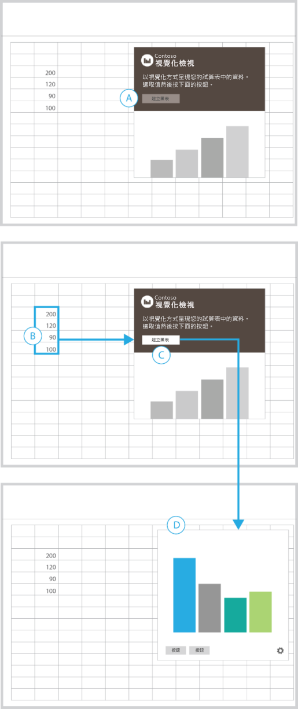
 
<ul><li>
若要強化您必須於選擇按鈕前執行動作，請將指示連同已停用的按鈕 (A) 一併顯示出來。
</li><li>
您選取某個範圍的儲存格之後，[建立的圖] 按鈕會變成作用中 (B-C)。
</li><li>
視覺效果填滿容器，並取代先前的檢視 (D)。
</li><li>
在增益集的下邊緣顯示任何額外的 UI，以及可把您連結到可以重設或管理增益集的檢視之 [設定] 按鈕 (齒輪)。
</li></ul>最適合︰
<ul><li>
在啟動之前必須選取資料的增益集。
</li></ul>

## 使用工作窗格增益集轉換內容

這個範例顯示將文件中的文字翻譯成其他語言的工作窗格增益集。

在此互動模式中，您必須先選取文件中您想要翻譯的文字。

**將文件文字翻譯成其他語言的工作窗格增益集**
 
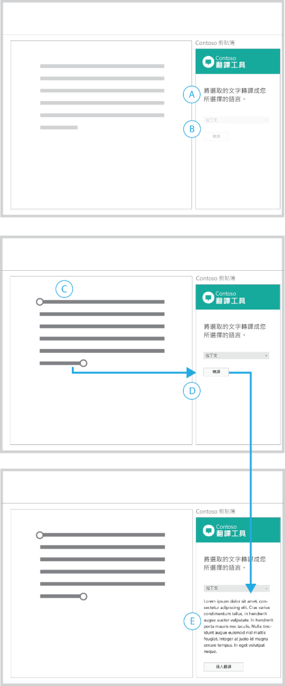
 
<ul><li>
在標題傳達增益集的目的，以及提示您必須先選取項目 (A) 的事實。
</li><li>
語言功能表和 [翻譯] 按鈕已停用，強制您必須先執行動作，才能夠開始。在文件中選取內容之後，這兩個元素會成為作用中 (D)。
</li><li>
在文件中選取翻譯之後，這兩個元素會成為作用中 (D)。
</li><li>
您可以提供傳回給初始檢視的 [清除] 或 [重設] 按鈕。
</li></ul>最適合︰
<ul><li>
在啟動之前必須選取資料的增益集。
</li><li>
隨著您的案例進度展開或顯示的 UI。
</li></ul>

## 使用工作窗格增益集處理資料

這個範例顯示會在 Excel 中檢查資料的工作窗格增益集。

在此互動模式中，您必須選取試算表中要開始的儲存格範圍。

**在 Excel 中檢查資料的工作窗格增益集**
 
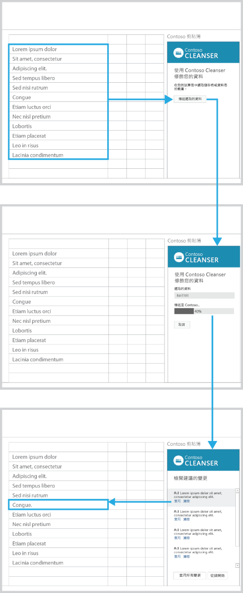
 
<ul><li>
在標題中描述增益集的目的。有助您快速入門的指示。
</li><li>
[傳送選取的資料] 按鈕已停用，強制您必須先執行動作，才能夠開始進行 (A)。
</li><li>
在他們的試算表 (B) 中選取儲存格範圍後，[傳送選取的資料] 按鈕就會啟用。
</li><li>
您選擇這個按鈕之後，UI 會被選取範圍的儲存格、進度列，和 [取消] 按鈕取代。
</li><li>
進度列傳達程序的狀態，[取消] 按鈕可讓您中斷它 (D)。
</li><li>
處理程序完成時，會自動顯示結果 (E)。在清單中選取元素會啟動試算表中對應的儲存格。
</li></ul>最適合︰
<ul><li>
所需的時間長度不確定的處理程序。
</li></ul>

## 使用工作窗格增益集分析內容

這個範例顯示在您輸入文字時顯示文字定義的工作窗格增益集。

在此互動模式中，您必須選取文件中的文字，以查看結果。

**在您輸入文字時顯示文字定義的工作窗格增益集**
 
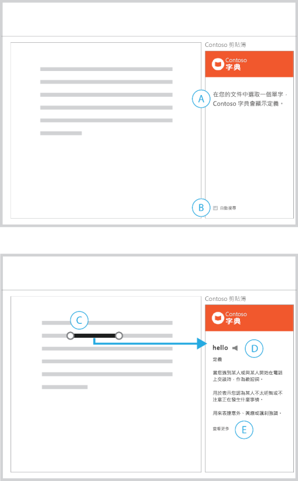
 
<ul><li>
標題說明增益集的用途，以及如何開始 (A)。
</li><li>
預設會啟用自動搜尋，並具有選項可停用它 (B)。
</li><li>
在進行選擇之後，增益集會顯示對應的內容 (D)。
</li><li>
提供可顯示更多資訊的連結 (E)。
</li></ul>最適合︰
<ul><li>
在您撰寫時自動傳回內容的增益集。
</li><li>
在啟動之前必須選取內容的增益集。
</li></ul>

## 使用工作窗格增益集尋找內容

這個範例會顯示用於搜尋內容的工作窗格增益集。

在此互動模式中，您可以在搜尋方塊中輸入字串，或從精選的內容清單中選取來開始。

**搜尋內容的工作窗格增益集**
 
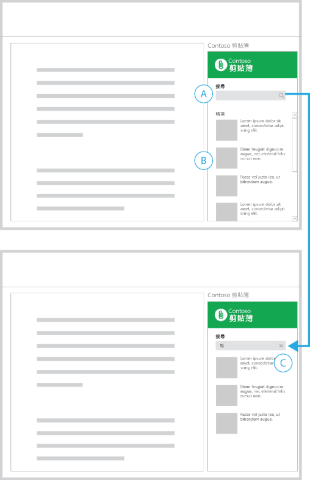
 
<ul><li>
初始檢視包含搜尋方塊 (A) 及精選內容的清單 (B)。
</li><li>
當您在搜尋方塊中輸入字串時，搜尋圖示由關閉圖示取代 (C)。
</li><li>
選擇關閉圖示會讓您回到初始的檢視。
</li></ul>最適合︰
<ul><li>
在您撰寫時自動傳回內容的增益集。
</li><li>
在啟動之前必須選取內容的增益集。
</li></ul>

## 使用工作窗格增益集插入媒體

在此互動模式中，您可以從搜尋結果選取影像，以插入您的文件中。

**插入影像的工作窗格增益集**
 
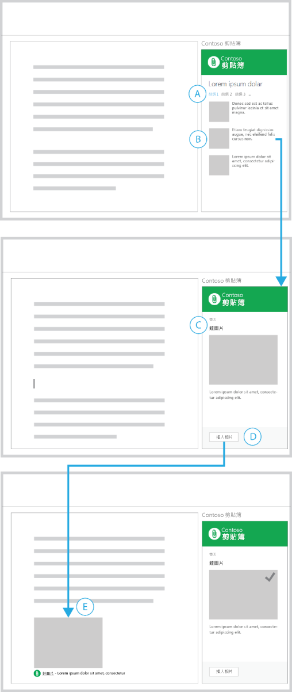
 
<ul><li>
您篩選了搜尋傳回的清單 (A)，並選取要插入的內容清單 (B)。
</li><li>
所選取的內容的詳細資料檢視會顯示 (C)，並具有可讓您回到清單的按鈕。
</li><li>
[插入相片] 按鈕位於頁尾 (D)。選擇這個按鈕之後，影像會插入文件。
</li><li>
影像來自何處的簡短描述會隨著插入的內容併入 (E)。 
</li><li>
增益集中的 UI 可以視覺化方式確認動作的成功。
</li></ul>最適合︰
<ul><li>
用於插入內容的增益集。
</li></ul>

## 使用工作窗格增益集插入選取的文字

在此互動模式中，您會從搜尋結果選取文字，以插入文件中。

**插入文字的工作窗格增益集**
 
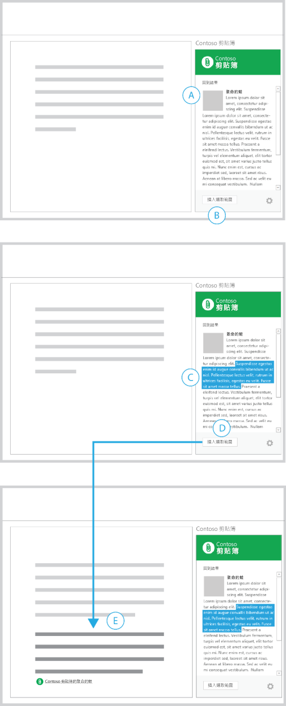
 
<ul><li>
您已經找到一段內容 (A)。
</li><li>
已停用的 [插入選取範圍] 按鈕位於頁尾 (B)。
</li><li>
當您選取文字字串 (C)，[插入選取範圍] 按鈕會變成作用中。
</li><li>
選擇這個按鈕之後，增益集會將選取的文字插入文件並具有內容來源的參考 (E)。
</li></ul>最適合︰
<ul><li>
進行研究和插入內容的增益集。
</li></ul>

## 發佈到使用工作窗格增益集的 Web 服務

這個範例會顯示將文件發佈成部落格文章的工作窗格增益集。

在此互動模式中，您已完成在文件中撰寫內容，並且想要張貼到您的部落格。

**將文件發佈成部落格文章的工作窗格增益集**
 
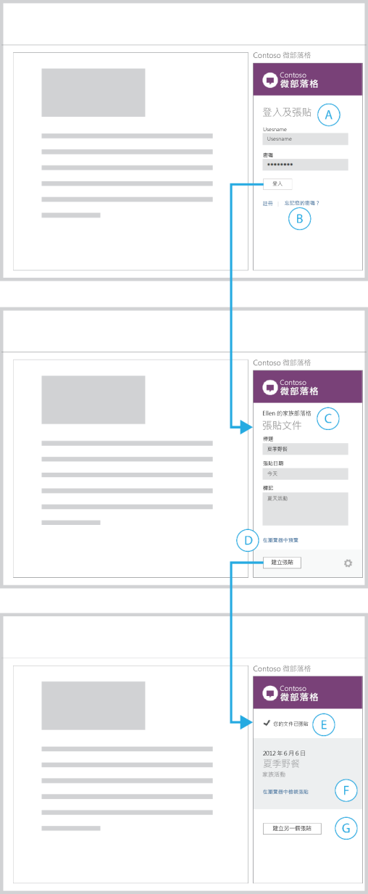
 
<ul><li>
首先，會顯示登入表單，要求您輸入認證 (A)。
</li><li>
提供用於建立帳號和處理一般登入問題的連結 (B)。選擇這些連結，則會在瀏覽器中開啟這些網頁。
</li><li>
您登入之後，增益集就會顯示用來建立新的部落格文章的表單 (C)。
</li><li>
您登入 (並進行張貼) 的帳戶名稱會顯示在增益集上方。增益集提供預覽文章的連結 (D)。選擇此連結會在瀏覽器中顯示預覽。
</li><li>
選擇 [建立文章] 之後，增益集會顯示一個檢視，確認已張貼文件內容 (E)。
</li><li>
增益集提供在瀏覽器中檢視此文章的連結 (F)，以及用來建立另一個文章的按鈕 (G)。
</li></ul>最適合︰
<ul><li>
對社交網路、部落格網站和 Web 服務輸出、發佈或共用內容的增益集。
</li><li>
要求您登入服務的增益集。
</li></ul>

## 取得使用 Outlook 增益集之人員的詳細資訊

 **範例 1**

**結果和詳細資料頁面**
 
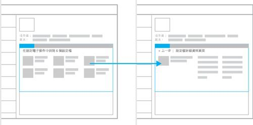
 
最適合︰
<ul><li>
如果您有對展示有幫助的大型資料集，可揭露內容的廣度。
</li><li>
使用完整的增益集容器大小的詳細資料網頁
</li><li>
可從「往返」流程獲益的瀏覽模型。
</li></ul>
 **範例 2**

**使用持續性瀏覽的詳細資料網頁**
 
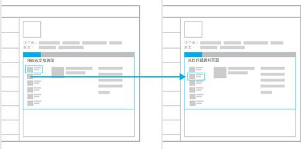
 
最適合︰
<ul><li>
會根據預設顯示資料集的第一個結果。
</li><li>
瀏覽結構的作用類似索引標籤 (單層線性導覽)。
</li><li>
隨時保持瀏覽，以減少選取的動作。
</li><li>
提供空間以隨時顯示瀏覽。
</li></ul>

## 取得使用 Outlook 增益集之內容的詳細資訊

 **範例 1**

**結果和詳細資料頁面**
 
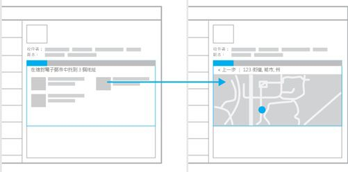
 
最適合︰
<ul><li>
如果您有對顯示有幫助的大型資料集，可揭露內容的廣度。
</li><li>
要求您在顯示更多詳細資料之前進行選擇。
</li><li>
使用完整的增益集容器大小的詳細資料網頁。
</li><li>
可從「往返」流程獲益的瀏覽模型。
</li></ul>
 **範例 2**

**具有次要內容的詳細資料頁面**
 
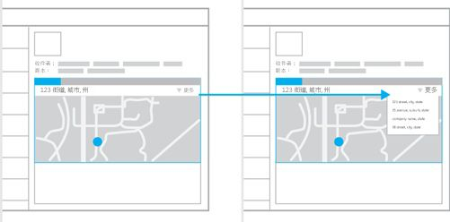
 
最適合︰
<ul><li>
您想要精選某項內容的情況。
</li><li>
揭露您的內容，而無需使用者互動。
</li><li>
持續性的瀏覽 (可以加入這個模型，以獲得簡潔和輕鬆瀏覽的混合)。
</li></ul>

## 連線到線上服務及展示資料

這些範例顯示用於從線上服務取得資料和內容的互動模式。它可用於所有三種增益集類型︰內容增益集、工作窗格增益集和 Outlook 增益集。

 **範例 1**

**浮動切換**
 
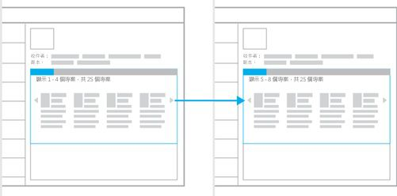
 
最適合︰
<ul><li>
小量資料可一次揭露一個，或以群組形式揭露。
</li><li>
以圖庫格式揭露內容，例如投影片或影像圖庫。
</li><li>
下一頁/上一頁瀏覽模型可正常運作時。
</li></ul>
 **範例 2**

**精靈**
 
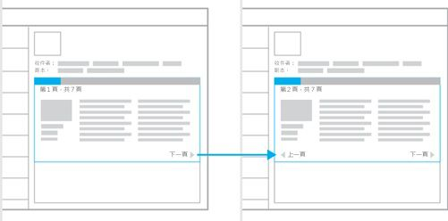
 
最適合︰
<ul><li>
需要以特定順序顯示的內容。
</li><li>
大量內容分成小型片段是最佳的取用方式。
</li><li>
類似書籍的取用經驗。
</li><li>
需要一系列的步驟或動作才能完成工作時。
</li></ul>
 **範例 3**

**表單、結果及詳細資料**
 
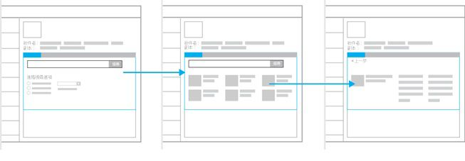
 
最適合︰
<ul><li>
需要輸入資料的增益集。
</li><li>
結果與詳細資料模式的進入點。
</li></ul>

## 其他資源

- [Office 增益集的設計指導方針](../add-in-design.md)
    
