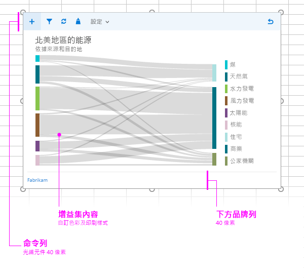

#內容增益集的版面配置

運用建議的設計版面配置，可為您的內容增益集建立一致的外觀和風格。內容增益集的建議版面配置包括下列元素： 

- 命令列 (選用) - 包含圖示或使用者導覽，可與增益集內容重疊。高度上限為 80 像素。
- 增益集內容
- 品牌元素 (選用)

您也可以在內容增益集中加入[自訂的 HTML 架構 UI](ui-elements.md#custom-HTML-based-UI)。

如需示範如何在 Office 增益集中使用 Office UI Fabric 的範例，請參閱 [Office 增益集 Fabric UI 範例](https://github.com/OfficeDev/Office-Add-in-Fabric-UI-Sample)。

<!-- Add sample template for content add-in and individual building blocks - Command Bar, Input, layout components. -->
