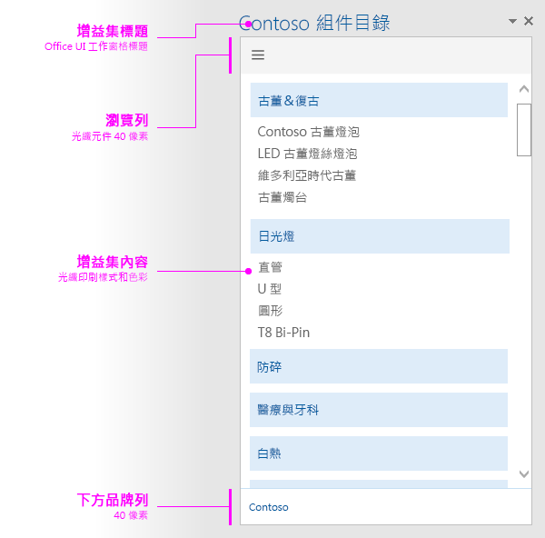

#工作窗格容器的版面配置

運用建議的設計版面配置，可為您的工作窗格容器建立一致的外觀和風格。工作窗格的建議版面配置包含下列元素： 

- 導覽元素 (選用) - 包括品牌元素 (若您有使用) 下方的導覽列或樞紐列，高度上限為 80 像素。
- 增益集內容
- 品牌元素 (選用)

您也可以在工作窗格中加入[自訂的 HTML 架構 UI](ui-elements.md#custom-HTML-based-UI)。

如需示範如何在 Office 增益集中使用 Office UI Fabric 的範例，請參閱 [Office 增益集 Fabric UI 範例](https://github.com/OfficeDev/Office-Add-in-Fabric-UI-Sample)。

<!-- Add sample template for content add-in and individual building blocks - Branding, Navigation bar or pivot, input, layout components -->
