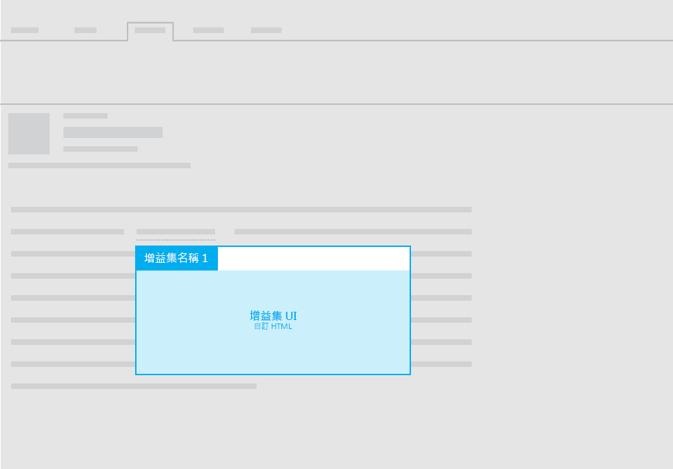

#郵件增益集的版面配置

您可以為郵件增益集使用下列任何一個版面配置：

- 工作窗格
- 關聯式
- 具有資訊列通知的函數

如需增益集內 UI 文字的相關指導方針，請參閱 [Office 語音](https://msdn.microsoft.com/en-us/library/office/mt484351.aspx)。

##工作窗格
 如需郵件增益集的工作窗格版面配置的相關建議，請參閱[工作窗格增益集的版面配置](layout-for-task-pane-add-ins.md)。

##關聯式增益集

下圖顯示[內容相關式郵件增益集](https://msdn.microsoft.com/EN-US/library/office/dn893542.aspx)的建議版面配置。

##具有資訊列通知的函數

除了在郵件增益集內使用工作窗格或關聯式窗格來顯示自訂 HTML UI，您也可以從命令執行函數。需要將 UI 文字顯示為函數的結果時，可以使用資訊列通知。例如，您可以使用資訊列通知來顯示錯誤或成功訊息。 

如需詳細資訊，請參閱 [郵件的增益集命令](https://msdn.microsoft.com/EN-US/library/office/mt267546.aspx)。 

