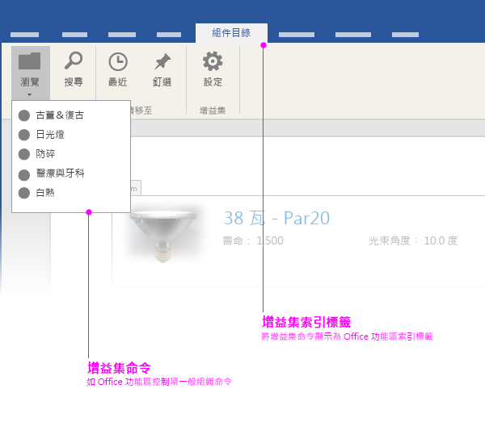

# Office 增益集 UI 元素

您可以在 Office 增益集內使用兩種 UI 元素類型： 

- 增益集命令 
- 自訂 HTML 介面

## 增益集命令
命令在[增益集 XML 資訊清單](../../outlook/manifests/define-add-in-commands.md)中定義，並在 Office UI 中呈現為原生 UX 擴充功能。例如，您可以使用增益集命令來新增按鈕至 Office 功能區。 

目前，增益集命令僅支援郵件增益集。若要深入了解，請參閱[郵件的增益集命令](../../outlook/add-in-commands-for-outlook.md)。 

Excel、PowerPoint 和 Word 在 Office 功能區的 [插入] 索引標籤上，有預先定義的工作窗格和內容增益集進入點。內容和工作窗格增益集的自訂命令功能即將推出。 

![顯示 Word 功能區上 [插入] 索引標籤的影像](../../../images/Word-insert-tab.png)

## 自訂 HTML 架構 UI
增益集可以在 Office 用戶端中內嵌自訂的 HTML 架構 UI。用於顯示 UI 的容器，會根據增益集的類型而有所不同。例如，工作窗格增益集會在文件的右窗格中顯示自訂 HTML 架構 UI；而內容增益集則直接在 Office 文件中顯示自訂 UI。

不論建立的增益集類型為何，您都可以使用通用建置組塊來建立自訂 HTML 架構 UI。我們建議您使用這些 UI 元素的 [Office UI Fabric](https://github.com/OfficeDev/Office-UI-Fabric)，讓您的增益集可與 Office 外觀和風格整合。也歡迎您使用自己的 UI 元素來表達您的品牌。

Office UI Fabric 提供下列 UI 元素：

- 印刷樣式
- 色彩
- 圖示
- 動畫
- 輸入元件
- 版面配置
- 導覽元素

您可以[從 Github 下載 Office UI Fabric](https://github.com/OfficeDev/Office-UI-Fabric)。

如需示範如何在增益集中使用 Office UI Fabric 的範例，請參閱 [Office 增益集 Fabric UI 範例](https://github.com/OfficeDev/Office-Add-in-Fabric-UI-Sample)。

**附註：**如果您決定要使用自己的字型及圖示集，請確定它們不會與 Office 的字型及圖示產生衝突。例如，不要在增益集中使用相同或類似於 Office 的圖示，卻代表不同的意義。 

### 建立自訂的調色盤
如果您決定使用自己的調色盤，請務必記住下列幾點： 
 
- 使用色彩是為了傳達您的品牌價值給使用者，以及為您的增益集使用者經驗增添情感和愉悅感。
- 增益集的色彩運用應有意義且一致。例如，選定一個色彩以為增益集提供一致的視覺主題。
- 互動式與非互動式元素不要使用相同的色彩。如果您使用某個色彩來表示使用者可與其互動的元素，例如導覽、連結及按鈕，請勿對靜態元素使用同樣的色彩。
- 如果您使用彩色文字或彩色背景搭配白色文字，請確認色彩有足夠的對比度，符合協助工具規則 (4.5:1 對比率)。
- 照顧色盲使用者，不要只使用色彩來表示互動功能。

### 佈景主題 
無論您決定採用 Office 色彩配置還是使用您自己的色彩配置，我們都鼓勵您使用我們的「佈景主題 API」。與 Office 佈景主題經驗一致的增益集，會呈現更融洽的 Office 整合感。

- 若為郵件和工作窗格增益集，請使用 [Context.officeTheme](../../../reference/shared/office.context.officetheme.md) 以符合 Office 應用程式的佈景主題。此 API 目前僅適用於 Office 2016。  
- 若為 PowerPoint 內容增益集，請參閱[在 PowerPoint 增益集中使用 Office 佈景主題](../../powerpoint/use-document-themes-in-your-powerpoint-add-ins.md)。

<!-- Link to theming API docs and Humberto's seed sample. Add screenshot of themed add-in. -->

