# Office 增益集的 UX 設計模式範本 

[Office 增益集的 UX 設計模式專案](https://github.com/OfficeDev/Office-Add-in-UX-Design-Patterns-Code "Office 增益集的 UX 設計模式專案")包含用來為增益集建立 UX 的 HTML、JavaScript 及 CSS 檔案。   

UX 設計模式專案的功用：

* 為常見客戶案例套用解決方案。
* 套用設計最佳做法。
* 納入 [Office UI 結構](https://dev.office.com/fabric/getting-started/)元件與樣式。
* 建置以視覺化方式整合預設 Office UI 的增益集。  

## 使用 UX 設計模式

當您要建立自己的 UX 設計時，可以使用 [UX 設計工具的規格](https://github.com/OfficeDev/Office-Add-in-Design-Patterns/blob/master/Patterns/Source%20Files)做為指引，或可以直接將[原始程式碼](https://github.com/OfficeDev/Office-Add-in-UX-Design-Patterns-Code/tree/master/templates)新增至您的專案。

若要使用規格來建置自己的增益集 UI 模擬：

1. 下載 [UX 設計模式](https://github.com/OfficeDev/Office-Add-in-UX-Design-Patterns)。
2. 使用 [Word](https://github.com/OfficeDev/Office-Add-in-UX-Design-Patterns/blob/master/Helpful%20Templates/AddIn_Template_Word_Desktop_reference.pdf)、[Excel](https://github.com/OfficeDev/Office-Add-in-UX-Design-Patterns/blob/master/Helpful%20Templates/AddIn_Template_Excel_Desktop_reference.pdf) 或 [PowerPoint](https://github.com/OfficeDev/Office-Add-in-UX-Design-Patterns/blob/master/Helpful%20Templates/AddIn_Template_PowerPoint_Desktop_reference.pdf) 範本來模擬桌面或平板電腦的擴充點。
3. 複製及修改 [UX 設計模式](https://github.com/OfficeDev/Office-Add-in-UX-Design-Patterns/tree/master/Patterns)以滿足您的特定需求。
4. 若要瀏覽 [Office UI 結構圖示主要工作表](https://github.com/OfficeDev/Office-Add-in-UX-Design-Patterns/blob/master/Helpful%20Templates/OfficeUIFabric_icon_mastersheet.pdf)、檢視 Word、Excel 及 PowerPoint 的擴充點 (如 [Excel iPad](https://github.com/OfficeDev/Office-Add-in-UX-Design-Patterns/blob/master/Helpful%20Templates/AddIn_Template_Excel_iPad_reference.pdf) 和 [Excel Windows Desktop](https://github.com/OfficeDev/Office-Add-in-UX-Design-Patterns/blob/master/Helpful%20Templates/AddIn_Template_Excel_Desktop_reference.pdf))，或[完成增益集命令的圖示](https://github.com/OfficeDev/Office-Add-in-UX-Design-Patterns/blob/master/Helpful%20Templates/Icon_production.pdf)，請參閱範本。

若要新增原始原始碼︰

1. 複製 [Office 增益集的 UX 設計模式專案儲存機制](https://github.com/OfficeDev/Office-Add-in-UX-Design-Patterns-Code "Office 增益集的 UX 設計模式專案儲存機制")。 
2. 將[資產資料夾](https://github.com/OfficeDev/Office-Add-in-UX-Design-Pattern-Code/tree/master/assets)及您所選的個別模式的程式碼資料夾，複製到您的增益集專案。  
3. 將個別模式納入您的增益集。例如：
    - 編輯資訊清單中的來源位置或增益集命令 URL。
    - 使用 UX 設計模式作為其他網頁的範本。
    - 從 UX 設計模式連結或連結至 UX 設計模式。

## UX 設計模式的類型
### 泛型頁面

泛型頁面範本可套用至增益集內的任何頁面，它們沒有特殊的用途。 任何初次執行模式即是特殊用途頁面的範例。 以下清單說明可用的泛型頁面：

* **登陸頁面** - 標準增益集頁面，如初次執行體驗或登入程序後使用者登陸的頁面。 
    * [登陸頁面規格](https://github.com/OfficeDev/Office-Add-in-Design-Patterns/blob/master/Helpful%20Templates/AddIn_Template_Standard_Layout.pdf "PDF")
    * [登陸頁面程式碼](https://github.com/OfficeDev/Office-Add-in-UX-Design-Patterns-Code/tree/master/templates/generic/landing-page)
* **商標列中的商標影像** - 是登陸頁面，在頁尾具有代表您的品牌的影像。 
    * [商標列規格](https://github.com/OfficeDev/Office-Add-in-UX-Design-Patterns/blob/master/Patterns/Brand_Bar.md)
    * [商標列程式碼](https://github.com/OfficeDev/Office-Add-in-UX-Design-Patterns-Code/tree/master/templates/generic/brand-bar)

<table>
 <tr><th>登陸</th><th>商標列</th></tr>
 <tr><td><A href="https://github.com/OfficeDev/Office-Add-in-UX-Design-Patterns-Code/tree/master/templates/generic/landing-page">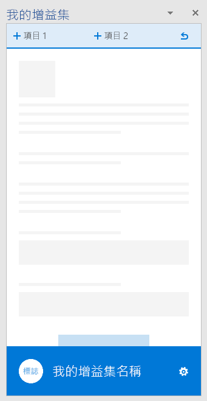</A></td>
<td><A href="https://github.com/OfficeDev/Office-Add-in-UX-Design-Patterns-Code/tree/master/templates/generic/brand-bar">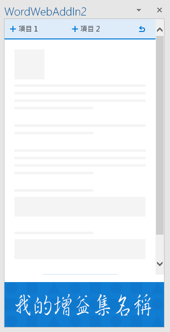</A></td></tr>
 </table>
 
### 初次執行體驗

初次執行體驗是使用者第一次開啟增益集時的體驗。 以下是可用的初次執行設計模式範本： 

* **啟動步驟** - 為使用者提供步驟排序清單，即可開始使用增益集。 
    * [啟動步驟規格](https://github.com/OfficeDev/Office-Add-in-Design-Patterns/blob/master/Patterns/FirstRun_StepsToStart.md)
    * [啟動步驟程式碼](https://github.com/OfficeDev/Office-Add-in-UX-Design-Patterns-Code/tree/master/templates/first-run/instruction-step)
* **值** - 傳達了增益集的價值主張。
    * [值規格](https://github.com/OfficeDev/Office-Add-in-Design-Patterns/blob/master/Patterns/FirstRun_ValuePlacemat.md)
    * [值程式碼](https://github.com/OfficeDev/Office-Add-in-UX-Design-Patterns-Code/tree/master/templates/first-run/value-placemat)
* **影片** - 在使用者開始使用增益集前會向其顯示影片。
    * [影片規格](https://github.com/OfficeDev/Office-Add-in-Design-Patterns/blob/master/Patterns/FirstRun_VideoPlacemat.md)
    * [影片程式碼](https://github.com/OfficeDev/Office-Add-in-UX-Design-Patterns-Code/tree/master/templates/first-run/video-placemat)
* **逐步解說** - 在使用者開始使用增益集前，會先帶他們了解一系列功能或資訊。
    * [逐步解說規格](https://github.com/OfficeDev/Office-Add-in-Design-Patterns/blob/master/Patterns/FirstRun_PagingPanel.md)
    * [逐步解說程式碼](https://github.com/OfficeDev/Office-Add-in-UX-Design-Patterns-Code/tree/master/templates/first-run/walkthrough)


  [Office 市集](https://msdn.microsoft.com/en-us/library/office/jj220033.aspx)具有管理增益集試用版的系統，但是如果您想要控制增益集試用版體驗的 UI，請使用下列模式︰

* **試用版** - 向使用者示範如何開始使用增益集試用版。
    * [試用版規格](https://github.com/OfficeDev/Office-Add-in-Design-Patterns/blob/master/Patterns/FirstRun_TrialVersion.md)
    * [試用版程式碼](https://github.com/OfficeDev/Office-Add-in-UX-Design-Patterns-Code/tree/master/templates/first-run/trial-placemat)
* **試用版功能** - 告知使用者，他們嘗試使用的功能在增益集試用版中無法使用。 或者，如果您的增益集是免費的，但是包含需要訂閱的功能，請考慮使用這種模式。 您也可以使用這種模式，在試用版結束後，提供降級的經驗。
    * [試用版功能規格](https://github.com/OfficeDev/Office-Add-in-UX-Design-Patterns/blob/master/Patterns/FirstRun_TrialFeature.md)
    * [試用版功能程式碼](https://github.com/OfficeDev/Office-Add-in-UX-Design-Patterns-Code/tree/master/templates/first-run/trial-placemat-feature)

> **重要事項：**如果您決定要管理您自己的試用版，並且不使用 Office 市集來管理試用版，請確保您在賣方儀表板中的測試附註包含**可能需要另外購買**標記。

請考慮對您的案例來說，向使用者顯示一次或多次初次執行體驗是否很重要。 例如，如果使用者偶爾使用您的增益集，他們可能會忘記如何使用，因此多次參考初次執行體驗也許能幫助他們。 

 <table>
 <tr><th>啟動步驟</th><th>值</th><th>影片</th></tr>
 <tr>
<td><A href="https://github.com/OfficeDev/Office-Add-in-UX-Design-Patterns-Code/tree/master/templates/first-run/instruction-step">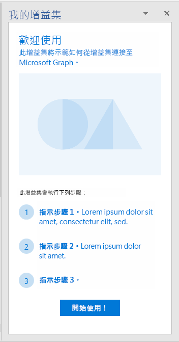</A></td>
<td><A href="https://github.com/OfficeDev/Office-Add-in-UX-Design-Patterns-Code/tree/master/templates/first-run/value-placemat">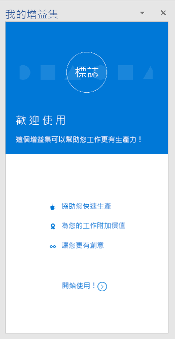</A></td>
<td><A href="https://github.com/OfficeDev/Office-Add-in-UX-Design-Patterns-Code/tree/master/templates/first-run/video-placemat">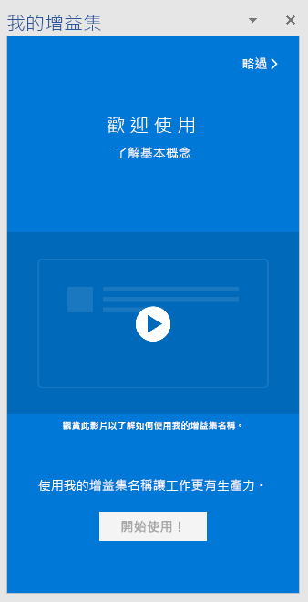</A></td></tr>
 </table>

 <table>
 <tr><th>逐步解說第一頁</th><th>試用版</th><th>試用版功能</th></tr>
 <tr>
<td><A href="https://github.com/OfficeDev/Office-Add-in-UX-Design-Patterns-Code/tree/master/templates/first-run/walkthrough">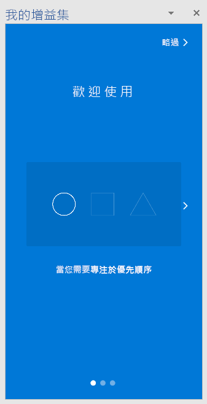</A></td>
<td><A href="https://github.com/OfficeDev/Office-Add-in-UX-Design-Patterns-Code/tree/master/templates/first-run/trial-placemat">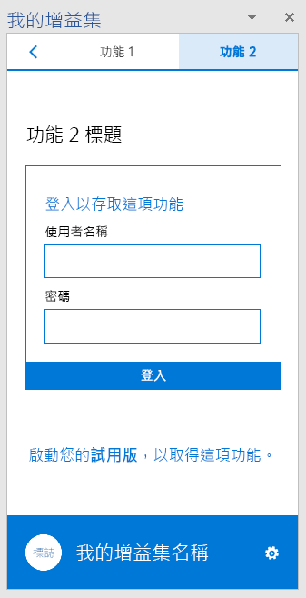</A></td>
<td></td></tr>
 </table> 

### 瀏覽

使用者需要在增益集的不同頁面之間瀏覽。 以下瀏覽範本展示各種用來在增益集內組織頁面和命令的選項。

* **上一步按鈕和下一頁** - 顯示含 [上一步] 和 [下一頁] 按鈕的工作窗格。 此模式能確保使用者遵循已排序的一連串步驟。
    * [上一步按鈕和下一頁規格](https://github.com/OfficeDev/Office-Add-in-UX-Design-Patterns/blob/master/Patterns/Back_Button.md)
    * [上一步按鈕和下一頁程式碼](https://github.com/OfficeDev/Office-Add-in-UX-Design-Patterns-Code/tree/master/templates/navigation/back-button) 
* **瀏覽** - 在工作窗格中顯示含頁面功能表項目的功能表 (通常稱為漢堡功能表)。 
    * [瀏覽規格](https://github.com/OfficeDev/Office-Add-in-UX-Design-Patterns/blob/master/Patterns/Navigation.md)
    * [瀏覽程式碼](https://github.com/OfficeDev/Office-Add-in-UX-Design-Patterns-Code/tree/master/templates/navigation/navigation) 
* **使用命令進行瀏覽** - 在工作窗格內顯示含命令 (或動作) 按鈕的漢堡功能表。 當您想要同時提供瀏覽和命令選項時，請使用此模式。  
    * [使用命令進行瀏覽規格](https://github.com/OfficeDev/Office-Add-in-UX-Design-Patterns/blob/master/Patterns/Navigation_%26_Commands.md)
    * [使用命令進行瀏覽程式碼](https://github.com/OfficeDev/Office-Add-in-UX-Design-Patterns-Code/tree/master/templates/navigation/navigation-commands)
* **樞紐** - 在工作窗格內顯示樞紐瀏覽。 使用樞紐瀏覽允許使用者在不同的內容之間瀏覽。
    * [樞紐規格](https://github.com/OfficeDev/Office-Add-in-UX-Design-Patterns/blob/master/Patterns/Pivot.md)
    * [樞紐程式碼](https://github.com/OfficeDev/Office-Add-in-UX-Design-Patterns-Code/tree/master/templates/navigation/pivot)
* **索引標籤列** - 使用含垂直堆疊之文字和圖示的按鈕顯示瀏覽。 透過索引標籤列，您可以使用含簡短和描述性標題的索引標籤提供瀏覽。
    * [索引標籤列規格](https://github.com/OfficeDev/Office-Add-in-UX-Design-Patterns/blob/master/Patterns/Tab_Bar.md)
    * [索引標籤列程式碼](https://github.com/OfficeDev/Office-Add-in-UX-Design-Patterns-Code/tree/master/templates/navigation/tab-bar) 

<table>
<tr><th>上一步按鈕</th><th>瀏覽</th><th>使用命令進行瀏覽</th></tr>
<tr>
    <td>
        <A href="https://github.com/OfficeDev/Office-Add-in-UX-Design-Patterns-Code/tree/master/templates/navigation/back-button">
        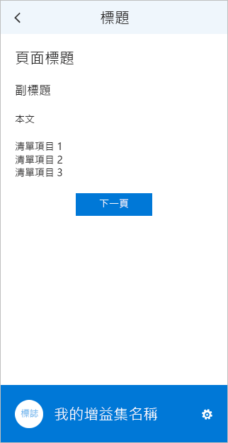</A>
    </td>
    <td>
        <A href="https://github.com/OfficeDev/Office-Add-in-UX-Design-Patterns-Code/tree/master/templates/navigation/navigation">
        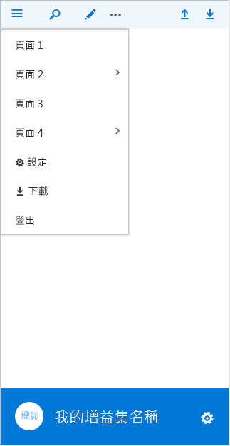</A>
    </td>
    <td>
        
    </td>
</tr>
 </table>

<table>
<tr><th>樞紐</th><th>索引標籤列</th></tr>
<tr><td><A href="https://github.com/OfficeDev/Office-Add-in-UX-Design-Patterns-Code/tree/master/templates/navigation/pivot">
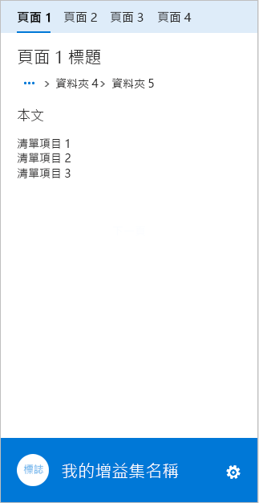</A></td>
<td><A href="https://github.com/OfficeDev/Office-Add-in-UX-Design-Patterns-Code/tree/master/templates/navigation/tab-bar">
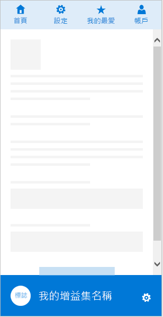</A></td>
</tr>
 </table>

### 通知

增益集可以透過多種方法通知使用者有關事件 (例如錯誤) 或進度的資訊。 以下是可用的通知範本︰ 

* **內嵌對話方塊** - 在工作窗格顯示對話方塊，其中提供資訊，並使用按鈕或其他控制項選擇性地提供互動式體驗。 請考慮使用其中一種來提示使用者確認動作。 當您想要將使用者體驗維持在工作窗格內時，請使用內嵌對話方塊模式。
    * [內嵌對話方塊規格](https://github.com/OfficeDev/Office-Add-in-Design-Patterns/blob/master/Patterns/Embedded_Dialog.md)
    * [內嵌對話方塊程式碼](https://github.com/OfficeDev/Office-Add-in-UX-Design-Patterns-Code/tree/master/templates/notifications/embedded-dialog)
* **內嵌訊息** - 表示錯誤、成功或資訊，而且它可以出現在工作窗格中的指定位置。 例如，如果使用者在文字方塊中輸入格式不正確的電子郵件地址，錯誤訊息就會出現在文字方塊的正下方。 
    * [內嵌訊息規格](https://github.com/OfficeDev/Office-Add-in-Design-Patterns/blob/master/Patterns/Notification_Inline_Message.md)
    * [內嵌訊息程式碼](https://github.com/OfficeDev/Office-Add-in-UX-Design-Patterns-Code/tree/master/templates/notifications/inline-message)
* **訊息橫幅** - 提供資訊，並選擇性地提供簡單的動作呼叫，該橫幅可摺疊成一行、展開成好幾行，或將其關閉。 訊息橫幅可用來在增益集啟動時報告服務更新或有用的提示。 
    * [訊息橫幅規格](https://github.com/OfficeDev/Office-Add-in-UX-Design-Patterns/blob/master/Patterns/Notification_MessageBanner.md)
    * [訊息橫幅程式碼](https://github.com/OfficeDev/Office-Add-in-UX-Design-Patterns-Code/tree/master/templates/notifications/message-banner)
* **進度列** - 指出長時間執行、同步處理程序 (例如使用者在能夠採取任何動作前必須完成的設定工作) 的進度。 它是個別的插入式頁面，其中同時會強調增益集的品牌。 當程序可以定期將程序還需多久時間的量值傳回增益集時，請使用進度列。
    * [進度列規格](https://github.com/OfficeDev/Office-Add-in-UX-Design-Patterns/blob/master/Patterns/Notification_Progress.md)
    * [進度列程式碼](https://github.com/OfficeDev/Office-Add-in-UX-Design-Patterns-Code/tree/master/templates/notifications/progress-bar)
* **載入狀態圓環** - 表示長時間執行、同步處理程序正在進行中，但不會顯示還需多久的時間。 它是個別的插入式頁面，其中同時會強調增益集的品牌。 當增益集無法知道處理程序還需多久時，請使用載入狀態圓環。 
    * [載入狀態圓環規格](https://github.com/OfficeDev/Office-Add-in-UX-Design-Patterns/blob/master/Patterns/Notification_Progress.md)
    * [載入狀態圓環程式碼](https://github.com/OfficeDev/Office-Add-in-UX-Design-Patterns-Code/tree/master/templates/notifications/spinner)
* **快顯通知** - 提供幾秒鐘後即會淡出的簡短訊息。 因為使用者可能不會看到訊息，只對非必要的資訊才使用快顯通知。 這是一個好選擇，可用在遠端系統中通知使用者接收電子郵件之類的事件。
    * [快顯通知規格](https://github.com/OfficeDev/Office-Add-in-UX-Design-Patterns/blob/master/Patterns/Notification_Toast.md)
    * [快顯通知程式碼](https://github.com/OfficeDev/Office-Add-in-UX-Design-Patterns-Code/tree/master/templates/notifications/toast)

 <table>
 <tr><th>內嵌對話方塊</th><th>內嵌訊息</th><th>訊息橫幅</th></tr>
 <tr><td><A href="https://github.com/OfficeDev/Office-Add-in-UX-Design-Patterns-Code/tree/master/templates/notifications/embedded-dialog">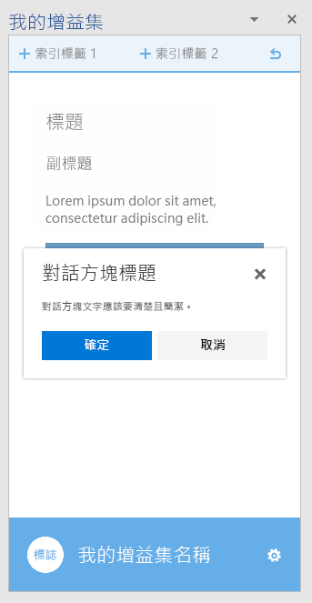</A></td>
<td><A href="https://github.com/OfficeDev/Office-Add-in-UX-Design-Patterns-Code/tree/master/templates/notifications/inline-message">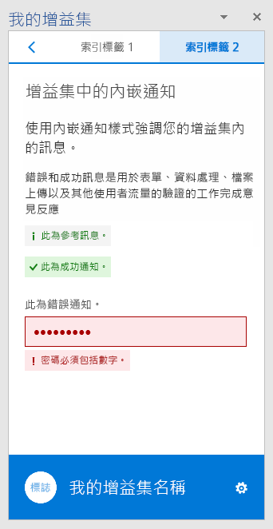</A></td>
<td><A href="https://github.com/OfficeDev/Office-Add-in-UX-Design-Patterns-Code/tree/master/templates/notifications/message-banner">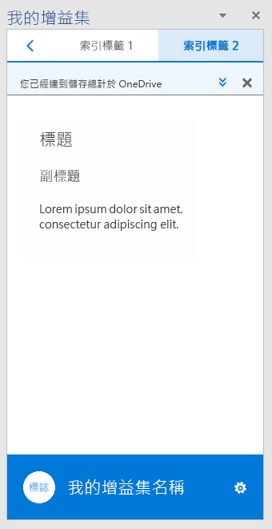</A></td></tr>
 </table>

 <table>
 <tr><th>進度列</th><th>載入狀態圓環</th><th>快顯通知</th></tr>
 <tr><td><A href="https://github.com/OfficeDev/Office-Add-in-UX-Design-Patterns-Code/tree/master/templates/notifications/progress-bar">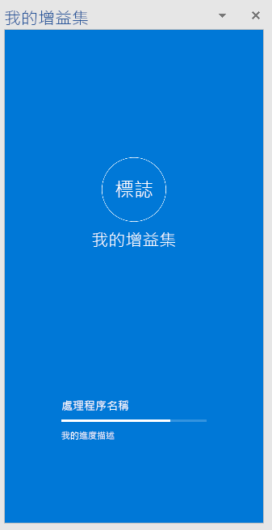</A></td>
<td><A href="https://github.com/OfficeDev/Office-Add-in-UX-Design-Patterns-Code/tree/master/templates/notifications/spinner">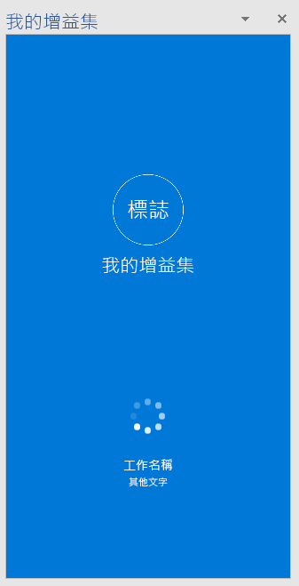</A></td>
<td><A href="https://github.com/OfficeDev/Office-Add-in-UX-Design-Patterns-Code/tree/master/templates/notifications/toast">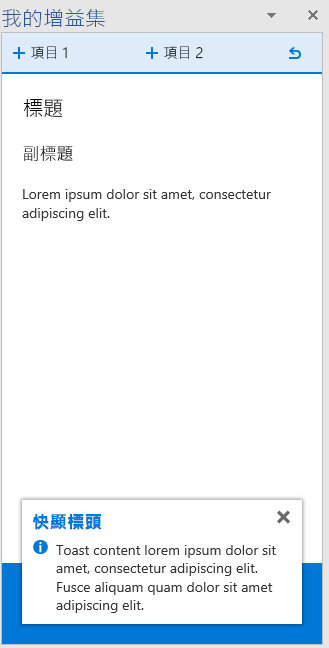</A></td></tr>
 </table>
 

### 一般元件

以下是您可以在各種案例的增益集中使用的一般元件。  

#### 用戶端對話方塊

用戶端對話方塊提供使用者在工作窗格之外操作增益集的另一種方法。 以下是可用的對話方塊範本︰

* **Typeramp 對話方塊** - 顯示具有文字內容的對話方塊。 您可以使用 Typeramp 對話方塊，向使用者顯示費盡心思的資訊。 
    * [Typeramp 對話方塊規格](https://github.com/OfficeDev/Office-Add-in-UX-Design-Patterns/blob/master/Patterns/Client_Dialog.md)
    * [Typeramp 對話方塊程式碼](https://github.com/OfficeDev/Office-Add-in-UX-Design-Patterns-Code/tree/master/templates/dialog/typeramp)
* **警示對話方塊** - 向使用者顯示具有重要資訊的警示方塊，例如錯誤或通知。  
    * [警示對話方塊規格](https://github.com/OfficeDev/Office-Add-in-UX-Design-Patterns/blob/master/Patterns/Client_Dialog.md)
    * [警示對話方塊程式碼](https://github.com/OfficeDev/Office-Add-in-UX-Design-Patterns-Code/tree/master/templates/dialog/alert)
* **瀏覽對話方塊** - 顯示具有瀏覽的對話方塊。 使用瀏覽對話方塊允許使用者在不同的內容之間瀏覽。 
    * [瀏覽對話方塊規格](https://github.com/OfficeDev/Office-Add-in-UX-Design-Patterns/blob/master/Patterns/Client_Dialog.md)
    * [瀏覽對話方塊程式碼](https://github.com/OfficeDev/Office-Add-in-UX-Design-Patterns-Code/tree/master/templates/dialog/navigation)

<table>
 <tr><th>Typeramp 對話方塊</th><th>警示對話方塊</th></tr>
<tr>
<td><A href="https://github.com/OfficeDev/Office-Add-in-UX-Design-Patterns-Code/tree/master/templates/dialog/typeramp">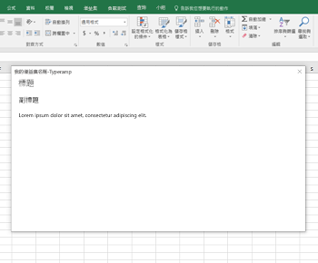</A></td>
<td><A href="https://github.com/OfficeDev/Office-Add-in-UX-Design-Patterns-Code/tree/master/templates/dialog/alert">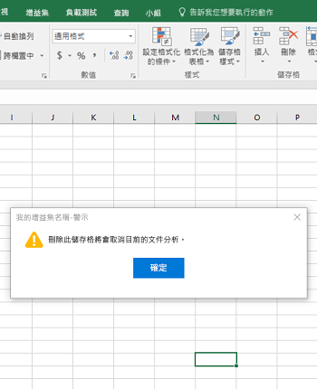</A></td>
</tr></tr>
 </table>
 
 <table>
 <tr><th>瀏覽對話方塊</th></tr>
<tr><td><A href="https://github.com/OfficeDev/Office-Add-in-UX-Design-Patterns-Code/tree/master/templates/dialog/navigation">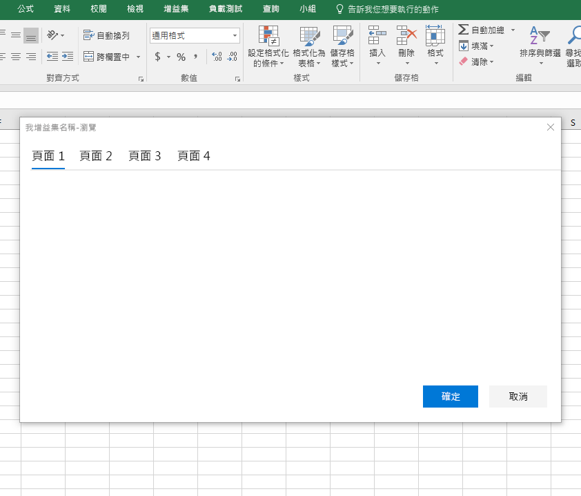</A></td></tr>
</tr>
 </table>

#### 意見反應和評分

若要改善增益集的可視性和採用情況，讓使用者在 Office 市集中為增益集評分及發表評論是有幫助的做法。 該模式會在增益集內顯示兩種呈現意見反應和評分的方法︰

- 使用者啟動的意見反應 - 使用者需要使用瀏覽功能表 (例如，使用 **[傳送意見]** 連結) 或頁尾上的圖示來選擇傳送意見反應。
- 系統啟動的意見反應 - 增益集執行三次之後，系統會提示使用者透過訊息橫幅提供意見反應。

任何一種方法都會開啟含增益集之 Office 市集頁面的對話方塊。

* [意見反應和評分規格](https://github.com/OfficeDev/Office-Add-in-UX-Design-Patterns/blob/master/Patterns/Notification_Feedback.md)
* [意見反應和評分程式碼](https://github.com/OfficeDev/Office-Add-in-UX-Design-Patterns-Code/tree/master/templates/feedback/office-store)

>**重要事項：**這種模式目前會指向 Office 市集首頁。 請務必將該 URL 更新為 Office 市集內的增益集頁面 URL。

 <table>
 <tr><th>意見反應和評分</th></tr>
<tr><td><A href="https://github.com/OfficeDev/Office-Add-in-UX-Design-Patterns-Code/tree/master/templates/feedback/office-store">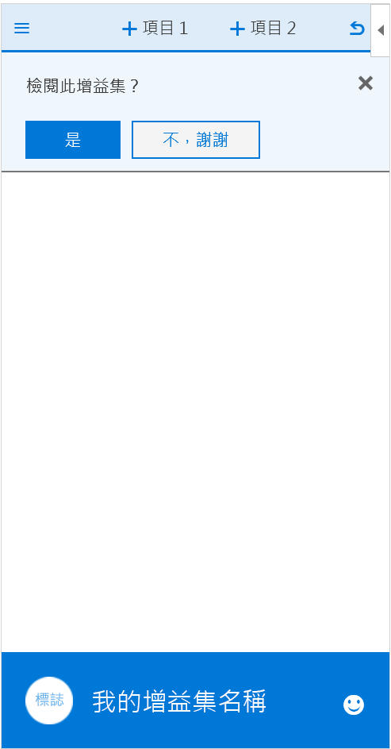</A></td></tr>
</tr>
 </table>

#### 設定和隱私權

增益集可能需要讓使用者配置設定的頁面，使其得以控制增益集的行為。 此外，您可能會想要將增益集遵守的隱私權原則提供給使用者。 

* **設定** - 顯示工作窗格，提供控制增益集之行為的設定元件。 設定頁面能提供讓使用者選擇的選項。
    * [設定規格](https://github.com/OfficeDev/Office-Add-in-UX-Design-Patterns/blob/master/Patterns/Settings.md)
    * [設定程式碼](https://github.com/OfficeDev/Office-Add-in-UX-Design-Patterns-Code/tree/master/templates/settings)
* **隱私權原則** - 顯示含隱私權原則之相關重要資訊的工作窗格。 
    * [隱私權原則規格](https://github.com/OfficeDev/Office-Add-in-UX-Design-Patterns/blob/master/Patterns/Settings.md)
    * [隱私權原則程式碼](https://github.com/OfficeDev/Office-Add-in-UX-Design-Patterns-Code/tree/master/templates/settings)

<table>
 <tr><th>設定</th><th>隱私權原則</th></tr>
<tr>
<td><A href="https://github.com/OfficeDev/Office-Add-in-UX-Design-Patterns-Code/tree/master/templates/settings">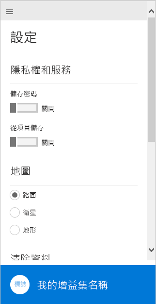</A></td>
<td></td>
</tr></tr>
 </table>

## 其他資源

* [開發 Office 增益集的最佳做法](https://dev.office.com/docs/add-ins/overview/add-in-development-best-practices)
* [Office UI 結構](http://dev.office.com/fabric/)
