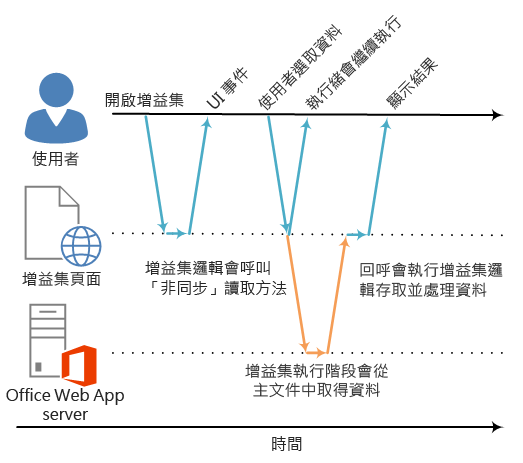

# Office 增益集中的非同步程式設計

為什麼 Office 增益集 API 使用非同步程式設計？由於 JavaScript 是單一執行緒語言，如果指令碼叫用長時間執行的同步處理程序，在該程序完成之前，所有後續的指令碼執行將遭封鎖。由於對 Office Web 用戶端 (也包括豐富型用戶端) 的某些作業若同步執行則可能會無法執行，適用於 Office 的 JavaScript API 中大部分方法的設計為以非同步方法執行。如此可確保 Office 增益集回應靈敏且執行良好。處理這些非同步方法時，它也會經常需要您撰寫回撥函式。

API 中所有非同步方法的名稱結尾是 "Async"，例如 [Document.getSelectedDataAsync](../../reference/shared/document.getselecteddataasync.md)、[Binding.getDataAsync](../../reference/shared/binding.getdataasync.md) 或 [Item.loadCustomPropertiesAsync](../../reference/outlook/Office.context.mailbox.item.md) 方法。呼叫 "Async" 方法時，它會立即執行，而且任何後續的指令碼可以繼續執行。您傳遞到 "Async" 方法的選擇性回撥函式，在資料或要求的作業就緒時就會執行。這通常會立即發生，但可能在傳回前稍有延遲。

下圖顯示對 "Async" 方法呼叫的執行流程，該方法會讀取使用者在伺服器端 Word Online 或 Excel Online 中開啟的文件所選取的資料。進行 "Async" 呼叫時，JavaScript 執行的執行緒可以自由地執行任何額外的用戶端處理。(不過圖表中均未顯示。)當 "Async" 方法傳回時，回撥會在執行緒上繼續執行，而增益集可以存取資料、進行處理，及顯示結果。使用 Office 豐富型用戶端主應用程式 (例如 Word 2013 或 Excel 2013) 時，會保持相同的非同步執行模式。

**圖 1.非同步程式設計執行流程**




在豐富型與 Web 用戶端中非同步設計的支援是 Office 增益集的開發模型「撰寫一次即跨平台執行」(write once-run cross-platform) 設計目標的一部分。例如，您可以使用單一基礎程式碼來建立可同時在 Excel 2013 和 Excel Online 中執行的內容或工作窗格增益集。

## 撰寫 "Async" 方法的回撥函式


您傳遞至 "Async" 方法做為 _callback_ 引數的回撥函式，必須宣告單一參數，供增益集執行階段用來在回撥函式執行時提供存取 [AsyncResult](../../reference/shared/asyncresult.md) 物件。您可以撰寫︰


- 匿名函式，必須撰寫並直接隨著對 "Async" 方法的呼叫內嵌傳遞，做為 "Async" 方法的 _callback_ 參數。
    
- 具名函式，傳遞該函式的名稱做為 "Async" 方法的 _callback_ 參數。
    
如果您只打算使用其程式碼一次，匿名函式會很實用，因為其中沒有任何名稱，使得無法在程式碼的另一個部分參考該程式碼。如果您想要對一個以上的 "Async" 方法重複使用回撥函式，則具名函式很實用。


### 撰寫匿名的回撥函式

下列匿名回撥函式會宣告名為 `result` 的單一參數，在回撥傳回時，從 [AsyncResult.value](../../reference/shared/asyncresult.status.md) 屬性擷取資料。


```js
function (result) {
        write('Selected data: ' + result.value);
}
```

下列範例顯示如何在對 **Document.getSelectedDataAsync** 方法的完整 "Async" 方法呼叫的內容中，內嵌傳遞此匿名回撥函式。


- 第一個 _coercionType_ 引數 `Office.CoercionType.Text` 會指定以文字字串形式傳回選取的資料。
    
- 第二個 _callback_ 引數是內嵌傳遞至方法的匿名函式。函式執行時，它會使用 _result_ 參數來存取 **AsyncResult** 物件的 **value** 屬性，以顯示使用者在文件中所選取的資料。
    


```js
Office.context.document.getSelectedDataAsync(Office.CoercionType.Text, 
    function (result) {
        write('Selected data: ' + result.value);
    }
});

// Function that writes to a div with id='message' on the page.
function write(message){
    document.getElementById('message').innerText += message; 
}
```

您也可以使用您的回撥函式的參數，以存取 **AsyncResult** 物件的其他屬性。使用 [AsyncResult.status](../../reference/shared/asyncresult.error.md) 屬性來判斷呼叫成功或失敗。如果呼叫失敗，您可以使用 [AsyncResult.error](../../reference/shared/asyncresult.context.md) 屬性來存取 [Error](../../reference/shared/error.md) 物件以取得錯誤資訊。

如需使用 **getSelectedDataAsync** 方法的詳細資訊，請參閱[在文件或試算表中將資料讀取和寫入使用中的選取範圍](../../docs/develop/read-and-write-data-to-the-active-selection-in-a-document-or-spreadsheet.md)。 


### 寫入具名的回撥函式

或者，您可以撰寫一個具名函式，並將其名稱傳遞至 "Async" 方法的 _callback_參數。例如，可以重新編寫先前的範例，傳遞名為 `writeDataCallback` 的函式做為 _callback_ 參數，類似這樣。


```js
Office.context.document.getSelectedDataAsync(Office.CoercionType.Text, 
    writeDataCallback);

// Callback to write the selected data to the add-in UI.
function writeDataCallback(result) {
    write('Selected data: ' + result.value);
}

// Function that writes to a div with id='message' on the page.
function write(message){
    document.getElementById('message').innerText += message; 
}
```


## 傳回 AsyncResult.value 屬性的內容中的差異


**AsyncResult** 物件的 **asyncContext**、**status** 和 **error** 屬性會傳回相同種類的資訊至傳遞至所有 "Async" 方法的回撥函式。不過，傳回至 **AsyncResult.value** 屬性的內容會因 "Async" 方法的功能而有所不同。

例如，**addHandlerAsync** 方法 ([Binding](../../reference/shared/binding.md)、[CustomXmlPart](../../reference/shared/customxmlpart.customxmlpart.md)、[Document](../../reference/shared/document.md)、[RoamingSettings](../../reference/outlook/RoamingSettings.md) 和 [Settings](../../reference/shared/settings.md) 物件) 用來將事件處理常式函式加入這些物件所代表的項目。您可以從傳遞至任一 **addHandlerAsync** 方法的回撥函式存取 **AsyncResult.value** 屬性，但因為當您加入事件處理常式時，沒有存取任何資料或物件，如果您嘗試存取它，**value** 屬性一律會傳回 **undefined**。

另一方面，如果您呼叫 **Document.getSelectedDataAsync** 方法，它會在回撥中傳回使用者在文件中所選取的資料至 **AsyncResult.value** 屬性。或者，如果您呼叫 [Bindings.getAllAsync](../../reference/shared/bindings.getallasync.md) 方法，它會在文件中傳回所有的 **Binding** 物件的陣列。而且，如果您呼叫 [Bindings.getByIdAsync](../../reference/shared/bindings.getbyidasync.md) 方法，它會傳回單一 **Binding** 物件。

如需傳回至 "Async" 方法 **AsyncResult.value** 屬性的描述，請參閱該方法參考主題的「回撥值」一節。如需提供 "Async" 方法的所有物件的摘要，請參閱 [AsyncResult](../../reference/shared/asyncresult.md) 物件主題底部的表格。


## 非同步程式設計模式


適用於 Office 的 JavaScript API 支援兩種非同步程式設計模式︰


- 使用巢狀的回撥
    
- 使用 Promise 模式
    
使用回撥函式的非同步程式設計通常會要求您將傳回的一個回撥的結果在兩或多個回撥中建立巢狀。如果您需要執行這項操作，您可以使用來自 API 的所有 "Async" 方法的巢狀回撥。

使用巢狀回撥是大部份 JavaScript 開發人員熟悉的程式設計模式，但具有深層巢狀回撥的程式碼可能難以閱讀及了解。做為巢狀回撥的替代方式，Office 的 JavaScript API 也支援 Promise 模式的實作。不過，在 Office 的 JavaScript API 的目前版本中，Promise 模式僅對 [Excel 試算表和 Word 文件中的繫結](../../docs/develop/bind-to-regions-in-a-document-or-spreadsheet.md)的程式碼有作用。

<a name="AsyncProgramming_NestedCallbacks" />
### 使用巢狀回撥函式的非同步程式設計


您通常必須執行兩或多個非同步作業，才能完成工作。若要完成該動作，您可以讓 "Async" 呼叫間形成巢狀。 

下列程式碼範例會將兩個非同步呼叫形成巢狀。 


- 首先，會呼叫 [Bindings.getByIdAsync](../../reference/shared/bindings.getbyidasync.md) 方法來存取文件中名為 "MyBinding" 的繫結。傳回至該回撥之 `result` 參數的 **AsyncResult** 物件會提供來自 **AsyncResult.value** 屬性的指定繫結物件的存取。
    
- 然後，從第一個 `result` 參數存取的繫結物件會用來呼叫 [Binding.getDataAsync](../../reference/shared/binding.getdataasync.md) 方法。
    
- 最後，傳遞至 **Binding.getDataAsync** 方法之回撥的 `result2` 參數，會用來顯示繫結中的資料。
    


```js
function readData() {
    Office.context.document.bindings.getByIdAsync("MyBinding", function (result) {
        result.value.getDataAsync({ coercionType: 'text' }, function (result2) {
            write(result2.value);
        });
    });
}

// Function that writes to a div with id='message' on the page.
function write(message){
    document.getElementById('message').innerText += message; 
}
```

這個基本的巢狀回撥模式可以用於適用於 Office 的 JavaScript API 中的所有非同步方法。

下列各節說明如何在非同步方法中使用巢狀回撥的匿名或具名函式。


#### 對巢狀回撥使用匿名函式

在下列範例中，兩個匿名函式會內嵌宣告，並以巢狀回撥形式傳遞至 **getByIdAsync** 和 **getDataAsync** 方法。因為函式簡單且內嵌，實作的目的顯而易見。


```js
Office.context.document.bindings.getByIdAsync('myBinding', function (bindingResult) {
    bindingResult.value.getDataAsync(function (getResult) {
        if (getResult.status == Office.AsyncResultStatus.Failed) {
            write('Action failed. Error: ' + asyncResult.error.message);
        } else {
            write('Data has been read successfully.');
        }
    });
});

// Function that writes to a div with id='message' on the page.
function write(message){
    document.getElementById('message').innerText += message; 
}
```


#### 對巢狀回撥使用具名函式

在複雜的實作中使用具名函式讓您的程式碼更容易閱讀、維護和重複使用，可能會很有幫助。在下列範例中，來自上一節範例的兩個匿名函式已重新撰寫為名為 `deleteAllData` 和 `showResult` 的函式。然後會將這些具名函式依名稱傳遞至 **getByIdAsync** 和 **deleteAllDataValuesAsync** 方法做為回撥。


```js
Office.context.document.bindings.getByIdAsync('myBinding', deleteAllData);

function deleteAllData(asyncResult) {
    asyncResult.value.deleteAllDataValuesAsync(showResult);
}

function showResult(asyncResult) {
    if (asyncResult.status == Office.AsyncResultStatus.Failed) {
        write('Action failed. Error: ' + asyncResult.error.message);
    } else {
        write('Data has been deleted successfully.');
    }
}

// Function that writes to a div with id='message' on the page.
function write(message){
    document.getElementById('message').innerText += message; 
}
```


### 使用 Promise 模式來存取繫結中的資料的非同步程式設計


Promise 程式設計模式不會傳遞回撥函式並在繼續執行之前等候函式傳回，而是會立即傳回 Promise 物件，代表其預期的結果。不過，與真正的同步程式設計不同，在背後，Promise 履行的結果實際上會延後，直到 Office 增益集的執行階段環境可以完成要求。當無法完成要求時，會提供 _onError_ 處理常式來涵蓋該情況。

Office 的 JavaScript API 提供 [Office.select](../../reference/shared/office.select.md) 方法，以支援 Promise 模式用於搭配現有的繫結物件。傳回至 **Office.select** 方法的 Promise 物件僅支援您可以直接從 [Binding](../../reference/shared/binding.md) 物件存取的四個方法︰[getDataAsync](../../reference/shared/binding.getdataasync.md)、[setDataAsync](../../reference/shared/binding.setdataasync.md)、[addHandlerAsync](../../reference/shared/asyncresult.value.md) 和 [removeHandlerAsync](../../reference/shared/binding.removehandlerasync.md)。

搭配繫結的 Promise 模式採用這種形式︰

 **Office.select(**_selectorExpression_,  _onError_**).**_BindingObjectAsyncMethod_

_selectorExpression_ 參數會採用形式 `"bindings#bindingId"`，其中 _bindingId_ 是您先前在文件或試算表中建立的繫結的名稱 (**id**) (使用 **Bindings** 集合的其中一個 "addFrom"方法︰**addFromNamedItemAsync**、**addFromPromptAsync** 或 **addFromSelectionAsync**)。例如，選取器運算式 `bindings#cities` 會指定您要存取 **id** 為 'cities' 的繫結。

_onError_ 參數是錯誤處理函式，採用類型 **AsyncResult** 的單一參數，該參數可以在 **select** 方法無法存取指定繫結時用於存取 **Error** 物件。下列範例會示範可以傳遞至 _onError_ 參數的基本錯誤處理常式函式。


```js
function onError(result){
    var err = result.error;
    write(err.name + ": " + err.message);
}
// Function that writes to a div with id='message' on the page.
function write(message){
    document.getElementById('message').innerText += message; 
}
```

以對 Promise 物件支援的四個 _Binding_ 物件方法的其中一個進行呼叫來取代 **BindingObjectAsyncMethod** 預留位置︰**getDataAsync**、**setDataAsync**、**addHandlerAsync** 或 **removeHandlerAsync**。對這些方法的呼叫不支援其他的 Promise。您必須使用[巢狀回撥函式模式](../../docs/develop/asynchronous-programming-in-office-add-ins.md#AsyncProgramming_NestedCallbacks)呼叫它們。

履行 **Binding** 物件 Promise 之後，它可在鏈結的方法呼叫中如同繫結般重複使用 (增益集執行階段不會以非同步方式重試履行 Promise)。如果無法完成 **Binding** 物件 Promise，下一次叫用它的其中一個非同步方法時，增益集執行階段會再次嘗試存取繫結物件。

下列程式碼範例會使用 **select** 方法，從 **Bindings** 集合擷取具有 **id** " `cities`" 的繫結，然後呼叫 [addHandlerAsync](../../reference/shared/asyncresult.value.md) 方法，為繫結的 [dataChanged](../../reference/shared/binding.bindingdatachangedevent.md) 事件加入事件處理常式。


```js
function addBindingDataChangedEventHandler() {
    Office.select("bindings#cities", function onError(){/* error handling code */}).addHandlerAsync(Office.EventType.BindingDataChanged,
    function (eventArgs) {
        doSomethingWithBinding(eventArgs.binding);
    });
}

```


 >**重要：****Office.select** 方法所傳回的 **Binding** 物件 Promise，僅提供 **Binding** 物件四個方法的存取。 如果您需要存取 **Binding** 物件的任何其他成員，您必須改為使用 **Document.bindings** 屬性和 **Bindings.getByIdAsync** 或 **Bindings.getAllAsync** 方法來擷取 **Binding** 物件。 例如，如果您需要存取 **Binding** 物件的任何屬性 (**document**、**id** 或 **type** 屬性)，或需要存取 [MatrixBinding](../../reference/shared/binding.matrixbinding.md) 或 [TableBinding](../../reference/shared/binding.tablebinding.md) 物件的屬性，您必須使用 **getByIdAsync** 或 **getAllAsync** 方法來擷取 **Binding** 物件。


## 將選擇性參數傳遞至非同步方法


所有 "Async" 方法的一般語法會遵循這個模式︰

 _AsyncMethod_ `(`_RequiredParameters_`, [`_OptionalParameters_`],`_CallbackFunction_`);`

支援選擇性參數的所有非同步方法，會以包含一或多個選擇性參數的 JavaScript 物件標記法 (JSON) 物件的形式傳遞。包含選擇性參數的 JSON 物件為機碼值組未排序的集合，並以 ":" 字元分隔機碼和值。物件中的每一配對是以逗號分隔，而且整組配對是以大括號括住。機碼是參數名稱，而值是要為該參數傳遞的值。

您可以建立包含內嵌選擇性參數的 JSON 物件，或是藉由建立 `options` 物件然後以 _options_ 參數形式傳入。


### 傳遞內嵌選擇性參數

例如，使用內嵌選擇性參數呼叫 [Document.setSelectedDataAsync](../../reference/shared/document.getselecteddataasync.md) 方法的語法看起來像這樣︰

```js
 Office.context.document.setSelectedDataAsync(data, {coercionType: 'coercionType', asyncContext:' asyncContext},callback);

```

在這種形式的呼叫語法中，兩個選擇性參數 _coercionType_ 和 _asyncContext_ 都是以使用大括號括住的內嵌 JSON 物件定義。

下列範例示範如何藉由指定指定內嵌選擇性參數來呼叫 **Document.setSelectedDataAsync** 方法。


```js
Office.context.document.setSelectedDataAsync(
    "<html><body>hello world</body></html>",
    {coercionType: "html", asyncContext: 42},
    function(asyncResult) {
        write(asyncResult.status + " " + asyncResult.asyncContext);
    }
)

// Function that writes to a div with id='message' on the page.
function write(message){
    document.getElementById('message').innerText += message; 
}
```


> **附註：**您可以在 JSON 物件中以任何順序指定選擇性參數，只要已正確指定其名稱。


### 在 options 物件中傳遞選擇性參數

此外，您可以建立一個名為 `options` 的物件，從方法呼叫分別指定選擇性參數，然後傳遞 `options` 物件做為 _options_ 引數。

下列範例會示範建立 `options` 物件的其中一種方式，其中 `parameter1`、`value1` 等等為實際參數名稱和值的預留位置。


```js
var options = {
    parameter1: value1,
    parameter2: value2,
    ...
    parameterN: valueN
};

```

用來指定 [ValueFormat](../../reference/shared/valueformat-enumeration.md) 和 [FilterType](../../reference/shared/filtertype-enumeration.md) 參數時，它看來類似下列的範例。


```js
var options = {
    valueFormat: "unformatted",
    filterType: "all"
};
```

以下是建立 `options` 物件的另一個方式。


```js
var options = {};
options[parameter1] = value1;
options[parameter2] = value2;
...
options[parameterN] = valueN;
```

用來指定 **ValueFormat** 和 **FilterType** 參數時，它看來類似下列的範例：


```js
var options = {};
options["ValueFormat"] = "unformatted";
options["FilterType"] = "all";
```


 >**附註：**使用建立 `options` 物件的任一種方法時，您可以以任何順序指定選擇性參數，只要已正確指定其名稱。

下列範例示範如何藉由指定在 `options` 物件中指定選擇性的參數來呼叫 **Document.setSelectedDataAsync** 方法。


```js
var options = {
   coercionType: "html",
   asyncContext: 42
};

document.setSelectedDataAsync(
    "<html><body>hello world</body></html>",
    options,
    function(asyncResult) {
        write(asyncResult.status + " " + asyncResult.asyncContext);
    }
)

// Function that writes to a div with id='message' on the page.
function write(message){
    document.getElementById('message').innerText += message; 
}
```


在這兩個選擇性參數範例中，_callback_ 參數是指定為最後一個參數 (接在內嵌選擇性參數或接在 _options_ 引數物件之後)。或者，您可以在內嵌的 JSON 物件內或 `options` 物件中指定 _callback_ 參數。不過，您只能在一個位置傳遞 _callback_ 參數︰在 _options_ 物件 (內嵌或外部建立)，或以最後一個參數形式，但不能同時。


## 其他資源


- [了解適用於 Office 的 JavaScript API](../../docs/develop/understanding-the-javascript-api-for-office.md)
    
- [JavaScript API for Office](../../reference/javascript-api-for-office.md)
     
