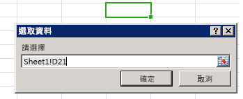


# <a name="bind-to-regions-in-a-document-or-spreadsheet"></a>繫結至文件或試算表中的區域

以繫結為基礎的資料存取，可讓內容和工作窗格增益集一致地透過識別碼來存取文件或試算表的特定區域。增益集必須先藉由呼叫將文件的一部分與唯一識別碼產生關聯的其中一個方法來建立繫結︰[addFromPromptAsync]、[addFromSelectionAsync] 或 [addFromNamedItemAsync]。建立繫結之後，增益集可以使用提供的識別碼來存取文件或試算表的關聯的區域中所包含的資料。建立繫結可提供增益集下列值︰


- 允許存取所有支援的 Office 應用程式的常見資料結構，例如︰表格、範圍或文字 (連續執行的字元)。
    
- 啟用讀寫作業而不需要使用者進行選擇。
    
- 在文件中的增益集和資料之間建立關聯。繫結會保存在文件中，而且可以稍後加以存取。
    
建立繫結也可讓您訂閱資料及選取範圍變更事件，其範圍限制在文件或試算表的特定區域。這表示增益集只會收到繫結區域內發生的變更的通知，而不是整份文件或試算表一般變更的通知。

[Bindings] 物件會公開 [getAllAsync] 方法，其可為文件或試算表上建立的所有繫結的集合提供存取。可以使用 Bindings.[getByIdAsync] 或 [Office.select] 方法利用 ID 存取個別的繫結。您可以使用 [Bindings] 物件的下列其中一個方法來建立新繫結，以及移除現有的繫結︰[addFromSelectionAsync]、[addFromPromptAsync]、[addFromNamedItemAsync] 或 [releaseByIdAsync]。


## <a name="binding-types"></a>繫結類型

當您使用 [addFromSelectionAsync]、[addFromPromptAsync] 或 [addFromNamedItemAsync] 方法建立繫結時，對 _bindingType_ 參數可以指定[三種不同類型的繫結] [Office.BindingType]︰

1. **[文字繫結][TextBinding]** - 繫結至可以用文字表示之文件的區域。

    在 Word 中，大部分的連續選取項目為有效，而在 Excel 中，只有單一儲存格選取項目可以是文字繫結的目標。在 Excel 中僅支援純文字。Word 中支援三種格式︰純文字、HTML 和 Open XML for Office。

2. **[矩陣繫結][MatrixBinding]** - 繫結至包含表格式資料而沒有標題之文件的固定區域。矩陣繫結中的資料會以兩個維度**陣列**的形式寫入或讀取，在 JavaScript 會實作為陣列的陣列。例如，兩欄中兩列的 **string** 值可以寫入或讀取為 ` [['a', 'b'], ['c', 'd']]`，而三列的單一欄可以寫入或讀取為 `[['a'], ['b'], ['c']]`。

    在 Excel 中，任何連續選取的儲存格可以用於建立矩陣繫結。在 Word 中，只有表格支援矩陣繫結。

3. **[表格繫結][TableBinding]** - 繫結至包含標題之表格文件的某個區域。在表格繫結中的資料會以 [TableData](../../reference/shared/tabledata.md) 物件的形式寫入或讀取。`TableData` 物件會透過 `headers` 和 `rows` 屬性公開資料。

    任何 Excel 或 Word 表格可以是表格繫結的基礎。建立表格繫結之後，使用者加入至表格的每個新列或欄會自動包含在繫結中。

使用 `Bindings` 物件的三個 "addFrom" 方法其中一個建立繫結之後，您可以使用對應的物件的方法來處理繫結的資料和屬性︰[MatrixBinding]、[TableBinding] 或 [TextBinding]。這三個物件皆繼承可讓您與繫結資料互動的 `Binding` 物件的 [getDataAsync] 和 [setDataAsync] 方法。

> **何時應該使用矩陣與資料表繫結？**當您正在使用的表格式資料包含合計列時，如果增益集的指令碼需要存取合計列中的值或偵測使用者在合計列的選取範圍，則必須使用矩陣繫結。如果您建立包含合計列的表格式資料的表格繫結，事件處理常式中的 [TableBinding.rowCount] 屬性和 [BindingSelectionChangedEventArgs] 物件的 `rowCount` 和 `startRow` 屬性不會在它們的值中反映合計列。若要解決這項限制，您必須建立矩陣繫結，以使用合計列。


### <a name="add-a-binding-to-the-user's-current-selection"></a>將繫結加入至使用者目前的選取範圍

下列範例顯示如何使用 [addFromSelectionAsync] 方法加入名為 `myBinding` 的文字繫結至文件中目前的選取範圍。


```js
Office.context.document.bindings.addFromSelectionAsync(Office.BindingType.Text, { id: 'myBinding' }, function (asyncResult) {
    if (asyncResult.status == Office.AsyncResultStatus.Failed) {
        write('Action failed. Error: ' + asyncResult.error.message);
    } else {
        write('Added new binding with type: ' + asyncResult.value.type + ' and id: ' + asyncResult.value.id);
    }
});

// Function that writes to a div with id='message' on the page.
function write(message){
    document.getElementById('message').innerText += message; 
}
```

在這個範例中，指定的繫結類型會是文字。這表示將為選取項目建立 [TextBinding]。不同的繫結類型會公開不同的資料和作業。[Office.BindingType] 是可用的繫結類型值的列舉。

第二個選擇性參數是指定要建立的新繫結之識別碼的物件。如果未指定識別碼，則會自動產生一個識別碼。

傳遞至函式做為最後一個 _callback_ 參數的匿名函式，會在作業完成時執行。會使用單一參數 `asyncResult` 來呼叫函式，其可提供會提供呼叫狀態之 [AsyncResult] 物件的存取。`AsyncResult.value` 屬性包含針對新建立的繫結類型指定之 [Binding] 物件的參考。您可以使用這個 [Binding] 物件來取得及設定資料。

### <a name="add-a-binding-from-a-prompt"></a>從提示加入繫結

下列範例顯示如何使用 [addFromPromptAsync] 方法加入名為 `myBinding` 的文字繫結。這個方法可讓使用者使用應用程式的內建範圍選取提示來指定繫結的範圍。


```js
function bindFromPrompt() {
    Office.context.document.bindings.addFromPromptAsync(Office.BindingType.Text, { id: 'myBinding' }, function (asyncResult) {
        if (asyncResult.status == Office.AsyncResultStatus.Failed) {
            write('Action failed. Error: ' + asyncResult.error.message);
        } else {
            write('Added new binding with type: ' + asyncResult.value.type + ' and id: ' + asyncResult.value.id);
        }
    });
}

// Function that writes to a div with id='message' on the page.
function write(message){
    document.getElementById('message').innerText += message; 
}
```

在這個範例中，指定的繫結類型會是文字。這表示將為使用者在提示中指定的選取項目建立 [TextBinding]。

第二個參數是包含要建立的新繫結之識別碼的物件。如果未指定識別碼，則會自動產生一個識別碼。

傳遞至函式做為第三個 _callback_ 參數的匿名函式，會在作業完成時執行。當回撥函式執行時，[AsyncResult] 物件會包含呼叫和新建立繫結的狀態。

圖 1 顯示 Excel 中內建的範圍選取提示。


**圖 1.Excel Select Data UI**




### <a name="add-a-binding-to-a-named-item"></a>將繫結加入至具名項目


下列範例顯示如何使用 [addFromNamedItemAsync] 方法，將繫結以 "matrix" 繫結形式加入至現有的 `myRange` 具名項目，並指定繫結的 `id` 為 "myMatrix"。


```js
function bindNamedItem() {
    Office.context.document.bindings.addFromNamedItemAsync("myRange", "matrix", {id:'myMatrix'}, function (result) {
        if (result.status == 'succeeded'){
            write('Added new binding with type: ' + result.value.type + ' and id: ' + result.value.id);
            }
        else
            write('Error: ' + result.error.message);
    });
}

// Function that writes to a div with id='message' on the page.
function write(message){
    document.getElementById('message').innerText += message; 
}

```

 **若為 Excel**，[addFromNamedItemAsync] 方法的 `itemName` 參數可以參考現有具名範圍，以 `A1` 參考樣式 `("A1:A3")` 或表格指定的範圍。依預設，在 Excel 中新增表格會針對您新增的第一個表格指派名稱 "Table1"，針對您新增的第二個表格指派名稱 "Table2"，依此類推。若要在 Excel UI 中為表格指派有意義的名稱，請使用功能區的 [表格工具] | [設計] 索引標籤的**表格名稱**屬性。


 >**附註：**在 Excel 中，將表格指定為具名項目時，您必須指定完整名稱，才能使用此格式將工作表名稱加入表格名稱：`"Sheet1!Table1"`

下列範例會在 Excel 中建立繫結，到欄 A 中的前三個儲存格 (`"A1:A3"`)、指派 id `"MyCities"`，然後寫入該繫結中的三個城市名稱。


```js
 function bindingFromA1Range() {
    Office.context.document.bindings.addFromNamedItemAsync("A1:A3", "matrix", {id: "MyCities" },
        function (asyncResult) {
            if (asyncResult.status == "failed") {
                write('Error: ' + asyncResult.error.message);
            }
            else {
                // Write data to the new binding.
                Office.select("bindings#MyCities").setDataAsync([['Berlin'], ['Munich'], ['Duisburg']], { coercionType: "matrix" },
                    function (asyncResult) {
                        if (asyncResult.status == "failed") {
                            write('Error: ' + asyncResult.error.message);
                        }
                    });
            }
        });
}
// Function that writes to a div with id='message' on the page.
function write(message){
    document.getElementById('message').innerText += message; 
}
```

 **對於 Word**，[addFromNamedItemAsync] 方法的 `itemName` 參數是指 `Rich Text` 內容控制項的 `Title` 屬性。(您無法繫結至 `Rich Text` 內容控制項以外的內容控制項。)

依預設，內容控制項沒有指派的 `Title*` 值。若要在 Word UI 中指派有意義的名稱，請從功能區 [開發人員] 索引標籤上的 [控制項] 群組插入 [RTF 文字]內容控制項之後，請使用 [控制項] 群組中的 [屬性] 命令，來顯示 [內容控制項屬性] 對話方塊。然後將內容控制項的**標題**屬性設為您要從程式碼參照的名稱。

下列範例會在 Word 中建立文字繫結至名稱為 `"FirstName"`的 RTF 文字內容控制項、指派 **id**`"firstName"`，然後顯示該資訊。


```js
function bindContentControl() {
    Office.context.document.bindings.addFromNamedItemAsync('FirstName', 
        Office.BindingType.Text, {id:'firstName'},
        function (result) {
            if (result.status === Office.AsyncResultStatus.Succeeded) {
                write('Control bound. Binding.id: '
                    + result.value.id + ' Binding.type: ' + result.value.type);
            } else {
                write('Error:', result.error.message);
            }
    });
}
// Function that writes to a div with id='message' on the page.
function write(message){
    document.getElementById('message').innerText += message; 
}
```


### <a name="get-all-bindings"></a>取得所有繫結


下列範例顯示如何藉由使用 Bindings.[getAllAsync] 方法，取得文件中的所有繫結。


```js
Office.context.document.bindings.getAllAsync(function (asyncResult) {
    var bindingString = '';
    for (var i in asyncResult.value) {
        bindingString += asyncResult.value[i].id + '\n';
    }
    write('Existing bindings: ' + bindingString);
});

// Function that writes to a div with id='message' on the page.
function write(message){
    document.getElementById('message').innerText += message; 
}
```

傳遞至函式做為 `callback` 參數的匿名函式，會在作業完成時執行。會使用單一參數 `asyncResult` 來呼叫函式，其中包含文件中繫結的陣列。逐一查看陣列以建置包含繫結之識別碼的字串。然後，字串會顯示在訊息方塊中。


### <a name="get-a-binding-by-id-using-the-getbyidasync-method-of-the-bindings-object"></a>使用 Bindings 物件的 getByIdAsync 方法，依識別碼取得繫結


下列範例顯示如何使用 [getByIdAsync] 方法，藉由指定其識別碼來取得文件中的繫結。本範例假設已使用本主題稍早所述的方法之一，將名為 `'myBinding'` 的繫結加入至文件。


```js
Office.context.document.bindings.getByIdAsync('myBinding', function (asyncResult) {
    if (asyncResult.status == Office.AsyncResultStatus.Failed) {
        write('Action failed. Error: ' + asyncResult.error.message);
    } 
    else {
        write('Retrieved binding with type: ' + asyncResult.value.type + ' and id: ' + asyncResult.value.id);
    }
});

// Function that writes to a div with id='message' on the page.
function write(message){
    document.getElementById('message').innerText += message; 
}
```

在範例中，第一個 `id` 參數是要擷取之繫結的識別碼。

傳遞至函式做為第二個 _callback_ 參數的匿名函式，會在作業完成時執行。會使用單一參數 _asyncResult_ 來呼叫函式，其中包含呼叫和具有 ID "myBinding" 之繫結的狀態。


### <a name="get-a-binding-by-id-using-the-select-method-of-the-office-object"></a>使用 Office 物件的 select 方法，依識別碼取得繫結


下列範例顯示如何使用 [Office.select] 方法，藉由在選取器字串中指定其識別碼來取得文件中的 [Binding] 物件 Promise。接著，它會呼叫 Binding.[getDataAsync] 方法從指定的繫結取得資料。本範例假設已使用本主題稍早所述的方法之一，將名為 `'myBinding'` 的繫結加入至文件。


```js
Office.select("bindings#myBinding", function onError(){}).getDataAsync(function (asyncResult) {
    if (asyncResult.status == Office.AsyncResultStatus.Failed) {
        write('Action failed. Error: ' + asyncResult.error.message);
    } else {
        write(asyncResult.value);
    }
});

// Function that writes to a div with id='message' on the page.
function write(message){
    document.getElementById('message').innerText += message; 
}
```


 > **附註：**如果 `select` 方法承諾成功傳回 [Binding] 物件，則該物件只會公開物件的下列四個方法︰[getDataAsync]、[setDataAsync]、[addHandlerAsync] 和 [removeHandlerAsync]。如果該 Promise 無法傳回 Binding 物件，可以使用 `onError` 回呼來存取 [asyncResult].error 物件，以取得詳細資訊。如果您需要呼叫的 Binding 物件成員，不是 `select` 方法傳回之 Binding 物件 Promise 所公開的四個方法，則改為使用 [getByIdAsync] 方法，您可以使用 [Document.bindings] 屬性和 Bindings.[getByIdAsync] 方法，以擷取 Binding** 物件。

### <a name="release-a-binding-by-id"></a>依識別碼釋出繫結


下列範例顯示如何使用 [releaseByIdAsync] 方法，藉由指定其識別碼來釋出文件中的繫結。

```js
Office.context.document.bindings.releaseByIdAsync('myBinding', function (asyncResult) {
    write('Released myBinding!');
});

// Function that writes to a div with id='message' on the page.
function write(message){
    document.getElementById('message').innerText += message; 
}
```

在範例中，第一個 `id` 參數是要釋出之繫結的識別碼。

傳遞至函式做為第二個參數的匿名函式，是當作業完成時執行的回撥。會使用單一參數 [asyncResult] 來呼叫函式，其中包含呼叫的狀態。


### <a name="read-data-from-a-binding"></a>從繫結讀取資料


下列範例示範如何使用 [getDataAsync] 方法，以從現有繫結取得資料。


```js
myBinding.getDataAsync(function (asyncResult) {
    if (asyncResult.status == Office.AsyncResultStatus.Failed) {
        write('Action failed. Error: ' + asyncResult.error.message);
    } else {
        write(asyncResult.value);
    }
});

// Function that writes to a div with id='message' on the page.
function write(message){
    document.getElementById('message').innerText += message; 
}
```

 `myBinding` 是一個包含文件中現有文字繫結的變數。或者，您可以使用 [Office.select] 來依識別碼存取繫結，並對 [getDataAsync] 方法開始您的呼叫，就像這樣︰ 

```js 
Office.select("bindings#myBindingID").getDataAsync
```


傳遞至函式的匿名函式，是當作業完成時執行的回撥。[AsyncResult].value 屬性包含 `myBinding` 內的資料。值的類型視繫結類型而定。在這個範例中的繫結是文字繫結。因此，值會包含字串。如需使用矩陣和表格繫結的其他詳細範例，請參閱 [getDataAsync] 方法主題。


### <a name="write-data-to-a-binding"></a>將資料寫入繫結

下列範例示範如何使用 [setDataAsync] 方法，以設定現有繫結中的資料。

```js
myBinding.setDataAsync('Hello World!', function (asyncResult) { });
```

 `myBinding` 是一個包含文件中現有文字繫結的變數。

在範例中，第一個參數是要在 `myBinding` 上設定的值。因為這是文字繫結，值會是 `string`。不同的繫結類型會接受不同類型的資料。

傳遞至函式的匿名函式，是當作業完成時執行的回撥。會使用單一參數 `asyncResult` 來呼叫函式，其中包含結果的狀態。

 > **附註：**隨著 Excel 2013 SP1 發行與 Excel Online 的對應組建開始，您現在可以[寫入和更新繫結表格中的資料時設定格式設定](../../docs/excel/format-tables-in-add-ins-for-excel.md)。


### <a name="detect-changes-to-data-or-the-selection-in-a-binding"></a>偵測繫結中資料或選取範圍的變更


下列範例顯示如何將事件處理常式附加至識別碼為 "MyBinding" 之繫結的 [DataChanged](../../reference/shared/binding.bindingdatachangedevent.md) 事件。


```js
function addHandler() {
Office.select("bindings#MyBinding").addHandlerAsync(
    Office.EventType.BindingDataChanged, dataChanged);
}
function dataChanged(eventArgs) {
    write('Bound data changed in binding: ' + eventArgs.binding.id);
}
// Function that writes to a div with id='message' on the page.
function write(message){
    document.getElementById('message').innerText += message; 
}
```

 `myBinding` 是一個包含文件中現有文字繫結的變數。

[addHandlerAsync] 方法的第一個 `eventType` 參數會指定要訂閱的事件名稱。[Office.EventType] 是可用的事件類型值的列舉。`Office.EventType.BindingDataChanged evaluates to the string `"bindingDataChanged"`.

`dataChanged` 會傳遞至為第二個函式的函式 _handler_ 參數是繫結中的資料變更時執行事件處理常式。會使用單一參數 _eventArgs_ 來呼叫函式，其中包含繫結的參考。此繫結可以用來擷取更新的資料。

同樣地，藉由將事件處理常式附加到繫結的 [SelectionChanged] 事件，當使用者在繫結中變更選取範圍時，您可以偵測到。若要這樣做，請將 [addHandlerAsync] 方法的 `eventType` 參數指定為 `Office.EventType.BindingSelectionChanged` 或 `"bindingSelectionChanged"`。

您可以藉由再次呼叫 [addHandlerAsync] 方法，為指定的事件加入多個事件處理常式，並為 `handler` 參數傳入其他的事件處理常式函式。只要每個事件處理常式函式的名稱是唯一的，這將正確運作。


### <a name="remove-an-event-handler"></a>移除事件處理常式


若要移除事件的事件處理常式，請呼叫 [removeHandlerAsync] 方法，將事件類型傳入為第一個 _eventType_ 參數，以及要移除的事件處理常式函式名稱做為第二個 _handler_ 參數。例如，下列函式將會移除在前一節的範例中所加入的 `dataChanged` 事件處理常式函式。


```
function removeEventHandlerFromBinding() {
    Office.select("bindings#MyBinding").removeHandlerAsync(
        Office.EventType.BindingDataChanged, {handler:dataChanged});
}
```


 >**重要事項：**如果在呼叫 [removeHandlerAsync] 方法時省略選用的 _handler_ 參數，會移除所有指定的 `eventType` 的事件處理常式。


## <a name="additional-resources"></a>其他資源

- [了解適用於 Office 的 JavaScript API](../../docs/develop/understanding-the-javascript-api-for-office.md)
    
- [Office 增益集中的非同步程式設計](../../docs/develop/asynchronous-programming-in-office-add-ins.md)
    
- [在文件或試算表中的作用選取範圍內讀取和寫入資料](../../docs/develop/read-and-write-data-to-the-active-selection-in-a-document-or-spreadsheet.md)
    
[Binding]:               ../../reference/shared/binding.md
[MatrixBinding]:         ../../reference/shared/binding.matrixbinding.md
[TableBinding]:          ../../reference/shared/binding.tablebinding.md
[TextBinding]:           ../../reference/shared/binding.textbinding.md
[getDataAsync]:          ../../reference/shared/binding.getdataasync.md
[setDataAsync]:          ../../reference/shared/binding.setdataasync.md
[SelectionChanged]:      ../../reference/shared/binding.bindingselectionchangedevent.md
[addHandlerAsync]:       ../../reference/shared/binding.addhandlerasync.md
[removeHandlerAsync]:    ../../reference/shared/binding.removehandlerasync.md

[Bindings]:              ../../reference/shared/bindings.bindings.md
[getByIdAsync]:          ../../reference/shared/bindings.getbyidasync.md 
[getAllAsync]:           ../../reference/shared/bindings.getallasync.md
[addFromNamedItemAsync]: ../../reference/shared/bindings.addfromnameditemasync.md
[addFromSelectionAsync]: ../../reference/shared/bindings.addfromselectionasync.md
[addFromPromptAsync]:    ../../reference/shared/bindings.addfrompromptasync.md
[releaseByIdAsync]:      ../../reference/shared/bindings.releasebyidasync.md

[AsyncResult]:          ../../reference/shared/asyncresult.md
[Office.BindingType]:   ../../reference/shared/bindingtype-enumeration.md
[Office.select]:        ../../reference/shared/office.select.md 
[Office.EventType]:     ../../reference/shared/eventtype-enumeration.md 
[Document.bindings]:    ../../reference/shared/document.bindings.md


[TableBinding.rowCount]: ../../reference/shared/binding.tablebinding.rowcount.1md
[BindingSelectionChangedEventArgs]: ../../reference/shared/binding.bindingselectionchangedeventargs.md
