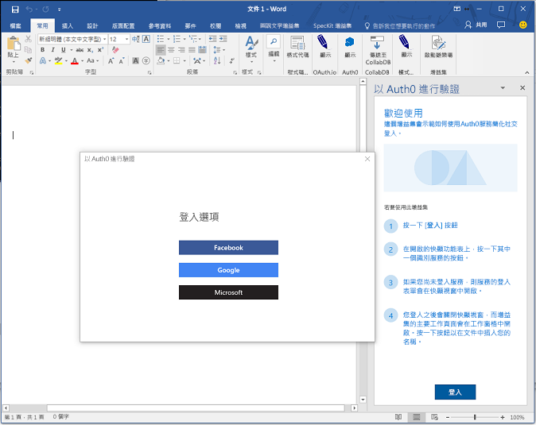
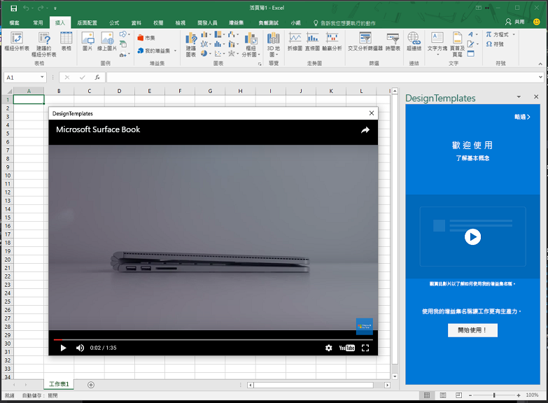

# <a name="use-the-dialog-api-in-your-office-add-ins"></a>在 Office 增益集中使用對話方塊 API 

您可以使用[對話方塊 API](../../reference/shared/officeui.md) 在 Office 增益集中開啟對話方塊。本文提供在 Office 增益功能中使用「對話方塊 API」的指引。

> **附註：**如需目前支援「對話方塊 API」的位置相關資訊，請參閱[對話方塊 API 需求集合](../../reference/requirement-sets/dialog-api-requirement-sets.md)。Word、Excel、PowerPoint 和 Outlook 目前都支援「對話方塊 API」。

您可能想要從工作窗格、內容增益集或[增益集命令](https://dev.office.com/docs/add-ins/design/add-in-commands)開啟對話方塊，進而︰ 

- 顯示無法直接在工作窗格中開啟的登入頁面。
- 為增益集中的一些工作，提供更多的螢幕空間或甚至提供全螢幕。
- 裝載受限於工作窗格而太小的影片。

>**附註：**由於重疊 UI 可能造成使用者困擾，所以避免從工作窗格開啟對話方塊，除非您的案例這麼要求。當您在考慮如何使用工作窗格的介面區時，請注意工作窗格可以是索引標籤式窗格。如需範例，請參閱 [Excel 增益集 JavaScriptSalesTracker](https://github.com/OfficeDev/Excel-Add-in-JavaScript-SalesTracker) 範例。

下圖顯示對話方塊的範例。 



請注意，對話方塊總是在螢幕中央開啟。使用者可以移動並調整其大小。此視窗為「非強制回應」**的視窗︰使用者可以繼續與 Office 主應用程式中的文件以及工作窗格中的主頁面互動 (如果有的話)。

## <a name="dialog-api-scenarios"></a>對話方塊 API 案例

Office JavaScript API 以一個 [Dialog](../../reference/shared/officeui.dialog.md) 物件和 [Office.context.ui 命名空間](../../reference/shared/officeui.md)中的兩個函式來支援下列案例。 

### <a name="opening-a-dialog-box"></a>開啟對話方塊

若要開啟對話方塊，您在工作窗格中的程式碼會呼叫 [displayDialogAsync](../../reference/shared/officeui.displaydialogasync.md) 方法，並將應該開啟的資源 URL 傳遞給它。這通常是網頁，但它可能是 MVC 應用程式中的控制站方法、路由、Web 服務方法或任何其他資源。在本文中，「網頁」或「網站」是指對話方塊中的資源。以下是簡單的範例。

```js
Office.context.ui.displayDialogAsync('https://myAddinDomain/myDialog.html'); 
```

> **附註：**

> - 此 URL 會使用 HTTP**S** 通訊協定。對於在一個對話方塊中載入的所有頁面 (而不只是所載入的第一頁)，這是必要的。
> - 此網域與主頁面的網域相同，可以是工作窗格中的頁面或增益集命令的[函式檔案](https://dev.office.com/reference/add-ins/manifest/functionfile)。這是必要的︰傳遞至 `displayDialogAsync` 方法的網頁、控制站方法或其他資源必須與裝載網頁在相同的網域。 

載入第一頁 (或其他資源) 之後，使用者可以前往使用 HTTPS 的任何網站 (或其他資源)。您也可以將第一頁設計成立即重新導向至另一個網站。 

根據預設，對話方塊將會佔裝置畫面高度和寬度的 80%，但是您可以將設定物件傳遞至此方法以設定不同的百分比，如下列範例所示。

```js
Office.context.ui.displayDialogAsync('https://myDomain/myDialog.html', {height: 30, width: 20}); 
```

如需這麼做的範例增益集，請參閱 [Office 增益集對話方塊 API 範例](https://github.com/OfficeDev/Office-Add-in-Dialog-API-Simple-Example)。

將兩個值設為 100%，可取得實際的全螢幕經驗。(有效上限為 99.5%，而視窗仍可移動並可調整大小。)

>**附註：**只可以從主應用程式視窗開啟一個對話方塊。嘗試開啟另一個對話方塊會產生錯誤。(如需詳細資訊，請參閱[來自 displayDialogAsync 的錯誤](#errors-from-displaydialogAsync)。)因此，如果使用者從工作窗格開啟一個對話方塊，便無法從工作窗格中的不同頁面開啟第二個對話方塊。不過，若從[增益集命令](https://dev.office.com/docs/add-ins/design/add-in-commands)開啟對話方塊，此命令會在每次選取時開啟新的 (但看不見的) HTML 檔案。這會建立新的 (看不見的) 主視窗，因此每個這類視窗都可以啟動自己的對話方塊。 

### <a name="take-advantage-of-a-performance-option-in-office-online"></a>善用 Office Online 中的效能選項

`displayInIframe` 屬性是組態物件中的額外屬性，您可以將它傳遞至 `displayDialogAsync`。當這個屬性設為 `true` 且增益集在 Office Online 中開啟的文件執行時，對話方塊會以浮動 iframe 而不是獨立的視窗開啟，讓它可以更快速開啟。以下為範例。

```js
Office.context.ui.displayDialogAsync('https://myDomain/myDialog.html', {height: 30, width: 20, displayInIframe: true}); 
```

預設值是 `false`，也就是與完全省略屬性相同。

如果增益集不是在 Office Online 中執行，會忽略 `displayInIframe`，但其存在也無礙。

> **附註：**如果對話方塊會在任何時間重新導向至無法在 iframe 中開啟的網頁，則您***不***應該使用`displayInIframe: true`。例如，許多常用 Web 服務的登入網頁 (例如 Google 和 Microsoft 帳戶) 無法在 iframe 中開啟。 

### <a name="sending-information-from-the-dialog-box-to-the-host-page"></a>將對話方塊中的資訊傳送到主頁面

對話方塊無法與工作窗格中的主頁面通訊，除非︰

- 對話方塊的目前頁面與主頁面位於相同的網域。
- Office JavaScript 程式庫會載入此頁面中。(如同任何使用 Office JavaScript 程式庫的頁面，此頁面的指令碼必須指派方法給 `Office.initialize` 屬性，雖然它可以是空白的方法。如需詳細資訊，請參閱[初始化增益集](http://dev.office.com/docs/add-ins/develop/understanding-the-javascript-api-for-office#initializing-your-add-in))。 

對話方塊頁面中的程式碼會使用 `messageParent` 函式，將布林值或字串訊息傳送至主頁面。此字串可以是單字、句子、XML blob、字串化 JSON，或是任何可序列化為字串的項目。以下為範例。

```js
if (loginSuccess) {
    Office.context.ui.messageParent(true); 
}
```

>**附註：** 

> - `messageParent` 函式是可以在對話方塊中呼叫的「唯獨」**兩個 Office API 之一。(另一個是 `Office.context.requirements.isSetSupported`。如需相關資訊，請參閱[指定 Office 主應用程式及 API 需求](https://github.com/OfficeDev/office-js-docs/blob/master/docs/overview/specify-office-hosts-and-api-requirements.md)。
> - `messageParent` 函式只能在與主頁面相同網域 (包括通訊協定和連接埠) 的頁面上呼叫。

在下一個範例中，`googleProfile` 是使用者 Google 設定檔的字串化版本。

```js
if (loginSuccess) {
    Office.context.ui.messageParent(googleProfile); 
}
```

必須將主頁面設定用來接收訊息。您的作法是回呼參數新增至 `displayDialogAsync` 的原始呼叫。回呼會指派處理常式給 `DialogMessageReceived` 事件。以下為範例。請注意有關這段程式碼的下列各項︰

- Office 會將 [AsyncResult](https://dev.office.com/reference/add-ins/shared/asyncresult) 物件傳遞給回呼。它代表嘗試開啟對話方塊的結果。但不代表對話方塊中任何事件的結果。如需此區別的詳細資訊，請參閱[處理錯誤和事件](#handling-errors-and-events)一節。 
- `asyncResult` 的 `value` 屬性會設定為 [Dialog](https://dev.office.com/reference/add-ins/shared/officeui.dialog) 物件，該物件存在於主頁面中，但不存在於對話方塊的執行內容中。
- `processMessage` 是處理事件的函式。您可以自行替它命名。 
- `dialog` 變數會在比回呼更廣的範圍上宣告，因為它也會在 `processMessage` 中參照。

```js
var dialog;
Office.context.ui.displayDialogAsync('https://myDomain/myDialog.html', {height: 30, width: 20},
    function (asyncResult) {
        dialog = asyncResult.value;
        dialog.addEventHandler(Office.EventType.DialogMessageReceived, processMessage);
    }
); 
```

下列是 `DialogMessageReceived` 事件的處理常式範例。請注意有關這段程式碼的下列各項︰

- Office 會將 `arg` 物件傳遞至處理常式。其 `message` 屬性是在對話方塊中呼叫 `messageParent` 所傳送的布林值或字串。在這個範例中，它是以字串形式呈現的 Microsoft 帳戶或 Google 等服務的使用者設定檔，所以會利用 `JSON.parse` 還原序列化為物件。
- 系統不會顯示 `showUserName` 實作。可能會在工作窗格上顯示個人化的歡迎訊息。

```js
function processMessage(arg) {
    var messageFromDialog = JSON.parse(arg.message);
    showUserName(messageFromDialog.name);
}
```

當使用者與對話方塊完成互動時，您的訊息處理常式應會關閉對話方塊，如這個範例所示。請注意有關這段程式碼的下列各項︰

- `dialog` 物件必須是呼叫 `displayDialogAsync` 所傳回的同一個物件。 
- 呼叫 `dialog.close` 可告訴 Office 立即關閉對話方塊。

```js
function processMessage(arg) {
    dialog.close();
    // message processing code goes here;
}
```

如需使用這些技術的範例增益集，請參閱 [Office 增益集對話方塊 API 範例](https://github.com/OfficeDev/Office-Add-in-Dialog-API-Simple-Example)。

如果增益集在接收訊息之後，需要開啟工作窗格的不同頁面，您可以使用 `window.location.replace` 方法 (或 `window.location.href`) 做為處理常式的最後一行。以下為範例。

```js
function processMessage(arg) {
    // message processing code goes here;
    window.location.replace("/newPage.html");
    // Alternatively ...
    // window.location.href = "/newPage.html";
}
```

如需可執行此作業的增益集範例，請參閱[使用 Microsoft Graph 在 PowerPoint 增益集中插入 Excel 圖表](https://github.com/OfficeDev/PowerPoint-Add-in-Microsoft-Graph-ASPNET-InsertChart)。 

#### <a name="conditional-messaging"></a>條件式傳訊

因為您可以從對話方塊傳送多個 `messageParent` 呼叫，但您在 `DialogMessageReceived` 事件的主頁面中只有一個處理常式，所以處理常式必須使用條件式邏輯來區分不同的訊息。例如，如果對話方塊提示使用者登入 Microsoft 帳戶或 Google 等識別提供者，則會以訊息形式傳送使用者的設定檔。如果驗證失敗，則對話方塊應將錯誤資訊傳送至主頁面，如下列範例所示。請注意有關這段程式碼的下列各項︰

- `loginSuccess` 變數會藉由讀取識別提供者的 HTTP 回應來初始化。
- 系統不會顯示 `getProfile` 和 `getError` 函式的實作。它們會各自從查詢參數或從 HTTP 回應的主體取得資料。
- 系統會根據登入是否成功來傳送不同類型的匿名物件。兩者都具有 `messageType` 屬性，但其中一個有 `profile` 屬性，而另一個有 `error` 屬性。

```js
if (loginSuccess) {
    var userProfile = getProfile();
    var messageObject = {messageType: "signinSuccess", profile: userProfile};            
    var jsonMessage = JSON.stringify(messageObject);
    Office.context.ui.messageParent(jsonMessage); 
} else {
    var errorDetails = getError();
    var messageObject = {messageType: "signinFailure", error: errorDetails};            
    var jsonMessage = JSON.stringify(messageObject);
    Office.context.ui.messageParent(jsonMessage); 
}
```

如需使用條件式傳訊的範例，請參閱 

- [使用 Auth0 服務以簡化社交網路帳戶登入的 Office 增益集](https://github.com/OfficeDev/Office-Add-in-Auth0)
- [使用 OAuth.io 服務以簡化熱門線上服務存取權的 Office 增益集](https://github.com/OfficeDev/Office-Add-in-OAuth.io)

主網頁中的處理常式程式碼會使用 `messageType` 屬性值進行分支，如下列範例所示。請注意，`showUserName` 函式與上述範例相同，而 `showNotification` 函式會在主頁面的 UI 中顯示錯誤。 

```js
function processMessage(arg) {
    var messageFromDialog = JSON.parse(arg.message);
    if (messageFromDialog.messageType === "signinSuccess") {
        dialog.close();
        showUserName(messageFromDialog.profile.name);
        window.location.replace("/newPage.html");
    } else {
        dialog.close();
        showNotification("Unable to authenticate user: " + messageFromDialog.error);
    }
}
```

### <a name="closing-the-dialog-box"></a>關閉對話方塊

您可以在對話方塊中實作可關閉對話方塊的按鈕。若要這麼做，按鈕的點選事件處理常式應使用 `messageParent` 來告知主網頁已按下此按鈕。以下為範例。

```js
function closeButtonClick() {
    var messageObject = {messageType: "dialogClosed"};            
    var jsonMessage = JSON.stringify(messageObject);
    Office.context.ui.messageParent(jsonMessage); 
}
``` 

`DialogMessageReceived` 的主頁面處理常式會呼叫 `dialog.close`，如這個範例所示。(請參閱本文前面顯示對話方塊物件如何初始化的範例)。


```js
function processMessage(arg) {
    var messageFromDialog = JSON.parse(arg.message);
    if (messageFromDialog.messageType === "dialogClosed") {
       dialog.close();
    }
}
```

如需使用此技術的範例，請參閱 [Office 增益集的 UX 設計模式](https://github.com/OfficeDev/Office-Add-in-UX-Design-Patterns-Code)儲存機制中的[對話方塊瀏覽設計模式](https://github.com/OfficeDev/Office-Add-in-UX-Design-Patterns-Code/tree/master/templates/dialog/navigation)。

即使您沒有自己的關閉對話方塊 UI，使用者仍可藉由選擇右上角的 **X** 來關閉對話方塊。這個動作會觸發 `DialogEventReceived` 事件。如果主窗格必須知道何時發生此事件，則應宣告此事件的處理常式。如需詳細資訊，請參閱[對話視窗中的錯誤和事件](#errors-and-events-in-the-dialog-window)一節。

## <a name="handling-errors-and-events"></a>處理錯誤和事件 

您的程式碼該處理兩類事件︰

- 呼叫 `displayDialogAsync` 所傳回的錯誤，因為無法建立對話方塊。 
- 對話視窗中的錯誤和其他事件。

### <a name="errors-from-displaydialogasync"></a>來自 displayDialogAsync 的錯誤

除了一般平台和系統錯誤以外，呼叫 `displayDialogAsync` 會出現三個特定錯誤。

|代碼編號|意義|
|:-----|:-----|
|12004|傳遞至 `displayDialogAsync` 的 URL 網域不受信任。網域必須與主機頁面 (包括通訊協定和連接埠號碼) 的網域相同。|
|12005|傳送至 `displayDialogAsync` 的 URL 使用 HTTP 通訊協定。HTTPS 為必填。(部分 Office 版本中，傳回的 12005 錯誤訊息與傳回的 12004 錯誤相同。)|
|12007|已經從這個主視窗開啟對話方塊。主視窗 (如工作窗格) 一次只能開啟一個對話方塊。|

呼叫 `displayDialogAsync` 時，它一律將 [AsyncResult](https://dev.office.com/reference/add-ins/shared/asyncresult) 物件傳遞給其回呼函式。若呼叫成功 (也就是開啟對話視窗)，`AsyncResult` 物件的 `value` 屬性會是 [Dialog](https://dev.office.com/reference/add-ins/shared/officeui.dialog) 物件。[將對話方塊中的資訊傳送到主頁面](#sending-information-from-the-dialog-to-the-host-page)一節中有其範例。若 `displayDialogAsync` 呼叫失敗，則無法建立視窗，`AsyncResult` 物件的 `status` 屬性會設為「失敗」，而且會填入此物件 `error` 的屬性。您應該永遠都有回呼可測試 `status` 並在發生錯誤時予以回應。以下範例只會回報錯誤訊息，而不管其代碼編號為何。 

```js
var dialog;
Office.context.ui.displayDialogAsync('https://myDomain/myDialog.html', 
function (asyncResult) {
    if (asyncResult.status === "failed") { 
        showNotification(asynceResult.error.code = ": " + asyncResult.error.message); 
    } else {
        dialog = asyncResult.value;
        dialog.addEventHandler(Office.EventType.DialogMessageReceived, processMessage);
    }
}); 
```

### <a name="errors-and-events-in-the-dialog-window"></a>對話視窗中的錯誤和事件

對話方塊中有三個錯誤和事件 (依照其代碼編號辨別) 會在主頁面中觸發 `DialogEventReceived` 事件。 

|代碼編號|意義|
|:-----|:-----|
|12002|下列其中一項：<br> - 傳遞至 `displayDialogAsync` 的 URL 不存在任何頁面。<br> - 已載入傳遞至 `displayDialogAsync` 的頁面，但是對話方塊被導向至它找不到或無法載入的頁面，或已導向至含有無效語法的 URL。|
|12003|對話方塊被導向至採用 HTTP 通訊協定的 URL。需要 HTTPS。|
|12006|對話方塊已關閉，通常是因為使用者選擇 **X** 按鈕。|

您的程式碼可以在 `displayDialogAsync` 呼叫中為 `DialogEventReceived` 事件指派處理常式。以下是簡單的範例。

```js
var dialog;
Office.context.ui.displayDialogAsync('https://myDomain/myDialog.html', 
    function (result) {
        dialog = result.value;
        dialog.addEventHandler(Office.EventType.DialogEventReceived, processDialogEvent);
    }
); 
```

以下是 `DialogEventReceived` 事件的處理常式範例，它可為每個錯誤碼建立自訂錯誤訊息。 

```js
function processDialogEvent(arg) {
    switch (arg.error) {
        case 12002:
            showNotification("The dialog box has been directed to a page that it cannot find or load, or the URL syntax is invalid.");
            break;
        case 12003:
            showNotification("The dialog box has been directed to a URL with the HTTP protocol. HTTPS is required.");            break;
        case 12006:
            showNotification("Dialog closed.");
            break;
        default:
            showNotification("Unknown error in dialog box.");
            break;
    }
}
```

如需以此方式處理錯誤的範例增益集，請參閱 [Office 增益集對話方塊 API 範例](https://github.com/OfficeDev/Office-Add-in-Dialog-API-Simple-Example)。

 
## <a name="passing-information-to-the-dialog-box"></a>將資訊傳遞至對話方塊

主頁面有時候必須將資訊傳送至對話方塊。主要有兩個方法可以這麼做：

- 將查詢參數新增至已傳遞給 `displayDialogAsync` 的 URL。 
- 將資訊儲存在主視窗和對話方塊都可以存取的位置。這兩個視窗不會共用一般的工作階段儲存體，但「如果兩者的網域相同」** (包括連接埠號碼，如果有的話)，則會共用一般的[本機儲存體](http://www.w3schools.com/html/html5_webstorage.asp)。

### <a name="using-local-storage"></a>使用本機儲存體

若要使用本機儲存體，您的程式碼可在 `displayDialogAsync` 呼叫之前，於主頁面中呼叫 `window.localStorage` 物件的 `setItem` 方法，如下列範例所示。

```js
localStorage.setItem("clientID", "15963ac5-314f-4d9b-b5a1-ccb2f1aea248");
```

必要時，對話視窗中的程式碼會讀取此項目，如下列範例所示。

```js
var clientID = localStorage.getItem("clientID");
// You can also use property syntax:
// var clientID = localStorage.clientID;
```

如需以此方式使用本機儲存體的範例增益集，請參閱︰ 

- [使用 Auth0 服務以簡化社交網路帳戶登入的 Office 增益集](https://github.com/OfficeDev/Office-Add-in-Auth0)
- [使用 OAuth.io 服務以簡化熱門線上服務存取權的 Office 增益集](https://github.com/OfficeDev/Office-Add-in-OAuth.io)

### <a name="using-query-parameters"></a>使用查詢參數

下列範例顯示如何使用查詢參數傳遞資料。

```js
Office.context.ui.displayDialogAsync('https://myAddinDomain/myDialog.html?clientID=15963ac5-314f-4d9b-b5a1-ccb2f1aea248'); 
```

如需使用此技術的範例，請參閱[透過 PowerPoint 增益集使用 Microsoft Graph 插入 Excel 圖表](https://github.com/OfficeDev/PowerPoint-Add-in-Microsoft-Graph-ASPNET-InsertChart)。

對話視窗中的程式碼可以剖析 URL 並讀取參數值。

> **注意**：Office 會自動將名為 `_host_info` 的查詢參數新增至傳遞給 `displayDialogAsync` 的 URL。(它會附加在您的自訂查詢參數之後 (如果有的話)。但不會附加到對話方塊所瀏覽的任何後續 URL。)Microsoft 未來可能會變更此值的內容，或完全予以移除，因此您的程式碼應該不會讀取它。系統會將相同的值新增至對話方塊的工作階段儲存體。同樣地，*您的程式碼應該不會讀取也不會寫入這個值*。

## <a name="using-the-dialog-apis-to-show-a-video"></a>使用對話方塊 API 顯示影片

若要在對話方塊中顯示影片︰

1.  建立內容僅限 iframe 的網頁。iframe 點的 `src` 屬性會指向線上影片。影片 URL 的通訊協定必須是 HTTP**S**。在本文中，我們將此頁面稱為 "video.dialogbox.html"。以下是標記範例。

        <iframe class="ms-firstrun-video__player"  width="640" height="360" 
            src="https://www.youtube.com/embed/XVfOe5mFbAE?rel=0&autoplay=1" 
            frameborder="0" allowfullscreen>
        </iframe>

2.  video.dialogbox.html 頁面必須位於與主頁面相同的網域中。
3.  在主頁面中使用 `displayDialogAsync` 呼叫，以開啟 video.dialogbox.html。
4.  如果增益集必須知道使用者何時關閉對話方塊，請註冊 `DialogEventReceived` 事件的處理常式並處理 12006 事件。如需詳細資訊，請參閱[對話視窗中的錯誤和事件](#errors-and-events-in-the-dialog-window)一節。

如需在對話方塊中顯示影片的範例，請參閱 [Office 增益集的 UX 設計模式](https://github.com/OfficeDev/Office-Add-in-UX-Design-Patterns-Code)儲存機制中的[影片配置 Placemat 設計模式](https://github.com/OfficeDev/Office-Add-in-UX-Design-Patterns-Code/tree/master/templates/first-run/video-placemat)。



## <a name="using-the-dialog-apis-in-an-authentication-flow"></a>在驗證流程中使用對話方塊 API

「對話方塊 API」的主要案例是要能夠向不允許在 iframe 中開啟其登入頁面的資源或識別提供者 (例如 Microsoft 帳戶、Office 365、Google 和 Facebook) 進行驗證。 

>**注意：**當您在此情況下使用「對話方塊 API」時，*不要*在呼叫中使用 `displayInIframe: true` 選項來 `displayDialogAsync`。請參閱本文稍早關於此選項的詳細資訊。 

以下是簡單和典型的驗證流量。 

1. 對話方塊中所開啟的第一頁是增益集的網域中所裝載的本機頁面 (或其他資源)；也就是主視窗的網域。這個頁面可以顯示簡單的 UI：「請稍候，正在重新導向至可讓您登入 *NAME-OF-PROVIDER* 的頁面。」此頁面中的程式碼會使用傳遞至對話方塊的資訊 (如[將資訊傳遞至對話方塊](#passing-information-to-the-dialog-box)中所述)，以便建構識別提供者的登入頁面 URL。 
2. 然後對話方塊視窗會重新導向至登入頁面。此 URL 包含一個查詢參數，可告訴識別提供者在使用者登入特定頁面後重新導向對話視窗。在本文中，我們將此頁面稱為 "redirectPage.html"。(*這必須是與主視窗位於相同網域的頁面*，因為對話視窗傳遞登入嘗試結果的唯一方法就是呼叫 `messageParent`，但只能在與主視窗位於相同網域的頁面上呼叫。) 
2. 識別提供者的服務會處理從對話視窗傳入的 GET 要求。如果使用者已經登入，它會立即將視窗重新導向至 redirectPage.html，並將使用者資料納入為查詢參數。如果使用者尚未登入，則提供者的登入頁面會出現在視窗中，使用者即可登入。對於大部分的提供者而言，如果使用者無法成功，則提供者會在對話視窗中顯示錯誤頁面，而且不會重新導向至 redirectPage.html。使用者必須選取角落的 **X** 來關閉視窗。如果使用者順利登入，則對話視窗會重新導向至 redirectPage.html，而且使用者資料會納入為查詢參數。
3. 當 redirectPage.html 頁面開啟時，它會呼叫 `messageParent` 向主頁面報告成功或失敗，並選擇性地報告使用者資料或錯誤資料。 
4. `DialogMessageReceived` 事件會在主頁面中觸發，而其處理常式會關閉對話視窗，並選擇性地進行其他訊息處理。 

如需使用此模式的範例增益集，請參閱︰

- [使用 Microsoft Graph 在 PowerPoint 增益集中插入 Excel 圖表](https://github.com/OfficeDev/PowerPoint-Add-in-Microsoft-Graph-ASPNET-InsertChart)：一開始在對話方塊視窗中開啟的資源是控制站方法，沒有其本身的任何檢視。會重新導向至 Office 365 登入頁面。
- [適用於 AngularJS 的 Office 增益集 Office 365 用戶端驗證](https://github.com/OfficeDev/Word-Add-in-AngularJS-Client-OAuth)：一開始在對話方塊視窗中開啟的資源是網頁。 

#### <a name="supporting-multiple-identity-providers"></a>支援多個識別提供者

如果增益集可讓使用者選擇提供者 (例如 Microsoft 帳戶、Google 或 Facebook)，您需要位於本機的第一頁 (請參閱上一節)，以提供讓使用者選取提供者的 UI。選取項目會觸發登入 URL 的建構並重新導向它。 

如需使用此模式的範例，請參閱[使用 Auth0 服務以簡化社交網路帳戶登入的 Office 增益集](https://github.com/OfficeDev/Office-Add-in-Auth0)。

#### <a name="authorization-of-the-add-in-to-an-external-resource"></a>增益集對外部資源的授權

在新式 Web 中，Web 應用程式屬於安全性主體 (如同使用者一樣)，而且應用程式對於線上資源 (例如 Office 365、Google Plus、Facebook 或 LinkedIn) 會有其自己的身分識別和權限。應用程式會在部署前向資源提供者註冊。註冊包含︰ 

- 應用程式存取使用者資源所需的權限清單。
- 當應用程式存取資源服務時，該服務應將存取權杖傳回至的 URL。  

當使用者在應用程式中叫用可存取資源服務中使用者資料的函式時，系統會先提示使用者登入服務，再提示使用者授與應用程式存取使用者資源所需的權限。服務會接著將登入視窗重新導向至先前註冊的 URL 並傳遞存取權杖。應用程式會使用存取權杖來存取使用者的資源。 

您可以使用「對話方塊 API」來管理此程序，其作法是使用類似針對使用者所述的流程進行登入，或使用[處理慢速網路](#addressing-a-slow-network)中所述的變化。只有以下差異︰

- 如果使用者先前未授與應用程式所需的權限，則系統會提示使用者在登入後於對話方塊中執行此動作。 
- 對話視窗可使用 `messageParent` 傳送字串化存取權杖，或將存取權杖儲存在主視窗可以擷取的位置，藉此傳送存取權杖給主視窗。權杖有時間限制，但只要有效，主視窗即可用來直接存取使用者的資源，而不需任何進一步的提示。

下列範例將「對話方塊 API」用於以下目的︰

- [使用 Microsoft Graph 在 PowerPoint 增益集中插入 Excel 圖表](https://github.com/OfficeDev/PowerPoint-Add-in-Microsoft-Graph-ASPNET-InsertChart) - 在資料庫中儲存存取權杖。
- [使用 OAuth.io 服務以簡化熱門線上服務存取權的 Office 增益集](https://github.com/OfficeDev/Office-Add-in-OAuth.io)

#### <a name="more-information-about-authentication-and-authorization-in-add-ins"></a>如需增益集驗證和授權的詳細資訊

- [在您的 Office 增益集中授權外部服務](https://dev.office.com/docs/add-ins/develop/auth-external-add-ins)
- [Office JavaScript API 協助程式庫](https://github.com/OfficeDev/office-js-helpers) 


## <a name="using-the-office-dialog-api-with-single-page-applications-and-client-side-routing"></a>使用 Office 對話方塊 API 搭配單一頁面應用程式和用戶端路由

如果增益集使用用戶端路由 (如同單一頁面應用程式通常所為)，您可以選擇將路由的 URL 傳遞至 [displayDialogAsync](http://dev.office.com/reference/add-ins/shared/officeui.displaydialogasync) 方法，而非傳遞完整個別 HTML 網頁的 URL。 

> **重要事項：**對話方塊是在新視窗中，並有其自己的執行內容。如果您傳遞路由，則基礎網頁與其所有的初始化和啟動載入程式碼都會在此新的內容中重新執行，而所有變數會在對話視窗中設定為其初始值。因此這項技術會在對話視窗中啟動應用程式的第二個執行個體。在對話視窗中變更變數的程式碼不會變更相同變數的工作窗格版本。同樣地，此對話視窗有自己的工作階段儲存體，其無法在工作窗格中經由程式碼存取。 

