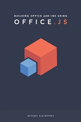

# 針對想要知道其*實際*運作方式的使用者來實作詳細資料

| | |
|:--|:--|
||**本文摘錄自 Michael Zlatkovsky 撰寫的書籍《[使用 Office.js 建置 Office 增益集](https://leanpub.com/buildingofficeaddins)》，您可以在 [LeanPub.com](https://leanpub.com/buildingofficeaddins) 以電子書的形式購買本書。 (英文)**  Copyright © 2016-2017 by Michael Zlatkovsky. 著作權所有，並保留一切權利。|

> *在撰寫本書及收到早期讀者的意見反應時，我收到一些要求，要求更徹底的說明對這所有 Proxy 物件/同步業務的幕後發生了什麼。因此，如果您是想要查看**實作詳細資料**以更加了解 API 外部行為的使用者，請繼續閱讀。如果您不想閱讀這些資料，請隨意跳到下一節。*

## 要求內容佇列

Office 2016 API 新浪潮的核心是「要求內容」－它是您接收做為 `Excel.run` 內批次函式參數的物件。基本上，您可以將「要求內容」物件想像為會累積您想要對文件所做的任何變更的中央儲存機制。這裡說「儲存機制」，是因為「要求內容」確實可以比作版本控制系統，其中您傳送的都是本機狀態與遠端狀態之間的*差異*。

>**附註：**Git 是特別適合的版本控制類比，因為本機變更會與儲存機制完美隔離：在您執行本機狀態的 `git push` 之前，儲存機制有*皆不會知道*所做的相關變更！新 Office.js 模型的「要求內容」和 Proxy 物件幾乎完全相同：在開發人員發出 `context.sync()` 命令之前，文件完全不會知道！  

「要求內容」會保有兩個陣列，讓它進行其作業。一個針對**物件路徑**：如何自一個物件衍生一個物件的說明 (亦即「*使用參數值 `2` 在 <insert-some-preceding-object-path> 上呼叫方法 `getRow`，以便衍生此物件*」)。另一個則用於**動作** (亦即，*將物件路徑 #xyz 所描述之物件上名為 "color" 的屬性設定為 "purple" 值*)。對於那些熟悉「命令」設計模式的人員，帶著代表特定動作配方物件的概念應該很熟悉。

在「要求內容」上是單一的根物件，將它連接至基礎物件模型。針對 Excel，這個物件是 `workbook`；針對 Word，它是 `document`。您可以從其上藉由在該根 Proxy 物件，或在它的任何下階上呼叫方法來衍生新物件。例如，若要取得名為 "Report" 的工作表，您會要求 `workbook` 物件提供其 `worksheets` 屬性 (它會傳回對應於文件中工作表集合的 Proxy 物件)，然後使用 `worksheets` 呼叫 `getItem("Report")` 方法，以取得與所需的 "Report" 工作表對應的 Proxy 物件。每個物件會帶有其原始「要求內容」的連結，它會依序會持續追蹤每個物件的路徑資訊：也就是說，誰是這個新物件的父系，以及建立它時的情況 (*是屬性或方法呼叫是？是否傳遞任何參數？*)。

每當在 Proxy 物件上呼叫方法或屬性，會將該呼叫登錄為「要求內容」上的**動作**。例如，呼叫 `range.merge()` 或 `fill.color = "purple"` 的設定，會放在佇列中作為某物件上的某動作。此外，如果方法或屬性呼叫的結果是另一個 Proxy 物件 (例如，`worksheets.getItem("Report")` 或 `worksheets.add()`)，方法呼叫的*副作用*是會產生新的 Proxy 物件，而全能的「要求內容」會將其歷程詳盡載明。

讓我們逐步完成真實的範例。假設您有下列程式碼：

**透過要求內容/Proxy 物件追蹤作業**
~~~
    Excel.run(async (context) => {
        let range = context.workbook.getSelectedRange();
        range.clear();
        let thirdRow = range.getRow(2);
        thirdRow.format.fill.color = "purple";

        await context.sync();
    }).catch(OfficeHelpers.Utilities.log);
~~~

現在讓我們藉由仔細搜查來分析它。利用每一個 API 呼叫，我會持續執行物件路徑和其動作的記錄 (以友善和縮短的標記法表示，但緊接著說明內部發生什麼事)。

若要開始，行 **#1** -- `Excel.run(async (context) => {` -- 使用 `Excel.run` 來建立「要求內容」物件。`.run` 呼叫也會執行許多其他動作，但讓我們目前暫且不談。重點是，它能提供我們全新的 `context` 物件，在其上頭已經有預先初始化的 `workbook` 物件 (我們立刻會用到)。  

~~~
    objectPaths:
        // markua-start-insert
        1 => global object (workbook)
        // markua-end-insert

    actions: <none>,
~~~

在行 **#2** -- `let range = context.workbook.getSelectedRange()` -- 我們使用該 `workbook` 物件來衍生新物件，對應於目前的選取範圍。我們將它指派給稱為 `range` 的變數，但對「要求內容」不重要：即使我們還沒有將它命名為任何項目，而是用它做為傳遞物件來取得其他目的地，則仍會反映在「要求內容」清單中。建立物件也會使得在動作清單中反映為物件初始設定動作，這個章節稍後將說明其用途。

~~~
    objectPaths:
        P1 => global object (workbook)
        // markua-start-insert
        P2 => (range)
                parent: "P1", type: "method",
                name: "getSelectedRange", args: <none>
        // markua-end-insert

    actions:
        // markua-start-insert
        A1 => action: "init", object: "P2" (range)
        // markua-end-insert
~~~

行 **#3** -- `range.clear()` -- 新增第一個實際影響文件的動作：用於清除範圍的內容的命令：

~~~
    objectPaths:
        P1 => global object (workbook)
        P2 => (range)
                parent: "P1", type: "method",
                name: "getSelectedRange", args: <none>

    actions:
        A1 => action: "init", object: "P2" (range)
        // markua-start-insert
        A2 => action: "method", object: "P2" (range)
                name: "clear", args: <none>
        // markua-end-insert
~~~

行 **#4** -- `let thirdRow = range.getRow(2)` -- 採用與行 #2 相似的模式，建立衍生自先前定義的 `range` 物件的 `thirdRow` 物件，並新增另一個具現化動作：

~~~
    objectPaths:
        P1 => global object (workbook)
        P2 => (range)
                parent: "P1", type: "method",
                name: "getSelectedRange", args: <none>
        // markua-start-insert
        P3 => (thirdRow)
                parent: "P2", type: "method",
                name: "getRow", args: [2]
        // markua-end-insert

    actions:
        A1 => action: "init", object: "P2" (range)
        A2 => action: "method", object: "P2" (range)
                name: "clear", args: <none>
        // markua-start-insert
        A3 => action: "init", object: "P3" (thirdRow)
        // markua-end-insert
~~~

行 **#5** -- `thirdRow.format.fill.color = "purple"` -- 包裝了幾個 API 呼叫。我們藉由遵循 `thirdRow` 變數的 `format` 屬性來開始建立 [anonymous] 格式物件。我們再對 [anonymous] 填滿物件執行相同的動作。兩者都遵循之前的相同模式，為每一個建立物件路徑和具現化動作。但之後，在達到想要的物件時，我們在物件上執行另一個影響文件的動作：將第三個資料列的填滿色彩設定為紫色 (請參閱下方的動作 "**A6**")：

~~~
    objectPaths:
        P1 => global object (workbook)
        P2 => (range)
                parent: "P1", type: "method",
                name: "getSelectedRange", args: <none>
        P3 => (thirdRow)
                parent: "P2", type: "method",
                name: "getRow", args: [2]
        // markua-start-insert
        P4 => (format)
                parent: "P3", type: "property",
                name: "format"
        P5 => (fill)
                parent: "P4", type: "property",
                name: "fill"
        // markua-end-insert

    actions:
        A1 => action: "init", object: "P2" (range)
        A2 => action: "method", object: "P2" (range)
                name: "clear", args: <none>
        A3 => action: "init", object: "P3" (thirdRow)
        // markua-start-insert
        A4 => action: "init", object: "P4" (format)
        A5 => action: "init", object: "P5" (fill)
        A6 => action: "setter", object: "P5" (fill),
                name: "color", value: "purple"
        // markua-end-insert
~~~

最後，在行 **#7** (行 #6 是空白列)，我們來到神奇的 **`await context.sync()`** 咒語。這個命令會告知「要求內容」將所有相關資訊包裝起來 (也就是說，擱置中動作和任何相關的物件路徑的資訊)，並將它傳送給主應用程式進行處理。

在主應用程式的接收端，主機會解壓縮動作並開始逐一查看。它會保持在這個特定的 `sync` 階段作業期間衍生之物件的工作字典，以致於只要擷取一次與 `thirdRow` 相對應的範圍一次，即不需要重新評估它。這麼做不只是為了提高效率，也是為了避免錯誤：如果在它與第一列之間新增了其他幾個資料列，您不會希望重新擷取相對索引 2 的資料列；您也不會想要每次重新擷取選取項目，因為它可能已有變動 (例如，在新增並啟動新的工作表期間)，而且語意上應該尚未將範圍使用原始參考*加上印記*。最後，如果您有衍生自呼叫工作表集合物件 `add` 方法的物件，您*一定*不會想要重新衍生該物件，並且在每次存取物件時由於副作用而新增新的工作表！

如果鏈結中的任何點發生錯誤，則批次的其餘部份會中止。在之前的範例中，選取範圍中如果沒有第三個資料列 (亦即，它是 2x2 的儲存格選取範圍)，將忽略其餘的命令 (雖然這可能在您的預期)。重要的是，雖然 `Excel.run` 或 `sync` 沒有任何*不可部分完成性*：已完成的任何動作會*保持*完成。在這個範例中，文件可能會處於*已變更*狀態，已經發生選取範圍的清除，而第三列的格式設定則尚未完成。雖然不理想，但這與 VBA 或是 VSTO 的相關 Office 自動化沒有差別；它只是太困難而無法復原，尤其是指定可能同時發生的任何使用者或共同作業者動作。 

## 主應用程式的回應

讓我們假設 `sync` 確實會成功：每個必要物件 (原始選取範圍、其第三列、格式、填滿) 都已成功建立，且這兩個影響文件的動作也可以認可至文件。接下來會發生什麼？

前面提過，主機會保持所使用物件的執行中字典。但這個執行中字典*僅適用該特定 `sync` 的持續期間：而不是應用程式的存留期*。若要無限期地保留並追蹤物件，對效能會造成很大的衝擊。

現在，讓我們來看其中的物件路徑是在工作表集合上的「新增」動作的情況。 在 `sync` 處理期間，此方法只會執行一次 (但帶有建立工作表的適當副作用)，並且會快取產生的工作表。這非常適合目前的 `sync`，但萬一開發人員想要在稍後的 `sync` 再次存取工作表？這是先前所述的具現化動作進來的位置。

針對每個動作，主應用程式可能會*選擇性地*傳送回應。對於清除範圍或設定填滿色彩之類的動作，不會有任何回應 (藉由佇列持續執行到完成的事實可明顯得知作業已成功)。但對於具現化動作，主機*可能*會傳送回應，以告知 JavaScript 將它的物件路徑重新對應於較不具揮發性的項目。因此，雖然新建立工作表的原始路徑可能已經「*在物件 xyz 上執行方法 `add`*」(其中 xyz 是工作表集合)，回應可能會指出「*從這裡，請將工作表視為在該相同 xyz 物件上使用參數 "123456789" 的 "getItem" 呼叫」。也就是說，在建立物件及執行具現化動作中，主機可以找出是否有它可以提供回給 JavaScript 以便日後參考此物件的更多永久性識別碼。(較不極端的範例：依名稱擷取工作表有點風險，在於名稱可能同時透過使用者互動和程式設計的方式變更；但如果主應用程式可以將路徑重新對應至永久的工作表識別碼，未來在物件上的任何呼叫保證可繼續參考相同的工作表，而不論其名稱為何。)

但是還有另一個甚至更為重要的用途，用於來自主機的回應。假設您在 JavaScript 端有呼叫 `range.load("formulas")`。就動作而言，這會在物件上以*查詢*動作形式表示，並具有值為 "formulas" 的參數。對此動作，主機會藉由擷取適當的物件 (由於具現化動作，這已在其字典中) 來回應，查詢它以取得必要的屬性，並傳回所要求的資訊。

## 回到 Proxy 物件的領域

回到 JavaScript，`sync` 正耐心等待來自主應用程式的回應。並希望開發人員程式碼*也*正耐心等待，使用 `await` 或訂閱 `sync` 承諾的 `.then` 函式呼叫。

當回應*的確*傳回時，在執行回到開發人員程式碼之前有一些內部處理。例如，上一節所述的任何路徑重新對應會生效。另外還有一些內部處理 (例如，停用在先前的 `sync` 批次期間有效但不能再次使用的物件路徑，我很快會說明)。而重要的是，任何*查詢*動作的結果會生效，使用載入的值，並將其放回對應的物件和屬性上。這可以確保，在 `sync` 之後，如果開發人員的程式碼現在參考 `range.values` 來取得其值已載入的 Range，他/她會得到值的最後一個已知快照 (與 `PropertyNotLoaded` 錯誤相對)。

隨著後續處理完成，要求內容現在已就緒可重複使用。其動作陣列已在 `sync` 的最開頭重設為空白的靜態圖像；而相對地，物件路徑陣列 (在特定要求內容存留期期間永遠不會清空，因為後續動作會繫結到重複使用部分現有的路徑) 的物件路徑會根據來自主機的回應和後續處理經過調整。因此可開始新的批次作業，加入佇列直到下次的 `await context.sync()`。

## 特殊 (但常見) 的案例：物件沒有識別碼

使用工作表 (Excel) 或內容控制項 (Word) 之類的物件時，主應用程式的工作相當簡單：在這兩種情況下，有一個附加至這每個物件的永久識別碼 (`getActiveWorksheet()` 或 `getItem`，或任何其他呼叫)，主機永遠都可以使用具現化動作來將路徑重新對應回永久識別碼。也就是說，身為開發人員，有時候一次建立物件，您可以繼續在下一個 `sync` 或甚至更久之後使用它。這在意料之中。

但如果物件沒有識別碼；以及根據定義，物件具有無限數量的交換呢？Excel 範圍 (特定一組儲存格) 與 Word 範圍 (在一個位置開始並在另一個結束的某些文字) 都無法容易取得其具體參考：它們所在的位址/索引可能會變更，而如果在其中新增其他的儲存格或字元，範圍也可能成長並擴大。對一些其他物件也是一樣的。

在批次的*處理*期間，主機對於追蹤物件沒有問題，因為它可以在此使用內部字典，並且擷取一次物件，在批次的持續期間繼續貼附它。但如同先前所述，批次間的主機為*無狀態* -- 它無法負擔在每次從 JavaScript 存取它時，便在每個物件上保留參考的作業，否則應用程式將洩漏記憶體並進行編目到中止。

若要避免主應用程式被上千個不再需要的物件拖累，同時啟用在使用物件執行進一步動作之前需要執行 `load` 和 `sync` 的常見案例，原始的設計如下所示：

1. 根據預設，沒有識別碼的任何物件會默默與基礎文件失去連線，且無法在目前的 `sync` 後再次使用。它在同步*之後*仍然可以由 JavaScript 讀取 (否則在第一時間會沒有可載入它的點！)，而可能不適合某些案例，但此預設行為會妨礙會先讀取範圍值，而據以標示色彩的反白顯示範例之類動作。
2. 若要啟用後面的案例，我們會公開 API -- `context.trackedObjects.add`，開發人員可以明確告訴主機「*我想要長期追蹤此物件，而不只是目前的 `sync`*」。然後當不再需要物件時，開發人員會負責呼叫 `context.trackedObjects.remove` (若他/她沒這麼做也不會有罰則，但會隨著時間讓主應用程式變得緩慢，因此請謹慎使用物件追蹤，並在您完成時試著釋出)。

在 JavaScript 層，呼叫 `context.trackedObjects.add` 會將將一個類型的動作新增至佇列，表示想要追蹤具有某識別碼的物件。在主機端，這個動作會被解譯，以便對記憶體內部物件建立永久包裝函式，建立物件可以使用的虛構識別碼，就好像有真實識別碼一般。這個識別碼會送回給該物件，非常類似具現化動作的物件路徑重新對應的結果。同樣地，呼叫 `context.trackedObjects.remove` 會同樣地使佇列上新增特殊的動作，要求主機將不再需要的物件釋出記憶體，並將物件本身標示為不再具有有效路徑。

這種設計很有效，而且事實上，如果開發人員選擇透過 `var context = new Excel.RequestContext()`，而不是 `.run` 以手動方式建立「要求內容」，它在今日仍有效。但在實務上，在我們的內部測試和公用預覽中，幾乎必須在每個情況中的一或兩個物件上呼叫 `context.trackedObjects.add` 變得非常繁瑣。而即使開發人員的確呼叫它 (利用一些試驗和錯誤)，期待同事會記住並而且正確處置不再需要追蹤的物件，卻更為繁瑣 (甚至不實際)。

在觀察同事與這個追蹤物件概念奮戰時，變得清楚的一件事是，在絕大多數情況下，開發人員的用意是*不要*一段長時間存放物件，而是開發人員通常只需要追蹤物件，使其可以跨一或兩個 `sync` 界限使用物件，然後對它的動作就完成了。這是要 `Excel.run` (`Word.run` 等等) 概念誕生的位置：讓開發人員宣告單一語意單位的自動化，即使它在內部是由一系列的 `sync` 組成。接著是用來以無訊息模式處理追蹤和取消追蹤的架構。

這表示每當您執行 `Excel.run` (`Word.run` 等等)，在每一個具現化動作後，*也*會有用來追蹤物件的動作。而最遠的一端，在完成 `Excel.run` 時佇列的最終清除之後，會有一個個別的內部要求，要求取消追蹤同時建立的每個無識別碼和非衍生物件。因此，來自上方「動作」陣列的*實際*圖形會較先前所示的更冗長一點：

~~~
    actions:
        A1 => action: "init", object: "P2" (range)
        // markua-start-insert
        A2 => action: "track", object: "P2" (range)
        // markua-end-insert
        A3 => action: "method", object: "P2" (range)
                name: "clear", args: <none>
        A4 => action: "init", object: "P3" (thirdRow)
        // markua-start-insert
        A5 => action: "track", object: "P3" (thirdRow)
        // markua-end-insert
        A6 => action: "init", object: "P4" (format)
        A7 => action: "init", object: "P5" (fill)
        A8 => action: "setter", object: "P5" (fill),
                name: "color", value: "purple"
~~~

然後，完成 `run` 時，在佇列的最終排清之後，將傳送下列內容 (請注意，只會傳送相關的物件路徑；不需要透過線路/處理序界限帶著額外的封包)：

~~~
    objectPaths:
        P1 => global object (workbook)
        P2 => (range)
                parent: "P1", type: "method",
                name: "getSelectedRange", args: <none>
        P3 => (thirdRow)
                parent: "P2", type: "method",
                name: "getRow", args: [2]

    actions:
        A1 => action: "untrack", object: "P2" (range)
        A2 => action: "untrack", object: "P3" (thirdRow)
~~~

而這個情況下，簡短而言是基礎 Proxy 物件的運作方式，以及執行階段如何處理往返主應用程式之間通訊的方式。  

>**本文摘錄自 Michael Zlatkovsky 撰寫的書籍《[使用 Office.js 建置 Office 增益集](https://leanpub.com/buildingofficeaddins)》。**在 [LeanPub.com](https://leanpub.com/buildingofficeaddins) 線上購買電子書來閱讀更多內容。
