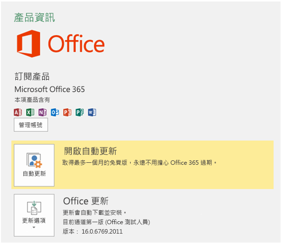

# 安裝 Office 2016 最新版本

新的開發人員功能，包括仍處於預覽階段的功能，將首次提供給選擇使用 Office 最新組建的訂閱者。若要選擇使用 Office 2016 最新組建 

- 如果您是 Office 365 家用版、個人版或大專院校版的訂閱者，請參閱[成為 Office 測試人員](https://products.office.com/en-us/office-insider)。
- 如果您是商務用 Office 365 客戶，請參閱[安裝適用於商務用 Office 365 客戶的第一版組建](https://support.office.com/en-us/article/Install-the-First-Release-build-for-Office-365-for-business-customers-4dd8ba40-73c0-4468-b778-c7b744d03ead?ui=en-US&rs=en-US&ad=US)。
- 如果您正在 Mac 上執行 Office 2016 ︰
    - 啟動 Office 2016 for Mac 程式。
    - 選取 **** [說明] 功能表的 [檢查更新]。
    - 在 Microsoft AutoUpdate 方塊中，核取方塊以加入 Office 測試人員計畫。 

若要取得最新組建： 

1. 下載 [Office 2016 部署工具](https://www.microsoft.com/en-us/download/details.aspx?id=49117)。 
2. 執行工具。此動作會擷取下列兩個檔案︰Setup.exe 和 configuration.xml。
3. 將 configuration.xml 檔案取代為[初次發行的組態檔](https://raw.githubusercontent.com/OfficeDev/Office-Add-in-Commands-Samples/master/Tools/FirstReleaseConfig/configuration.xml)。
4. 以系統管理員身分執行下列命令︰  `setup.exe /configure configuration.xml` 

>**附註：**命令可能要花很長的時間，而不會指出進度。

當安裝程序完成時，將會安裝最新的 Office 2016 應用程式。若要驗證您擁有的是最新組建，請移至任何 Office 應用程式的**檔案**  >  **帳戶**。在 Office Update 下，您會在版本號碼上方看到 (Office 測試人員) 標籤。

