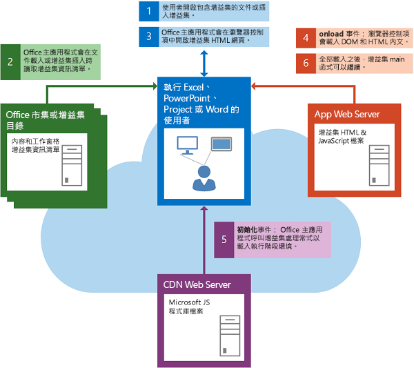
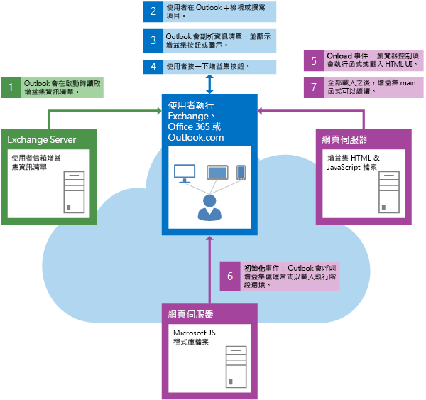

# 載入 DOM 和執行階段環境


增益集必須確定載入 DOM 和 Office 增益集的執行階段環境，才能執行它自己的自訂邏輯。 

## 內容或工作窗格增益集的啟動

下圖顯示在 Excel、PowerPoint、Project、Word 或 Access 中啟動內容或工作窗格增益集的相關事件流程。



內容或工作窗格增益集啟動時，就會發生下列事件︰ 


1. 使用者會開啟已經包含增益集的文件，或在文件中插入增益集。
    
2. Office 主應用程式會讀取來自 Office 市集的增益集的 XML 資訊清單、SharePoint 上的增益集目錄或其原始的共用資料夾目錄。
    
3. Office 主應用程式會在瀏覽器控制項中開啟增益集 HTML 頁面。
    
    接下來的兩個步驟，步驟 4 和 5，會以非同步且並行的方式進行。 基於這個理由，繼續之前請務必確認您的 DOM 與增益集的執行階段環境已經完成載入。
    
4. 瀏覽器控制項會載入 DOM 和 HTML 內文，並呼叫 **window.onload** 事件的事件處理常式。
    
5. Office 主應用程式會載入執行階段環境，其會從內容散發網路 (CDN) 伺服器下載並快取適用於 Office 的 JavaScript API 程式庫檔案，然後對 [Office](../../reference/shared/office.initialize.md) 物件的 [initialize](../../reference/shared/office.md) 事件呼叫增益集的事件處理常式。
    
6. 當 DOM 和 HTML 內文完成載入，且增益集完成初始化時，可以繼續進行增益集的主函式。
    

## Outlook 增益集的啟動


下圖顯示啟動桌面、平板電腦或智慧型手機上執行的 Outlook 增益集的相關事件流程。



Outlook 增益集啟動時，就會發生下列事件︰ 


1. Outlook 啟動時，Outlook 會讀取已為使用者的電子郵件帳戶安裝的 Outlook 增益集的 XML 資訊清單。
    
2. 使用者在 Outlook 中選取項目。
    
3. 如果選取的項目滿足 Outlook 增益集的啟動條件，Outlook 就會啟動增益集，並讓其的按鈕在 UI 顯示。
    
4. 如果使用者按一下按鈕來啟動 Outlook 增益集，Outlook 會在瀏覽器控制項中開啟 HTML 頁面。接下來的兩個步驟，步驟 5 和 6，會並行發生。
    
5. 瀏覽器控制項會載入 DOM 和 HTML 內文，並呼叫 **onload** 事件的事件處理常式。
    
6. Outlook 會呼叫增益集的 [Office](../../reference/shared/office.initialize.md) 物件的 [initialize](../../reference/shared/office.md) 事件的事件處理常式。
    
7. 當 DOM 和 HTML 內文完成載入，且增益集完成初始化時，可以繼續進行增益集的主函式。
    

## 檢查載入狀態


檢查 DOM 和執行階段環境都已完成載入的一個方法是使用 jQuery [.ready()](http://api.jquery.com/ready/) 函式︰`$(document).ready()`。例如，下列 **initialize** 事件處理常式函式可確保在特定程式碼之前先載入 DOM 以初始化增益集執行。接下來，**initialize** 事件處理常式會繼續進行，以使用 [mailbox.item](../../reference/outlook/Office.context.mailbox.item.md) 屬性來取得目前在 Outlook 中選取的項目，並呼叫增益集的主函式 `initDialer`。


```js
Office.initialize = function () {
    // Checks for the DOM to load.
    $(document).ready(function () {
        // After the DOM is loaded, add-in-specific code can run.
        var mailbox = Office.context.mailbox;
        _Item = mailbox.item;
        initDialer();
    });
}
```

這項相同技術可以用於任何 Office 增益集的 **initialize** 處理常式。

電話撥號程式範例 Outlook 增益集顯示稍有不同的方法，只使用 JavaScript 來檢查這些相同狀況。 

 **重要事項：**即使您的增益集沒有要執行的初始設定工作，您必須至少併入一個基本的 **Office.initialize** 事件處理常式函式，如下列範例所示。


```js
Office.initialize = function () {
};
```

如果您未併入 **Office.initialize** 事件處理常式，增益集啟動時可能會引發錯誤。此外，如果使用者嘗試搭配 Office Online 網頁用戶端 (例如 Excel Online、PowerPoint Online 或 Outlook Web App) 使用您的增益集，它將無法執行。

如果增益集包含一個以上的頁面，只要載入新頁面，該頁面必須包含或呼叫 **Office.initialize** 事件處理常式。


## 其他資源


- [了解適用於 Office 的 JavaScript API](../../docs/develop/understanding-the-javascript-api-for-office.md)
    
