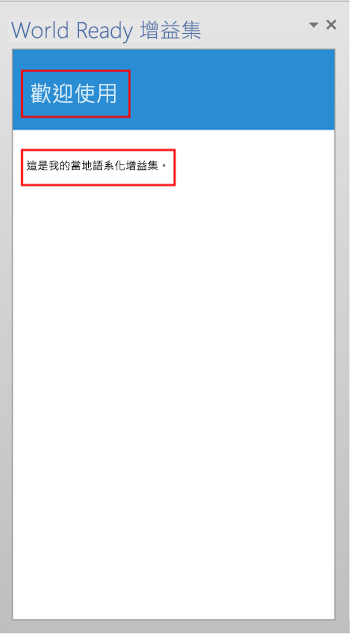
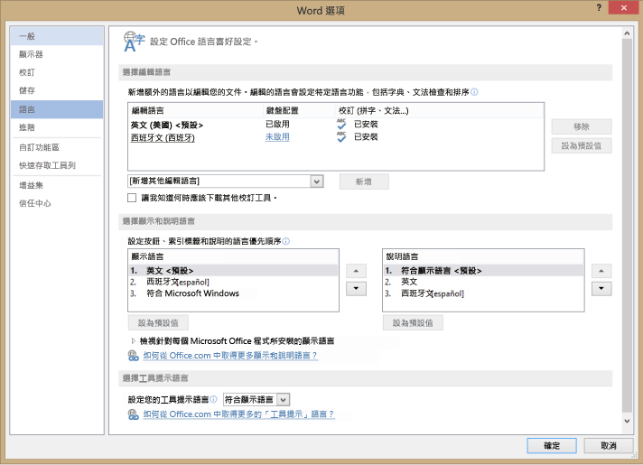
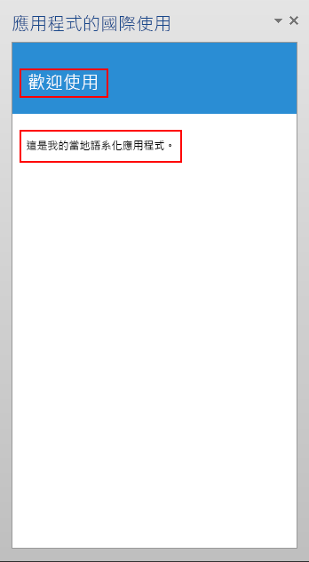

# <a name="localization-for-office-add-ins"></a>Office 增益集的當地語系化

您可以實作您的 Office 增益集適用的任何當地語系化配置。JavaScript API 和 Office 增益集平台的資訊清單結構描述提供一些選項。您可以使用適用於 Office 的 JavaScript API 來判斷地區設定，並根據主應用程式的地區設定顯示字串，或根據資料的地區設定來解譯或顯示資料。您可以使用資訊清單來指定地區設定特定的增益集檔案位置和描述性資訊。或者，您可以使用 Microsoft Ajax 指令碼來支援全球化和當地語系化。

## <a name="use-the-javascript-api-to-determine-locale-specific-strings"></a>使用 JavaScript API 來判斷地區設定的特定字串

適用於 Office 的 JavaScript API 提供兩個屬性，可支援顯示或解譯與主應用程式和資料的地區設定一致的值︰


- [Context.displayLanguage][displayLanguage] 指定主應用程式使用者介面的地區設定 (或語言)。下列範例會驗證主應用程式是否使用 en-US 或 fr-Fr 地區設定，並顯示地區設定特定的問候語。

    
```js
      function sayHelloWithDisplayLanguage() {
        var myLanguage = Office.context.displayLanguage;
        switch (myLanguage) {
            case 'en-US':
                write('Hello!');
                break;
            case 'fr-FR':
                write('Bonjour!');
                break;
        }
    }
    // Function that writes to a div with id='message' on the page.
        function write(message){
        document.getElementById('message').innerText += message; 
     }

```

- [Context.contentLanguage][contentLanguage] 指定資料的地區設定 (或語言)。延伸最後一個程式碼範例，而非檢查 [displayLanguage] 屬性，指派 `myLanguage` 到 [contentLanguage] 屬性，並使用相同程式碼其餘部分，根據資料的地區設定顯示問候語︰
    
```js
      var myLanguage = Office.context.contentLanguage;
```


## <a name="control-localization-from-the-manifest"></a>從資訊清單控制當地語系化


每個 Office 增益集會在資訊清單中指定一個 [DefaultLocale] 元素和一個地區設定。預設情況下，Office 增益集平台和 Office 主應用程式會將 [Description]、[DisplayName][IconUrl]、[HighResolutionIconUrl] 以及 [SourceLocation] 元素的值套用至所有地區設定。您可以藉由為這五個元素任一個的每個額外地區設定指定 [Override] 子元素，選擇性地支援特定地區設定的特定值。[DefaultLocale] 元素和 [Override] 元素的 `Locale` 屬性的值是根據 [RFC 3066]「語言的識別標籤」指定。表 1 說明這些元素的當地語系化支援。

**表 1.當地語系化支援**


|** 元素**|**當地語系化支援**|
|:-----|:-----|
|[描述]   |在您指定的每個地區設定中的使用者可以在 Office 市集 (或私人目錄) 中看見增益集當地語系化的描述。<br/>針對 Outlook 增益集，使用者可以在安裝完成後，於 Exchange 系統管理中心 (EAC) 看到描述。|
|[DisplayName]   |在您指定的每個地區設定中的使用者可以在 Office 市集 (或私人目錄) 中看見增益集當地語系化的描述。<br/>針對 Outlook 增益集，使用者可以在安裝完成後，於 EAC 看見以 Outlook 增益集按鈕的標籤形式的顯示名稱。<br/>針對內容和工作窗格增益集，使用者可以在安裝增益集後於功能區中看見顯示名稱。|
|[IconUrl]        |圖示影像是選擇性的。您可以使用相同的覆寫技術來指定特定文化特性的特定影像。如果您使用並將圖示當地語系化，在您指定的每個地區設定中的使用者可以看見增益集的當地語系化圖示影像。<br/>針對 Outlook 增益集，安裝增益集之後，使用者可以在 EAC 中看見圖示。<br/>針對內容和工作窗格增益集，使用者可以在安裝增益集後於功能區中看見圖示。|
|[HighResolutionIconUrl] <br/><br/>**重要：**這個元素只有在使用資訊清單 1.1 版中使用增益集時才可供使用。|高解析度圖示影像是選擇性的，但如果有指定，它必須發生在 [IconUrl] 元素之後。指定了 [HighResolutionIconUrl] 並且增益集安裝在支援高 DPI 解析度的裝置上時，會使用 [HighResolutionIconUrl] 的值來取代 [IconUrl] 的值。<br/>您可以使用相同的覆寫技術來指定特定文化特性的特定影像。如果您使用並將圖示當地語系化，在您指定的每個地區設定中的使用者可以看見增益集的當地語系化圖示影像。<br/>針對 Outlook 增益集，安裝增益集之後，使用者可以在 EAC 中看見圖示。<br/>針對內容和工作窗格增益集，使用者可以在安裝增益集後於功能區中看見圖示。|
|[SourceLocation]   |在您指定的每個地區設定中的使用者，可以看到您專為該地區設定增益集設計的網頁。 |

 > 
  **附註：**您僅可以將描述和該 Office 所支援的地區設定的顯示名稱當地語系化。請參閱 [Office 2013 的語言識別碼與 OptionState 識別碼值](http://technet.microsoft.com/en-us/library/cc179219.aspx)，以取得目前的 Office 版本的語言和地區設定的清單。


### <a name="examples"></a>範例

例如，Office 增益集可以將 [DefaultLocale] 指定為 `en-us`。對於 [DisplayName] 元素，增益集可以為地區設定 `fr-fr` 指定 [Override] 子元素，如下所示。 


```xml
<DefaultLocale>en-us</DefaultLocale>
...
<DisplayName DefaultValue="Video player">
    <Override Locale="fr-fr" Value="Lecteur vidéo" />
</DisplayName>
```

這表示增益集預設會假設使用 `en-us` 地區設定。所有地區設定的使用者會看到英文顯示名稱 "Video player"，除非用戶端電腦的地區設定是 `fr-fr`，在這種情況下，使用者會看到法文顯示名稱 "Lecteur vidéo"。

> **附註：**您只能對每種語言指定單一覆寫，包括預設地區設定。例如，如果您的預設地區設定是 `en-us`，您也不能指定 `en-us` 的覆寫。 

下列範例會對 [Description] 元素套用地區設定覆寫。它會先指定預設地區設定 `en-us` 和英文描述，然後對 `fr-fr` 地區設定以法文描述指定 [Override] 陳述式︰

```xml
<DefaultLocale>en-us</DefaultLocale>
...
<Description DefaultValue=
   "Watch YouTube videos referenced in the emails you receive 
   without leaving your email client.">
   <Override Locale="fr-fr" Value=
   "Visualisez les vidéos YouTube référencées dans vos courriers 
   électronique directement depuis Outlook et Outlook Web App."/>
</Description>
```

這表示增益集預設會假設使用 `en-us` 地區設定。所有地區設定的使用者會在 `DefaultValue` 屬性中看到英文描述，除非用戶端電腦的地區設定是 `fr-fr`，在這種情況下，使用者會看到法文描述。

在下列範例中，增益集會指定更適合 `fr-fr` 地區設定和文化特性的不同影像。根據預設，使用者會看到影像 DefaultLogo.png，除了當用戶端電腦的地區設定為 `fr-fr` 時。在此情況下，使用者會看到影像 FrenchLogo.png。 


```xml
<!-- Replace "domain" with a real web server name and path. -->
<IconUrl DefaultValue="https://<domain>/DefaultLogo.png"/>
    <Override Locale="fr-fr" Value="https://<domain>/FrenchLogo.png"/>
```

對於 [SourceLocation] 元素，支援其他地區設定表示為每個指定的地區設定提供個別的來源 HTML 檔案。在您指定的每個地區設定中的使用者，可以看到您為其設計的自訂網頁。

若為 Outlook 增益集，[SourceLocation] 元素也會對應表單係數。這可讓您對每個相對應的表單係數提供不同的當地語系化來源 HTML 檔案。您可以在每個適用的設定元素 ([DesktopSettings]、[TabletSettings] 或 [PhoneSettings]) 中指定一或多個 [Override] 子元素。下列範例顯示桌面、平板電腦和智慧型手機表單係數的設定元素，各有一個用於預設地區設定和另一個用於法文地區設定的 HTML 檔案。


```xml
<DesktopSettings>
   <SourceLocation DefaultValue="https://contoso.com/Desktop.html">
      <Override Locale="fr-fr" Value="https://contoso.com/fr/Desktop.html" />
   </SourceLocation>
   <RequestedHeight>250</RequestedHeight>
</DesktopSettings>
<TabletSettings>
   <SourceLocation DefaultValue="https://contoso.com/Tablet.html">
      <Override Locale="fr-fr" Value="https://contoso.com/fr/Tablet.html" />
   </SourceLocation>
   <RequestedHeight>200</RequestedHeight>
</TabletSettings>
<PhoneSettings>
   <SourceLocation DefaultValue="https://contoso.com/Mobile.html">
      <Override Locale="fr-fr" Value="https://contoso.com/fr/Mobile.html" />
   </SourceLocation>

</PhoneSettings>

```


## <a name="match-date/time-format-with-client-locale"></a>符合用戶端地區設定的日期/時間格式


您可以使用 [displayLanguage] 屬性以取得主應用程式使用者介面的地區設定。然後，您就可以使用與主應用程式目前的地區設定一致的格式顯示日期和時間值。其中一個方法就是準備資源檔，其指定要用於 Office 增益集支援的每個地區設定的日期/時間顯示格式。在執行階段，您的增益集可以使用資源檔，並符合自 [displayLanguage] 屬性取得之地區設定的適當日期/時間格式。

您可以使用 [contentLanguage] 屬性以取得主應用程式資料的地區設定。根據這個值，您可以再適當地解譯或顯示日期/時間字串。例如，`jp-JP` 地區設定將資料/時間值表示為 `yyyy/MM/dd`，以及 `fr-FR` 地區設定則為 `dd/MM/yyyy`。


## <a name="use-ajax-for-globalization-and-localization"></a>使用 Ajax 進行全球化和當地語系化


如果您使用 Visual Studio 來建立 Office 增益集，.NET Framework 和 Ajax 提供將用戶端指令碼檔案全球化和當地語系化的方法。

您可以在 JavaScript 程式碼中全球化並使用 [Date](http://msdn.microsoft.com/library/caf98d32-2de2-4704-8198-692350343681.aspx) 和 [Number](http://msdn.microsoft.com/library/c216d3a1-12ae-47d1-bca1-c3666d04572f.aspx) JavaScript 類型擴充功能和 JavaScript [Date](http://msdn.microsoft.com/library/ce2202bb-7ec9-4f5a-bf48-3a04feff283e.aspx) 物件，讓 Office 增益集根據目前瀏覽器的地區設定顯示值。如需詳細資訊，請參閱[逐步解說︰使用用戶端指令碼將日期全球化](http://msdn.microsoft.com/library/69b34e6d-d590-4d03-a763-b7ae54b47d74.aspx)。

您可以直接在獨立 JavaScript 檔案中併入當地語系化的資源字串，以提供不同地區設定 (瀏覽器上設定或使用者所提供) 的用戶端指令碼檔案。為每個支援的地區設定建立個別的指令碼檔案。在每個指令碼檔案中，併入 JSON 格式的物件，其中包含該地區設定的資源字串。在瀏覽器中執行指令碼時，會套用當地語系化的值。 


## <a name="example:-build-a-localized-office-add-in"></a>範例：建置當地語系化的 Office 增益集


本節提供的範例將告訴您如何將 Office 增益集描述、顯示名稱與 UI 當地語系化。

若要執行提供的範例程式碼，請在您的電腦上將 Microsoft Office 2013 設定為使用其他語言，以便您可以藉由切換用於顯示在功能表和命令的語言、用於編輯及校對的語言 (或兩者) 來測試增益集。

同時，您將需要建立 Visual Studio 2015 Office 增益集專案。


 > **附註：**若要下載 Visual Studio 2015，請參閱 [Office 開發人員工具頁面](https://www.visualstudio.com/features/office-tools-vs)。這個網頁也會有 Office 程式開發人員工具的連結。

### <a name="configure-office-2013-to-use-additional-languages-for-display-or-editing"></a>設定 Office 2013 以使用其他語言來顯示或編輯

您可以使用 Office 2013 語言套件來安裝額外的語言。如需有關語言套件及在何處可以取得這些套件的詳細資訊，請參閱 [Office 2013 語言選項](http://office.microsoft.com/en-us/language-packs/)。


 > **附註：**如果您是 MSDN 訂閱者，可能已為您提供 Office 2013 語言套件。如果要判斷您的訂閱是否提供下載 Office 2013 語言套件，請前往 [MSDN 訂閱首頁](https://msdn.microsoft.com/subscriptions/manage/)，在**軟體下載**中輸入 Office 2013 語言套件，選擇 [搜尋]，然後選取 [透過我的訂閱可用的產品]。在 [語言] 下，選取您想要下載的語言套件的核取方塊，然後選擇 [搜尋]。 

安裝語言套件之後，您可以設定 Office 2013 以使用安裝的語言在 UI 中顯示、用於編輯文件內容 (或兩者)。本文章中的範例會使用已套用西班牙文語言套件的 Office 2013 的安裝。


### <a name="create-an-office-add-in-project"></a>建立 Office 增益集專案


1. 在 Visual Studio 中，選擇 [檔案]  >  [新增專案]。
    
2. 在 [新增專案] 對話方塊的 [範本] 下，展開 **Visual Basic** 或 **Visual C#**，展開 **Office/SharePoint**，然後選擇 [Office 增益集]。
    
3. 選擇 [Office 增益集]，然後命名增益集，例如 WorldReadyAddIn。選擇 [確定]。
    
4. 在 [建立 Office 增益集] 對話方塊中，選取 [工作窗格] 並選擇 [下一步]。在下一個頁面上，清除除了 Word 之外的所有主應用程式的核取方塊。選擇 [完成] 來建立專案。
    

### <a name="localize-the-text-used-in-your-add-in"></a>當地語系化在增益集中所使用的文字


想要為另一個語言當地語系化的文字會出現在兩個區域︰


-  **增益集的顯示名稱和描述**。這是由增益集資訊清單檔案中的項目來控制。
    
-  **增益集 UI**。您可以將在您的增益集 UI 中出現的字串利用 JavaScript 程式碼當地語系化，例如，藉由使用包含當地語系化的字串的不同資源檔。
    
若要當地語系化增益集顯示名稱和描述︰


1. 在**方案總管**中，展開 **WorldReadyAddIn**、**WorldReadyAddInManifest**，然後選擇 **WorldReadyAddIn.xml**。
    
2. 在 WorldReadyAddInManifest.xml 中，以下列程式碼區塊取代 [DisplayName] 和 [描述] 元素：
    
     > **附註：**您可以針對 [DisplayName] 和 [Description] 元素，將此範例中使用的西班牙文語言當地語系化字串，取代為任何其他語言的當地語系化字串。

```xml
      <DisplayName DefaultValue="World Ready add-in">
        <Override Locale="es-es" Value="Aplicación de uso internacional"/>
      </DisplayName>
      <Description DefaultValue="An add-in for testing localization">
        <Override Locale="es-es" Value="Una aplicación para la prueba de la localización"/>
      </Description>
```

3. 比方說，當您將 Office 2013 的顯示語言從英文變更為西班牙文，然後執行增益集，增益集顯示名稱和描述會以當地語系化的文字顯示。 
    
若要設定增益集 UI 的版面配置：


1. 在 Visual Studio 中的**方案總管**中，選擇 **Home.html**。
    
2. 以下列的 HTML 取代 Home.html 中的 HTML。
    
```html
    <!DOCTYPE html>
    <html>
    <head>
        <meta charset="UTF-8" />
        <meta http-equiv="X-UA-Compatible" content="IE=Edge" />
        <title></title>
        <script src="../../Scripts/jquery-1.8.2.js" type="text/javascript"></script>
    
        <link href="../../Content/Office.css" rel="stylesheet" type="text/css" />
        <script src="https://appsforoffice.microsoft.com/lib/1/hosted/office.js" type="text/javascript"></script>
    
        <!-- To enable offline debugging using a local reference to Office.js, use:                        -->
        <!-- <script src="../../Scripts/Office/MicrosoftAjax.js" type="text/javascript"></script>          -->
        <!--    <script src="../../Scripts/Office/1.0/office.js" type="text/javascript"></script>          -->
    
        <link href="../App.css" rel="stylesheet" type="text/css" />
        <script src="../App.js" type="text/javascript"></script>
    
        <link href="Home.css" rel="stylesheet" type="text/css" />
        <script src="Home.js" type="text/javascript"></script> <body>
        <!-- Page content -->
        <div id="content-header">
            <div class="padding">
                <h1 id="greeting"></h1>
            </div>
        </div>
        <div id="content-main">
            <div class="padding">
                <div>
                    <p id="about"></p>
                </div>            
            </div>
        </div>
    </head>
    </html>
```

3. 在 Visual Studio 中，選擇 [檔案]，[儲存 AddIn\Home\Home.html]。
    
圖 3 顯示將在範例增益集執行時，顯示當地語系化文字的標題 (h1) 元素和段落 (p) 元素。

**圖 3.增益集 UI**




#### <a name="add-the-resource-file-that-contains-the-localized-strings"></a>加入包含當地語系化字串的資源檔


JavaScript 資源檔包含用於增益集 UI 的字串。範例增益集 UI 有顯示問候語的 h1 元素，以及向使用者介紹增益集的 p 元素。 

為了對標題及段落啟用當地語系化字串，您可以將字串放在個別的資源檔中。資源檔會建立一個 JavaScript 物件，其包含每一組當地語系化字串的個別 JavaScript 物件標記法 (JSON) 物件。資源檔也會提供方法，用於取回指定的地區設定的適當 JSON 物件。 

若要將資源檔加入至增益集專案︰


1. 在 Visual Studio 的**方案總管**中，選擇範例增益集 Web 專案的**增益集**資料夾，然後選擇 [加入]  >  [JavaScript 檔案]。
    
2. 在 [指定項目的名稱] 對話方塊中，輸入 UIStrings.js。
    
3. 加入下列程式碼至 UIStrings.js 檔案。

```js
      /* Store the locale-specific strings */
    
    var UIStrings = (function ()
    {
        "use strict";
    
        var UIStrings = {};
    
        // JSON object for English strings
        UIStrings.EN =
        {        
            "Greeting": "Welcome",
            "Introduction": "This is my localized add-in."        
        };
    
    
        // JSON object for Spanish strings
        UIStrings.ES =
        {        
            "Greeting": "Bienvenido",
            "Introduction": "Esta es mi aplicación localizada."
        };
    
        UIStrings.getLocaleStrings = function (locale)
        {
            var text;
            
            // Get the resource strings that match the language.
            switch (locale)
            {
                case 'en-US':
                    text = UIStrings.EN;
                    break;
                case 'es-ES':
                    text = UIStrings.ES;
                    break;
                default:
                    text = UIStrings.EN;
                    break;
            }
    
            return text;
        };
    
        return UIStrings;
    })();
```

UIStrings.js 資源檔會建立物件 **UIStrings**，其包含了增益集 UI 的當地語系化字串。 

#### <a name="localize-the-text-used-for-the-add-in-ui"></a>當地語系化用於增益集 UI 的文字


若要在增益集中使用資源檔，您將必須在 Home.html 上為它加入指令碼標記。載入 Home.html 時會執行 UIStrings.js，而您用來取得字串的 **UIStrings** 物件可供您的程式碼使用。在 Home.html 的 head 標記中加入下列 HTML，讓 **UIStrings** 可供您的程式碼使用。


```html
<!-- Resource file for localized strings:                                                          -->
<script src="../UIStrings.js" type="text/javascript"></script>
```

現在您可以使用 **UIStrings** 物件來設定增益集 UI 的字串。

如果您想要根據用於在功能表和主應用程式的命令中顯示的語言變更增益集的當地語系化，您會使用 **Office.context.displayLanguage** 屬性來取得該語言的地區設定。例如，如果主應用程式的語言在功能表和命令中使用西班牙文顯示，**Office.context.displayLanguage** 屬性會傳回語言代碼 es-ES。

如果您想要根據用於編輯文件內容的語言變更增益集的當地語系化，您會使用 **Office.context.contentLanguage** 屬性來取得該語言的地區設定。例如，如果主應用程式的語言對編輯文件內容使用西班牙文，**Office.context.contentLanguage** 屬性會傳回語言代碼 es-ES。

知道主應用程式正在使用的語言之後，您可以使用 **UIStrings** 來取得符合主應用程式語言的當地語系化字串集合。

以下列程式碼取代 Home.js 檔案中的程式碼。此程式碼顯示您可以如何根據主應用程式的顯示語言或主應用程式的編輯語言，變更在 Home.html 上 UI 元素中所使用的字串。


 > **附註：**若要在根據用來編輯的語言變更增益集當地語系化之間切換，請取消註解程式碼行 `var myLanguage = Office.context.contentLanguage;` 並註解化程式碼行 `var myLanguage = Office.context.displayLanguage;`


```js
/// <reference path="../App.js" />
/// <reference path="../UIStrings.js" />


(function () {
    "use strict";

    // The initialize function must be run each time a new page is loaded.
    Office.initialize = function (reason)
    {
       
        $(document).ready(function () {
            app.initialize();

            // Get the language setting for editing document content.
            // To test this, uncomment the following line and then comment out the
            // line that uses Office.context.displayLanguage.
            // var myLanguage = Office.context.contentLanguage;

            // Get the language setting for UI display in the host application.
            var myLanguage = Office.context.displayLanguage;            
            var UIText;

            // Get the resource strings that match the language.
            // Use the UIStrings object from the UIStrings.js file
            // to get the JSON object with the correct localized strings.
            UIText = UIStrings.getLocaleStrings(myLanguage);            

            // Set localized text for UI elements.
            $("#greeting").text(UIText.Greeting);
            $("#about").text(UIText.Instruction);
        });
    };    
})();
```


### <a name="test-your-localized-add-in"></a>測試當地語系化的增益集


若要測試當地語系化的增益集，請變更用來在主應用程式中顯示或編輯的語言，然後執行您的增益集。 

若要變更用來在增益集中顯示或編輯的語言︰


1. 在 Word 2013 中，依序選擇 [檔案]、[選項]、[語言]。圖 4 顯示在 [語言] 索引標籤開啟的 [Word 選項] 對話方塊。
    
    **圖 4.Word 2013 選項對話方塊的 [語言] 選項**

    

2. 在 [選擇顯示和說明語言] 下，選取您想要用於顯示的語言，例如西班牙文，然後選擇向上箭號，將西班牙文語言移至清單中的第一個位置。或者，若要變更用於編輯的語言，請在 [選擇編輯語言] 中，選擇您要用於編輯的語言，例如，西班牙文，然後選擇 [設成預設值]。
    
3. 選擇 [確定] 以確認您的選擇，然後關閉 Word。
    
執行範例增益集。工作窗格增益集會在 Word 2013 中載入，而增益集 UI 中的字串會變更以符合主應用程式所使用的語言，如圖 5 所示。


**圖 5.具有當地語系化文字的增益集 UI**




## <a name="additional-resources"></a>其他資源

- [Office 增益集的設計指導方針](../../docs/design/add-in-design.md)
    
- 
  [Office 2013 的語言識別碼與 OptionState 識別碼值](http://technet.microsoft.com/en-us/library/cc179219%28Office.15%29.aspx)

[DefaultLocale]:         ../../reference/manifest/defaultlocale.md
[Description]:           ../../reference/manifest/description.md
[DisplayName]:           ../../reference/manifest/displayname.md
[IconUrl]:               ../../reference/manifest/iconurl.md
[HighResolutionIconUrl]: ../../reference/manifest/highresolutioniconurl.md
[SourceLocation]:        ../../reference/manifest/sourcelocation.md
[Override]:              ../../reference/manifest/override.md
[DesktopSettings]:       ../../reference/manifest/desktopsettings.md
[TabletSettings]:        ../../reference/manifest/tabletsettings.md
[PhoneSettings]:         ../../reference/manifest/phonesettings.md
[displayLanguage]:  ../../reference/shared/office.context.displaylanguage.md 
[contentLanguage]:  ../../reference/shared/office.context.contentlanguage.md 
[RFC 3066]: http://www.ietf.org/rfc/rfc3066.txt