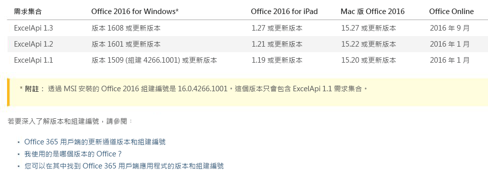

# Office.js API 版本設定 

| | |
|:--|:--|
||**本文摘錄自 Michael Zlatkovsky 撰寫的書籍《[使用 Office.js 建置 Office 增益集](https://leanpub.com/buildingofficeaddins)》，您可以在 [LeanPub.com](https://leanpub.com/buildingofficeaddins) 以電子書的形式購買本書。 (英文)**  Copyright © 2016-2017 by Michael Zlatkovsky. 著作權所有，並保留一切權利。|

Office.js 程式庫的版本設定有幾個方面。

## JavaScript 檔案 

首先是實際 **JavaScript 原始程式檔**的版本設定。幸運的是，這個部份很簡單：您**一定想要最新且最好的生產 Office.js**，您可以方便地透過 CDN 取得：https://appsforoffice.microsoft.com/lib/1/hosted/Office.js。

除了 CDN，生產 Office.js 檔案也會以 NuGet 套件形式出貨，以允許採用防火牆公司的開發或離線開發。話雖如此，NuGet 可能會落後 CDN 數週，仍*需要*任何存放區繫結增益集來參考生產 CDN 位置。因此，就 Office.js 版本而言，實際 JS 檔案的版本設定沒有很多：最好的選擇無疑是參考長青、經常更新、永遠回溯相容、需要存放區的 CDN 版本。

## 主機功能 

版本設定更有趣的部份是**每一部主機提供的實際 API 功能**。只因為您有最新且最好的 JavaScript，並不表示舊用戶端能夠使用它的所有功能。雖然某些客戶可能會使用最新且最好的 Office 版本，其他人可能不是！特別是，Office 2016 RTM 永遠只能存取 Office 2016 API 原始的集合，僅此而已。而且即使是擁有 Office 訂閱版本 (Office 365/隨選即用) 的客戶可能仍使用應該是長青版本的舊版，取決於他們是使用 Office 365 的*目前通道*或*順延通道*。這個原生應用程式版本設定與 javascript 版本設定的交集就比較弔詭。

這個複雜性 (雖然本身複雜) 的解決方案是*需求集合*。例如，如果您查看 [Excel API 集合](https://dev.office.com/reference/add-ins/requirement-sets/excel-api-requirement-sets)的說明文件，您會看到 2016 年 12 月時 Excel API 的 2016 浪潮已有三種版本：1.1、1.2 和 1.3。ExcelApi 1.1 在 2015 年 9 月隨附於 Office 2016 RTM；1.2 在 2016 年 3 月初出貨；而 1.3 則在 2016 年 10 月出貨。每個 API 集合版本有一個支援此 API 集合的對應 Office 主機版本。表格中列出版本號碼，而表格下方的連結可供您從目前的組建編號尋找對應。

下圖顯示表格；請參閱 [Excel JavaScript API 需求集合](../../reference/requirement-sets/excel-api-requirement-sets.md)主題以取得最新的內容。

每個的 API 集合版本包含一些相當大型的功能，以及對現有功能的逐步改善。每個需求集合的主題 (例如以上連結) 將提供這每項功能的詳細清單。而在您進行設計程式時，如果您使用 JavaScript 或 TypeScript IntelliSense，應該可以看到每個API 的 API 版本隨著 IntelliSense 的一部分顯示：

您可以使用兩種方式中的一個來使用需求集合。您可以在資訊清單中宣告「我需要 API 集合 ExcelApi 1.2，否則我的增益集完全無法運作」。這麼做很好，但結果當然是無法服務較舊的主機，因此您的增益集甚至不會在該處出現。或者，如果您增益集*大概*能在 1.1 版環境中運作，但您想要在支援它的較新主機上*啟動*其他功能，您可以使用資訊清單來宣告您只需要最基本的 API 集合 (ExcelApi 1.1)，然後透過 `isSetSupported` API 進行執行階段檢查以取得較高的版本號碼。

例如，假設您要將某些資料匯出至新工作表中，理想情況下，您想要自動調整欄寬，但這只適用於 ExcelApi 1.2。不要透過執行較舊的主機徹底封鎖增益集，您可以在支援 API 的較新主機上執行啟動案例，否則略過功能：

**啟動較新 API 集合的功能**

~~~
Excel.run(context => {
    let data = [
        ["Name", "Phone number"]
        ["Joe Doe", "425-123-4567"],
        ...
    ]
    let newSheet = workbook.worksheets.add();
    let dataRange = newSheet.getCell(0, 0)
        .getResizedRange(values.length - 1, values[0].length - 1);
    dataRange.values = data;
    
    // markua-start-insert
    if (Office.context.requirements.isSetSupported("ExcelApi", 1.2)) {
        dataRange.format.autofitColumns();
    }
    // markua-end-insert
    
    await context.sync();
})
~~~

> **重要事項：**版本號碼因*每個 API 集合*而不同。非常清楚的說：版本號碼例如 `ExcelApi 1.3` 與 *API 集合本身*有關，但與 Office.js 或其他 API 集合的版本號碼無關。不同的需求集合會以完全不同的速度進行 (這很合理，您不會想要 Excel API 延遲數個月，只是為了讓 Excel 的 1.3 集合與 Word 的 1.3 集合同一時間出貨)。因此，Office.js 在任何指定時間是不同 API 集合版本號碼的汞合金。因此，雖然明確有 `ExcelApi 1.3` 之類的項目，***卻沒有任何 Office.js 1.3***。它一定是由單一的長青 Office 端點，以及各種不同版本的 API 集合組成。

## Beta 端點 

除了生產 CDN，另外還有一個 **Beta**端點；具有相同的 URL，但使用 "beta" 取代 "1"。因此，完整的 Beta URL 是 https://appsforoffice.microsoft.com/lib/**beta**/hosted/Office.js

說明這個 Beta 端點之前，值得說明 API 的一般生命週期。它會像這樣：

1. 任何實作開始前，會透過各種的通道 (UserVoice、StackOverflow、與協力廠商的交談等等) 收集需求與功能要求。
2. 從這些需求，會選擇許多功能區域 (相關 API 功能的群組) 作為小組針對下一個發行的焦點 (其中「發行」是對 API 集合的遞增，通常每 3 到 4 個月間隔推出)。然後設計 API，並逐一查看。
3. 當設計就緒並大致上與實作開始同時時，API 規格會張貼在「開啟規格」程序 (<https://dev.office.com/reference/add-ins/openspec>)，並且將從社群成員收集意見反應 (並且併入設計 - 愈快收到意見反應愈好！)。也可能擴大 API 來納入相關的功能，或根據實作條件約束調整。
4. 實作已完成；但完整 API 集合的實際發行則可能之後幾個月了。這是要 **Beta** 程序進行的位置：針對使用 Office 測試人員 - 快組建的人員，他們可以取得 API 並在生產首展之前提前試驗幾個月。這對於開發人員很有幫助，這樣他們可以事先計劃，並且準備在 API 一公開提供便使用新功能；同時，它也可以做為催化劑，用於提供從現實生活使用 API 的意見反應，而不只是在規格形式想像它。
5. 一段時間之後，API 會成為 API 集合下一浪潮的一部份，並且出貨至全世界。

若要使用 Beta 端點，只需變更指令碼參考，並且試用您在開啟規格中看到的一些 API。某些項目可能會就緒；其他則未就緒。如果您遇到了對不存在物件或函式調整的 JavaScript 執行階段錯誤，表示它尚不屬於 Beta 端點的一部份；如果 JavaScript 正確，但您遇到 "`ApiNotFound`" 錯誤，表示您並沒有足夠新的組建 (或可能尚不存在這類組建)。桌面版和有時 Office Online 是 Beta 階段期間可取得 API 的前兩個通道；其他的平台則只能在首展至生產之後才能接收 API。

Beta 端點有一些需要注意的地方：

* 它本質上就是更多的試驗，並且*不*應該用在生產。
* 其中任何新的 API 會立即處於預覽模式，並隨時可能變更。可能的變更包括重新命名、延後 (移動到較新的 API 集合)，或移除或完全重作 API。
* 當 API 屬於工作中項目 (尚未出貨) API 集合版本時，前述版本的 `isSetSupported` 將會傳回 `false` (不論是生產或 Beta JavaScript)，因此您將無法對新 API 執行此檢查，直到它們進入生產為止。

雖然如此：當您比較熟悉平台，特別是看到您關心的功能變成開啟規格時，強烈建議您參與意見反應的程序，並使用 Beta 端點來驗證設計符合您的需求。然後一如往常，非常歡迎您在 StackOverflow 上提出關於 API 的問題或意見反應，無論是生產或 Beta。

### 提示：為 Beta 端點編寫 `isSetSupported`

如稍早所述，Beta 階段的 API 不會將 `isSetSupported` 顯示為 `true`，直到功能已經生產就緒為止 (請參閱下一節)。但另一方面，如果您想要如同您對生產所做一般編寫程式碼，而不變更一行程式碼 (亦即，不需要回頭並取消註解之前標記為註解的 `if` 陳述式？)

我個人的秘訣：請繼續進行，並編寫您自己的 `isSetSupported` 檢查和 `if` 陳述式，就像您對一般生產 API 一樣。前往您的主要 HTML 網頁 (理想情況下您有兩份副本，一個用於生產，還有一個用於開發，您可以在其中參考 Beta CDN)，並在緊接著您的 Beta CDN 參考之下編寫下列指令碼標記 (假設您關心的 API 集合是 `ExcelApi`；而針對測試目的，您實際上想要顯示*任何*新的 API，如同它們受到完整支援)：

~~~
   (function() {
     var originalIsSetSupported = Office.requirements.isSetSupported;
     Office.requirements.isSetSupported = function (apiSet, version) {
       if (apiSet === 'ExcelApi') { return true; }
       return originalIsSetSupported(apiSet, version);
     };
   })();
~~~

基本上，上述指令碼會對屬於您想要最新且最好的 Beta 版功能 (在此情況下為 `ExcelApi`) API 集合的任何 API 傳回 `true`，否則會重新導向至原始 `isSetSupported` 函式。

## 您如何知道 API 已「生產就緒」？ 

當您查看 IntelliSense 時，查看 API 應該是哪個 API 集合版本的一部份，對該版本號碼執行 `isSetSupported`，並看見它傳回 `true`，該 API 即已生產就緒。

此時應該大致上對應於：

* 看見 API 列於文件中，不再列於「開啟規格」下。
* 看見其 IntelliSense 列於公共位置中，例如 [DefinitelyTyped](https://github.com/DefinitelyTyped/DefinitelyTyped/blob/master/types/office-js/index.d.ts)。

請注意，某些平台可能會超前其他平台，通常是桌面版領先。因此，只因為 `isSetSupported` 在桌面版上傳回 `true`，並不表示它在同時一定會在 Mac 上傳回 `true` (雖然它一般會如此，在一個月或兩個月內)。但實作的不同步調，正是為什麼在一開始便需要 `isSetSupported` (和/或資訊清單式需求規格) 的原因。只要使用 `isSetSupported` 將任何啟動功能括在一起，或新增資訊清單需求，您應該不需要擔心什麼時候將什麼 API 提供使用；當功能在指定的平台上提供使用時，您的增益集將能夠在該處「直接運作」。

>**本文摘錄自 Michael Zlatkovsky 撰寫的書籍《[使用 Office.js 建置 Office 增益集](https://leanpub.com/buildingofficeaddins)》。**在 [LeanPub.com](https://leanpub.com/buildingofficeaddins) 線上購買電子書來閱讀更多內容。
