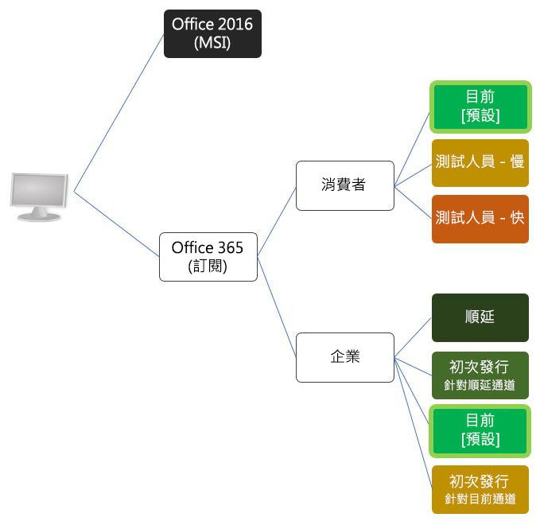

# 了解 Office 版本

| | |
|:--|:--|
||**本文摘錄自 Michael Zlatkovsky 撰寫的書籍《[使用 Office.js 建置 Office 增益集](https://leanpub.com/buildingofficeaddins)》，您可以在 [LeanPub.com](https://leanpub.com/buildingofficeaddins) 以電子書的形式購買本書。 (英文)**  Copyright © 2016-2017 by Michael Zlatkovsky. 著作權所有，並保留一切權利。|

若要開發和散發使用新 Office 2016 API 模型的增益集，您需要 Office 2016 或 Office 365 (包含所有 Office 2016 功能的訂閱式超集)。這看起來相當直接了當，但細節則有點複雜。

**康莊大道**

最簡單的可能情形是當您 (開發人員) 和使用者都具備 Office 365 最新且最完善的版本。當然，對於開發/設計原型需求，讓 Office 365 具備最新的更新將最簡單。但如果您是 ISV (獨立軟體廠商)，而對於您的客戶正在執行的版本無法控制；或如果您任職於可能不是走在時代尖端的企業，則了解 Office 版本就變得很重要。

**為什麼您應該注意**

不同版本 (和版本的類別) 提供不同的 API 表面區域。例如，Office 2016 RTM 只提供 Excel 和 Word API 新浪潮的第一批；從那時以來，這些 API 已經過大幅擴充。同樣地，在原始 RTM 版本中並未提供其他功能－最值得注意的是增益集命令 (功能區擴充性) 以及啟動對話方塊的能力。

在接下來的幾個頁面中，我將說明不同的安裝可能性。將以下影像謹記在心會有所幫助：

## Office 2016 與Office 365

API 表面區域分散的第一個地方在於 Office 2016 MSI 式安裝與 Office 365 訂閱式 (有時稱為「隨選即用」) 安裝之間的劃分。

讓我們暫停一下來說明 Office 365，因為我發現用詞方面有些混淆。  

Office 365 是一種訂閱服務，提供來自 Microsoft 的最新工具。有適用家庭及個人使用的 Office 365 計劃，也有適用中小型企業、大型企業、學校及非營利機構的計劃。適用家庭或個人使用的所有 Office 365 計劃包括 Office 2016，其具有完整安裝的 Office 應用程式 (例如 Word、PowerPoint 和 Excel) 以及線上儲存空間等等。除了 Office 軟體，商務用 Office 365 使用者還能透過 Exchange Server、商務用 Skype Server、Office Online 和 Yammer 整合提供電子郵件和社交網路服務。

因此，對於來自 SharePoint 世界的使用者：是的，SharePoint Online 屬於 Office 365 訂閱的一部分，其隨附的 Office Online 瀏覽器內編輯器也是如此。但它不是訂閱的*唯一*部份。取得*您熟知且喜愛的相同桌面/Mac Office 程式*的存取權，也是該相同訂閱的一部份 (取得那些 Word、Excel、PowerPoint 等等程式的 iOS 和Android 版本也是如此)。

現在，讓我們回到 API：如果您有 Office 2016 (非訂閱)，將*只*具備初始的一組 Excel 和 Word API (`ExcelApi 1.1` 和 `WordApi 1.1`) 新浪潮。或是更清楚的說：您將只會有*初始的一組擴充性功能*，僅此而已。因此，除了缺少對 Excel 和 Word API 的改善，您也將同樣缺乏其他增益集功能，例如自訂功能區或啟動對話方塊的功能。

值得一提的是，API 的原始 RTM 供應項目確實有些問題。我個人認為，我會偏向將 RTM 視為通往豐富主機特定 API *旅程的開端*，而不是其本身的目的地。

因此，重申：Office 2016，從 API/擴充性觀點來看，在時間上已凍結... 凍結在 2015 年 9 月出貨時具備的功能。  

同時，Office 365 則表示「訂閱」。這代表著具備最新且最好的穩定組建 (其中對企業來說的「穩定」可能是早幾個月的組建；以下會詳細說明這部份)。

如果您想存取最新且最好的 API 功能 (身為開發人員，您絕對想這麼做) 您*必須*使用 Office 的訂閱式安裝，而非時間上凍結的 Office 2016 MSI 安裝。此外，對於大多數的新功能，您可能也希望您的客戶使用訂閱式安裝。

## 消費者的 Office 365 類別

Office 365 的消費者 (非商務) 版本包括 **Office 365 個人版**和 **Office 365 家用版** (這兩者之間的差異在於訂閱上作用中裝置的數量，1 部 PC 或 Mac，1 個平板電腦和 1 部電話，相對於每個各 5 部)。另外還有 **Office 365 大專院校版**，其等同於個人版，但可在*兩個*裝置而非一個裝置上啟動。對於這三項，它們的差別僅在於計劃的成本和支援的裝置數目；從 API 與功能的觀點來看，它們都完全相等。

Office 365 的消費者版本每個月會更新，以無訊息模式並自動安裝更新。因此，Office 365 的消費者版本，只要電腦連線到網際網路，將一律可存取最新且最好的功能。預設值是「目前」通道 (亦即，全球公開提供使用的項目)，但勇於嘗試的使用者 (開發人員) 也可以選擇加入其中一個*測試人員*軌道。測試人員軌道提供兩個類別：「測試人員 - 快」和「測試人員 - 慢」，*快*真正走在尖端，而*慢*則落後數週，鎖定在更穩定的組建。在這兩種情況下，它們可讓您早於一般大眾一個月或兩個月之前預覽即將推出的功能。對於開發人員，比客戶更早試用最新的 API 特別有用，如此可讓您在新功能公開提供時，即在您的客戶電腦上提供新功能。結合使用 Beta CDN for Office.js 時，它也可以讓您在 API 確定並上線之前，提供即時的 API 回應給小組！若要成為測試人員，請參閱 <https://products.office.com/en-us/office-insider>。

## 企業的 Office 365 類別

針對企業/商務使用者的 Office 365 類別，也有許多選項 (通常是由 IT 系統管理員處理)。正如同消費者版本，有一個「目前」通道 (最新且最好的穩定組建，每月更新)，並且同樣地，有一個「目前通道第一版」，它基本上與消費者版本中的「測試人員」組建相同。

不過，不願承擔風險的企業也可以選擇使用順延通道，它會每四個月更新一次，而不是每個月更新一次。此外，這些企業也能保持使用順延通道四個月或甚至八個月，之後才前往使用較新的組建。因此，以提供的 API 功能來說，使用順延通道的企業仍可能有點落後於開發人員 (但不會落後於使用 Office 2016 RTM 組建的人)。

## 其他平台 (Mac、iOS、Online) 上的 Office

針對非 PC 平台，不同功能的推出也需要一些時間。這有時候不僅取決於某項目程式碼編寫完成，並交到客戶手中之間的*延遲* (亦即，測試人員與目前和順延之間的差異)，還取決於在這些平台上實作功能的順序。對於目前的 Excel API，我曾看過它們大致上在相同的時間於多數平台推出；對於 Word，桌面版 Office 一般會早於 Office Online。對於非 API 功能 (亦即對話方塊、功能區擴充性)，這些一般是先提供桌面版，然後才是 Office Online 和 Mac。由於實作速度的差異，需注意的不僅僅是 Office 主機版本，還需要注意 API 版本和需求集合。

>**本文摘錄自 Michael Zlatkovsky 撰寫的書籍《[使用 Office.js 建置 Office 增益集](https://leanpub.com/buildingofficeaddins)》。**在 [LeanPub.com](https://leanpub.com/buildingofficeaddins) 線上購買電子書來閱讀更多內容。

