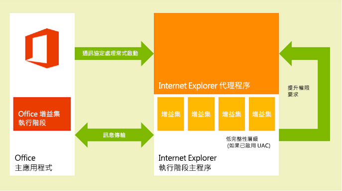
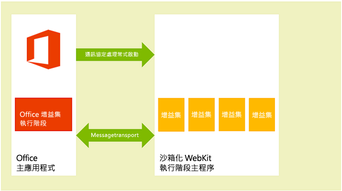
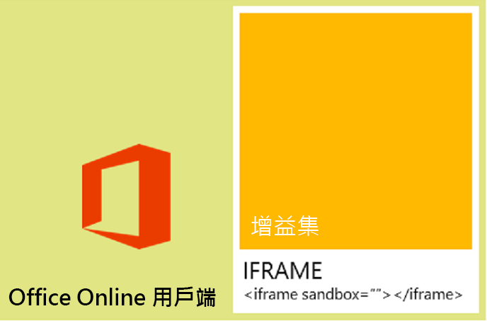

# Office 增益集的隱私權和安全性


## 了解增益集執行階段

Office 增益集受到增益集執行階段環境、多層權限模型以及效能管控者的保護。此架構會以下列方式保護使用者的體驗： 


- 管理對主應用程式的 UI 框架存取。
    
- 只允許間接存取主應用程式的 UI 執行緒。
    
- 不允許強制回應互動，例如，不允許對 JavaScript **alert**、**confirm** 和 **prompt** 函式的呼叫，因為它們是強制回應。
    
此外，執行階段架構提供下列優點，以確保 Office 增益集不會危害使用者的環境：


- 隔離增益集執行所在的處理程序。
    
- 不需要取代 .dll 或 .exe 或 ActiveX 元件。
    
- 易於安裝和解除安裝增益集。
    
此外，Office 增益集使用的記憶體、CPU 及網路資源可受到控管，以確保會維持良好的效能及可靠性。 

下列各節簡述執行階段結構如何支援在 Windows 架構的裝置上、在 OS X Mac 裝置上的 Office 用戶端以及網路上的 Office Online 用戶端中執行增益集。


### Windows 和 OS X 裝置的用戶端

在支援的桌面及平板電腦裝置用戶端中，如 Excel、Outlook 和 Mac 版 Outlook，Office 增益集是透過整合同處理序元件即 Office 增益集執行階段來支援，其會管理增益集生命週期，並啟用增益集與用戶端應用程式之間的互通性。增益集網頁本身是主控的跨處理序。如圖 1 所示，在 Windows 桌面或平板電腦裝置上，增益集網頁是主控於 Internet Explorer 的控制項內，而它則是主控於提供安全性和效能隔離增益集的執行階段處理程序的控制項內。 


**圖 1.在 Windows 架構的桌面及平板電腦用戶端中的 Office 增益集執行階段環境**



如圖 2 所示，在 OS X Mac 桌面上，增益集網頁是主控在沙箱化的 WebKit 執行階段主應用程式處理程序內，這有助於提供類似層級的安全性和效能保護。 


**圖 2：在 OS X Mac 用戶端中的 Office 增益集執行階段環境**



Office 增益集執行階段會讓處理序間通訊、JavaScript API 呼叫和事件的轉譯成為原生交易，以及 UI 遠端支援，以讓增益集在文件內、在工作窗格中或相鄰的電子郵件訊息、會議邀請或約會中轉譯。


### 網頁用戶端

在支援的網頁用戶端中，例如 Excel Online 和 Outlook Web App，Office 增益集都主控於使用 HTML5 **sandbox** 屬性執行的 **iframe**。不允許 ActiveX 元件或導覽網頁用戶端的主頁面。透過適用於 Office 的 JavaScript API 的整合，在網頁用戶端啟用 Office 增益集的支援。JavaScript API 會以類似於桌面用戶端應用程式類似的方式來管理增益集的生命週期，以及增益集與網頁用戶端之間的互通性。這個互通性是使用特殊的跨框架 POST 訊息通訊基本架構來實作。在桌面用戶端上使用的相同 JavaScript 程式庫 (Office.js) 可供用來與網頁用戶端互動。圖 3 說明在 Office Online (在瀏覽器中執行) 支援 Office 增益集的基礎結構，以及支援它們所需的相關元件 (網頁用戶端、**iframe**、Office 增益集執行階段和適用於 Office 的 JavaScript API)。


**圖 3.在 Office 網頁用戶端中支援 Office 增益集的基礎結構**




## Office 市集中的增益集完整性

透過在 Office 市集中發佈增益集，即可讓您的 Office 增益集公開提供。Office 市集強制執行下列措施來保有增益集的完整性︰


- 需要 Office 增益集的主機伺服器一律使用安全通訊端層 (SSL) 通訊。
    
- 需要開發人員提供的識別證明、契約性協議，以及相容的隱私權原則以送出增益集。
    
- 確保增益集的來源可在唯讀模式中存取。
    
- 支援可用增益集的使用者檢閱系統，以提升自我監督的社群。
    

## 解決使用者的隱私權疑慮

這一節將討論使用 Office 增益集時使用者的隱私權疑慮。首先，它從客戶 (使用者) 的觀點說明 Office 增益集平台所提供的保護。然後，它提供身為開發人員的您如何支援使用者的期望，以及如何安全地處理使用者的個人識別資訊 (PII) 的指導方針。 


### 使用者的觀點

Office 增益集是使用在瀏覽器控制項或 **iframe** 中執行的 Web 技術所建置。因此，使用增益集就像在網際網路或內部網路上瀏覽網站。增益集可以在組織外部 (如果您從 Office 市集取得增益集) 或內部 (如果您從 Exchange Server 增益集目錄、SharePoint 增益集目錄或組織網路上的檔案共用取得增益集)。增益集對網路的存取有限，而大部分的增益集可以讀取或寫入至作用中的文件或郵件項目。在使用者或系統管理員安裝或啟動增益集之前，增益集平台會套用某些條件約束。但是，如同任何擴充性模型，在啟動不明的增益集之前，使用者應該要小心。

增益集平台會以下列方式解決使用者的隱私權疑慮︰


- 與主控內容的 Web 伺服器、Outlook 或工作窗格增益集通訊的資料，以及增益集與它所使用的任何 Web 服務之間的通訊，必須使用安全通訊端層 (SSL) 通訊協定加密。
    
- 使用者從 Office 市集安裝增益集之前，使用者可以檢視該增益集的隱私權原則和需求。此外，與使用者信箱互動的 Outlook 增益集會顯示它們需要的特定權限；使用者可以在安裝 Outlook 增益集之前檢閱使用條款、要求的權限和隱私權原則。
    
- 共用文件時，使用者也會共用已插入或與該文件相關聯的增益集。如果使用者開啟包含使用者之前尚未使用過之增益集的文件時，主應用程式就會提示使用者授與增益集在文件中執行的權限。在組織環境中，如果文件來自外部來源，則 Office 主應用程式也會提示使用者。
    
- 使用者可以啟用或停用對 Office 市集的存取。 針對內容和工作窗格增益集，使用者會從主控 Office 用戶端上的**信任中心** (從 [檔案]****  >  [選項]**** >  [信任中心]****  >  [信任中心設定]****  > [受信任的增益集目錄]**** 開啟) 管理對信任的增益集和目錄的存取。 若為 Outlook 增益集，使用可以藉由選擇 [管理增益集]**** 按鈕來管理增益集︰在 Windows 版 Outlook 中，選擇 [檔案]**** >  [管理增益集]****。 在 Mac 版 Outlook 中，選擇增益集列上的 [管理增益集]**** 按鈕。 在 Outlook Web App 中，選擇 [設定]**** 功能表 (齒輪圖示) > [管理增益集]****。 系統管理員也可以[使用群組原則](http://technet.microsoft.com/en-us/library/jj219429.aspx#BKMK_Managing)管理此存取。
    
- 增益集平台的設計可透過下列方式為使用者提供安全性和效能︰
    
      - Office 增益集會在 Web 瀏覽器控制項中執行，其主控於與 Office 主應用程式不同的增益集執行階段環境中。此設計提供來自主應用程式的安全性和效能隔離。
    
  - 在 Web 瀏覽器控制項中執行可讓增益集進行在瀏覽器中執行的一般網頁可以進行的幾乎所有動作，但在此同時，會限制增益集，使得它無法觀察相同原始來源原則以進行網域隔離和安全性區域。
    
透過 Outlook 增益集特定的資源使用狀況監控，Outlook 增益集可提供額外的安全性和效能功能。如需詳細資訊，請參閱[Outlook 增益集的隱私權、權限和安全性](../../docs/outlook/privacy-and-security.md)


### 處理 PII 的開發人員指導方針

您可以在[保護開發和測試人力資源應用程式中的隱私權](http://technet.microsoft.com/en-us/library/gg447064.aspx)中閱讀 IT 系統管理員和開發人員適用的一般的 PII 保護指導方針。以下為身為 Office 增益集開發人員的您列出一些特定的 PII 保護指導方針︰


- [Settings](../../reference/shared/settings.md) 物件的目的是要用於保存內容增益集或工作窗格增益集的各個工作階段的設定及狀態資料，但不要在 **Settings** 物件中儲存密碼和其他敏感的 PII。使用者看不到 **Settings** 物件中的資料，但資料會隨著文件檔案格式的一部分儲存，該格式可輕易存取。您應該限制增益集使用的 PII，並且在主控增益集做為使用者保護資源的伺服器上儲存增益集所需的任何 PII。
    
- 使用某些應用程式可以顯示 PII。請確定您安全地儲存您的使用者識別、位置、存取時間和任何其他的認證資料，使資料不會被使用增益集的其他使用者取得。
    
- 如果增益集會在 Office 市集中提供，Office 市集的 HTTPS 需求可保護您的 Web 伺服器與用戶端電腦或裝置之間傳輸的 PII。不過，如果您將該資料重新傳輸到其他伺服器，請確定您觀察到相同的層級的保護。
    
- 如果您儲存使用者的 PII，請確定您顯示這件事，並提供方法讓使用者檢查並將它刪除。如果您提交增益集至 Office 市集，您可以概述您所收集的資料，以及資料在隱私權聲明中的使用方式。
    

## 開發人員的權限選擇和安全性作法

請遵循這些一般指導方針，來支援 Office 增益集的安全性模型，並對每個增益集類型向下切入其他詳細資料。


### 權限選項

增益集平台提供的權限模型，可供您的增益集用來宣告其功能存取使用者資料所需的層級。每個使用權限層級會對應至您的增益集獲允許使用其功能之適用於 Office 的 JavaScript API 的子集。例如，內容和工作窗格增益集的 **WriteDocument** 權限允許存取 [Document.setSelectedDataAsync](../../reference/shared/document.setselecteddataasync.md) 方法，該方法可讓增益集寫入使用者的文件，但不允許存取從文件讀取資料的任何一種方法。此權限層級最適合只需要寫入文件的增益集，例如：使用者可以查詢資料以插入到其文件中的增益集。

作為最佳作法，您應該根據 _least privilege_ 的原則要求權限。也就是說，您應該要求只能存取增益集正常運作所需的 API 最基本子集合的權限。例如，如果您的增益集的功能只需要讀取使用者文件中的資料，您應該不要求超過 **ReadDocument** 的權限。(但請記住，要求的權限不足時，會導致增益集平台封鎖您的增益集使用某些 API，且會在執行階段產生錯誤。)

如以下這一節的範例所示，您會在增益集資訊清單中指定權限，而使用者在決定安裝或第一次啟動增益集之前，可以看到增益集要求的權限層級。此外，要求 **ReadWriteMailbox** 權限的 Outlook 增益集需要明確的系統管理員權限才能安裝。

下列範例會示範工作窗格增益集如何在其資訊清單中指定 **ReadDocument** 的權限。為了將權限保持為焦點，不會顯示資訊清單中的其他元素。


```XML
<?xml version="1.0" encoding="utf-8"?>
<OfficeApp xmlns="http://schemas.microsoft.com/office/appforoffice/1.0"
 xmlns:xsi="http://www.w3.org/2001/XMLSchema-instance" 
xmlns:ver="http://schemas.microsoft.com/office/appforoffice/1.0"
xsi:type="TaskPaneApp">
...<!-- To keep permissions as the focus, not displaying other elements. -->
  <Permissions>ReadDocument</Permissions>
...
</OfficeApp>

```

如需針對工作窗格和內容增益集的此項內容的詳細資訊，請參閱[要求用於內容和工作窗格增益集的 API 權限](requesting-permissions-for-api-use-in-content-and-task-pane-add-ins.md)。

如需針對 Outlook 增益集的此項內容的詳細資訊，請參閱下列主題：


- [Outlook 增益集的隱私權、權限和安全性](../../docs/outlook/privacy-and-security.md)
    
- [了解 Outlook 增益集的權限](../../docs/outlook/understanding-outlook-add-in-permissions.md)
    

### 相同原始來源的原則

由於 Office 增益集是在網頁瀏覽器控制項中執行的網頁，它們必須遵循瀏覽器強制執行的相同原始來源的原則︰根據預設，在一個網域中的網頁不能對不在其主控位置的另一個網域進行 [XmlHttpRequest](http://www.w3.org/TR/XMLHttpRequest/) Web 服務呼叫。

克服這個限制的方法之一是使用 JSON/P -- 藉由併入指向主控在另一個網域上的一些指令碼的 **script** 標記與 **src** 屬性，提供 Web 服務的 Proxy。您可以以程式設計方式建立 **script** 標記，動態建立供 **src** 屬性指向的 URL，並透過 URI 查詢參數將參數傳遞至該 URL。Web 服務提供者會在特定 URL 建立和主控 JavaScript 程式碼，並視 URI 查詢參數而定，傳回不同的指令碼。然後，這些指令碼會在插入的位置執行，並如預期般運作。

以下是 Outlook 增益集範例中 JSON/P 的範例。 


```
// Dynamically create an HTML SCRIPT element that obtains the details for the specified video.
function loadVideoDetails(videoIndex) {
    // Dynamically create a new HTML SCRIPT element in the webpage.
    var script = document.createElement("script");
    // Specify the URL to retrieve the indicated video from a feed of a current list of videos,
    // as the value of the src attribute of the SCRIPT element. 
    script.setAttribute("src", "https://gdata.youtube.com/feeds/api/videos/" + 
        videos[videoIndex].Id + "?alt=json-in-script&amp;callback=videoDetailsLoaded");
    // Insert the SCRIPT element at the end of the HEAD section.
    document.getElementsByTagName('head')[0].appendChild(script);
}

```

Exchange 與 SharePoint 提供用戶端 Proxy，以啟用跨網域存取。一般情況下，內部網路上相同原始來源的原則並不與網際網路上一樣嚴格。如需詳細資訊，請參閱[相同原始來源的原則第 1 部份：沒有預覽](http://blogs.msdn.com/b/ieinternals/archive/2009/08/28/explaining-same-origin-policy-part-1-deny-read.aspx)和[解決 Office 增益集中的相同原始來源原則的限制](../../docs/develop/addressing-same-origin-policy-limitations.md)。


### 提示：若要防止惡意的跨網站指令碼

有不良企圖的使用者可能會藉由在增益集的文件或功能變數中輸入惡意指令碼，來攻擊增益集的來源。開發人員應該處理使用者輸入，以避免在其網域內執行惡意使用者的 JavaScript。以下是處理來自處理文件或郵件訊息或透過增益集功能變數的使用者輸入，可遵循的一些良好作法︰


- 不要使用 DOM 屬性 [innerHTML](http://msdn.microsoft.com/en-us/library/ie/ms533897.aspx)，而是在適當時使用 [innerText](https://msdn.microsoft.com/library/ms533899.aspx) 和 [textContent](https://developer.mozilla.org/en-US/docs/DOM/Node.textContent) 屬性。對 Internet Explorer 和 Firefox 跨瀏覽器支援執行下列動作︰
    
```
     var text = x.innerText || x.textContent
```

   如需有關 **innerText** 和 **textContent** 之間的差異的詳細資訊，請參閱 [Node.textContent](https://developer.mozilla.org/en-US/docs/DOM/Node.textContent)。如需有關常見瀏覽器的 DOM 相容性的詳細資訊，請參閱 [W3C DOM 相容性 - HTML](http://www.quirksmode.org/dom/w3c_html.html#t07)。
    
- 如果您必須使用 **innerHTML**，請確定使用者的輸入不包含惡意內容，然後才將它傳遞至 **innerHTML**。如需詳細資訊和如何安全地使用 **innerHTML** 的範例，請參閱 [innerHTML](http://msdn.microsoft.com/en-us/library/ie/ms533897.aspx) 屬性。
    
- 如果您使用 jQuery，請使用 [.text()](http://api.jquery.com/text/) 方法，而不是 [.html()](http://api.jquery.com/html/) 方法。
    
- 使用 [toStaticHTML](http://msdn.microsoft.com/en-us/library/ie/cc848922.aspx) 方法以在使用者的輸入中移除任何動態 HTML 元素和屬性，然後才將它傳遞至 **innerHTML**。
    
- 使用 [encodeURIComponent](http://msdn.microsoft.com/en-us/library/8202bce6-1342-40dc-a5ef-ac6d210a7d15.aspx) 或 [encodeURI](http://msdn.microsoft.com/en-us/library/17bab5a2-bcd4-46c2-8b52-b2b5a0ed98a3.aspx) 函式來為目的要成為來自或包含使用者輸入的 URL 的文字進行編碼。
    
- 請參閱[開發安全的增益集](http://msdn.microsoft.com/en-us/library/windows/apps/hh849625.aspx)，以取得建立更安全的 Web 解決方案的更多最佳做法。
    

### 防止 "Clickjacking" 的提示

因為在具有 Office Online 主應用程式的瀏覽器中執行時，Office 增益集在 iframe 中轉譯，請使用下列提示將 [clickjacking](http://en.wikipedia.org/wiki/Clickjacking) 的風險降至最低，這是一種駭客用來欺騙使用者透露機密資訊的技術。

首先，識別增益集可執行的機密動作。其中包含未經授權的使用者可能因惡意目的而使用的動作，例如起始金融交易或發佈敏感性資料。例如，增益集可能會讓使用者傳送付款至使用者定義的收件者。

第二，針對機密動作，增益集應該在執行動作之前先與使用者確認。這個確認應該詳細說明此動作會有的效果。如有必要，它也應該詳細說明使用者如何能夠避免該動作，無論是藉由選擇標示為「不允許」的特定按鈕，或藉由忽略確認。

第三，若要確保沒有潛在的攻擊者可以隱藏或遮罩確認，您應該在增益集內容以外 (也就是不在 HTML 對話方塊中) 顯示它。

以下是如何獲得確認的一些範例︰


- 傳送包含確認連結的一封電子郵件給使用者。
    
- 傳送文字訊息給使用者，其中包含使用者可以在增益集中輸入的確認碼。
    
- 開啟包含確認提示的新瀏覽器視窗。
    
此外，請確定您用於連絡使用者的位址不是由潛在攻擊者提供。例如，針對付款確認，請使用記載的獲授權使用者帳戶的位址。


### 其他安全性作法

開發人員也應該注意下列的安全性作法︰


- 開發人員不應該在 Office 增益集中使用 ActiveX 控制項，因為 ActiveX 控制項不支援增益集平台的跨平台本質。
    
- 內容和工作窗格增益集預設會假設使用 Internet Explorer 使用的相同 SSL 設定，並可讓大部份的內容，只能透過 SSL 傳送。Outlook 增益集要求透過 SSL 傳送所有內容。開發人員必須在增益集資訊清單的 **SourceLocation** 元素中指定使用 HTTPS 的 URL，以識別增益集 HTML 檔案的位置。
    
    若要確定增益集不使用 HTTP 傳遞內容，測試增益集時，開發人員應該要確定在 Internet Explorer 中選取下列設定值，且測試案例中沒有出現安全性警告︰
    
      - 確定 **[網際網路]** 區域的 **[顯示混合的內容]** 安全性設定是設為 **[提示]**。您可以這麼做：在 Internet Explorer 中選取下列︰在 **[網際網路選項]** 對話方塊的 **[安全性]**索引標籤中，選取 **[網際網路]** 區域，選取 **[自訂層級]**，捲動以尋找 **[顯示混合的內容]**，然後選取 **[提示]** (如果還未選取)。
    
  - 請確定 [網際網路選項]**** 對話方塊的 [進階]**** 索引標籤中已選取 [切換安全性與非安全性模式時發出警告]****。
    
- 為了確定該增益集不會使用過多的 CPU 核心或記憶體資源，並且造成用戶端電腦上任何的拒絕服務，增益集平台會建立資源使用量限制。做為測試的一部分，開發人員應該驗證增益集是否在資源使用量限制內執行。 
    
- 發佈增益集之前，開發人員應該要確定他們在增益集檔案中公開的任何個人識別資訊是安全的。
    
- 開發人員不應該將他們用於存取協力廠商的 API 或服務 (例如 Bing、Google 或 Facebook) 的金鑰直接內嵌在其增益集的 HTML 頁面中。相反地，他們應該建立一個自訂的 Web 服務或將機碼以其他形式儲存在安全 Web 儲存區中，供他們呼叫以傳遞機碼值至他們的增益集。
    
- 提交增益集至 Office 市集時，開發人員應該執行下列動作︰
    
      - 在支援 SSL 的網頁伺服器上主控他們要提交的增益集。
    
  - 產生說明相容的隱私權原則的陳述式。
    
  - 準備在送出增益集時簽署契約性協議。
    
除了資源使用量規則，Outlook 增益集的開發人員也應該要確定其增益集會觀察用於指定啟動規則及使用 JavaScript API 的限制。如需詳細資訊，請參閱[適用於 Outlook 增益集的 JavaScript API 和啟動的限制](http://msdn.microsoft.com/library/e0c9e3d0-517e-4333-b8bd-e169c51a07f6.aspx)。


## IT 系統管理員的控制項

在公司設定中，IT 系統管理員對於啟用或停用 Office 市集和任何私人目錄的存取擁有最終授權。 


## 其他資源


- [要求用於內容和工作窗格增益集的 API 權限](http://msdn.microsoft.com/library/da2efadc-4ebf-45fe-be39-397ac1eb1dbd.aspx)
    
- [Outlook 增益集的隱私權、權限和安全性](http://msdn.microsoft.com/library/44208fc4-05d4-42d8-ab20-faa89624de1c.aspx)
    
- [了解 Outlook 增益集的權限](http://msdn.microsoft.com/library/5bca69f2-b287-4e19-8f0f-78d896b2a3d3.aspx)
    
- [適用於 Outlook 增益集的 JavaScript API 和啟動的限制](http://msdn.microsoft.com/library/e0c9e3d0-517e-4333-b8bd-e169c51a07f6.aspx)
    
- [解決 Office 增益集中的相同原始來源原則的限制](http://msdn.microsoft.com/library/36c800ae-1dda-4ea8-a558-37c89ffb161b.aspx)
    
- [相同原始來源的原則](http://www.w3.org/Security/wiki/Same_Origin_Policy)
    
- [相同原始來源的原則第 1 部份︰沒有預覽](http://blogs.msdn.com/b/ieinternals/archive/2009/08/28/explaining-same-origin-policy-part-1-deny-read.aspx)
    
- [JavaScript 的相同原始來源原則](https://developer.mozilla.org/En/Same_origin_policy_for_JavaScript)
    
- [定義更安全的 JSON-P](http://json-p.org/)
    
