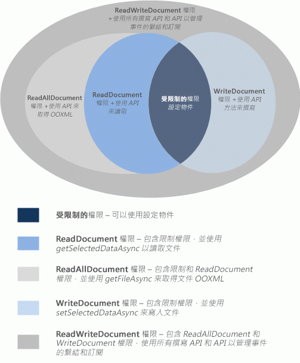

# 要求用於內容和工作窗格增益集的 API 權限
本文章說明可以在您的內容中宣告的不同權限層級，或工作窗格增益集的資訊清單，以指定您的增益集功能所需要的 JavaScript API 存取的層級。 


## 權限模型


五個層級的 JavaScript API 存取權限模型，可為您的內容和工作窗格增益集的使用者提供隱私權和安全性的基礎。圖 1 顯示您可以在增益集的資訊清單中宣告的五個層級 API 權限。


**圖 1. 內容和工作窗格增益集的五個層級權限模型**




這些權限可指定增益集執行階段將在使用者插入項目然後啟動 (信任) 增益集時，允許您的內容或工作窗格增益集使用的 API 的子集。 若要宣告您的內容或工作窗格增益集需要的權限層級，請在增益集資訊清單的 [Permissions](http://msdn.microsoft.com/en-us/library/d4cfe645-353d-8240-8495-f76fb36602fe%28Office.15%29.aspx) 元素中指定其中一個權限文字值。 下列範例要求 **WriteDocument** 權限，它僅允許可以寫入 (但無法讀取) 文件的方法。


```XML
<Permissions>WriteDocument</Permissions>
```

作為最佳作法，您應該根據 _least privilege_ 的原則要求權限。 也就是說，您應該要求只能存取增益集正常運作所需的 API 最基本子集合的權限。 例如，如果您的增益集的功能只需要讀取使用者文件中的資料，您應該不要求超過 **ReadDocument** 的權限。

下表說明每個權限層級啟用的 JavaScript API 的子集。


|**權限**|**已啟用的 API 子集合**|
|:-----|:-----|
|**限制**|[Settings](../../reference/shared/settings.md) 物件的方法，以及 [Document.getActiveViewAsync](../../reference/shared/document.getactiveviewasync.md) 方法。這是內容或工作窗格增益集可以要求的最小權限層級。|
|**ReadDocument**|除了 **Restricted** 權限所允許的 API 之外，新增閱讀文件及管理繫結所需之 API 成員的存取權限。這包括使用︰<br/><ul><li>
  <a href="http://msdn.microsoft.com/en-us/library/f85ad02c-64f0-4b73-87f6-7f521b3afd69(Office.15).aspx" target="_blank">Document.getSelectedDataAsync</a> 方法來取得選取的文字、HTML (僅限 Word) 或表格式資料，但不是包含文件中所有資料的基礎 Open Office XML (OOXML) 程式碼。</p></li><li><p>
  <a href="http://msdn.microsoft.com/en-us/library/78047418-89c4-4c7d-9427-4735b8559518(Office.15).aspx" target="_blank">Document.getFileAsync</a> 方法來取得文件中的所有文字，但不是文件的基礎 OOXML 二進位複本。</p></li><li><p>
  <a href="http://msdn.microsoft.com/en-us/library/5372ffd8-579d-4fcb-9e5b-e9a2128f3201(Office.15).aspx" target="_blank">Binding.getDataAsync</a> 方法來讀取文件中的繫結資料。</p></li><li><p>
  <span class="keyword">Bindings</span> 物件的 <a href="http://msdn.microsoft.com/en-us/library/afbadac7-60c7-47cb-9477-6e9466ded44c(Office.15).aspx" target="_blank">addFromNamedItemAsync</a>、<a href="http://msdn.microsoft.com/en-us/library/9dc03608-b08b-4700-8be1-3c86ae236799(Office.15).aspx" target="_blank">addFromPromptAsync</a>、<a href="http://msdn.microsoft.com/en-us/library/edc99214-e63e-43f2-9392-97ead42fc155(Office.15).aspx" target="_blank">addFromSelectionAsync</a> 方法在文件中建立繫結。</p></li><li><p>
  <span class="keyword">Bindings</span> 物件的 <a href="http://msdn.microsoft.com/en-us/library/ef902b73-cc4c-4551-95de-d8a51eeba82f(Office.15).aspx" target="_blank">getAllAsync</a>、<a href="http://msdn.microsoft.com/en-us/library/2727c891-bc05-465c-9324-113fbfeb3fbb(Office.15).aspx" target="_blank">getByIdAsync</a> 和 <a href="http://msdn.microsoft.com/en-us/library/ad285984-8b44-435d-9b84-f0ade570c896(Office.15).aspx" target="_blank">releaseByIdAsync</a> 方法來存取及移除文件中的繫結。</p></li><li><p>
  <a href="http://msdn.microsoft.com/en-us/library/2533a563-95ae-4d52-b2d5-a6783e4ef5b4(Office.15).aspx" target="_blank">Document.getFilePropertiesAsync</a> 方法來存取文件檔案屬性 (如文件的 URL)。</p></li><li><p>
  <a href="http://msdn.microsoft.com/en-us/library/35dda81c-235e-4eab-8a77-9acb3b73a380(Office.15).aspx" target="_blank">Document.goToByIdAsync</a> 方法來瀏覽至文件中的命名物件和位置。</p></li><li><p>
  <a href="http://msdn.microsoft.com/en-us/library/1908af4f-93b9-4859-87e3-06942014fae1(Office.15).aspx" target="_blank">ProjectDocument</a> 物件的所有 "get" 方法，用於專案的工作窗格增益集。 </p></li></ul>|
|**ReadAllDocument**|除了 **Restricted** 和 **ReadDocument** 權限所允許的 API 之外，還允許以下文件資料的其他存取權限︰<br/><ul><li><p><span class="keyword">Document.getSelectedDataAsync</span> 和 <span class="keyword">Document.getFileAsync</span> 方法可以存取文件的基礎 OOXML 程式碼 (除了文字以外，可能包含格式設定、連結、內嵌的圖形、註解、修訂等)。</p></li></ul>|
|**WriteDocument**|除了 **Restricted** 權限所允許的 API 之外，將存取權限新增至下列 API 成員：<br/><ul><li><p>
  <a href="http://msdn.microsoft.com/en-us/library/998f38dc-83bd-4659-a759-4758c632a6ef(Office.15).aspx" target="_blank">Document.setSelectedDataAsync</a> 方法可寫入文件中的使用者選取範圍。</p></li></ul>|
|**ReadWriteDocument**|除了 **Restricted**、**ReadDocument**、**ReadAllDocument** 和 **WriteDocument** 權限所允許的 API 之外，加入內容和工作窗格增益集支援之所有剩餘 API 的存取權限，包括訂閱事件的方法。您必須宣告 **ReadWriteDocument** 權限才能存取這些額外的 API 成員︰<br/><ul><li><p>
  <a href="http://msdn.microsoft.com/en-us/library/6a59bb6d-40b6-4a95-9b98-d70d4616de09(Office.15).aspx" target="_blank">Binding.setDataAsync</a> 方法可用來寫入文件的繫結區域。</p></li><li><p>
  <a href="http://msdn.microsoft.com/en-us/library/1cd23454-8435-4e13-98b3-d0d29ed278a8(Office.15).aspx" target="_blank">TableBinding.addRowsAsync</a> 方法可用來將資料列新增至繫結資料表。</p></li><li><p>
  <a href="http://msdn.microsoft.com/en-us/library/8f1bfa81-3850-4ea1-ba2e-c9bcf5847a44(Office.15).aspx" target="_blank">TableBinding.addColumnsAsync</a> 方法可用來將資料行新增至繫結資料表。</p></li><li><p>
  <a href="http://msdn.microsoft.com/en-us/library/8f5cc783-384d-4520-a218-190dfed74dd2(Office.15).aspx" target="_blank">TableBinding.deleteAllDataValuesAsync</a> 方法可用來刪除繫結資料表中的所有資料。</p></li><li><p>
  <span class="keyword">TableBinding</span> 物件的 <a href="http://msdn.microsoft.com/en-us/library/49712906-f582-4055-9ef8-6edde6e97679(Office.15).aspx" target="_blank">SetFormatsAsync</a>、<a href="http://msdn.microsoft.com/en-us/library/cc56e9c0-b33c-4d9b-b676-a7e50f757c10(Office.15).aspx" target="_blank">clearFormatsAsync</a> 和 <a href="http://msdn.microsoft.com/en-us/library/2885fc57-4527-4ca4-a43d-9ee447ec27d3(Office.15).aspx" target="_blank">setTableOptionsAsync</a> 方法，可用來在繫結資料表上設定格式和選項。</p></li><li><p>
  <a href="http://msdn.microsoft.com/en-us/library/dc1518de-47fa-4108-aab7-04a022724b04(Office.15).aspx" target="_blank">CustomXmlNode</a>、<a href="http://msdn.microsoft.com/en-us/library/83f0e668-8236-4f2f-a20f-b173a9e3f65f(Office.15).aspx" target="_blank">CustomXmlPart</a>、<a href="http://msdn.microsoft.com/en-us/library/ba40cd4c-29bb-4f31-875d-6f1382fd1ee8(Office.15).aspx" target="_blank">CustomXmlParts</a> 和 <a href="http://msdn.microsoft.com/en-us/library/18b9aa8c-83e7-4c2f-8530-6a0ac8ce5535(Office.15).aspx" target="_blank">CustomXmlPrefixMappings</a> 物件的所有成員。</p></li><li><p>用來訂閱內容和工作窗格增益集支援之事件的所有方法，特別是 <a href="http://msdn.microsoft.com/en-us/library/42882642-d22b-47d2-a8d3-3aa8c6a4435e(Office.15).aspx" target="_blank">Binding</a>、<a href="http://msdn.microsoft.com/en-us/library/83f0e668-8236-4f2f-a20f-b173a9e3f65f(Office.15).aspx" target="_blank">CustomXmlPart</a>、<a href="http://msdn.microsoft.com/en-us/library/f8859516-cc1f-4b20-a8f3-cee37a983e70(Office.15).aspx" target="_blank">Document</a>、<a href="http://msdn.microsoft.com/en-us/library/1908af4f-93b9-4859-87e3-06942014fae1(Office.15).aspx" target="_blank">ProjectDocument</a> 及 <a href="http://msdn.microsoft.com/en-us/library/ad733387-a58c-4514-8fc2-53e64fad468d(Office.15).aspx" target="_blank">Settings</a> 物件的 <span class="keyword">addHandlerAsync</span> 和 <span class="keyword">removeHandlerAsync</span> 的方法。</p></li></ul>|

## 其他資源

    
- [Office 增益集的隱私權和安全性](../../docs/develop/privacy-and-security.md)
    


