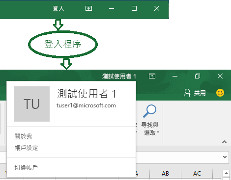

# <a name="enable-single-sign-on-for-office-add-ins-preview"></a>啟用 Office 增益集的單一登入 (預覽)

您可以利用使用者能夠登入 Office (線上、行動及桌面平台) 的事實，他們可以透過其個人 Microsoft 帳戶或其工作或學校 (Office 365) 帳戶來執行這項操作。 



您的增益集可以使用 SSO 來執行下列作業 - 不需要使用者登入第二次：

* 授權使用者使用您的增益集。
* 授權增益集存取 [Microsoft Graph](https://developer.microsoft.com/graph/docs)。 

>**附註：**此功能目前正在預覽階段，有可能在未來版本中變更。對於這個預覽，僅針對工作或學校 (Office 365) 帳戶以及桌面版本 Office 支援單一登入。 

對於使用者而言，這會讓執行增益集的體驗更平順，其中牽涉到最多的一次同意畫面。對於開發人員而言，這表示增益集可以透過 Microsoft Graph 與使用者已提供給 Office 應用程式的認證，驗證使用者和取得使用者資料的授權存取權。
 

### <a name="sso-add-in-architecture"></a>SSO 增益集架構

除了裝載頁面和 Web 應用程式的 JavaScript 之外，增益集也必須在相同[完整網域名稱](https://msdn.microsoft.com/en-us/library/windows/desktop/ms682135(v=vs.85).aspx#_dns_fully_qualified_domain_name_fqdn__gly)中裝載一或多個 Web API，它會取得 Microsoft Graph 的存取權杖並且對它提出要求。

增益集資訊清單會包含指定如何在 Azure Active Directory (AD Azure) v2.0 端點中註冊增益集的標記，它會指定增益集需要的任何 Microsoft Graph 權限。

### <a name="how-it-works-at-runtime"></a>執行階段的運作方式

下圖示範 SSO 程序的運作方式。 
<!-- Minor fixes to the text in the diagram - change V2 to v2.0, and change "(e.g. Word, Excel, etc.)" to "(for example, Word, Excel)". -->


1. 增益集中的 JavaScript 會呼叫新的 Office.js API `getAccessTokenAsync`。這會告訴 Office 主應用程式以取得增益集的存取權杖。(以下稱為「增益集權杖」。)
1. [需要時才會發生] 如果使用者未登入，Office 主應用程式就會開啟快顯視窗，讓使用者登入。 
1. [需要時才會發生] 如果這是目前的使用者第一次使用增益集，系統會提示他或她同意。 
1. Office 主應用程式從目前使用者的 Azure AD v2.0 端點，要求增益集權杖。
1. Azure AD 會將增益集權杖傳送至 Office 主應用程式。
1. Office 主應用程式會將增益集權杖傳送至增益集，作為呼叫 `getAccessTokenAsync` 呼叫傳回之結果物件的一部分。
1. 增益集中的 JavaScript 會對 Web API (裝載於與增益集相同的完整網域) 進行 HTTP 要求，它包含增益集權杖作為授權證明。  
1. 伺服器端程式碼會驗證傳入的增益集權杖。
1. 伺服器端程式碼會使用「代表」流程 (在[OAuth2 權杖交換](https://tools.ietf.org/html/draft-ietf-oauth-token-exchange-02)和 [Web API Azure 案例的精靈或伺服器應用程式](https://docs.microsoft.com/en-us/azure/active-directory/develop/active-directory-authentication-scenarios#daemon-or-server-application-to-web-api)中定義)，以取得 Microsoft Graph 的存取權杖 (以下稱為「MSG 權杖」)，與增益集權杖交換。 
1. Azure AD 會將 MSG 權杖 (和重新整理權杖，如果增益集要求 *offline_access* 權限) 傳回至增益集。
1. 伺服器端程式碼會快取權杖。
1. 伺服器端程式碼會對 Microsoft Graph 提出要求，並且包含 MSG 權杖。
1. Microsoft Graph 會將資料傳回到增益集，可以將它傳遞至增益集的 UI。 
1. [需要時才會發生] 當 MSG 權杖到期時，伺服器端程式碼可以使用它的重新整理權杖來取得新的 MSG 權杖。

### <a name="develop-an-sso-add-in"></a>開發 SSO 增益集

下列章節描述建立使用 SSO 的 Office 增益集所涉及的工作。這些工作在這裡以語言和架構無從驗證方式說明。詳細逐步解說的連結如下。

#### <a name="create-the-service-application"></a>建立服務應用程式

在 Azure v2.0 端點的註冊入口網站註冊增益集：https://apps.dev.microsoft.com。這是 5-10 分鐘的處理程序，包含下列工作︰

* 取得增益集的用戶端 ID 和密碼。
* 指定增益集需要的 Microsoft Graph 權限。
* 將 Office 主應用程式信任授與增益集。
* 使用預設權限 *access_as_user* 將 Office 主應用程式預先授權給增益集。

#### <a name="configure-the-add-in"></a>設定增益集

將新的標記新增至增益集資訊清單︰

* **WebApplicationID** - 增益集的用戶端 ID。
* **WebApplicationResource** - 增益集的 URL。
* **WebApplicationScopes** - 指定 Office 主應用程式需要的增益集權限，指定增益集需要的 Microsoft Graph 權限。一般情況下，您永遠需要 *User.Read*，但是您可以要求更多存取權 (例如 *Mail.Read* 或 *offline_access*)。

#### <a name="add-client-side-code"></a>新增用戶端程式碼

將 JavaScript 新增至增益集來︰

* 呼叫 `Office.context.auth.getAccessTokenAsync(myTokenHandler)`。
* 建立處理常式，將增益集權杖傳遞至增益集的伺服器端程式碼。例如：

```js
function mytokenHandler(asyncResult) {
    // Passes asyncResult.value (which has the add-in access token)
    // to the add-in’s web API as an Authorization header.
}
```

#### <a name="add-server-side-code"></a>新增伺服器端程式碼

建立一或多個 Web API 方法，以取得 Microsoft Graph 資料。根據您的語言和架構，可能可以使用程式庫，簡化您必須撰寫的程式碼。您的伺服器端程式碼必須執行下列作業︰

* 驗證從您稍早建立的權杖處理常式所收到的增益集權杖。
* 使用對 Azure AD v2.0 端點的呼叫來起始「代表」流程，包括增益集存取權杖、使用者的某些中繼資料，以及增益集的認證 (其 ID 和密碼)。 
* 快取傳回的 MSG 權杖。
* 使用 MSG 權杖從 Microsoft Graph 取得資料。

### <a name="walkthroughs"></a>逐步解說

* [建立使用單一登入的 Node.js Office 增益集](../../docs/develop/create-sso-office-add-ins-nodejs.md)
* [建立使用單一登入的 ASP.NET Office 增益集](../../docs/develop/create-sso-office-add-ins-aspnet.md)


