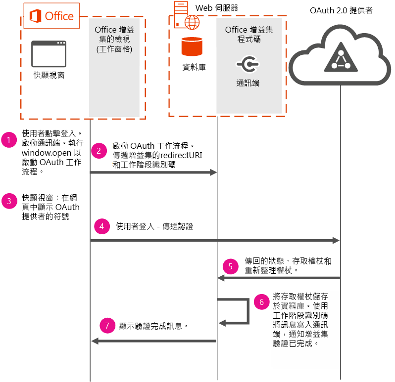

# <a name="use-the-oauth-authorization-framework-in-an-office-add-in"></a>在 Office 增益集中使用 OAuth 授權架構

OAuth 是用於授權的開放標準，線上服務提供者 (例如 Office 365、Facebook、Google、SalesForce、LinkedIn 及其他廠商) 會用這個標準來執行使用者驗證。OAuth 授權架構是用於 Azure 和 Office 365 的預設授權通訊協定。OAuth 授權架構同時用於企業 (公司) 和消費者案例。

線上服務提供者可能會透過 REST 公開公用 API。開發人員可以在其 Office 增益集中使用這些公用 API，以將資料讀取或寫入到線上服務提供者。整合增益集中線上服務提供者的資料可增加其價值，讓更多使用者採用。在增益集中使用這些 API 時，使用者將會需要使用 OAuth 授權架構來進行驗證。

本主題說明如何在增益集中實作驗證流程，以執行使用者驗證。本主題中所包含的程式碼區段取自 [Office-Add-in-NodeJS-ServerAuth](https://github.com/OfficeDev/Office-Add-in-NodeJS-ServerAuth) 程式碼範例。

 **附註**  基於安全性考量，不允許瀏覽器顯示使用 IFrame 的登入網頁。根據您客戶使用的 Office 版本，尤其是以 web 為基礎的版本，會使用 IFrame 顯示增益集。這會需要考量如何管理驗證流程。 

下圖顯示在增益集中實作驗證時發生事件所需的元件及流程。



下圖顯示如何使用下列必要元件︰


- Office 會在使用者電腦上執行工作窗格增益集。增益集會開啟快顯視窗以啟動驗證流程。增益集無法直接啟動驗證流程，因為增益集可能使用 IFRAME 執行 (視使用的平台而定)。基於安全性考量，無法使用 IFRAME 顯示 OAuth 登入頁面。 
    
- Web 伺服器主控您的增益集程式碼。這個程式碼範例會使用 web 伺服器上執行的資料庫伺服器，來儲存使用者的存取權杖。保存存取權杖是必要的，如此使用快顯視窗完成驗證後，主要增益集頁面就可以使用相同的權杖從線上服務存取資料。使用伺服器端選項來儲存權杖是必要的，因為您不能依賴透過增益集或快顯視窗所傳遞的資訊。
    
- OAuth 2.0 提供者會執行使用者驗證。
    

    
 **重要事項**  無法將存取權杖傳回至工作窗格，但是可以在伺服器上使用它們。在這個程式碼範例中，存取權杖會儲存在資料庫中 2 分鐘的時間。2 分鐘後，會將權杖從資料庫清除，並會提示使用者重新驗證。在變更實作的此時間間隔前，請考慮在資料庫中存取權杖的儲存時間超過 2 分鐘的相關安全性風險。


## <a name="step-1---start-socket-and-open-a-pop-up-window"></a>步驟 1 - 開始通訊端並開啟快顯視窗

執行此程式碼範例時，工作窗格增益集會顯示在 Office 中。當使用者選擇登入的 OAuth 提供者時，增益集會先建立通訊端。這個範例會使用通訊端，來提供良好的增益集使用者經驗。增益集使用通訊端，與使用者通訊驗證成功或失敗。藉由使用通訊端，可輕鬆更新增益集主頁面的驗證狀態，而且不需使用者互動或輪詢。下列取自 routes/connect.js 的程式碼區段，會示範如何啟動通訊端。通訊端使用  **decodedNodeCookie** 來命名，這是增益集的工作階段 ID。這個程式碼範例會使用 [socket.io](http://socket.io/) 來建立通訊端。


```js
io.on('connection', function (socket) {
  console.log('Socket connection established');
  var jsonCookie =
    cookie.parse(socket
      .handshake
      .headers
      .cookie);
  var decodedNodeCookie =
    cookieParser
      .signedCookie(jsonCookie.nodecookie, '<Insert a random string>');
  console.log('Decoded cookie: ' + decodedNodeCookie);
  // The session ID becomes the room name for this session.
  socket.join(decodedNodeCookie);
  io.to(decodedNodeCookie).emit('init', 'Private socket session established');
});

```

接下來，增益集會連接到通訊端。下列程式碼可以在 /public/javascripts/client.js 中找到。


```js
var socket = io.connect('https://localhost:3001', { secure: true });
```

接下來，增益集會使用  **window.open** 開啟使用者電腦上的快顯視窗。執行  **window.open** 時，請確保使用 URL 來傳遞增益集的重新導向 URI 和工作階段 ID。增益集的工作階段 ID 是用來識別將驗證狀態資訊傳送至增益集 UI 時使用的通訊端。下列程式碼區段可以在 views/index.jade 中找到。


```js
onclick="window.open('/connect/azure/#{sessionID}', 'AuthPopup', 'width=500,height=500,centerscreen=1,menubar=0,toolbar=0,location=0,personalbar=0,status=0,titlebar=0,dialog=1')")
```


## <a name="steps-2-&amp;-3---start-the-authentication-flow-and-show-the-sign-in-page"></a>步驟 2 和 3 - 啟動驗證流程並顯示登入頁面

增益集必須啟動驗證流程。下列程式碼區段使用 Passport OAuth 程式庫。啟動驗證流程時，請確定您傳遞 OAuth 提供者的授權 URL 和增益集的工作階段 ID。增益集的工作階段 ID 必須使用狀態參數傳遞。快顯視窗現在會顯示 OAuth 提供者的登入頁面，讓使用者可以登入。


```js
router.get('/azure/:sessionID', function(req, res, next) { 
   passport.authenticate( 
     'azure',  
     { state: req.params.sessionID }, 

```


## <a name="steps-4,-5-&amp;-6---user-signs-in-and-web-server-receives-tokens"></a>步驟 4、5 和 6 - 使用者登入和 web 伺服器收到權杖

 成功登入後，存取權杖、重新整理權杖和狀態參數會傳回至增益集。狀態參數包含的工作階段 ID，是用來將驗證狀態資訊傳送至步驟 7 中的通訊端。下列取自 app.js 的程式碼區段可儲存資料庫中的存取權杖。


```js
  dbHelperInstance.insertDoc(userData, null, 
         function (err, body) { 
           if (!err) { 
             console.log("Inserted session entry [" + userData.sessid + "] id: " + body.id); 
           } 
           done(err, userData); 
         }); 

```


## <a name="step-7---show-authentication-information-in-the-add-in's-ui"></a>步驟 7 - 顯示增益集 UI 中的驗證資訊

下列取自 connect.js 的程式碼區段可將增益集 UI 更新為驗證狀態資訊。增益集 UI 會使用步驟 1 中建立的通訊端進行更新。


```js
  
       io.to(user.sessid).emit('auth_success', providers); 
       next(); 

```


## <a name="additional-resources"></a>其他資源
<a name="bk_addresources"> </a>


- [Node.js 的 Office 增益集伺服器驗證範例](https://github.com/OfficeDev/Office-Add-in-Nodejs-ServerAuth/blob/master/README.md)
    
