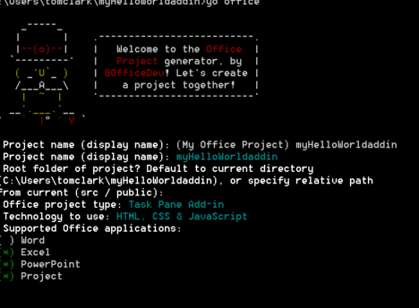

# <a name="create-an-office-add-in-using-any-editor"></a>使用任何編輯器建立 Office 增益集

您可以使用 Yeoman 產生器來建立 Office 增益集。Yeoman 產生器提供專案建構和建置管理。`manifest.xml` 檔案會告訴您 Office 應用程式增益集的所在位置與您想要顯示它的方式。Office 應用程式負責在 Office 內主控它。

 >**附註︰**這些指示使用 Windows 命令提示字元，但您也可以使用其他的 Shell 環境。 


## <a name="prerequisites-for-yeoman-generator"></a>Yeoman 產生器的必要條件

若要執行 Yeoman Office 產生器，您需要下列項目︰


- [Git](https://git-scm.com/downloads)  
- [npm](https://www.nodejs.org/en/download)
- [Bower](http://bower.io/)
- [Yeoman Office 產生器](https://www.npmjs.com/package/generator-office)
- [Gulp](http://gulpjs.com/)
- [TSD](http://definitelytyped.org/tsd/)
    
只有 Git 和 npm 需要個別安裝。其他項目可以使用 npm 安裝。

安裝 Git 時，除了應該選擇的下列選項以外，請使用預設值︰ 

- 從 Windows 命令提示字元使用 Git
- 使用 Windows 的預設主控台視窗
    
使用預設值安裝 npm。接著以系統管理員身分開啟命令提示字元，並全域安裝其他軟體︰

```
npm install -g bower yo generator-office gulp tsd
```


## <a name="create-the-default-files-for-your-add-in"></a>為增益集建立預設檔案

開發 Office 增益集之前，應該先為您的專案建立資料夾，並從該處執行產生器。Yeoman 產生器會在您想要建構專案的目錄中執行。 

在命令提示字元中，移至您想要建立專案的上層資料夾。然後使用下列命令來建立名為 _myHelloWorldaddin_ 的新資料夾，並將目前的目錄轉移至此處︰


```
mkdir myHelloWorldaddin
cd myHelloWorldaddin
```

使用 Yeoman 產生器來建立您所選擇的 Office 增益集︰Outlook、內容或工作窗格。在本文的步驟中，建立工作窗格增益集。若要執行產生器，請輸入下列指示︰


```
yo office
```

產生器會提示您輸入下列︰ 


- 增益集的名稱 - 使用 _myHelloWorldaddin_ 
- 專案的根資料夾 - 使用_目前的資料夾_
- 增益集的類型 - 使用_工作窗格_
- 建立增益集所使用的技術 - _HTML、CSS &amp; JavaScript_
- 支援的 Office 應用程式 - 您可以選擇任何應用程式
    

**增益集的 Yeoman 產生器輸入**



這會為您的增益集建立結構和基本檔案。


## <a name="hosting-your-office-add-in"></a>主控 Office 增益集

必須透過 HTTPS 提供 Office 增益集；如果是 HTTP，Office 應用程式將不會以增益集形式載入 Web 應用程式。若要在本機開發、偵錯和主控增益集，您需要一個方式在本機使用 HTTPS 建立並提供 Web 應用程式。您可以透過 gulp (在下一節說明) 建立自我主控的 HTTPS 站台，或者也可以使用 Azure。 


### <a name="using-a-self-hosted-https-site"></a>使用自我主控的 HTTPS 站台

gulp-webserver 外掛程式會建立自我主控的 HTTPS 站台。針對所產生的專案，Office 產生器會以名為 serve-static 的工作形式，將這加入 gulpfile.js。使用下列陳述式啟動自我主控的 Web 伺服器︰ 


```
gulp serve-static
```

這會在 https://localhost:8443 啟動 HTTPS 伺服器。


## <a name="develop-your-office-add-in"></a>開發 Office 增益集

您可以使用任何文字編輯器為自訂的 Office 增益集開發檔案。


### <a name="javascript-project-support"></a>JavaScript 專案支援

建立您的專案時，Office 產生器會建立 jsconfig.json 檔案。這個檔案可供您用來推斷專案內的所有 JavaScript 檔案，並讓您不須併入重複的 /// <reference path="../App.js" /> 程式碼區塊。

在 [JavaScript 語言](https://code.visualstudio.com/docs/languages/javascript#_javascript-projects-jsconfigjson) 頁面上深入了解 jsconfig.json 檔案。


### <a name="javascript-intellisense-support"></a>JavaScript Intellisense 支援

此外，即使是撰寫一般 JavaScript，您可以使用 TypeScript 類型定義檔案 (`*.d.ts`) 來提供額外的 IntelliSense 支援。Office 產生器會加入 `tsd.json` 檔案至建立的檔案，其中包含您所選取之專案類型所使用的所有協力廠商程式庫的參考。

使用 Yeoman Office 產生器建立專案之後，您只需要執行下列命令來下載參考的類型定義檔案︰


```
tsd install
```


### <a name="create-a-hello-world-office-add-in"></a>建立 Hello World Office 增益集


在此範例中，您將要建立 Hello World 增益集。增益集的 UI 是透過可選擇性地提供 JavaScript 程式設計邏輯的 HTML 檔案提供。 


### <a name="to-create-the-files-for-a-hello-world-add-in"></a>為 Hello World 增益集建立檔案


- 在您的專案資料夾，移至 _[專案資料夾]/app/home_ (在此範例中，它是 myHelloWorldaddin/app/home)，開啟 home.html，並將現有程式碼以下列程式碼取代，這可提供顯示增益集 UI 所需最基本的一組 HTML 標籤。
    
```HTML
        <!DOCTYPE html>  
      <html> 
        <head> 
           <meta charset="UTF-8" /> 
           <meta http-equiv="X-UA-Compatible" content="IE=Edge"/> 
           <link rel="stylesheet" type="text/css" href="program.css" />
         </head> 
   
        <body> 
           <p>Hello World!</p> 
        </body> 
      
       </html> 
```

  
    
- 接下來，在相同的資料夾中，開啟 home.css 檔案，並加入下列 CSS 程式碼。
    
```css
     body 
   { 
        position:relative; 
   } 
   li :hover 
   { 
        text-decoration: underline; 
        cursor:pointer; 
   } 
   h1,h3,h4,p,a,li 
   { 
        font-family: "Segoe UI Light","Segoe UI",Tahoma,sans-serif; 
        text-decoration-color:#4ec724; 
   } 
```
    
- 然後，回到父專案資料夾，並確定名為 manifest-myHelloWorldaddin.xml 的 XML 檔案包含下列 XML 程式碼。
    
     >**重要事項：**`<id>` 標記中的值是 yeoman 產生器產生專案時所建立的 GUID。請勿變更 yeoman 產生器為您的增益集所建立的 GUID。如果主應用程式是 Azure，`SourceLocation` 值會是類似 _https:// [name-of-your-web-app].azurewebsites.net/[path-to-add-in]_ 的 URL。如果您使用自我主控的選項，如下列範例所示，就會是 _https://localhost:8443 / [path-to-add-in]_。

```XML
     <?xml version="1.0" encoding="utf-8"?> 
   <OfficeApp xmlns="http://schemas.microsoft.com/office/appforoffice/1.1" 
              xmlns:xsi="http://www.w3.org/2001/XMLSchema-instance" 
              xsi:type="TaskPaneApp"> 
   <Id>[GUID-for-your-add-in]</Id> 
   <Version>1.0</Version> 
   <ProviderName>Microsoft</ProviderName> 
   <DefaultLocale>EN-US</DefaultLocale> 
   <DisplayName DefaultValue="myHelloWorldaddin"/> 
   <Description DefaultValue="My first app."/> 
    
   <Hosts> 
     <Host Name="Document"/> 
     <Host Name="Workbook"/> 
   </Hosts>
    
   <DefaultSettings> 
     <SourceLocation DefaultValue="https://localhost:8443/app/home/home.html"/> 
   </DefaultSettings> 
   
   <Permissions>ReadWriteDocument</Permissions>
    
   </OfficeApp> 
```


### <a name="running-the-add-in-locally"></a>在本機執行增益集


若要在本機測試增益集，請開啟您的瀏覽器，並輸入您的 home.html 檔案的 URL。這可以是在 Web 伺服器或自我主控的 HTTPS 站台上。如果您在本機主控它，只需在您的瀏覽器輸入該 URL。在這範例中，是 `https://localhost:8443/app/home/home.html`。 

您會看到錯誤訊息說明「此網站的安全性憑證有問題」。選取 [繼續瀏覽此網站...]，然後您會看到文字 "Hello World!"


 >**附註︰**產生的增益集隨附自我簽署憑證與金鑰。請將它們新增到您的憑證信任授權單位清單，使得瀏覽器不會發出憑證警告。如果您想要使用自己的自我簽署憑證，請參閱 [gulp-webserver](https://www.npmjs.com/package/gulp-webserver) 文件。如需有關如何信任 OS X Yosemite 中憑證的資訊，請參閱 [OS X Yosemite：如果您的憑證不被接受](https://support.apple.com/kb/PH18677?locale=en_US)。


## <a name="install-the-add-in-for-testing"></a>安裝增益集進行測試

您可以使用側載來安裝增益集以進行測試︰

- [側載 Office 增益集來進行測試](../testing/create-a-network-shared-folder-catalog-for-task-pane-and-content-add-ins.md)
- [在 iPad 和 Mac 上側載 Office 增益集來進行測試](../testing/sideload-an-office-add-in-on-ipad-and-mac.md)   
- [側載 Outlook 增益集來進行測試](../outlook/testing-and-tips.md)
    

## <a name="debug-your-add-in"></a>對您的增益集進行偵錯

您可以使用以下各種方式對增益集進行偵錯：

- 從工作窗格附加偵錯工具 (Windows 版 Office 2016)。
- 使用瀏覽器的開發人員工具。
- 使用 Windows 10 中的 F12 開發人員工具。

### <a name="attach-debugger-from-the-task-pane"></a>從工作窗格附加偵錯工具

在 Windows 版 Office 2016 組建 77xx.xxxx 或更新版本中，您可以從工作窗格附加偵錯工具。 

若要啟動 **[附加偵錯工具]**，請選擇工作窗格右上角以啟用 **[特質]** 功能表 (下圖紅色圓圈處)。   

![[附加偵錯工具] 功能表的螢幕擷取畫面](../../images/attach-debugger.png)

選取 **[附加偵錯工具]**。此動作會啟動 **[Visual Studio Just-in-Time 偵錯工具]** 對話方塊 (如下圖所示)。 

![[Visual Studio JIT 偵錯工具] 對話方塊的螢幕擷取畫面](../../images/visual-studio-debugger.png)

接下來您就可以在 Visual Studio 中附加偵錯工具並進行偵錯。   

  >  **注意**：[Visual Studio 2015](https://www.visualstudio.com/downloads/) (具有 [Update 3](https://msdn.microsoft.com/en-us/library/mt752379.aspx)) 是目前唯一支援的偵錯工具。若未安裝 Visual Studio，當您選取 **[附加偵錯工具]** 選項時，系統不會有任何動作。  
  
如需詳細資訊，請參閱下列各主題：

-   若要在 Visual Studio 中啟動及使用 DOM 總管，請參閱[使用新的專案範本打造美觀的 Office App](https://blogs.msdn.microsoft.com/officeapps/2013/04/16/building-great-looking-apps-for-office-using-the-new-project-templates)  部落格文章中[祕訣和訣竅](https://blogs.msdn.microsoft.com/officeapps/2013/04/16/building-great-looking-apps-for-office-using-the-new-project-templates/#tips_tricks)小節的祕訣 4。
-   若要設定中斷點，請參閱[使用中斷點](https://msdn.microsoft.com/en-US/library/5557y8b4.aspx)。
-   若要使用 F12，請參閱[使用 F12 開發人員工具](https://msdn.microsoft.com/en-us/library/bg182326(v=vs.85).aspx)。

### <a name="browser-developer-tools"></a>瀏覽器開發人員工具 

您可以使用 Office Web 用戶端，然後開啟瀏覽器的開發人員工具來偵錯增益集，就像對任何其他用戶端 JavaScript 應用程式進行偵錯一樣。 

### <a name="f12-developer-tools-on-windows-10"></a>Windows 10 的 F12 開發人員工具

如果您在 Windows 10 上使用 Office 電腦版用戶端，您可以[使用 Windows 10 的 F12 開發人員工具偵錯增益集](../testing/debug-add-ins-using-f12-developer-tools-on-windows-10.md)。
    
## <a name="additional-resources"></a>其他資源


- [在 Visual Studio 中建立和偵錯 Office 增益集](../../docs/get-started/create-and-debug-office-add-ins-in-visual-studio.md)
    
