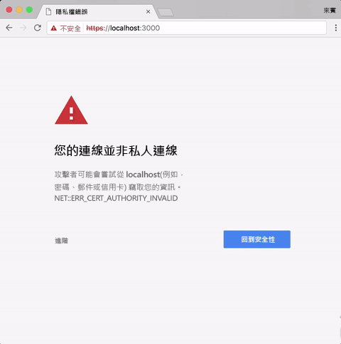

# <a name="create-an-office-add-in-using-any-editor"></a>使用任何編輯器建立 Office 增益集

您可以使用 Yeoman 產生器來建立 Office 增益集。Yeoman 產生器提供專案建構和建置管理。`manifest.xml` 檔案會告訴您 Office 應用程式增益集的所在位置與您想要顯示它的方式。Office 應用程式負責在 Office 內主控它。

 >**附註：**這些指示會在 Mac 上使用終端機，但您也可以使用其他的 Shell 環境。 


## <a name="prerequisites-for-the-yeoman-generator"></a>Yeoman 產生器的必要條件

若要安裝 Yeoman Office 產生器，您必須在電腦上安裝 [git](https://git-scm.com/downloads) 和 node.js。如果您是在 Mac 上，我們建議您使用[節點版本管理員](https://github.com/creationix/nvm)以正確的權限安裝 node.js。如果您是在 Windows 上，您可以從 [nodejs.org](https://nodejs.org/en/) 安裝 node.js。

>**附註：**如果您是在 Windows 上，當您安裝 git 時使用預設值，除了下列例外︰

>- 從 Windows 命令提示字元使用 git
>- 使用 Windows 的預設主控台視窗

在您安裝 node.js 後，請開啟終端機，並全域安裝產生器。

```
npm install -g yo generator-office
```


## <a name="create-the-default-files-for-your-add-in"></a>為增益集建立預設檔案

Yeoman 產生器會在您想要建構專案的目錄中執行。在您開發 Office 增益集之前，應該先為您的專案建立資料夾。

在終端機中，移至您想要用來建立專案的上層資料夾。然後使用下列命令來建立名為 _myHelloWorldaddin_ 的新資料夾，並將目前的目錄轉移至此處︰


```
mkdir myHelloWorldaddin
cd myHelloWorldaddin
```

使用 Yeoman 產生器來建立您所選擇的增益集。在本文的步驟中，建立簡單工作窗格增益集。若要執行產生器，請輸入下列命令︰


```
yo office
```

**增益集的 Yeoman 產生器輸入**

產生器會提示您輸入下列︰ 


- 新的子資料夾 - 使用_N_
- 增益集名稱 - 使用 _myHelloWorldaddin_ 
- 支援的 Office 應用程式 - 您可以選擇任何應用程式
- 建立新增益集 -- 使用_是，我想用新的增益集。_
- 新增 [TypeScript](https://www.typescriptlang.org/) -- 使用 _N_
- 選擇架構 -- 使用 _Jquery_

>**附註：**如果您想要建立使用 Office UI Fabric React 的 Office 增益集，請輸入下列各項︰
>- 新增 [TypeScript](https://www.typescriptlang.org/) -- 使用 _Y_
>- 選擇架構 -- 使用 _React_


這會為您的增益集建立結構和基本檔案。


## <a name="hosting-your-office-add-in"></a>主控 Office 增益集

即使在開發階段透過 HTTPS，仍須託管 Office 增益集。Yo Office 會建立 bsconfig.json，其會使用 Browsersync 在多個裝置下，更快速地調整並透過同步處理檔案變更，來測試您的增益集。 

透過在您的主控台輸入下列命令，以在 https://localhost:3000 上啟動本機的 HTTPS 站台︰


```
npm start
```

Browsersync 將啟動 HTTPS 伺服器，並啟動您專案中的 index.html 檔案。您會看到錯誤訊息說明「此網站的安全性憑證有問題」。




會發生此錯誤，是因為 Browsersync 包含您的開發環境必須信任的自我簽署 SSL 憑證。如需如何解決此錯誤的相關資訊，請參閱[新增自我簽署憑證](https://github.com/OfficeDev/generator-office/blob/master/src/docs/ssl.md)。

## <a name="sideload-the-add-in-into-office"></a>將增益集側載至 Office

您可以使用側載在 Office 用戶端內，安裝增益集以進行測試︰

- [側載 Office 增益集來進行測試](../testing/create-a-network-shared-folder-catalog-for-task-pane-and-content-add-ins.md)
- [在 iPad 和 Mac 上側載 Office 增益集來進行測試](../testing/sideload-an-office-add-in-on-ipad-and-mac.md)   
- [側載 Outlook 增益集來進行測試](../outlook/testing-and-tips.md)

## <a name="develop-your-office-add-in"></a>開發 Office 增益集

您可以使用任何文字編輯器為自訂的 Office 增益集開發檔案。

> **重要事項：**manifest-myHelloWorldaddin.xml 檔案會告訴 Office 用戶端應用程式如何與您的增益集互動。`<id>` 標記中的值是 Yo Office 產生專案時所建立的 GUID。請勿變更您增益集的 GUID。如果主應用程式是 Azure，`SourceLocation` 值會是類似 _https:// [name-of-your-web-app].azurewebsites.net/[path-to-add-in]_ 的 URL。如果您使用自我主控的選項，如下列範例所示，就會是 _https://localhost:3000/[path-to-add-in]_。


## <a name="debug-your-office-add-in"></a>偵錯您的 Office 增益集

您可以使用以下各種方式對增益集進行偵錯：

- 從工作窗格附加偵錯工具 (Windows 版 Office 2016)。
- 使用瀏覽器的開發人員工具。
- 使用 Windows 10 中的 F12 開發人員工具。

### <a name="attach-debugger-from-the-task-pane"></a>從工作窗格附加偵錯工具

在 Windows 版 Office 2016 組建 77xx.xxxx 或更新版本中，您可以從工作窗格附加偵錯工具。 

若要啟動 **[附加偵錯工具]**，請選擇工作窗格右上角以啟用 **[特質]** 功能表 (下圖紅色圓圈處)。   

![[附加偵錯工具] 功能表的螢幕擷取畫面](../../images/attach-debugger.png)

選取 **[附加偵錯工具]**。此動作會啟動 **[Visual Studio Just-in-Time 偵錯工具]** 對話方塊 (如下圖所示)。 

![[Visual Studio JIT 偵錯工具] 對話方塊的螢幕擷取畫面](../../images/visual-studio-debugger.png)

接下來您就可以在 Visual Studio 中附加偵錯工具並進行偵錯。   

  >**注意**：[Visual Studio 2015](https://www.visualstudio.com/downloads/) (具有 [Update 3](https://msdn.microsoft.com/en-us/library/mt752379.aspx)) 是目前唯一支援的偵錯工具。若未安裝 Visual Studio，當您選取 **[附加偵錯工具]** 選項時，系統不會有任何動作。  
  
如需詳細資訊，請參閱下列各主題：

-    若要在 Visual Studio 中啟動及使用 DOM 總管，請參閱[使用新的專案範本打造美觀的 Office App](https://blogs.msdn.microsoft.com/officeapps/2013/04/16/building-great-looking-apps-for-office-using-the-new-project-templates) (英文) 部落格文章中[祕訣和訣竅](https://blogs.msdn.microsoft.com/officeapps/2013/04/16/building-great-looking-apps-for-office-using-the-new-project-templates/#tips_tricks)小節的祕訣 4。
-    若要設定中斷點，請參閱[使用中斷點](https://msdn.microsoft.com/en-US/library/5557y8b4.aspx)。
-    若要使用 F12，請參閱[使用 F12 開發人員工具](https://msdn.microsoft.com/en-us/library/bg182326(v=vs.85).aspx)。

### <a name="browser-developer-tools"></a>瀏覽器開發人員工具 

您可以使用 Office Web 用戶端，然後開啟瀏覽器的開發人員工具來偵錯增益集，就像對任何其他用戶端 JavaScript 應用程式進行偵錯一樣。 

### <a name="f12-developer-tools-on-windows-10"></a>Windows 10 的 F12 開發人員工具

如果您在 Windows 10 上使用 Office 電腦版用戶端，您可以[使用 Windows 10 的 F12 開發人員工具偵錯增益集](../testing/debug-add-ins-using-f12-developer-tools-on-windows-10.md)。
    
## <a name="additional-resources"></a>其他資源


- [在 Visual Studio 中建立和偵錯 Office 增益集](../../docs/get-started/create-and-debug-office-add-ins-in-visual-studio.md)
    
