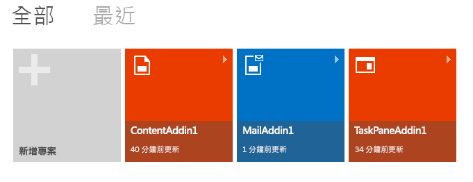
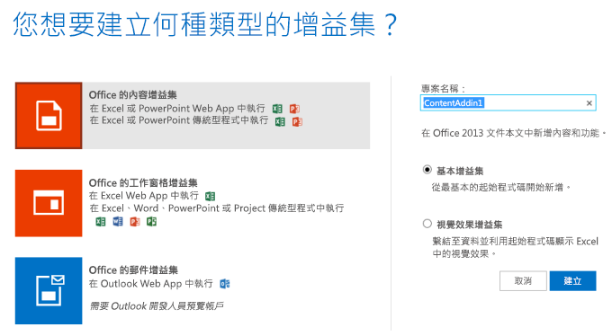


# 使用 Napa 建立 Office 增益集

[Office 增益集](../../docs/overview/office-add-ins.md)是一個 Web 應用程式，主控於瀏覽器控制項或是在 Office 應用程式的內容中執行的 iframe 中。增益集可以存取目前文件或郵件項目中的資料，以及連線至 Web 服務和其他 Web 資源。若要開發增益集，請使用 Web 標準技術 (例如 HTML5、JavaScript、CSS3、XML 和 REST API)。增益集實際上未安裝於執行 Office 主應用程式的電腦；其實作主控於網頁伺服器，讓您可以從該伺服器輕鬆地進行維護和更新。

您可以使用 Napa 建立簡單的 Office 增益集。若要這樣做，您將需要︰

- [Microsoft 帳戶](http://www.microsoft.com/en-us/account/default.aspx)
    
- [Napa](https://www.napacloudapp.com/ ) Web 應用程式的 URL

>**附註：**若要開始使用 OneNote 的增益集，請參閱[建置第一個 OneNote 增益集](../onenote/onenote-add-ins-getting-started.md)。

## 建立基本的增益集

1. 在瀏覽器中開啟 [Napa](https://www.napacloudapp.com/ )。
    
2. 選擇 [新增專案] 磚。
    
     **附註：**只有在您已建立其他專案，才會出現 [新增專案] 磚。如果這是您的第一個專案，則會跳至下一個步驟。
    
    

3. 選擇您想要建立的增益集類型，命名專案，然後選擇 [建立] 按鈕。
    
    

    程式碼編輯器會開啟並顯示預設網頁，其中已包含部分不需再做任何處理即可執行的範例程式碼。
    
4. 在頁面的一側，選擇 [執行] 按鈕 ()。
    
    所選增益集種類相關聯的 Office 應用程式隨即開啟，並顯示範例增益集。您現在可以嘗試增益集的功能。
    

## 其他資源

- [Office 增益集概觀](../../docs/overview/office-add-ins.md)
    
- [提供關於 Office 開發平台的意見](http://officespdev.uservoice.com/)
    
- [在 Office 增益集論壇中張貼問題](http://social.msdn.microsoft.com/Forums/officeapps/en-US/home?forum=appsforoffice%2Cofficestore&amp;filter=alltypes&amp;sort=lastpostdesc)
    
