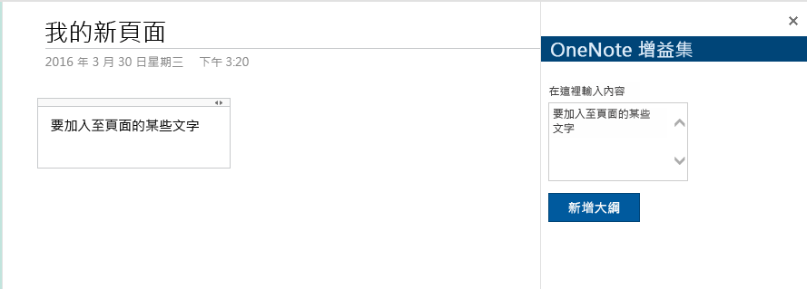
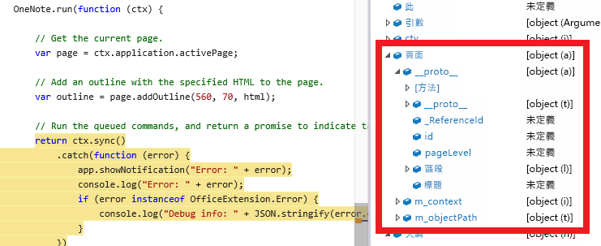

# <a name="build-your-first-onenote-add-in"></a>建立第一個 OneNote 增益集

此文章會引導您建置簡單的工作窗格增益集，可將某些文字加入到 OneNote 頁面中。

下列影像會顯示您要建立的增益集。

   

<a name="setup"></a>
## <a name="step-1-set-up-your-dev-environment-and-create-an-add-in-project"></a>步驟 1：設定您的開發環境，並建立增益集專案
依照[使用任何編輯器建立 Office 增益集](../get-started/create-an-office-add-in-using-any-editor.md)的指示以安裝必要的必要項目和執行 Office Yeoman 產生器，來建立新的增益集專案。下表會列出要在 Yeoman 產生器中選取的專案屬性。

| 選項 | 值 |
|:------|:------|
| 新的子資料夾 | (接受預設值) |
| 增益集名稱 | OneNote 增益集 |
| 支援的 Office 應用程式 | (選取 OneNote) |
| 建立新的增益集 | 是，我想用新的增益集 |
| 新增 [TypeScript](https://www.typescriptlang.org/) | 否 |
| 選擇架構 | Jquery |

<a name="develop"></a>
## <a name="step-2-modify-the-add-in"></a>步驟 2：修改增益集
您可以使用任何文字編輯器或 IDE 來編輯增益集檔案。如果您尚未嘗試使用 Visual Studio 程式碼，您可以在 Linux、Mac OSX 和 Windows 上[免費下載](https://code.visualstudio.com/)。

1 - 在專案目錄中開啟 **index.html**。 

2 - 請用下列的程式碼取代 `<main>` 元素。這會使用 [Office UI Fabric 元件](http://dev.office.com/fabric/components)，來新增文字區域和按鈕。

```html
<main class="ms-welcome__main">
   <br />
   <p class="ms-font-l">Enter content below</p>
   <div class="ms-TextField ms-TextField--placeholder">
       <textarea id="textBox" rows="5"></textarea>
   </div>
   <button id="addOutline" class="ms-welcome__action ms-Button ms-Button--hero ms-u-slideUpIn20">
        <span class="ms-Button-label">Add Outline</span>
        <span class="ms-Button-icon"><i class="ms-Icon"></i></span>
        <span class="ms-Button-description">Adds the content above to the current page.</span>
    </button>
</main>
```

3 - 在專案目錄中開啟 **app.js** (或如果使用 TypeScript 的 app.ts)。編輯 **Office.initialize** 函數，以便將 Click 事件新增到 [新增大綱]**** 按鈕，如下所示。

```js
// The initialize function is run each time the page is loaded.
Office.initialize = function (reason) {
   $(document).ready(function () {
       app.initialize();
       
       // Set up event handler for the UI.
       $('#addOutline').click(addOutlineToPage);
   });
};
```
 
4 - 以下列的 **addOutlineToPage** 方法，來取代 **run** 方法。這會從文字區域取得內容，並將其加入至頁面。

```js
// Add the contents of the text area to the page.
function addOutlineToPage() {        
   OneNote.run(function (context) {
      var html = '<p>' + $('#textBox').val() + '</p>';
      
       // Get the current page.
       var page = context.application.getActivePage();
       
       // Queue a command to load the page with the title property.             
       page.load('title'); 
       
       // Add an outline with the specified HTML to the page.
       var outline = page.addOutline(40, 90, html);
       
       // Run the queued commands, and return a promise to indicate task completion.
       return context.sync()
           .then(function() {
               console.log('Added outline to page ' + page.title);
           })
           .catch(function(error) {
               app.showNotification("Error: " + error); 
               console.log("Error: " + error); 
               if (error instanceof OfficeExtension.Error) { 
                   console.log("Debug info: " + JSON.stringify(error.debugInfo)); 
               } 
           }); 
       });
}
```

<a name="test"></a>
## <a name="step-3-test-the-add-in-on-onenote-online"></a>步驟 3：在 OneNote Online 上測試增益集
1 - 啟動 HTTPS 伺服器。  

  a.開啟 **cmd** 提示 / 終端機，接著移至增益集專案資料夾。 
  
  b.執行命令，如下所示。

  ```
  C:\your-local-path\onenote add-in\> npm start
  ```

2 - 安裝自我簽署憑證以作為受信任的憑證。針對使用 Office Yeoman 產生器所建立的所有增益集專案，只需要在您的電腦上進行一次這個動作。如需詳細資訊，請參閱[新增自我簽署憑證以作為受信任的根憑證](https://github.com/OfficeDev/generator-office/blob/master/src/docs/ssl.md)。

3 - 移至 [OneNote Online](https://www.onenote.com/notebooks) 上，並開啟筆記本。

4 - 選擇 [插入 > Office 增益集]****。這樣會開啟 [Office 增益集] 對話方塊。

  -如果您登入您的家庭用戶帳戶，選擇 [我的增益集]**** 索引標籤，然後選擇 [上傳我的增益集]****。
  
  -如果您登入您的工作或學校帳戶，選擇 [我的組織]**** 索引標籤，然後選擇 [上傳我的增益集]****。 
  
  下列影像顯示家庭用戶筆記本的 [我的增益集]**** 索引標籤。

  ![[Office 增益集] 對話方塊，該對話方塊顯示 [我的增益集] 索引標籤](../../images/onenote-office-add-ins-dialog.png)

5 - 在 [上傳增益集] 對話方塊中，瀏覽至專案資料夾中的 **onenote-add-in-manifest.xml**，然後選擇 [上傳]****。測試時會將您的資訊清單檔儲存在瀏覽器的本機存放區。

6 - 增益集會在 OneNote 頁面旁的 iFrame 中開啟。在文字區域中輸入一些文字，然後選擇 [新增大綱]****。您輸入的文字會加入至頁面。 

## <a name="troubleshooting-and-tips"></a>疑難排解及秘訣：
-您可以使用瀏覽器的開發人員工具，來偵錯增益集。當您使用 Gulp Web 伺服器，並在 Internet Explorer 或 Chrome 中偵錯時，您可以本機儲存您的變更，然後只要重新整理增益集 iFrame 即可。

-當您檢查 OneNote 物件時，目前可用的屬性會顯示實際值。需要載入的屬性會顯示 *undefined*。展開 `_proto_` 節點來檢視已在物件上定義，但尚未載入的屬性。



-如果增益集使用任何 HTTP 資源，則您必須在瀏覽器中啟用混合的內容。實際執行的增益集只應該使用安全的 HTTPS 資源。

-可從任何地方，開啟工作窗格的增益集，但只能在一般頁面內容中 (亦即不在標題、影像、Iframe 中等等) 插入內容的增益集。 

## <a name="additional-resources"></a>其他資源

-[OneNote JavaScript API 程式設計的概觀](onenote-add-ins-programming-overview.md)

-[OneNote JavaScript API 參考](../../reference/onenote/onenote-add-ins-javascript-reference.md)

-[Rubric Grader 範例](https://github.com/OfficeDev/OneNote-Add-in-Rubric-Grader)

-[Office 增益集平台概觀](https://dev.office.com/docs/add-ins/overview/office-add-ins)
