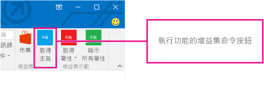
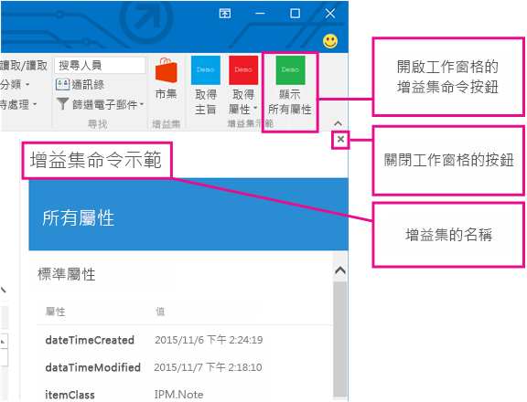
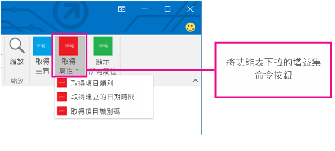

# Outlook 的增益集命令

藉由加入按鈕或下拉式功能表，Outlook 增益集命令提供從功能區初始化特定增益集動作的方式。這可讓使用者以簡單、直覺化又不礙眼的方式存取增益集。因為是以順暢的方式提供增強的功能，您可以使用增益集命令來建立更吸引人的解決方案。

> **附註**：增益集命令只適用於 Windows 的 Outlook 2016 和 Outlook 2013。增益集命令的支援需要 [2016 年 3 月 8 日安全性更新](https://support.microsoft.com/en-us/kb/3114829)。

增益集命令只適用於未使用 [temHasAttachment、ItemHasKnownEntity 或 ItemHasRegularExpressionMatch 規則](manifests/activation-rules.md)來限制他們啟動的項目類型的內容相關式增益集。不過，內容相關式增益集可以根據目前選取的項目是郵件或約會來呈現不同的命令，而且可以選擇顯現在讀取或撰寫案例中。如果可能的話，使用增益集命令是[最佳作法](../../docs/overview/add-in-development-best-practices.md)。

## 建立增益集命令

增益集命令是在增益集清單的 **VersionOverrides** 元素中宣告。這個元素是可確保回溯相容性的資訊清單結構描述 1.1 版的新增項目。在不支援 **VersionOverrides** 的用戶端中，現有增益集將繼續如往常沒有增益集命令般運作。

**VersionOverrides** 資訊清單項目會指定增益集的許多項目，例如主應用程式、要加入至功能區的控制項類型、文字、圖示和任何相關聯的函式。如需詳細資訊，請參閱[定義 Outlook 增益集資訊清單中的增益集命令](../outlook/manifests/define-add-in-commands.md)。 

當增益集需要提供狀態更新，例如：進度指示器或錯誤訊息時，必須透過[通知 API](../../reference/outlook/NotificationMessages.md) 執行此動作。通知的處理也必須在資訊清單的 **FunctionFile** 節點中所指定的不同 HTML 檔案中定義。

開發人員應該定義所有所需大小的圖示，使得增益集命令將順暢地隨著功能區調整。圖示大小是 80 x 80 像素、32 x 32 像素和 16 x 16 像素。

## 增益集命令的顯示方式？

增益集命令會在功能區上顯示為按鈕。當使用者安裝增益集時，它的命令會以標示了增益集名稱的一組按鈕形式出現在 UI 中。這可以是在功能區的預設索引標籤或在自訂索引標籤上。對於郵件，預設值是 [首頁] 或 [訊息] 索引標籤。對於行事曆，預設值是 [會議]、[會議項目]、[會議系列] 或 [約會] 索引標籤。針對模組延伸模組，預設值是自訂索引標籤。在預設索引標籤上，每個增益集可以有一個含有最多 6 個命令的功能區群組。在自訂索引標籤上，增益集最多可以有 10 個群組，每個有 6 個命令。增益集僅限於一個自訂索引標籤。

隨著功能區變得太過擁擠時，增益集命令將會以有條理的方式來調整 (摺疊)。在所有情況下，增益集的增益集命令會群組在一起。

當增益集命令加入至增益集時，會從應用程式列移除增益集名稱，除非增益集也包含[自訂窗格 Outlook 增益集](../outlook/custom-pane-outlook-add-ins.md)。只會保留功能區上的增益集命令按鈕。

## 增益集命令存在哪些 UX 形狀？

增益集命令的 UX 形狀的組成包含主應用程式中的功能區索引標籤，其中包含可以執行各種功能的按鈕。目前，支援三個 UI 形狀︰

- 執行 JavaScript 函式的按鈕
        
- 顯示下拉式功能表，其中具有另兩種類型的一或多個按鈕的按鈕

此外，內容相關式增益集支援︰ 
- 會啟動工作窗格的按鈕

### 執行 JavaScript 函式

針對使用者不需要作任何其他的選擇即可初始化動作的情況，使用可執行 JavaScript 函式的增益集命令按鈕。這可以是動作，例如：追蹤、提醒我或列印，或是使用者需要服務的更深入資訊的案例。 

在模組副檔名中，增益集命令按鈕可以執行與主要使用者介面中的內容互動的 JavaScript 函式。

### 啟動工作窗格

針對使用者需要與增益集互動一段長時間的情況，使用增益集命令按鈕來啟動工作窗格。例如，增益集需要變更設定或完成許多功能變數。 

垂直工作窗格的預設寬度為 300 像素。可以在 Outlook 檔案總管及檢查程式中調整垂直工作窗格的大小。可以透過調整待辦事項窗格和清單檢視大小的相同方式調整窗格的大小。

這個螢幕擷取畫面顯示垂直工作窗格的範例。窗格會開啟，左上角會顯示增益集命令的名稱。使用者在完成使用它時，可以使用窗格右上角的 **X** 按鈕來關閉增益集。此窗格不會在各郵件間保存。工作窗格中轉譯的所有 UI 元素，除了增益集的名稱和關閉按鈕，都是由增益集提供。

如果使用者選擇可開啟工作窗格的另一個增益集命令，則工作窗格會由最近使用的命令取代。如果使用者在工作窗格開啟時，選擇會執行函式的增益集命令按鈕或下拉式清單功能表，動作將會完成，並且工作窗格會維持開啟。

### 下拉功能表

定義按鈕靜態清單的下拉功能表增益集命令。功能表內的按鈕可以是執行函式或可開啟工作窗格之按鈕的按鈕任意組合。不支援子功能表。

## 增益集命令出現在 UI 中的位置？

增益集命令可支援四個案例︰

### 讀取郵件

當使用者正在讀取郵件，在讀取窗格中檢視郵件時，增益集命令會加入至出現在 [首頁] 索引標籤上的預設索引標籤，以及在蹦現的讀取表單的 [郵件] 索引標籤中。

### 撰寫郵件

當使用者正在撰寫郵件時，增益集命令會加入至出現在 [郵件] 索引標籤上的預設索引標籤。

### 以召集人的身分建立或檢視約會或會議

以召集人身分建立或檢視約會或會議時，加入到預設索引標籤的增益集命令，會顯示在 [會議]、[會議項目]、[會議系列] 或 [約會] 索引標籤的快顯表單上。不過，如果使用者在行事曆中選取一個項目，但未開啟快顯，增益集的功能區群組即不會在功能區中顯示。

### 以出席者身分檢視會議

以出席者身分檢視會議時，加入到預設索引標籤的增益集命令，會顯示在 [會議]、[會議項目] 或 [會議系列] 索引標籤的快顯表單上。不過，如果使用者在行事曆中選取一個項目，但未開啟快顯，增益集的功能區群組即不會在功能區中顯示

### 使用模組副檔名

使用模組副檔名時，增益集命令會顯示在副檔名的自訂索引標籤上。

## 其他資源

- [在 Outlook 增益集資訊清單中定義增益集命令](../outlook/manifests/define-add-in-commands.md)
    
- [增益集命令示範 Outlook 增益集](https://github.com/jasonjoh/command-demo)
    
