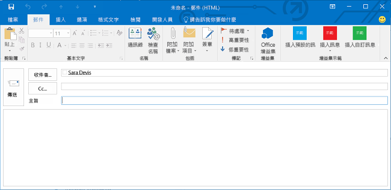
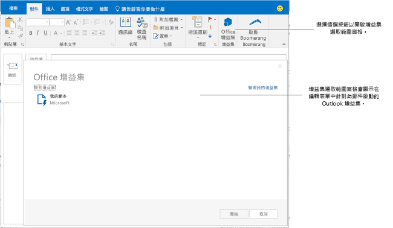

# 建立撰寫格式的 Outlook 增益集

自 Office 增益集資訊清單的 1.1 版結構描述和 1.1 版的 office.js 起，您可以建立撰寫增益集，也就是撰寫表單中啟動的 Outlook 增益集。相對於讀取增益集 (當使用者在檢視郵件或約會時，在讀取模式中啟動的 Outlook 增益集)，撰寫增益集在下列使用者案例中可供使用︰

- 在撰寫表單中撰寫新郵件、會議邀請或約會。
    
- 檢視或編輯現有的約會，或使用者為其是召集人的會議項目。
    
     >**附註**  如果使用者環境為 Outlook 2013 和 Exchange 2013 RTM 版本，並且正在檢視由使用者安排的會議項目，使用者可以使用讀取增益集。在相同的案例中，從 Office 2013 SP1 版本開始已變更為，僅撰寫增益集可以啟動且可以使用。
- 撰寫內嵌回應郵件，或在個別撰寫表單中回覆郵件。
    
- 編輯會議要求或會議項目的回覆 (**接受**、**暫訂**，或**拒絕**)。
    
- 提議會議項目的新開會時間。
    
- 轉寄或回覆會議邀請或會議項目。
    
在每一種撰寫案例中，會顯示增益集所定義的任何增益集指令按鈕。對於不會實作增益集命令舊的增益集，使用者可以選擇功能區中的 **Office 增益集**以開啟 [增益集選取範圍] 窗格，接著選擇並開始撰寫增益集。下圖顯示撰寫表單中的增益集命令。

下圖顯示由兩個不會實作增益集命令的撰寫增益集所組成的增益集選擇窗格，當使用者在 Outlook 中撰寫內嵌回覆時會啟動。

## 可在撰寫模式中使用的增益集類型

撰寫增益集實做為 [Outlook 的增益集命令](../outlook/add-in-commands-for-outlook.md)。

## 可用來撰寫增益集的 API 功能

- 如需在撰寫表單啟動增益集，請參閱[指定資訊清單中的啟動規則](../outlook/manifests/activation-rules.md#specify-activation-rules-in-a-manifest)中的表 1。
    
- [在 Outlook 中新增及移除撰寫格式項目的附件](../outlook/add-and-remove-attachments-to-an-item-in-a-compose-form.md)
    
- [在 Outlook 中取得並設定撰寫格式的項目資料](../outlook/get-and-set-item-data-in-a-compose-form.md)
    
- [在 Outlook 中撰寫約會或郵件時，取得、設定或新增收件者。](../outlook/get-set-or-add-recipients.md)
    
- [在 Outlook 中撰寫約會或郵件時，取得或設定主旨](../outlook/get-or-set-the-subject.md)
    
- [在 Outlook 中撰寫約會或郵件時，在本文中插入資料](../outlook/insert-data-in-the-body.md)
    
- [在 Outlook 中撰寫約會時，取得或設定位置](../outlook/get-or-set-the-location-of-an-appointment.md)
    
- [在 Outlook 中撰寫約會時，取得或設定時間](../outlook/get-or-set-the-time-of-an-appointment.md)
    
- [Outlook-Power-Hour_Code-Samples](https://github.com/OfficeDev/Outlook-Power-Hour-Code-Samples):  `ComposeAppDemo`
    

## 其他資源

- [開始使用 Office 365 的 Outlook 增益集](https://dev.outlook.com/MailAppsGettingStarted/GetStarted)
    
- [Outlook 增益集](../outlook/outlook-add-ins.md)
    
