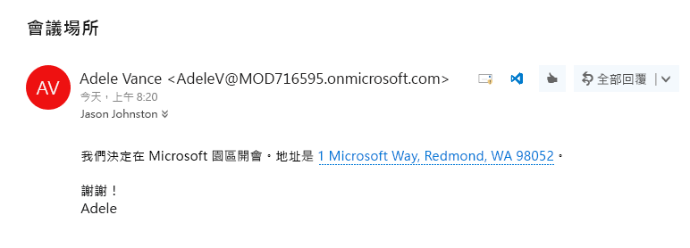
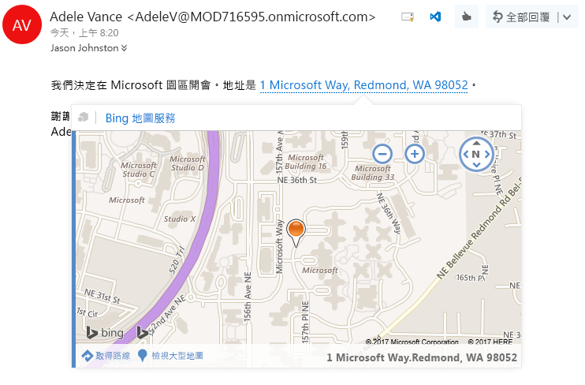

# <a name="contextual-outlook-add-ins"></a>關聯式 Outlook 增益集

關聯式增益集是根據郵件或約會中的文字啟動的 Outlook 增益集。藉由使用關聯式增益集，使用者可以啟始與郵件相關的工作，而不需要離開郵件本身，這可產生更輕鬆、更豐富的使用者經驗。

以下是關聯式增益集的範例：

- 選擇要開啟位置地圖的地址。
- 選擇開啟會議建議增益集的字串。
- 選擇要新增至您連絡人的電話號碼。

## <a name="how-to-make-a-contextual-add-in"></a>如何製作關聯式增益集

關聯式增益集的資訊清單必須包含 [ExtensionPoint](../../reference/manifest/extensionpoint.md) 元素，並且將 `xsi:type` 屬性設定為 `DetectedEntity`。在 **ExtensionPoint** 元素內，增益集會指定可以啟動它的實體或規則運算式。如果指定實體，實體可以是 [Entities](../../reference/outlook/simple-types.md) 物件中的任何屬性，**`EmailAddress`或 `Url`除外。因此，增益集資訊清單必須包含 **ItemHasKnownEntity** 或 **ItemHasRegularExpressionMatch** 類型的規則。下列範例顯示如何指定電話號碼的實體︰

```XML
<Rule xsi:type="ItemHasKnownEntity" EntityType="PhoneNumber" Highlight="all" />
```

關聯式增益集與帳戶相關聯後，當使用者按一下反白顯示的實體或規則運算式時會自動啟動。如需有關 Outlook 增益集的規則運算式的詳細資訊，請參閱[使用規則運算式的啟用規則來顯示 Outlook 增益集](../outlook/use-regular-expressions-to-show-an-outlook-add-in.md)。

關聯式增益集有數個限制︰

- 關聯式增益集只能存在於讀取增益集 (非撰寫增益集)。
- 您無法指定反白顯示實體的色彩。
- 未反白顯示的實體不會在卡片中啟動關聯式增益集。

因為未反白顯示的實體或規則運算式不會啟動關聯式增益集，增益集必須包含至少一個 `Rule` 元素，且 `Highlight` 屬性設定為 `all` 或 `first`。

## <a name="how-to-launch-a-contextual-add-in"></a>如何啟動關聯式增益集

使用者透過文字 (已知的實體或開發人員的規則運算式) 啟動關聯式增益集。一般而言，使用者因為實體反白顯示而識別關聯式增益集。下列範例顯示反白顯示在郵件中出現的方式。在這裡實體 (位址) 的色彩為藍色並加藍色虛線的底線。使用者按一下反白顯示的實體即可啟動關聯式增益集。 

**具有反白顯示實體 (位址) 的文字範例**


    
當郵件中有多個實體或關聯式增益集時，會有幾個使用者互動的規則︰

- 如果有多個實體，使用者必須按一下不同的實體以為其啟動增益集。
- 如果實體啟動多個增益集，則每個增益集會開啟新的索引標籤。使用者在索引標籤之間切換 (類似增益集列) 以在增益集之間進行變更。例如，姓名和地址可能會觸發電話增益集和地圖。
- 如果單一字串中包含啟動多個增益集的多個實體，則會反白顯示整個字串，且按一下字串會在個別的索引標籤上顯示所有與字串相關的增益集。例如，描述在餐廳裡的提議會議的字串，可能會啟動「建議的會議」增益集和餐廳評等增益集。

## <a name="how-a-contextual-add-in-displays"></a>關聯式增益集的顯示方式

已啟動的關聯式增益集會在卡片中顯示，也就是靠近實體的不同視窗。卡片通常會出現在實體下方，並盡可能置中對齊實體。如果實體下方沒有足夠的空間，卡片會放置在其上方。以下螢幕擷取畫面顯示反白顯示的實體，且在其下方為卡片中啟動的增益集 (Bing 地圖服務)。

**在卡片中顯示增益集的範例**



若要關閉卡片並結束增益集，使用者需按一下卡片外部的任意處。

## <a name="current-contextual-add-ins"></a>關聯式增益集

依預設會為具有 Outlook 增益集的使用者安裝下列關聯式增益集︰

- Bing 地圖服務 
- 建議的會議

## <a name="additional-resources"></a>其他資源

- [開始使用 Office 365 的 Outlook 增益集](https://dev.outlook.com/MailAppsGettingStarted/GetStarted.aspx)
- [使用規則運算式的啟用規則來顯示 Outlook 增益集](../outlook/use-regular-expressions-to-show-an-outlook-add-in.md)
- [實體物件](../../reference/outlook/simple-types.md)
