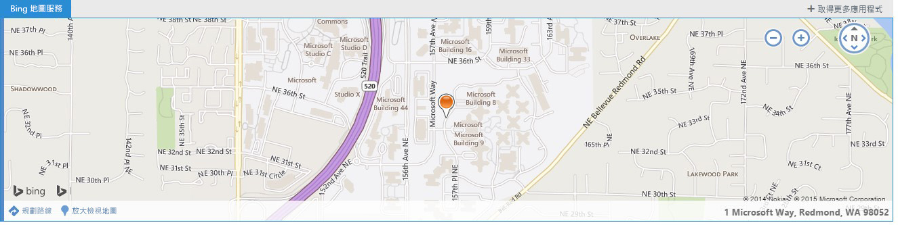

# 關聯式 Outlook 增益集

關聯式增益集是根據郵件或約會中的文字啟動的 Outlook 增益集。藉由使用關聯式增益集，使用者可以啟始與郵件相關的工作，而不需要離開郵件本身，這可產生更輕鬆、更豐富的使用者經驗。

關聯式增益集與增益集不同，其包含附件或專屬於特定的郵件類型。以下是關聯式增益集的範例：


- 選擇要開啟位置地圖的地址。
    
- 選擇開啟會議建議增益集的字串。
    
- 選擇要新增至您連絡人的電話號碼。
    
目前，關聯式增益集僅限於 Outlook Web App。

## 如何製作關聯式增益集

若要製作關聯式增益集，其增益集資訊清單必須指定可啟動它的實體或規則運算式。實體可以是 [Entities](../../reference/outlook/simple-types.md) 物件中的任何屬性。因此，增益集資訊清單必須包含 **ItemHasKnownEntity** 或 **ItemHasRegularExpressionMatch**類型的規則。下列範例顯示如何指定電話號碼的實體︰


```XML
<Rule xsi:type="ItemHasKnownEntity" EntityType="PhoneNumber"/>

```

關聯式增益集與帳戶相關聯後，當使用者按一下反白顯示的實體或規則運算式時會自動啟動。如需有關 Outlook 增益集的規則運算式的詳細資訊，請參閱[使用規則運算式的啟用規則來顯示 Outlook 增益集](../outlook/use-regular-expressions-to-show-an-outlook-add-in.md)。

關聯式增益集有數個限制︰


- 關聯式增益集只能存在於讀取增益集 (非撰寫增益集)。
    
- 您無法指定反白顯示實體的色彩。
    
- 未反白顯示的實體不會在卡片中啟動關聯式增益集。
    
- 卡片的維度是高度 140 到 450 像素 (建議限制為 300 像素) 及寬度 570 像素。
    
- 您不能指定增益集是否會在卡片或增益集列中顯示。
    

## 如何啟動關聯式增益集

使用者透過文字 (已知的實體或開發人員的規則運算式) 或藉由增益集列啟動關聯式增益集。一般而言，使用者因為實體反白顯示而識別關聯式增益集。下列範例顯示反白顯示在郵件中出現的方式。在這裡實體 (位址) 的色彩為藍色並加藍色虛線的底線。使用者按一下反白顯示的實體即可啟動關聯式增益集。 


**具有反白顯示實體 (位址) 的文字範例**


雖然反白顯示是關聯式增益集的最佳指示，但也有一些案例會在增益集列中顯示關聯式增益集：

- 當實體為 URL 或電子郵件地址時
    
- 當增益集資訊清單具有包含 type="ItemHasRegularExpressionMatch" 和 PropertyName="BodyAsHTML" 或 PropertyName="SenderSMTPAddress" 的規則時
    
- 當增益集資訊清單包含使用 OR RuleCollection (當中第一個規則具有 type="ItemIs" 與 itemType="Appointment" 或 "Message"，且當中第二個規則具有 type="ItemHasKnownEntity" 或 "ItemHasRegularExpressionMatch") 的啟動規則時
    
- 如果電子郵件本文的複雜性會影響郵件用戶端
    
當郵件中有多個實體或關聯式增益集時，會有幾個使用者互動的規則︰


- 如果有多個實體，使用者必須按一下不同的實體以為其啟動增益集。
    
- 如果實體啟動多個增益集，則每個增益集會開啟新的索引標籤。使用者在索引標籤之間切換 (類似增益集列) 以在增益集之間進行變更。例如，姓名和地址可能會觸發電話增益集和地圖。
    
- 如果單一字串中包含啟動多個增益集的多個實體，則會反白顯示整個字串，且按一下字串會在個別的索引標籤上顯示所有與字串相關的增益集。例如，描述在餐廳裡的提議會議的字串，可能會啟動「建議的會議」增益集和餐廳評等增益集。
    

## 關聯式增益集的顯示方式

啟動的關聯式增益集會出現在兩個位置其中之一︰


- 在卡片中，其為靠近實體的個別視窗
    
- 在增益集列中，其為寄件者和郵件本文的分隔線
    
卡片通常會出現在實體下方，並盡可能置中對齊實體。如果實體下方沒有足夠的空間，卡片會放置在其上方。以下螢幕擷取畫面顯示反白顯示的實體，且在其下方為卡片中啟動的增益集 (Bing 地圖服務)。


**在卡片中顯示增益集的範例**


注意下列事項：

- [Bing 地圖服務] 索引標籤會以藍色背景的白色文字形式出現。如果選取新的增益集，索引標籤會變更為白色背景與藍色文字。
    
- 其他增益集索引標籤 (如果有的話) 會出現在「Bing 地圖服務」右邊的白色背景與藍色文字的索引標籤中。當使用者按一下任何索引標籤時，它會變更為藍色背景與白色文字，並載入新的增益集。
    
- 按一下 [+ 取得更多增益集] 按鈕會開啟 Office 存放區。
    
- 如果增益集名稱對可用空間而言過大，它會在 [+ 取得更多增益集] 的左側以 "..." 取代。然後使用者可以按一下來查看不符合列的增益集的下拉式清單。
    
- 若要關閉卡片並結束增益集，使用者需按一下卡片外部的任意處。
    
以下螢幕擷取畫面顯示如果無法醒目提示文字 (例如，如果它包含在超連結中)，則相同的增益集 (此案例中為 Bing 地圖服務) 會如何顯示在列中。


**iframe 中的增益集列和增益集的範例**



注意下列事項：

- 在這個螢幕擷取畫面中，增益集列會顯示 iframe 上方的已啟動增益集名稱和 [+ 取得更多增益集]。如果有任何其他從增益集列啟動的增益集 (關聯式與否)，它們也將會出現。
    
- Iframe 會顯示增益集。開發人員可以設定 iframe 的高度，但寬度為固定的值。增益集列增益集會使用與卡片相同的高度；開發人員不需要指定兩個個別的高度。
    

## 關聯式增益集在不同裝置上的顯示方式

在桌面電腦上，關聯式增益集通常會顯示在卡片中；如果有多個增益集，則它們會出現於個別的索引標籤。在平板電腦上，相同的增益集會顯示在 overleaf 上，而 (如果有多個增益集) 它們會出現在索引標籤中。在電話上，增益集會顯示為沈浸式經驗。在有多個增益集已在實體上啟動的情況下，"..." 會顯示在右上方，讓使用者在特定實體上不同的增益集之間進行瀏覽。


## 關聯式增益集

依預設會為具有 Outlook 增益集的使用者安裝下列關聯式增益集︰


- Bing 地圖服務 
    
- 建議的會議
    
此外，可從 Office 市集取得 [Package Tracker](https://store.office.com/package-tracker-WA104162083.aspx?assetid=WA104162083.aspx) 關聯式增益集。


## 其他資源


- [開始使用 Office 365 的 Outlook 增益集](https://dev.outlook.com/MailAppsGettingStarted/GetStarted.aspx)
    
- [使用規則運算式的啟用規則來顯示 Outlook 增益集](../outlook/use-regular-expressions-to-show-an-outlook-add-in.md)

- [實體物件](../../reference/outlook/simple-types.md)
    
