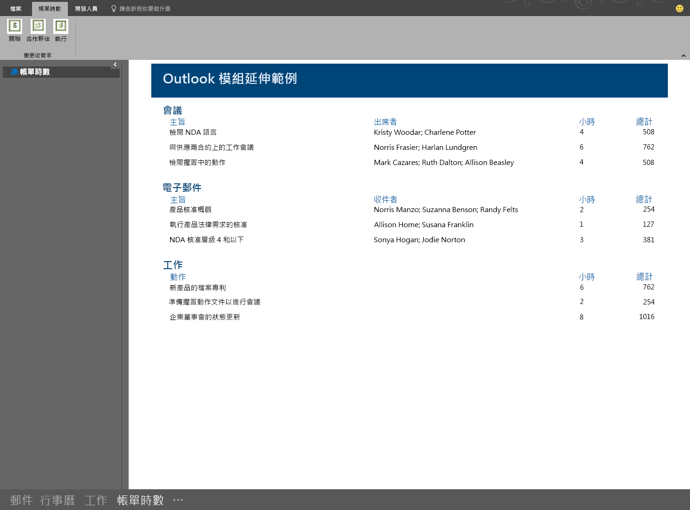

# 模組延伸 Outlook 增益集

模組擴充增益集會出現在 Outlook 的導覽列中，就在郵件、工作和行事曆旁。 模組擴充不限於使用郵件與約會的資訊；您可以建立 Outlook 內執行的應用程式，讓使用者能輕鬆取得商務資訊與生產力工具，而完全不需離開 Outlook。

> **附註**：模組擴充只適用於 Office 2016。

若要開啟模組擴充，使用者按一下 Outlook 導覽列中的模組名稱或圖示。 如果使用者選取了精簡導覽，導覽列就會有一個圖示顯示已載入擴充。

如果使用者未使用精簡導覽，導覽列會有兩種外觀，載入一個擴充的外觀會顯示增益集的名稱。

載入多個增益集時，即會顯示文字「增益集」。按一下將會開啟擴充的使用者介面。

當您按一下擴充時，Outlook 會將內建的模組取代為您自訂的模組，使用者就能夠與增益集互動。 您可以使用增益集中 Outlook JavaScript API 的所有功能，且能夠在 Outlook 功能區中建立命令按鈕，這些按鈕將會與增益集內容互動。 此範例增益集會整合在 Outlook 的導覽列以及其擁有的功能區命令將會更新增益集的內容。

以下是定義模組擴充的資訊清單檔案部分。

    <!-- Add Outlook module extension point -->
    <VersionOverrides xmlns="http://schemas.microsoft.com/office/mailappversionoverrides"
                      xsi:type="VersionOverridesV1_0">
       <VersionOverrides xmlns="http://schemas.microsoft.com/office/mailappversionoverrides/1.1"
                         xsi:type="VersionOverridesV1_1">

         <!-- Begin override of existing elements -->
         <Description resid="residVersionOverrideDesc" />
    
         <Requirements>
           <bt:Sets DefaultMinVersion="1.3">
              <bt:Set Name="Mailbox" />
            </bt:Sets>
          </Requirements>
          <!-- End override of existing elements -->

          <Hosts>
            <Host xsi:type="MailHost">
              <DesktopFormFactor>
                <!-- Set the URL of the file that contains the
                     JavaScript function that controls the extension -->
                <FunctionFile resid="residFunctionFileUrl" />
    
                <!--New Extension Point - Module for a ModuleApp -->
                <ExtensionPoint xsi:type="Module">
                  <SourceLocation resid="residExtensionPointUrl" />
                  <Label resid="residExtensionPointLabel" />
    
                  <CommandSurface>
                    <CustomTab id="idTab">
                      <Group id="idGroup">
                        <Label resid="residGroupLabel" />
    
                        <Control xsi:type="Button" id="group.changeToAssociate">
                          <Label resid="residChangeToAssociateLabel" />
                          <Supertip>
                            <Title resid="residChangeToAssociateLabel" />
                            <Description resid="residChangeToAssociateDesc" />
                          </Supertip>
                          <Icon>
                            <bt:Image size="16" resid="residAssociateIcon16" />
                            <bt:Image size="32" resid="residAssociateIcon32" />
                            <bt:Image size="80" resid="residAssociateIcon80" />
                          </Icon>
                          <Action xsi:type="ExecuteFunction">
                            <FunctionName>changeToAssociateRate</FunctionName>
                          </Action>
                        </Control>
                        
                    </Group>
                      <Label resid="residCustomTabLabel" />
                    </CustomTab>
                  </CommandSurface>
                </ExtensionPoint>
              </DesktopFormFactor>
            </Host>
          </Hosts>
    
          <Resources>
            <bt:Images>
              <bt:Image id="residAddinIcon16" 
                        DefaultValue="https://localhost:8080/Executive-16.png" />
              <bt:Image id="residAddinIcon32" 
                        DefaultValue="https://localhost:8080/Executive-32.png" />
              <bt:Image id="residAddinIcon80" 
                        DefaultValue="https://localhost:8080/Executive-80.png" />
            
              <bt:Image id="residAssociateIcon16" 
                        DefaultValue="https://localhost:8080/Associate-16.png" />
              <bt:Image id="residAssociateIcon32" 
                        DefaultValue="https://localhost:8080/Associate-32.png" />
              <bt:Image id="residAssociateIcon80" 
                        DefaultValue="https://localhost:8080/Associate-80.png" />
            </bt:Images>
    
            <bt:Urls>
              <bt:Url id="residFunctionFileUrl" 
                      DefaultValue="https://localhost:8080/" />
              <bt:Url id="residExtensionPointUrl" 
                      DefaultValue="https://localhost:8080/" />
            </bt:Urls>
    
            <!--Short strings must be less than 30 characters long -->
            <bt:ShortStrings>
              <bt:String id="residExtensionPointLabel" 
                         DefaultValue="Billable Hours" />
              <bt:String id="residGroupLabel" 
                         DefaultValue="Change billing rate" />
              <bt:String id="residCustomTabLabel" 
                         DefaultValue="Billable hours" />
    
              <bt:String id="residChangeToAssociateLabel" 
                         DefaultValue="Associate" />
            </bt:ShortStrings>
    
            <bt:LongStrings>
              <bt:String id="residVersionOverrideDesc" 
                         DefaultValue="Version override description" />
    
              <bt:String id="residChangeToAssociateDesc" 
                         DefaultValue="Change to the associate billing rate: $127/hr" />
            </bt:LongStrings>
          </Resources>
        </VersionOverrides>
      </VersionOverrides>

## 其他資源

* [Outlook 增益集資訊清單](manifests/manifests.md)
* [在 Outlook 增益集資訊清單中定義增益集命令](manifests/define-add-in-commands.md)
* [Outlook 模組擴充計費時間範例](https://github.com/OfficeDev/Outlook-Add-in-JavaScript-ModuleExtension)
