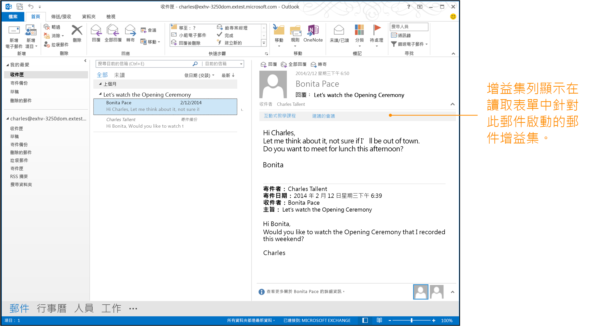


# <a name="activation-rules-for-outlook-add-ins"></a>Outlook 增益集的啟用規則

如果使用者讀取或撰寫的郵件或約會符合增益集的啟動規則，Outlook 將啟動某些類型的增益集。這適用於使用 1.1 版資訊清單結構描述的所有增益集，以及自訂窗格增益集。使用者接著可從 Outlook UI 中選擇增益集，為目前的項目啟動它。

下圖顯示為 [讀取窗格] 中訊息，而在增益集列中啟動的 Outlook 增益集。 




## <a name="specify-activation-rules-in-a-manifest"></a>指定資訊清單中的啟動規則


若要讓 Outlook 啟動特定條件的增益集，請使用下列其中一項**Rule** 元素來指定增益集資訊清單中的啟動規則︰

- [規則元素 (MailApp complexType)](../../../reference/manifest/rule.md) - 指定個別規則。
- [規則元素 (RuleCollection complexType)](#rulecollection-rule) -使用邏輯運算結合多個規則。
    

 > **附註：**您使用來指定個別規則的 **Rule** 元素屬於抽象元素 [Rule](../../../reference/manifest/rule.md)複雜類型。下列每個類型的規則會延伸此抽象 **Rule** 複雜類型。因此當您指定資訊清單中的個別規則時，必須使用 [xsi:type](http://www.w3.org/TR/xmlschema-1/) 屬性來進一步定義下列其中一個規則類型。例如，下列規則定義 [ItemIs](#itemis-rule) 規則︰`<Rule xsi:type="ItemIs" ItemType="Message" />` **FormType** 屬性套用至資訊清單的 v1.1 中的啟動規則，但不在 **VersionOverrides v1.0** 中定義。因此當 [ItemIs](#itemis-rule) 使用於 **VersionOverrides** 節點時，就無法使用它。

下表列出可用的規則類型。您可以依照表格，或在[建立讀取表單的 Outlook 增益集](../../outlook/read-scenario.md)下指定的文章中找到更多資訊。


|**規則名稱**|**適用的表單**|**描述**|
|:-----|:-----|:-----|
|[ItemIs](#itemis-rule)|閱讀、撰寫、自訂窗格|檢查目前的項目是否屬於指定的類型 (郵件或約會)。也可以檢查項目類別及表單類型，並選擇性地檢查項目郵件類別。|
|[ItemHasAttachment](#itemhasattachment-rule)|閱讀、自訂窗格|檢查選取的項目是否包含附件。|
|[ItemHasKnownEntity](#itemhasknownentity-rule)|閱讀、自訂窗格|檢查選取的項目是否包含一或多個已知的實體。更多資訊：[使 Outlook 項目中的字串與已知的實體相符](../../outlook/match-strings-in-an-item-as-well-known-entities.md)。|
|[ItemHasRegularExpressionMatch](#itemhasregularexpressionmatch-rule)|閱讀、自訂窗格|檢查寄件者的電子郵件地址、主旨及/或選取的項目主體是否包含規則運算式的符合項。如果您需要更多資訊︰[使用規則運算式的啟用規則來顯示 Outlook 增益集](../../outlook/use-regular-expressions-to-show-an-outlook-add-in.md)。|
|[RuleCollection](#rulecollection-rule)|閱讀、撰寫、自訂窗格|結合一組規則，以便您可以形成更複雜的規則。|

## <a name="itemis-rule"></a>ItemIs 規則


如果目前的項目符合項目類型，**ItemIs** 複雜類型會定義評估為 **true** 的規則；如果項目郵件類別在規則中陳述，則其為選擇性。

在 **ItemIs** 規則的 **ItemType** 屬性中指定下列其中一個項目類型。您可以在資訊清單中指定一個以上的 **ItemIs** 規則。ItemType simpleType 定義支援 Outlook 增益集的 Outlook 項目類型。


|**值**|**描述**|
|:-----|:-----|
|**約會**|在 Outlook 行事曆中指定項目。這包括已回應和含有召集人和與會者的會議項目，或沒有召集人或出席者，且在行事曆上只有一個項目的約會。這會對應到 Outlook 中 IPM.Appointment 郵件類別。|
|**訊息**|指定下列其中一個通常在收件匣中收到的項目︰ <ul><li><p>電子郵件。這會對應到 Outlook 中的 IPM.Note 郵件類別。</p></li><li><p>會議邀請、回覆或取消。這會對應到以下 Outlook 中的郵件類別。</p><p>IPM.Schedule.Meeting.Request</p><p>IPM.Schedule.Meeting.Neg</p><p>IPM.Schedule.Meeting.Pos</p><p>IPM.Schedule.Meeting.Tent</p><p>IPM.Schedule.Meeting.Canceled</p></li></ul>|
**FormType**屬性是用來指定增益集應該啟動的模式 (閱讀或撰寫)。


 > **附註：** **FormType** 屬性是定義在結構描述 1.1 和更新版本，但不是在 **VersionOverrides v1.0** 中。定義自訂窗格的規則時不包含 **FormType** 屬性。

啟動增益集後，您可以使用 [mailbox.item](../../../reference/outlook/Office.context.mailbox.item.md) 屬性，在 Outlook 中取得目前選取的項目，及使用 [item.itemType](../../../reference/outlook/Office.context.mailbox.item.md) 屬性以取得目前項目的類型。

您可以選擇性地使用 **ItemClass** 屬性來指定項目的郵件類別，以及 **IncludeSubClasses** 屬性來指定當項目是指定類別的子類別時，規則是否應該為 **true**。

如需郵件類別的詳細資訊，請參閱[項目類型與訊息類別](http://msdn.microsoft.com/library/15b709cc-7486-b6c7-88a3-4a4d8e0ab292%28Office.15%29.aspx)。

下列範例是 **ItemIs** 規則，可讓使用者在閱讀郵件時，在 Outlook 增益集列中看到增益集：

```xml
<Rule xsi:type="ItemIs" ItemType="Message" FormType="Read" />
```

下列範例是 **ItemIs** 規則，可讓使用者在閱讀郵件或約會時，在 Outlook 增益集列中看到增益集。

```xml
<Rule xsi:type="RuleCollection" Mode="Or">
  <Rule xsi:type="ItemIs" ItemType="Message" FormType="Read" />
  <Rule xsi:type="ItemIs" ItemType="Appointment" FormType="Read" />
</Rule>
```


## <a name="itemhasattachment-rule"></a>ItemHasAttachment 規則


**ItemHasAttachment** 複雜類型定義一個規則，檢查選取的項目是否包含附件。

```xml
<Rule xsi:type="ItemHasAttachment" />
```


## <a name="itemhasknownentity-rule"></a>ItemHasKnownEntity 規則

將項目使用於增益集之前，伺服器會檢查它來決定主旨及本文是否包含其中一個已知實體的任何文字。如果找到其中任何實體，則會使用該項目的 **getEntities** 或 **getEntitiesByType** 方法，將它放在您存取的已知實體集合中。

您可以指定規則，方法是使用 **ItemHasKnownEntity** 複雜類型，在項目出現指定類型的實體時顯示增益集。您可以在 **ItemHasKnownEntity** 規則的 在 **EntityType** 屬性中指定下列已知實體：
-  地址
-  連絡人
-  EmailAddress
-  MeetingSuggestion
-  PhoneNumber
-  TaskSuggestion
-  URL
    
您可以在 **RegularExpression** 屬性中選擇性地納入規則運算式，僅在出現符合規則運算式的實體時才顯示增益集。若要取得 **ItemHasKnownEntity** 規則中指定的規則運算式的符合項，您可以為目前所選的 Outlook 項目使用 **getRegExMatches** 或 **getFilteredEntitiesByName** 方法。

下列範例顯示 **Rule** 元素集合，當郵件顯示其中一個指定的已知實體時會顯示增益集。

```xml
<Rule xsi:type="RuleCollection" Mode="Or">
    <Rule xsi:type="ItemHasKnownEntity" EntityType="Address" />
    <Rule xsi:type="ItemHasKnownEntity" EntityType="MeetingSuggestion" />
    <Rule xsi:type="ItemHasKnownEntity" EntityType="TaskSuggestion" />
</Rule>
```

下列範例顯示包含 **RegularExpression** 屬性的 **ItemHasKnownEntity** 規則，可在郵件中出現含有「contoso」字樣的 URL 時啟動增益集。


```xml
<Rule xsi:type="ItemHasKnownEntity" EntityType="Url" RegularExpression="contoso" />
```

如需有關啟動規則中實體的詳細資訊，請參閱[使 Outlook 項目中的字串與已知的實體相符](../../outlook/match-strings-in-an-item-as-well-known-entities.md)。


## <a name="itemhasregularexpressionmatch-rule"></a>ItemHasRegularExpressionMatch 規則


**ItemHasRegularExpressionMatch** 複雜類型定義一個規則，使用規則運算式來比對項目之指定屬性的內容。若在項目的指定屬性中找到符合規則運算式的文字，Outlook 就會啟動增益集列並顯示增益集。您可以使用物件的 **getRegExMatches** 或 **getRegExMatchesByName** 方法來表示目前選取的項目，以取得指定規則運算式的符合項。

下列範例顯示 **ItemHasRegularExpressionMatch**，可在選取的項目本文包含 "apple"、"banana" 或 "coconut" 時啟動增益集 (忽略大小寫)。

```xml
<Rule xsi:type="ItemHasRegularExpressionMatch" RegExName="fruits" RegExValue="apple|banana|coconut" pPropertyName="BodyAsPlaintext" IgnoreCase="true" />
```

如需有關使用 **ItemHasRegularExpressionMatch** 規則的詳細資訊，請參閱[使用規則運算式的啟用規則來顯示 Outlook 增益集](../../outlook/use-regular-expressions-to-show-an-outlook-add-in.md)。


## <a name="rulecollection-rule"></a>RuleCollection 規則


**RuleCollection** 複雜類型會將多個規則結合成單一規則。您可以指定集合中的規則是否應該使用 **Mode** 屬性來結合邏輯 OR 或邏輯 AND。

指定邏輯 AND 時，項目必須符合集合的所有指定規則才能顯示增益集。指定邏輯 OR 時，符合集合中任何指定規則的項目將顯示增益集。

您可以結合 **RuleCollection** 規則以形成複雜規則。以下範例會在使用者正在檢視約會或訊息項目，並在項目的主旨或本文包含位址時啟動增益集。

```xml
<Rule xsi:type="RuleCollection" Mode="And">
  <Rule xsi:type="RuleCollection" Mode="Or">
    <Rule xsi:type="ItemIs" ItemType="Message" FormType="Read" />
    <Rule xsi:type="ItemIs" ItemType="Appointment" FormType="Read"/>
  </Rule>
  <Rule xsi:type="ItemHasKnownEntity" EntityType="Address" />
</Rule>
```

以下範例會在使用者正在撰寫郵件，或當使用者正在檢視約會，且約會的主旨或本文包含位址時啟動增益集。

```xml
<Rule xsi:type="RuleCollection" Mode="Or"> 
  <Rule xsi:type="ItemIs" ItemType="Message" FormType="Edit" /> 
  <Rule xsi:type="RuleCollection" Mode="And">
    <Rule xsi:type="ItemIs" ItemType="Appointment" FormType="Read" />
    <Rule xsi:type="ItemHasKnownEntity" EntityType="Address" />
  </Rule> 
</Rule>
```


## <a name="limits-for-rules-and-regular-expressions"></a>規則和規則運算式的限制


若要提供使用 Outlook 增益集的滿意經驗，您應該遵循啟動和 API 使用方針。下表顯示規則運算式及規則的一般限制，但有不同主機的特定規則。如需詳細資訊，請參閱[適用於 Outlook 增益集的 JavaScript API 和啟動的限制](../../outlook/limits-for-activation-and-javascript-api-for-outlook-add-ins.md)和 [Outlook 增益集啟動的疑難排解](../../outlook/troubleshoot-outlook-add-in-activation.md)。

|**增益集元素**|**指導方針**|
|:-----|:-----|
|資訊清單大小|不大於 256 KB。|
|規則|不超過 15 個規則。|
|ItemHasKnownEntity|Outlook 豐富型用戶端將針對第一個 1 MB 本文套用規則，而不是本文的其餘部分。|
|規則運算式|使用所有 Outlook 主應用程式 的 For ItemHasKnownEntity 或 ItemHasRegularExpressionMatch 規則：<br><ul><li>在 Outlook 增益集的啟用規則中最多只能指定 5 個規則運算式。如果您超過該上限，則無法安裝增益集。</li><li>指定規則運算式使得您預期的結果會由前 50 個相符項目內的 <b>getRegExMatches</b> 方法呼叫傳回。 </li><li>在規則運算式中指定前查詢的判斷提示，而非後查詢 (?<=text) 及負後查詢 (?<!text)。</li><li>指定規則運算式使符合項目不會超過下面表格的限制。<br/><br/><table><tr><th>regex 符合項目的長度限制</th><th>Outlook 豐富型用戶端</th><th>適用於 Devices 的 Outlook Web App</th></tr><tr><td>項目本文是純文字</td><td>1.5 KB</td><td>3 KB</td></tr><tr><td>項目本文是 HTML</td><td>3 KB</td><td>3 KB</td></tr></table>|

## <a name="additional-resources"></a>其他資源

- [Outlook 增益集](../../outlook/outlook-add-ins.md)
- [建立撰寫格式的 Outlook 增益集](../../outlook/compose-scenario.md)
- [適用於 Outlook 增益集的 JavaScript API 和啟動的限制](../../outlook/limits-for-activation-and-javascript-api-for-outlook-add-ins.md)
-   [項目類型和郵件類別](http://msdn.microsoft.com/library/15b709cc-7486-b6c7-88a3-4a4d8e0ab292%28Office.15%29.aspx)
- [使用規則運算式的啟用規則來顯示 Outlook 增益集](../../outlook/use-regular-expressions-to-show-an-outlook-add-in.md)
- [使 Outlook 項目中的字串與已知的實體相符](../../outlook/match-strings-in-an-item-as-well-known-entities.md)
    
