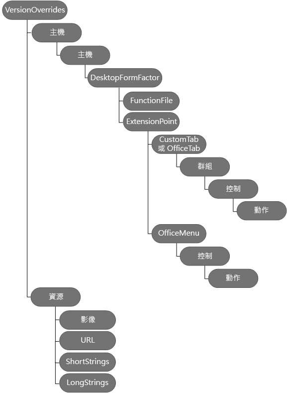

# 在資訊清單中定義增益集命令

增益集命令會提供簡單的方法來自訂預設 Office UI，其具有可執行動作的 UI 元素；例如，您可以在功能區上新增自訂按鈕。 若要建立命令，您可以將 **[VersionOverrides](../../../reference/manifest/versionoverrides.md)** 節點新增至現有的工作窗格資訊清單。 

當資訊清單含有 **VersionOverrides** 元素、支援增益集命令的 Word、Excel、Outlook 和 PowerPoint 版本會使用該元素內的資訊以載入增益集。 不支援增益集命令的舊版 Office 產品將會忽略元素。

當用戶端應用程式辨識 **VersionOverrides** 節點時，增益集名稱會出現在功能區，不會出現在工作窗格或閱讀/撰寫窗格中。 增益集不會出現在這兩個位置中。
 

## VersionOverrides 節點

[VersionOverrides](../../../reference/manifest/versionoverrides.md) 元素是根元素，包含增益集實作的增益集命令的資訊。 它是在資訊清單結構描述 1.1 版及更新版本支援，但在 VersionOverrides v1.0 結構描述中定義。 

VersionOverrides 元素包括下列子元素：

- [說明](../../../reference/manifest/description.md)
- [需求](../../../reference/manifest/requirements.md)
- [主應用程式](../../../reference/manifest/hosts.md)
- [資源](../../../reference/manifest/resources.md)

下圖顯示用來定義增益集命令的元素階層。 

## Outlook 增益集命令的規則變更

下列變更會影響資訊清單中的規則：

- 啟動規則現在位於每個進入點中。
    
- 已修改 [Rule](../../../reference/manifest/rule.md) 元素的 **ItemIs** 屬性。 **ItemType** 可以是訊息或 AppointmentAttendee。 **FormType** 屬性已移除。
    
- 已更新 [Rule](../../../reference/manifest/rule.md) 元素的 **ItemHasKnownEntity** 屬性以接受 EntityType 的字串。
    

## 範例資訊清單

如需實作 Word、Excel 和 PowerPoint 的增益集命令的範例資訊清單，請參閱[簡單增益集命令範例](https://github.com/OfficeDev/Office-Add-in-Commands-Samples/tree/master/Simple)。

如需實作 Outlook 的增益集命令的範例資訊清單，請參閱 [Outlook 增益集的簡單資訊清單檔案](https://gist.github.com/mlafleur/95b7ac030bb7a7ae742527e85a36b095)。

## 其他資源

- [Outlook 的增益集命令](../../outlook/add-in-commands-for-outlook.md)
    
- [Outlook 增益集資訊清單](../../outlook/manifests/manifests.md)
    
- [Outlook 增益集命令示範範例](https://github.com/jasonjoh/command-demo)
