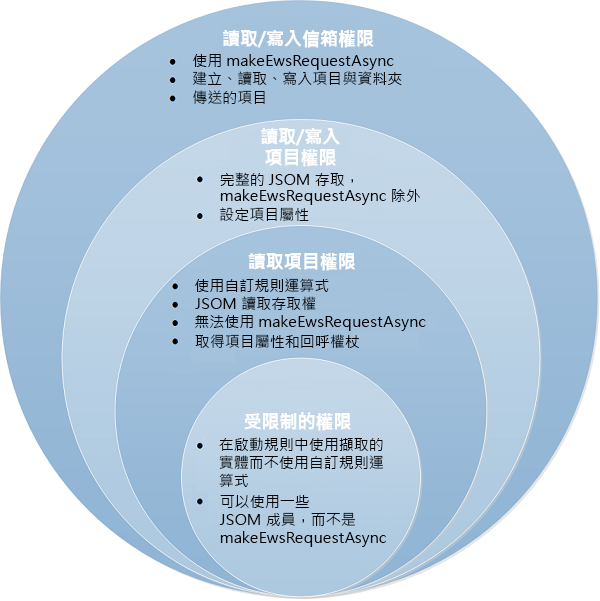

# <a name="outlook-add-in-manifests"></a>Outlook 增益集資訊清單

Outlook 增益集包含兩個元件︰XML 增益集清單和網頁，由 Office 的 JavaScript 程式庫增益集 (office.js) 所支援。資訊清單描述如何跨 Outlook 用戶端整合增益集。目前有三個版本的資訊清單結構描述，包括 **VersionOverrides**。我們建議您使用資訊清單結構描述 1.1 版和 **VersionOverrides** 1.0 以建置增益集。以下為範例。

 >**附註**  下列範例的所有 URL 值以 "YOUR_WEB_SERVER" 開頭。這個值是預留位置。在實際的有效資訊清單中，這些值會包含有效的 https Web URL。


```XML
<?xml version="1.0" encoding="UTF-8" ?>
<!--Created:cb85b80c-f585-40ff-8bfc-12ff4d0e34a9-->
<OfficeApp
  xmlns="http://schemas.microsoft.com/office/appforoffice/1.1"
  xmlns:xsi="http://www.w3.org/2001/XMLSchema-instance"
  xmlns:bt="http://schemas.microsoft.com/office/officeappbasictypes/1.0"
  xmlns:mailappor="http://schemas.microsoft.com/office/mailappversionoverrides/1.0"
  xsi:type="MailApp">
  <Id>7164e750-dc86-49c0-b548-1bac57abdc7c</Id>
  <Version>1.0.0.0</Version>
  <ProviderName>Microsoft Outlook Dev Center</ProviderName>
  <DefaultLocale>en-US</DefaultLocale>
  <DisplayName DefaultValue="Add-in Command Demo" />
  <Description DefaultValue="Adds command buttons to the ribbon in Outlook"/>
  <IconUrl DefaultValue="YOUR_WEB_SERVER/images/blue-64.png" />
  <HighResolutionIconUrl DefaultValue="YOUR_WEB_SERVER/images/blue-80.png" />
  <Hosts>
    <Host Name="Mailbox" />
  </Hosts>
  <Requirements>
    <Sets>
      <Set Name="MailBox" MinVersion="1.1" />
    </Sets>
  </Requirements>
  <!-- These elements support older clients that don't support add-in commands -->
  <FormSettings>
    <Form xsi:type="ItemRead">
      <DesktopSettings>
        <!-- NOTE: Just reusing the read taskpane page that is invoked by the button
             on the ribbon in clients that support add-in commands. You can 
             use a completely different page if desired -->
        <SourceLocation DefaultValue="YOUR_WEB_SERVER/AppRead/TaskPane/TaskPane.html"/>
        <RequestedHeight>450</RequestedHeight>
      </DesktopSettings>
    </Form>
    <Form xsi:type="ItemEdit">
      <DesktopSettings>
        <SourceLocation DefaultValue="YOUR_WEB_SERVER/AppCompose/Home/Home.html"/>
      </DesktopSettings>
    </Form>
  </FormSettings>
  <Permissions>ReadWriteItem</Permissions>
  <Rule xsi:type="RuleCollection" Mode="Or">
    <Rule xsi:type="ItemIs" ItemType="Message" FormType="Edit" />
    <Rule xsi:type="ItemIs" ItemType="Appointment" FormType="Edit" />
    <Rule xsi:type="ItemIs" ItemType="Message" FormType="Read" />
    <Rule xsi:type="ItemIs" ItemType="Appointment" FormType="Read" />
  </Rule>
  <DisableEntityHighlighting>false</DisableEntityHighlighting>

  <VersionOverrides xmlns="http://schemas.microsoft.com/office/mailappversionoverrides" xsi:type="VersionOverridesV1_0">

    <Requirements>
      <bt:Sets DefaultMinVersion="1.3">
        <bt:Set Name="Mailbox" />
      </bt:Sets>
    </Requirements>
    <Hosts>
        <Host Name="Mailbox" />
    </Hosts>
    <Requirements>
        <Sets>
            <Set Name="MailBox" MinVersion="1.1" />
        </Sets>
    </Requirements>
    <!-- These elements support older clients that don't support add-in commands -->
    <FormSettings>
        <Form xsi:type="ItemRead">
            <DesktopSettings>
                <!-- NOTE: Just reusing the read taskpane page that is invoked by the button
                     on the ribbon in clients that support add-in commands. You can
                     use a completely different page if desired -->
                <SourceLocation DefaultValue="YOUR_WEB_SERVER/AppRead/TaskPane/TaskPane.html" />
                <RequestedHeight>450</RequestedHeight>
            </DesktopSettings>
        </Form>
        <Form xsi:type="ItemEdit">
            <DesktopSettings>
                <SourceLocation DefaultValue="YOUR_WEB_SERVER/AppCompose/Home/Home.html" />
            </DesktopSettings>
        </Form>
    </FormSettings>
    <Permissions>ReadWriteItem</Permissions>
    <Rule xsi:type="RuleCollection" Mode="Or">
        <Rule xsi:type="ItemIs" ItemType="Message" FormType="Edit" />
        <Rule xsi:type="ItemIs" ItemType="Appointment" FormType="Edit" />
        <Rule xsi:type="ItemIs" ItemType="Message" FormType="Read" />
        <Rule xsi:type="ItemIs" ItemType="Appointment" FormType="Read" />
    </Rule>
    <DisableEntityHighlighting>false</DisableEntityHighlighting>

    <VersionOverrides xmlns="http://schemas.microsoft.com/office/mailappversionoverrides" xsi:type="VersionOverridesV1_0">

        <Requirements>
            <bt:Sets DefaultMinVersion="1.3">
                <bt:Set Name="Mailbox" />
            </bt:Sets>
        </Requirements>
        <Hosts>
            <Host xsi:type="MailHost">

                <DesktopFormFactor>
                    <FunctionFile resid="functionFile" />

                    <!-- Custom pane, only applies to read form -->
                    <ExtensionPoint xsi:type="CustomPane">
                        <RequestedHeight>100</RequestedHeight>
                        <SourceLocation resid="customPaneUrl" />
                        <Rule xsi:type="RuleCollection" Mode="Or">
                            <Rule xsi:type="ItemIs" ItemType="Message" />
                            <Rule xsi:type="ItemIs" ItemType="AppointmentAttendee" />
                        </Rule>
                    </ExtensionPoint>

                    <!-- Message compose form -->
                    <ExtensionPoint xsi:type="MessageComposeCommandSurface">
                        <OfficeTab id="TabDefault">
                            <Group id="msgComposeDemoGroup">
                                <Label resid="groupLabel" />
                                <!-- Function (UI-less) button -->
                                <Control xsi:type="Button" id="msgComposeFunctionButton">
                                    <Label resid="funcComposeButtonLabel" />
                                    <Supertip>
                                        <Title resid="funcComposeSuperTipTitle" />
                                        <Description resid="funcComposeSuperTipDescription" />
                                    </Supertip>
                                    <Icon>
                                        <bt:Image size="16" resid="blue-icon-16" />
                                        <bt:Image size="32" resid="blue-icon-32" />
                                        <bt:Image size="80" resid="blue-icon-80" />
                                    </Icon>
                                    <Action xsi:type="ExecuteFunction">
                                        <FunctionName>addDefaultMsgToBody</FunctionName>
                                    </Action>
                                </Control>
                                <!-- Menu (dropdown) button -->
                                <Control xsi:type="Menu" id="msgComposeMenuButton">
                                    <Label resid="menuComposeButtonLabel" />
                                    <Supertip>
                                        <Title resid="menuComposeSuperTipTitle" />
                                        <Description resid="menuComposeSuperTipDescription" />
                                    </Supertip>
                                    <Icon>
                                        <bt:Image size="16" resid="red-icon-16" />
                                        <bt:Image size="32" resid="red-icon-32" />
                                        <bt:Image size="80" resid="red-icon-80" />
                                    </Icon>
                                    <Items>
                                        <Item id="msgComposeMenuItem1">
                                            <Label resid="menuItem1ComposeLabel" />
                                            <Supertip>
                                                <Title resid="menuItem1ComposeLabel" />
                                                <Description resid="menuItem1ComposeTip" />
                                            </Supertip>
                                            <Icon>
                                                <bt:Image size="16" resid="red-icon-16" />
                                                <bt:Image size="32" resid="red-icon-32" />
                                                <bt:Image size="80" resid="red-icon-80" />
                                            </Icon>
                                            <Action xsi:type="ExecuteFunction">
                                                <FunctionName>addMsg1ToBody</FunctionName>
                                            </Action>
                                        </Item>
                                        <Item id="msgComposeMenuItem2">
                                            <Label resid="menuItem2ComposeLabel" />
                                            <Supertip>
                                                <Title resid="menuItem2ComposeLabel" />
                                                <Description resid="menuItem2ComposeTip" />
                                            </Supertip>
                                            <Icon>
                                                <bt:Image size="16" resid="red-icon-16" />
                                                <bt:Image size="32" resid="red-icon-32" />
                                                <bt:Image size="80" resid="red-icon-80" />
                                            </Icon>
                                            <Action xsi:type="ExecuteFunction">
                                                <FunctionName>addMsg2ToBody</FunctionName>
                                            </Action>
                                        </Item>
                                        <Item id="msgComposeMenuItem3">
                                            <Label resid="menuItem3ComposeLabel" />
                                            <Supertip>
                                                <Title resid="menuItem3ComposeLabel" />
                                                <Description resid="menuItem3ComposeTip" />
                                            </Supertip>
                                            <Icon>
                                                <bt:Image size="16" resid="red-icon-16" />
                                                <bt:Image size="32" resid="red-icon-32" />
                                                <bt:Image size="80" resid="red-icon-80" />
                                            </Icon>
                                            <Action xsi:type="ExecuteFunction">
                                                <FunctionName>addMsg3ToBody</FunctionName>
                                            </Action>
                                        </Item>
                                    </Items>
                                </Control>
                                <!-- Task pane button -->
                                <Control xsi:type="Button" id="msgComposeOpenPaneButton">
                                    <Label resid="paneComposeButtonLabel" />
                                    <Supertip>
                                        <Title resid="paneComposeSuperTipTitle" />
                                        <Description resid="paneComposeSuperTipDescription" />
                                    </Supertip>
                                    <Icon>
                                        <bt:Image size="16" resid="green-icon-16" />
                                        <bt:Image size="32" resid="green-icon-32" />
                                        <bt:Image size="80" resid="green-icon-80" />
                                    </Icon>
                                    <Action xsi:type="ShowTaskpane">
                                        <SourceLocation resid="composeTaskPaneUrl" />
                                    </Action>
                                </Control>
                            </Group>
                        </OfficeTab>
                    </ExtensionPoint>

                    <!-- Appointment compose form -->
                    <ExtensionPoint xsi:type="AppointmentOrganizerCommandSurface">
                        <OfficeTab id="TabDefault">
                            <Group id="apptComposeDemoGroup">
                                <Label resid="groupLabel" />
                                <!-- Function (UI-less) button -->
                                <Control xsi:type="Button" id="apptComposeFunctionButton">
                                    <Label resid="funcComposeButtonLabel" />
                                    <Supertip>
                                        <Title resid="funcComposeSuperTipTitle" />
                                        <Description resid="funcComposeSuperTipDescription" />
                                    </Supertip>
                                    <Icon>
                                        <bt:Image size="16" resid="blue-icon-16" />
                                        <bt:Image size="32" resid="blue-icon-32" />
                                        <bt:Image size="80" resid="blue-icon-80" />
                                    </Icon>
                                    <Action xsi:type="ExecuteFunction">
                                        <FunctionName>addDefaultMsgToBody</FunctionName>
                                    </Action>
                                </Control>
                                <!-- Menu (dropdown) button -->
                                <Control xsi:type="Menu" id="apptComposeMenuButton">
                                    <Label resid="menuComposeButtonLabel" />
                                    <Supertip>
                                        <Title resid="menuComposeSuperTipTitle" />
                                        <Description resid="menuComposeSuperTipDescription" />
                                    </Supertip>
                                    <Icon>
                                        <bt:Image size="16" resid="red-icon-16" />
                                        <bt:Image size="32" resid="red-icon-32" />
                                        <bt:Image size="80" resid="red-icon-80" />
                                    </Icon>
                                    <Items>
                                        <Item id="apptComposeMenuItem1">
                                            <Label resid="menuItem1ComposeLabel" />
                                            <Supertip>
                                                <Title resid="menuItem1ComposeLabel" />
                                                <Description resid="menuItem1ComposeTip" />
                                            </Supertip>
                                            <Icon>
                                                <bt:Image size="16" resid="red-icon-16" />
                                                <bt:Image size="32" resid="red-icon-32" />
                                                <bt:Image size="80" resid="red-icon-80" />
                                            </Icon>
                                            <Action xsi:type="ExecuteFunction">
                                                <FunctionName>addMsg1ToBody</FunctionName>
                                            </Action>
                                        </Item>
                                        <Item id="apptComposeMenuItem2">
                                            <Label resid="menuItem2ComposeLabel" />
                                            <Supertip>
                                                <Title resid="menuItem2ComposeLabel" />
                                                <Description resid="menuItem2ComposeTip" />
                                            </Supertip>
                                            <Icon>
                                                <bt:Image size="16" resid="red-icon-16" />
                                                <bt:Image size="32" resid="red-icon-32" />
                                                <bt:Image size="80" resid="red-icon-80" />
                                            </Icon>
                                            <Action xsi:type="ExecuteFunction">
                                                <FunctionName>addMsg2ToBody</FunctionName>
                                            </Action>
                                        </Item>
                                        <Item id="apptComposeMenuItem3">
                                            <Label resid="menuItem3ComposeLabel" />
                                            <Supertip>
                                                <Title resid="menuItem3ComposeLabel" />
                                                <Description resid="menuItem3ComposeTip" />
                                            </Supertip>
                                            <Icon>
                                                <bt:Image size="16" resid="red-icon-16" />
                                                <bt:Image size="32" resid="red-icon-32" />
                                                <bt:Image size="80" resid="red-icon-80" />
                                            </Icon>
                                            <Action xsi:type="ExecuteFunction">
                                                <FunctionName>addMsg3ToBody</FunctionName>
                                            </Action>
                                        </Item>
                                    </Items>
                                </Control>
                                <!-- Task pane button -->
                                <Control xsi:type="Button" id="apptComposeOpenPaneButton">
                                    <Label resid="paneComposeButtonLabel" />
                                    <Supertip>
                                        <Title resid="paneComposeSuperTipTitle" />
                                        <Description resid="paneComposeSuperTipDescription" />
                                    </Supertip>
                                    <Icon>
                                        <bt:Image size="16" resid="green-icon-16" />
                                        <bt:Image size="32" resid="green-icon-32" />
                                        <bt:Image size="80" resid="green-icon-80" />
                                    </Icon>
                                    <Action xsi:type="ShowTaskpane">
                                        <SourceLocation resid="composeTaskPaneUrl" />
                                    </Action>
                                </Control>
                            </Group>
                        </OfficeTab>
                    </ExtensionPoint>

                    <!-- Message read form -->
                    <ExtensionPoint xsi:type="MessageReadCommandSurface">
                        <OfficeTab id="TabDefault">
                            <Group id="msgReadDemoGroup">
                                <Label resid="groupLabel" />
                                <!-- Function (UI-less) button -->
                                <Control xsi:type="Button" id="msgReadFunctionButton">
                                    <Label resid="funcReadButtonLabel" />
                                    <Supertip>
                                        <Title resid="funcReadSuperTipTitle" />
                                        <Description resid="funcReadSuperTipDescription" />
                                    </Supertip>
                                    <Icon>
                                        <bt:Image size="16" resid="blue-icon-16" />
                                        <bt:Image size="32" resid="blue-icon-32" />
                                        <bt:Image size="80" resid="blue-icon-80" />
                                    </Icon>
                                    <Action xsi:type="ExecuteFunction">
                                        <FunctionName>getSubject</FunctionName>
                                    </Action>
                                </Control>
                                <!-- Menu (dropdown) button -->
                                <Control xsi:type="Menu" id="msgReadMenuButton">
                                    <Label resid="menuReadButtonLabel" />
                                    <Supertip>
                                        <Title resid="menuReadSuperTipTitle" />
                                        <Description resid="menuReadSuperTipDescription" />
                                    </Supertip>
                                    <Icon>
                                        <bt:Image size="16" resid="red-icon-16" />
                                        <bt:Image size="32" resid="red-icon-32" />
                                        <bt:Image size="80" resid="red-icon-80" />
                                    </Icon>
                                    <Items>
                                        <Item id="msgReadMenuItem1">
                                            <Label resid="menuItem1ReadLabel" />
                                            <Supertip>
                                                <Title resid="menuItem1ReadLabel" />
                                                <Description resid="menuItem1ReadTip" />
                                            </Supertip>
                                            <Icon>
                                                <bt:Image size="16" resid="red-icon-16" />
                                                <bt:Image size="32" resid="red-icon-32" />
                                                <bt:Image size="80" resid="red-icon-80" />
                                            </Icon>
                                            <Action xsi:type="ExecuteFunction">
                                                <FunctionName>getItemClass</FunctionName>
                                            </Action>
                                        </Item>
                                        <Item id="msgReadMenuItem2">
                                            <Label resid="menuItem2ReadLabel" />
                                            <Supertip>
                                                <Title resid="menuItem2ReadLabel" />
                                                <Description resid="menuItem2ReadTip" />
                                            </Supertip>
                                            <Icon>
                                                <bt:Image size="16" resid="red-icon-16" />
                                                <bt:Image size="32" resid="red-icon-32" />
                                                <bt:Image size="80" resid="red-icon-80" />
                                            </Icon>
                                            <Action xsi:type="ExecuteFunction">
                                                <FunctionName>getDateTimeCreated</FunctionName>
                                            </Action>
                                        </Item>
                                        <Item id="msgReadMenuItem3">
                                            <Label resid="menuItem3ReadLabel" />
                                            <Supertip>
                                                <Title resid="menuItem3ReadLabel" />
                                                <Description resid="menuItem3ReadTip" />
                                            </Supertip>
                                            <Icon>
                                                <bt:Image size="16" resid="red-icon-16" />
                                                <bt:Image size="32" resid="red-icon-32" />
                                                <bt:Image size="80" resid="red-icon-80" />
                                            </Icon>
                                            <Action xsi:type="ExecuteFunction">
                                                <FunctionName>getItemID</FunctionName>
                                            </Action>
                                        </Item>
                                    </Items>
                                </Control>
                                <!-- Task pane button -->
                                <Control xsi:type="Button" id="msgReadOpenPaneButton">
                                    <Label resid="paneReadButtonLabel" />
                                    <Supertip>
                                        <Title resid="paneReadSuperTipTitle" />
                                        <Description resid="paneReadSuperTipDescription" />
                                    </Supertip>
                                    <Icon>
                                        <bt:Image size="16" resid="green-icon-16" />
                                        <bt:Image size="32" resid="green-icon-32" />
                                        <bt:Image size="80" resid="green-icon-80" />
                                    </Icon>
                                    <Action xsi:type="ShowTaskpane">
                                        <SourceLocation resid="readTaskPaneUrl" />
                                    </Action>
                                </Control>
                            </Group>
                        </OfficeTab>
                    </ExtensionPoint>

                    <!-- Appointment read form -->
                    <ExtensionPoint xsi:type="AppointmentAttendeeCommandSurface">
                        <OfficeTab id="TabDefault">
                            <Group id="apptReadDemoGroup">
                                <Label resid="groupLabel" />
                                <!-- Function (UI-less) button -->
                                <Control xsi:type="Button" id="apptReadFunctionButton">
                                    <Label resid="funcReadButtonLabel" />
                                    <Supertip>
                                        <Title resid="funcReadSuperTipTitle" />
                                        <Description resid="funcReadSuperTipDescription" />
                                    </Supertip>
                                    <Icon>
                                        <bt:Image size="16" resid="blue-icon-16" />
                                        <bt:Image size="32" resid="blue-icon-32" />
                                        <bt:Image size="80" resid="blue-icon-80" />
                                    </Icon>
                                    <Action xsi:type="ExecuteFunction">
                                        <FunctionName>getSubject</FunctionName>
                                    </Action>
                                </Control>
                                <!-- Menu (dropdown) button -->
                                <Control xsi:type="Menu" id="apptReadMenuButton">
                                    <Label resid="menuReadButtonLabel" />
                                    <Supertip>
                                        <Title resid="menuReadSuperTipTitle" />
                                        <Description resid="menuReadSuperTipDescription" />
                                    </Supertip>
                                    <Icon>
                                        <bt:Image size="16" resid="red-icon-16" />
                                        <bt:Image size="32" resid="red-icon-32" />
                                        <bt:Image size="80" resid="red-icon-80" />
                                    </Icon>
                                    <Items>
                                        <Item id="apptReadMenuItem1">
                                            <Label resid="menuItem1ReadLabel" />
                                            <Supertip>
                                                <Title resid="menuItem1ReadLabel" />
                                                <Description resid="menuItem1ReadTip" />
                                            </Supertip>
                                            <Icon>
                                                <bt:Image size="16" resid="red-icon-16" />
                                                <bt:Image size="32" resid="red-icon-32" />
                                                <bt:Image size="80" resid="red-icon-80" />
                                            </Icon>
                                            <Action xsi:type="ExecuteFunction">
                                                <FunctionName>getItemClass</FunctionName>
                                            </Action>
                                        </Item>
                                        <Item id="apptReadMenuItem2">
                                            <Label resid="menuItem2ReadLabel" />
                                            <Supertip>
                                                <Title resid="menuItem2ReadLabel" />
                                                <Description resid="menuItem2ReadTip" />
                                            </Supertip>
                                            <Icon>
                                                <bt:Image size="16" resid="red-icon-16" />
                                                <bt:Image size="32" resid="red-icon-32" />
                                                <bt:Image size="80" resid="red-icon-80" />
                                            </Icon>
                                            <Action xsi:type="ExecuteFunction">
                                                <FunctionName>getDateTimeCreated</FunctionName>
                                            </Action>
                                        </Item>
                                        <Item id="apptReadMenuItem3">
                                            <Label resid="menuItem3ReadLabel" />
                                            <Supertip>
                                                <Title resid="menuItem3ReadLabel" />
                                                <Description resid="menuItem3ReadTip" />
                                            </Supertip>
                                            <Icon>
                                                <bt:Image size="16" resid="red-icon-16" />
                                                <bt:Image size="32" resid="red-icon-32" />
                                                <bt:Image size="80" resid="red-icon-80" />
                                            </Icon>
                                            <Action xsi:type="ExecuteFunction">
                                                <FunctionName>getItemID</FunctionName>
                                            </Action>
                                        </Item>
                                    </Items>
                                </Control>
                                <!-- Task pane button -->
                                <Control xsi:type="Button" id="apptReadOpenPaneButton">
                                    <Label resid="paneReadButtonLabel" />
                                    <Supertip>
                                        <Title resid="paneReadSuperTipTitle" />
                                        <Description resid="paneReadSuperTipDescription" />
                                    </Supertip>
                                    <Icon>
                                        <bt:Image size="16" resid="green-icon-16" />
                                        <bt:Image size="32" resid="green-icon-32" />
                                        <bt:Image size="80" resid="green-icon-80" />
                                    </Icon>
                                    <Action xsi:type="ShowTaskpane">
                                        <SourceLocation resid="readTaskPaneUrl" />
                                    </Action>
                                </Control>
                            </Group>
                        </OfficeTab>
                    </ExtensionPoint>
                </DesktopFormFactor>
            </Host>
        </Hosts>

        <Resources>
            <bt:Images>
                <!-- Blue icon -->
                <bt:Image id="blue-icon-16" DefaultValue="YOUR_WEB_SERVER/images/blue-16.png" />
                <bt:Image id="blue-icon-32" DefaultValue="YOUR_WEB_SERVER/images/blue-32.png" />
                <bt:Image id="blue-icon-80" DefaultValue="YOUR_WEB_SERVER/images/blue-80.png" />
                <!-- Red icon -->
                <bt:Image id="red-icon-16" DefaultValue="YOUR_WEB_SERVER/images/red-16.png" />
                <bt:Image id="red-icon-32" DefaultValue="YOUR_WEB_SERVER/images/red-32.png" />
                <bt:Image id="red-icon-80" DefaultValue="YOUR_WEB_SERVER/images/red-80.png" />
                <!-- Green icon -->
                <bt:Image id="green-icon-16" DefaultValue="YOUR_WEB_SERVER/images/green-16.png" />
                <bt:Image id="green-icon-32" DefaultValue="YOUR_WEB_SERVER/images/green-32.png" />
                <bt:Image id="green-icon-80" DefaultValue="YOUR_WEB_SERVER/images/green-80.png" />
            </bt:Images>
            <bt:Urls>
                <bt:Url id="functionFile" DefaultValue="YOUR_WEB_SERVER/FunctionFile/Functions.html" />
                <bt:Url id="readTaskPaneUrl" DefaultValue="YOUR_WEB_SERVER/AppRead/TaskPane/TaskPane.html" />
                <bt:Url id="composeTaskPaneUrl" DefaultValue="YOUR_WEB_SERVER/AppCompose/TaskPane/TaskPane.html" />
                <bt:Url id="customPaneUrl" DefaultValue="YOUR_WEB_SERVER/AppRead/CustomPane/CustomPane.html" />
            </bt:Urls>
            <bt:ShortStrings>
                <bt:String id="groupLabel" DefaultValue="Add-in Demo" />
                <!-- Compose mode -->
                <bt:String id="funcComposeButtonLabel" DefaultValue="Insert default message" />
                <bt:String id="menuComposeButtonLabel" DefaultValue="Insert message" />
                <bt:String id="paneComposeButtonLabel" DefaultValue="Insert custom message" />

                <bt:String id="funcComposeSuperTipTitle" DefaultValue="Inserts the default message" />
                <bt:String id="menuComposeSuperTipTitle" DefaultValue="Choose a message to insert" />
                <bt:String id="paneComposeSuperTipTitle" DefaultValue="Enter your own text to insert" />

                <bt:String id="menuItem1ComposeLabel" DefaultValue="Hello World!" />
                <bt:String id="menuItem2ComposeLabel" DefaultValue="Add-in commands are cool!" />
                <bt:String id="menuItem3ComposeLabel" DefaultValue="Visit dev.outlook.com" />

                <!-- Read mode -->
                <bt:String id="funcReadButtonLabel" DefaultValue="Get subject" />
                <bt:String id="menuReadButtonLabel" DefaultValue="Get property" />
                <bt:String id="paneReadButtonLabel" DefaultValue="Display all properties" />

                <bt:String id="funcReadSuperTipTitle" DefaultValue="Gets the subject of the message or appointment" />
                <bt:String id="menuReadSuperTipTitle" DefaultValue="Choose a property to get" />
                <bt:String id="paneReadSuperTipTitle" DefaultValue="Get all properties" />

                <bt:String id="menuItem1ReadLabel" DefaultValue="Get item class" />
                <bt:String id="menuItem2ReadLabel" DefaultValue="Get date time created" />
                <bt:String id="menuItem3ReadLabel" DefaultValue="Get item ID" />
            </bt:ShortStrings>
            <bt:LongStrings>
                <!-- Compose mode -->
                <bt:String id="funcComposeSuperTipDescription" DefaultValue="Inserts text into body of the message or appointment. This is an example of a function button." />
                <bt:String id="menuComposeSuperTipDescription" DefaultValue="Inserts your choice of text into body of the message or appointment. This is an example of a drop-down menu button." />
                <bt:String id="paneComposeSuperTipDescription" DefaultValue="Opens a pane where you can enter text to insert in the body of the message or appointment. This is an example of a button that opens a task pane." />

                <bt:String id="menuItem1ComposeTip" DefaultValue="Inserts Hello World! into the body of the message or appointment." />
                <bt:String id="menuItem2ComposeTip" DefaultValue="Inserts Add-in commands are cool! into the body of the message or appointment." />
                <bt:String id="menuItem3ComposeTip" DefaultValue="Inserts Visit dev.outlook.com into the body of the message or appointment." />

                <!-- Read mode -->
                <bt:String id="funcReadSuperTipDescription" DefaultValue="Gets the subject of the message or appointment and displays it in the info bar. This is an example of a function button." />
                <bt:String id="menuReadSuperTipDescription" DefaultValue="Gets the selected property of the message or appointment and displays it in the info bar. This is an example of a drop-down menu button." />
                <bt:String id="paneReadSuperTipDescription" DefaultValue="Opens a pane displaying all available properties of the message or appointment. This is an example of a button that opens a task pane." />

                <bt:String id="menuItem1ReadTip" DefaultValue="Gets the item class of the message or appointment and displays it in the info bar." />
                <bt:String id="menuItem2ReadTip" DefaultValue="Gets the date and time the message or appointment was created and displays it in the info bar." />
                <bt:String id="menuItem3ReadTip" DefaultValue="Gets the item ID of the message or appointment and displays it in the info bar." />
            </bt:LongStrings>
        </Resources>
    </VersionOverrides>
</OfficeApp>

```


## <a name="schema-versions"></a>結構描述版本

並非所有的 Outlook 用戶端會立即支援最新功能，因為某些 Outlook 使用者將擁有較舊版本的 Outlook。有結構描述版本可讓開發人員建置回溯相容的增益集，使用仍在較舊版本運作的最新可用功能。

資訊清單中的 **VersionOverrides** 元素是一個例子。**VersionOverrides** 內定義的所有元素將會覆寫資訊清單中另一個組件的相同元素。這表示可能的話，Outlook 會使用 **VersionOverrides** 區段的內容來設定增益集。不過，如果 Outlook 版本不支援特定版本的 **VersionOverrides**，Outlook 會忽略它並依據資訊清單的其餘資訊。 

這種方法表示開發人員不需要建立多個個別資訊清單，但保留一個檔案中定義的所有資訊。

目前版本的結構描述是︰


|||
|:-----|:-----|
|Version|描述|
|v1.0|支援 1.0 版 JavaScript API for Office。若為 Outlook 增益集，這種情況支援讀取表單。 |
|v1.1|支援 1.1 版 JavaScript API for Office 和 **VersionOverrides**。若為 Outlook 增益集，這會加入撰寫表單支援。|
|**VersionOverrides** 1.0|支援最新版的 JavaScript API for Office。這支援增益集命令。|
本文將討論 1.1 資訊清單的需求。即使您的增益集資訊清單使用  **VersionOverrides** 元素，請務必仍包含 1.1 資訊清單元素，以允許增益集使用不支援 **VersionOverrides** 的較舊用戶端。


## <a name="root-element"></a>根元素

Outlook 增益集資訊清單的根元素是 **OfficeApp**。這個元素也會宣告預設命名空間、結構描述版本和增益集的類型。將資訊清單的所有其他元素放在其左和右標記中。下列是根元素的範例︰


```XML
<OfficeApp
  xmlns="http://schemas.microsoft.com/office/appforoffice/1.1"
  xmlns:xsi="http://www.w3.org/2001/XMLSchema-instance"
  xmlns:bt="http://schemas.microsoft.com/office/officeappbasictypes/1.0"
  xmlns:mailappor="http://schemas.microsoft.com/office/mailappversionoverrides/1.0"
  xsi:type="MailApp">

  <!-- the rest of the manifest>

</OfficeApp>
```


## <a name="version"></a>版本

這是特定增益集的版本。如果開發人員更新資訊清單中的項目，就必須也遞增版本。如此一來，當安裝新的資訊清單時，它會覆寫現有的值，且使用者會得到新的功能。如果這個增益集已提交至存放區，就必須重新提交和重新驗證新的資訊清單。然後，此增益集的使用者會在它受到核准的幾個小時後，自動收到新的更新資訊清單。

如果增益集要求的權限變更時，系統將提示使用者升級，並重新同意該增益集。如果原本是由系統管理員為整個組織安裝這個增益集，則必須先經由系統管理員重新同意。使用者仍可同時看到舊的功能。


## <a name="versionoverrides"></a>VersionOverrides

**VersionOverrides** 元素是增益集命令的資訊位置。如需此元素的詳細資訊，請參閱[定義 Outlook 增益集資訊清單中的增益集命令](../../outlook/manifests/define-add-in-commands.md)。


## <a name="localization"></a>當地語系化

增益集的某些方面需要根據不同的地區設定加以當地語系化，例如名稱、描述和載入的 URL。將這些元素當地語系化很簡單，方法是指定預設值，然後地區設定會覆寫 **VersionOverrides** 元素內的 **Resources** 元素。以下範例顯示如何覆寫影像、URL 和字串︰


```XML
<Resources>
    <bt:Images>
      <bt:Image id="icon1_16x16" DefaultValue="https://contoso.com/images/app_icon_small.png" >
        <bt:Override Locale="ar-sa" Value="https://contoso.com/images/app_icon_small_arsa.png" />
        <!-- add information for other locales -->

    <bt:Urls>
      <bt:Url id="residDesktopFuncUrl" DefaultValue="https://contoso.com/urls/page_appcmdcode.html" >
        <bt:Override Locale="ar-sa" Value="https://contoso.com/urls/page_appcmdcode.html?lcid=ar-sa" />
        <!-- add information for other locales -->

    <bt:ShortStrings> 
      </bt:String>
      <bt:String id="residViewTemplates" DefaultValue="Launch My Add-in">
        <bt:Override Locale="ar-sa" Value="<add localized value here>" />
        <!-- add information for other locales -->
    </bt:ShortStrings>

  </Resources>
```

結構描述參考包含可當地語系化之元素的完整資訊。


## <a name="hosts"></a>Hosts

Outlook 增益集指定  **主機** 元素 (與下方類型)。


```XML
<OfficeApp>
...
  <Hosts>
    <Host Name="Mailbox" />
  </Hosts>
...
</OfficeApp>
```

這不同於 **VersionOverrides** 元素中的 **Hosts** 元素 (在[定義 Outlook 增益集資訊清單中的增益集命令](../../outlook/manifests/define-add-in-commands.md)中討論)。


## <a name="requirements"></a>需求

**Requirements** 元素指定增益集的可用的 API 集。若為 Outlook 增益集，需求集必須是信箱及 1.1 或以上的值。請參閱 API 參考以取得最新的需求集版本。如需需求集的詳細資訊，請參閱 [Outlook 增益集 API](../../outlook/apis.md)。

**Requirements** 元素也可以出現在 **VersionOverrides** 元素中，讓增益集在支援 **VersionOverrides** 的用戶端中載入時指定不同的需求。

下列範例使用 **Sets** 元素的 **DefaultMinVersion** 屬性來要求 office.js 1.1 版或更高版本，及 **Set** 元素的 **MinVersion** 屬性來要求信箱需求集 1.1 版。


```XML
<OfficeApp>
...
  <Requirements>
    <Sets DefaultMinVersion="1.1">
      <Set Name="MailBox" MinVersion="1.1" />
    </Sets>
  </Requirements>
...
</OfficeApp>
```


## <a name="form-settings"></a>表單設定

**FormSettings** 元素由較舊的 Outlook 用戶端使用，如此僅支援結構描述 1.1 而非 **VersionOverrides**。使用這個元素，開發人員定義如何在此類用戶端中顯示增益集。有兩個組件 - **ItemRead** 和 **ItemEdit**。**ItemRead** 用來指定當使用者閱讀郵件和約會時如何顯示增益集。**ItemEdit** 說明當身為召集人的使用者撰寫回覆、新郵件、新約會或編輯約會時，如何顯示增益集。

這些設定與 **Rule** 元素中的啟動規則直接相關。例如，如果增益集指定它應該以撰寫模式顯示在郵件時，必須指定 **ItemEdit** 表單。

如需詳細資訊，請參閱 [Office 增益集資訊清單的結構描述參考 (v1.1)](../../overview/add-in-manifests.md)

## <a name="app-domains"></a>應用程式網域

您在 **SourceLocation** 元素中指定的增益集起始頁面的網頁是增益集的預設網域。若未使用 **Appdomain** 和 **AppDomain** 元素，則在增益集嘗試瀏覽到另一個網域時，瀏覽器會開啟增益集窗格以外的新視窗。若要允許增益集瀏覽到增益集窗格中的另一個網域，請加入 **Appdomain** 元素，並在其位於增益集資訊清單的 **AppDomain** 子元素中加入每個其他網域。

下列範例將網域 `https://www.contoso2.com` 指定為增益集可以瀏覽至增益集窗格中的第二個網域︰


```XML
<OfficeApp>
...
  <AppDomains>
    <AppDomain>https://www.contoso2.com</AppDomain>
  </AppDomains>
...
</OfficeApp>
```

應用程式網域也需要在快顯視窗，與豐富型用戶端中執行的增益集之間啟用 cookie 共用。


## <a name="permissions"></a>權限

**Permissions** 元素包含增益集的必要權限。一般情況下，您應該視您打算使用的確切方法，指定增益集需要的最小權限。例如，在撰寫表單中啟動、只有唯讀權限、不會寫入項目屬性 (如 [item.requiredAttendees](../../../reference/outlook/Office.context.mailbox.item.md))，且不會呼叫 [mailbox.makeEwsRequestAsync](../../../reference/outlook/Office.context.mailbox.md) 來存取任何 Exchange Web Services 作業的郵件增益集，應該指定 **ReadItem** 權限。如需可用的使用權限的詳細資訊，請參閱[了解 Outlook 增益集的權限](../../outlook/understanding-outlook-add-in-permissions.md)。


**郵件增益集的四層權限模型**


```XML
<OfficeApp>
...
  <Permissions>ReadWriteItem</Permissions>
...
</OfficeApp>

```


## <a name="activation-rules"></a>啟動規則

啟動規則是在 **Rule** 元素中指定。**Rule** 元素可在 1.1 資訊清單中顯示為 **OfficeApp** 元素的子系，及另外顯示為 **VersionOverrides** 中 **ExtensionPoint** 元素的子系。請參閱[定義 Outlook 增益集資訊清單中的增益集命令](../../outlook/manifests/define-add-in-commands.md)，取得在 **VersionOverrides** 中使用此元素的詳細資訊。

啟動規則可根據目前所選項目的一或多個下列情況來啟動增益集。


- 項目類型和 (或) 郵件類別
    
- 已知實體的特定類型的存在，例如地址或電話號碼
    
- 本文、主旨或寄件者電子郵件地址中的規則運算式比對
    
- 附件存在
    
如需啟動規則的詳細資料及範例，請參閱 [Outlook 增益集的啟動規則](../../outlook/manifests/activation-rules.md)。


## <a name="next-steps:-add-in-commands"></a>後續步驟：增益集命令


定義基本資訊清單後，[定義增益集的增益集命令](../../outlook/manifests/define-add-in-commands.md)。增益集命令會在功能區顯示按鈕，讓使用者可以簡單、直覺的方式啟動增益集。如需詳細資訊，請參閱 [Outlook 的增益集命令](../../outlook/add-in-commands-for-outlook.md)。


## <a name="additional-resources"></a>其他資源


- [Outlook 增益集](../../outlook/outlook-add-ins.md)
    
- [Outlook 增益集的啟用規則](../../outlook/manifests/activation-rules.md)
    
- [Office 增益集的當地語系化](../../develop/localization.md)
    
- 
  [為桌上型電腦、平板電腦及行動裝置上執行的 Outlook 建立郵件增益集 (結構描述 v1.1)](http://msdn.microsoft.com/library/8d425fb3-8a7c-429d-87b3-8046e964b153%28Office.15%29.aspx)
    
- [Outlook 增益集的隱私權、權限和安全性](../../outlook/privacy-and-security.md)
    
- [Outlook 增益集 API](../../outlook/apis.md)
    
- [Office 增益集的 XML 資訊清單](../../overview/add-in-manifests.md)
    
- [Office 增益集資訊清單的結構描述參考 (v1.1)](../../overview/add-in-manifests.md)
    
- 
  [項目類型和郵件類別](http://msdn.microsoft.com/library/15b709cc-7486-b6c7-88a3-4a4d8e0ab292%28Office.15%29.aspx)
    
- [Office 增益集的設計指導方針](../../design/add-in-design.md)
    
- [了解 Outlook 增益集的權限](../../outlook/understanding-outlook-add-in-permissions.md)
    
- [使用規則運算式的啟用規則來顯示 Outlook 增益集](../../outlook/use-regular-expressions-to-show-an-outlook-add-in.md)
    
- [使 Outlook 項目中的字串與已知的實體相符](../../outlook/match-strings-in-an-item-as-well-known-entities.md)
    
