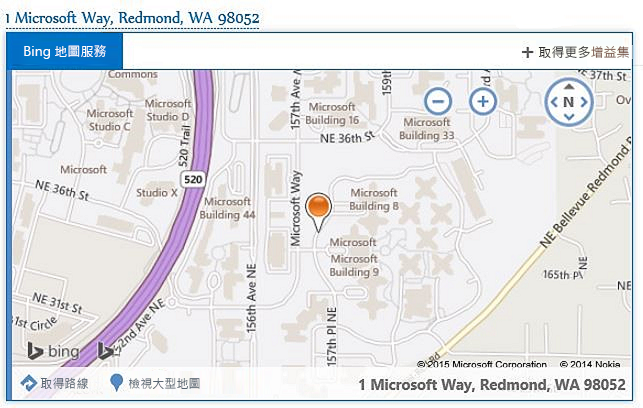
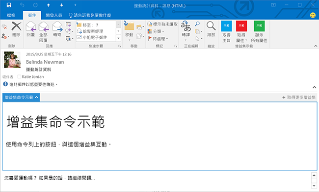

# Outlook 增益集

Outlook 增益集是由協力廠商使用新的 web 技術為基礎的平台建立至 Outlook 的整合。Outlook 增益集有三個主要領域︰

- 跨桌上型電腦 Outlook for Windows 以及 Mac、web (Office 365 與 Outlook.com) 和行動裝置運作的相同增益集和商務邏輯。
    
-  組成 Outlook 增益集的資訊清單會描述增益集整合到 Outlook (例如，按鈕或工作窗格) 的方式，以及 JavaScript/HTML 程式碼，其構成 UI 和增益集的商務邏輯。
    
- Outlook 增益集可以從 Office 存放區取得，或由使用者或系統管理員端載入。
    
Outlook 增益集與 COM 或 VSTO 增益集不同，其為 Windows 上執行的 Outlook 特定的較舊整合。與 COM 增益集不同的是，Outlook 增益集沒有任何實際安裝到使用者的裝置或 Outlook 用戶端的程式碼。針對 Outlook 增益集，Outlook 會讀取資訊清單並聯繫 UI 中的指定控制項，然後載入 JavaScript 及 HTML。在沙箱中的瀏覽器內容中會執行這全部。

支援郵件增益集的 Outlook 項目包括電子郵件、會議要求、回應和取消通知以及約會。每個郵件增益集會定義在當中其為可供使用 (包括項目類型以及使用者為讀取或撰寫項目) 的內容。

## 擴充點

擴充點是增益集與 Outlook 整合的方法。下列是可以執行此作業的方法︰

- 增益集可以宣告會跨郵件和約會出現在命令介面中的按鈕。如需詳細資訊，請參閱 [Outlook 的增益集命令](../outlook/add-in-commands-for-outlook.md)。
    
    **An add-in with command buttons on the ribbon**

    

- 增益集可以連結關閉規則運算式符合項目或在郵件和約會中偵測到的實體。如需詳細資訊，請參閱[關聯式 Outlook 增益集](../outlook/contextual-outlook-add-ins.md)。
    
    **A contextual add-in for a highlighted entity (an address)**

    

- 增益集可以出現在郵件或約會的本文上方的水平窗格。這是根據複雜的規則，例如附件或是郵件或約會的 Exchange 項目類別的存在。如需詳細資訊，請參閱[自訂窗格 Outlook 增益集](../outlook/custom-pane-outlook-add-ins.md)。
    
    **An add-in with a custom pane in read mode**

    

## 增益集可用的信箱項目

Outlook 增益集在撰寫或讀取可在郵件或約會上使用，但非其他項目類型。如果目前的郵件項目 (在撰寫或讀取表單中) 為下列其中一項，則 Outlook 不會啟動增益集︰

- 受 S/MIME 格式的資訊版權管理 (IRM) 所保護，或以其他方法加密以進行保護。範例是數位簽章的郵件，因為數位簽章依賴這些機制其中之一。
    
- 在 [垃圾電子郵件] 資料夾中。
    
- 傳遞報告或有郵件類別 IPM.Report.* 的通知，包括傳遞和未傳遞回報 (NDR) 報告，以及讀取、未讀取及延遲通知。
    
- 其他郵件的附件的 .msg 檔案。
    
- 從檔案系統開啟的 .msg 檔案。
    
一般情況下，Outlook 可以在 [寄件備份] 資料夾中的項目的讀取表單中啟動增益集，除了根據已知實體的字串相符項目啟動的增益集。如需有關啟動這背後的原因的詳細資訊，請參閱[使 Outlook 項目中的字串與已知的實體相符](../outlook/match-strings-in-an-item-as-well-known-entities.md)中的「已知實體的支援」。

## 支援的主機

Outlook 2013 和更新版本、Outlook 2016 for Mac、適用於 Exchange 2013 內部部署的 Outlook Web App、Office 365 及 Outlook.com. 中的 Outlook Web App 支援 Outlook 增益集。並非所有用戶端中都同時支援所有最新的功能。請參閱個別的主題和 API 參考，以查看它們在哪些主機中不支援。

## 開始建置 Outlook 增益集

若要開始建置 Outlook 增益集，請參閱[開始使用 Office 365 的 Outlook 增益集](https://dev.outlook.com/MailAppsGettingStarted/GetStarted)。

## 其他資源

- [Outlook 增益集的架構和功能概觀](../outlook/overview.md)
- [開發 Office 增益集的最佳做法](../../docs/overview/add-in-development-best-practices.md)
- [Office 增益集的設計指導方針](../../docs/design/add-in-design.md)
- [授權您的 Office 和 SharePoint 增益集](http://msdn.microsoft.com/library/3e0e8ff6-66d6-44ff-b0c2-59108ebd9181%28Office.15%29.aspx)
- [發佈 Office 增益集](../publish/publish.md)
- [將 Office 和 SharePoint 增益集和 Office 365 Web 應用程式提交給 Office 市集](http://msdn.microsoft.com/library/ff075782-1303-4517-91cc-b3d730e9b9ae%28Office.15%29.aspx)

