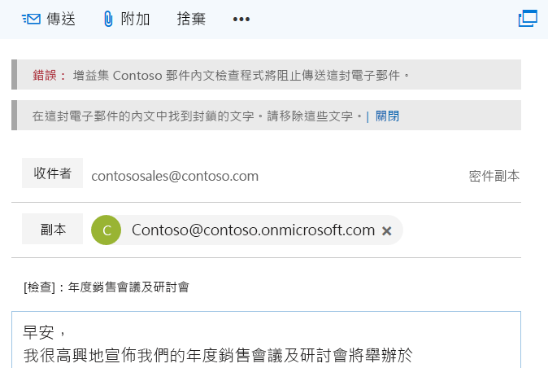

# <a name="on-send-feature-for-outlook-add-ins"></a>Outlook 增益集的傳送中功能

Outlook 增益集的傳送中功能提供方法來處理電子郵件，或阻止電子郵件使用者進行特定動作，並允許增益集設定特定傳送中項目。例如，您可以使用傳送中功能來完成下列目標：

- 避免使用者傳送機密資訊，或將 [主旨] 行留為空白。  
- 將特定收件者新增至 [副本] 行。

>  **附註：**目前僅在 Office 365 的 Outlook Web App 中支援傳送中功能。其他平台的支援即將推出。Office 市集中不允許使用傳送中功能的增益集。

事件會觸發傳送中功能。目前，該功能支援 **ItemSend** 事件型別。Outlook 增益集中的事件可讓您在相關事件發生時，處理、檢查或封鎖使用者動作。例如，事件會提供以下動作的方法︰

- 控制使用者動作
- 處理變更
- 發出使用者動作的訊號，例如按鈕點選
- 驗證使用者資料輸入
- 驗證訊息中的內容    

如需與傳送中功能限制的相關資訊，請參閱本文中稍後的 [限制](#limitations)。

## <a name="how-does-the-on-send-feature-work"></a>傳送中功能是如何運作的？

您可使用傳送中功能來建置其中整合 **ItemSend** 同步事件的 Outlook 增益集。此事件可偵測使用者按的是 [傳送] ****按鈕，並可在訊息驗證失敗時阻止電子郵件傳送。例如，使用者觸發訊息傳送事件時，使用傳送中功能的 Outlook 增益集可執行以下動作︰

- 讀取並驗證電子郵件訊息內容
- 確認該訊息包含 [主旨] 行
- 設定預先決定的收件者 

觸發傳送事件時，在 Outlook Web App 中用戶端上已完成驗證。如果驗證失敗，系統會阻止電子郵件的傳送，並會顯示一則含資訊列的錯誤訊息，提示使用者採取行動。  

下列螢幕擷取畫面顯示的資訊列是通知寄件者新增主旨。

![螢幕擷取畫面顯示的錯誤訊息是提示使用者輸入遺失的 [主旨] 行](../../images/block-on-send-subject-cc-inforbar.png) 

下列螢幕擷取畫面顯示的資訊列是通知寄件者找到封鎖的字。



## <a name="limitations"></a>限制

傳送中功能目前有下列限制︰

- **Office 市集** - 您無法將使用傳送中功能的 Outlook 增益集發佈至 Office 市集。使用傳送中事件的增益集的 Office 市集驗證將會失敗。    
- **資訊清單** - 每個增益集僅支援一個 **ItemSend** 事件。如果您在資訊清單中有兩個或更多 **ItemSend** 事件，資訊清單的驗證會失敗。 
- **效能** - 與裝載增益集的 Web 伺服器多個往返可能會影響增益集的效能。當您建立的增益集需要多個以電子郵件訊息為基礎的作業時，請考慮對效能的影響。

### <a name="mailbox-type-limitations"></a>信箱類型限制

僅 Outlook Web App 中的使用者信箱支援傳送中功能。下列信箱類型目前不支援此功能︰

- 共用信箱
- 離線模式
- 群組信箱 

如果這些信箱類型已啟用傳送中功能，則 Outlook Web App 不允許傳送。如果使用者回應群組信箱中的電子郵件，傳送中的增益集不會執行，且將會傳送訊息。

##  <a name="multiple-on-send-add-ins"></a>多個傳送中的增益集

如果已安裝多個傳送中的增益集，則增益集會依所安裝的順序執行。如果第一個增益集允許傳送，第二個增益集可進行變更，讓第一個增益集阻止傳送。然而，如果所有安裝的增益集已允許傳送，則第一個增益集將不會再次執行。 

例如，Add-in1 和 Add-in2 都使用傳送中功能。先安裝 Add-in1，接著安裝 Add-in2。Add-in1 驗證單字 Fabrikam 在訊息中出現作為增益集允許傳送的條件。然而， Add-in2 會移除所有出現的單字 Fabrikam。訊息將移除 Fabrikam 的所有例項並傳送 (因為 Add-in1 和 Add-in2 的安裝順序)。

## <a name="deploying-outlook-add-ins-that-use-on-send"></a>部署使用傳送中的 Outlook 增益集 

我們建議系統管理員部署使用傳送中功能的 Outlook 增益集。系統管理員必須確保傳送中增益集為以下狀態︰

- 每次撰寫項目開啟時 (對於電子郵件，即是新建、回覆或轉寄時) 都是存在的。
- 使用者無法關閉或停用。

## <a name="installing-outlook-add-ins-that-use-on-send"></a>安裝使用傳送中的 Outlook 增益集

Outlook Web App 中的傳送中功能需要為已傳送事件類型設定增益集。使用傳送中功能的 Outlook Web App 增益集會針對指派 Outlook Web App 信箱原則且其中 *OnSendAddinsEnabled* 旗標設為 **true** 的使用者執行。

若要安裝新增益集，請執行下列 Exchange Online PowerShell Cmdlet。 

```
$Data=Get-Content -Path '.\Contoso Message Body Checker.xml' -Encoding Byte –ReadCount 0 
```
```
New-App -OrganizationApp -FileData $Data -DefaultStateForUser Enabled
```

> **附註：**若要了解如何使用遠端 PowerShell 來連線至 Exchange Online，請參閱 [連線至 Exchange Online PowerShell](http://go.microsoft.com/fwlink/p/?LinkId=396554)。

### <a name="enabling-the-on-send-feature"></a>啟用傳送中功能 

預設情況下，傳送中功能已停用。藉由執行 Exchange Online PowerShell Cmdlet，系統管理員可以啟用傳送中功能。

若要啟用所有使用者的傳送中增益集： 

1. 建立新的 Outlook Web App 信箱原則

    ```
    New-OWAMailboxPolicy OWAOnSendAddinAllUserPolicy
    ```

    > **附註：**系統管理員可以使用現有的原則，但只有在特定信箱的類別才支援傳送中功能。根據預設，不受支援的信箱將會在 Outlook Web App 中阻止傳送。

2. 啟用傳送中功能。

    ```
    Get-OWAMailboxPolicy OWAOnSendAddinAllUserPolicy | Set-OWAMailboxPolicy –OnSendAddinsEnabled:$true
    ```

3. 將原則指派給使用者。

    ```
    Get-User -Filter {RecipientTypeDetails -eq 'UserMailbox'}|Set-CASMailbox -OwaMailboxPolicy OWAOnSendAddinAllUserPolicy
    ```

### <a name="enabling-the-on-send-feature-for-a-group-of-users"></a>啟用使用者群組的傳送中功能

若要啟用特定使用者群組的傳送中功能，步驟如下。在這個範例中，系統管理員只想要在針對財務使用者的環境 (其中財務使用者是屬於財務部門) 啟用 Outlook Web App 傳送中增益集功能。

1. 建立新群組 Outlook Web App 信箱原則。

    ```
    New-OWAMailboxPolicy FinanceOWAPolicy
    ```

    > **附註：**系統管理員可以使用現有原則，但只有特定信箱類別才支援傳送中功能 (如需詳細資訊，請參閱先前本文中的**信箱類別限制**)。根據預設，不受支援的信箱將會在 Outlook Web App 中阻止傳送。

2. 啟用傳送中功能。

    ```
    Get-OWAMailboxPolicy FinanceOWAPolicy | Set-OWAMailboxPolicy –OnSendAddinsEnabled:$true
    ```

3. 將原則指派給使用者。

    ```
    $targetUsers = Get-Group 'Finance'|select -ExpandProperty members
    $targetUsers | Get-User -Filter {RecipientTypeDetails -eq 'UserMailbox'}|Set-CASMailbox -OwaMailboxPolicy FinanceOWAPolicy
    ```

  >**附註：**等待至少 60 分鐘，原則才會生效，或重新啟動網際網路資訊服務 (IIS)。原則生效時，將會啟用群組傳送中功能。

### <a name="disabling-the-on-send-feature"></a>停用傳送中功能

若要停用使用者的傳送中功能，或對未啟用旗標的 Outlook Web App 信箱原則進行指派，請執行下列 Cmdlet。在這個範例中，信箱原則是 *ContosoCorpOWAPolicy*。

```
Get-CASMailbox joe@contoso.com | Set-CASMailbox –OWAMailboxPolicy "ContosoCorpOWAPolicy"
```

  > **附註：**如需有關如何使用 **Set-OwaMailboxPolicy** Cmdlet 來設定 web 信箱原則上的現有 Outlook，請參閱 [Set-OwaMailboxPolicy](https://technet.microsoft.com/en-us/library/dd297989(v=exchg.160).aspx)。

若要對已指派特定 Outlook Web App 信箱原則的所有使用者停用傳送中功能，請執行下列 Cmdlet。 

```
Get-OWAMailboxPolicy OWAOnSendAddinAllUserPolicy | Set-OWAMailboxPolicy –OnSendAddinsEnabled:$false
```

 > **附註：**如需有關如何使用 Set-OwaMailboxPolicy Cmdlet 來設定現有 Outlook Web App 信箱原則，請參閱 [Set-OwaMailboxPolicy](https://technet.microsoft.com/en-us/library/dd297989(v=exchg.160).aspx)。

## <a name="on-send-feature-scenarios"></a>傳送中功能案例

以下是針對使用傳送中功能的增益集，支援和不支援的案例。

#### <a name="user-mailbox-has-the-on-send-add-in-feature-enabled-but-no-add-ins-are-installed"></a>使用者信箱已啟用傳送中增益集，但沒有已安裝的增益集。

在這個案例中，使用者能夠傳送郵件，而不需執行任何增益集。

#### <a name="user-mailbox-has-the-on-send-add-in-feature-enabled-and-add-ins-that-supports-on-send-are-installed-and-enabled"></a>使用者信箱已啟用電子郵件增益集功能，且已安裝支援傳送中功能的增益集，並將其啟用。

增益集將會在傳送事件期間執行，而該期間將允許或阻止使用者進行傳送。

#### <a name="mailbox-delegation-where-mailbox-1-has-full-access-permissions-to-mailbox-2"></a>信箱委派，其中信箱 1 可完整存取信箱 2

|**案例**|**信箱 1 傳送中功能**|**信箱 2 傳送中功能**|**Outlook Web App 工作階段**|**結果**|**是否支援？**|
|:------------|:------------|:--------------------------|:---------|:-------------|:-------------|
|1|已啟用|已啟用|新工作階段|信箱 1 無法從信箱 2 傳送電子郵件。|目前不支援。如需因應措施，請使用案例 3。|
|2|已停用|已啟用|新工作階段|信箱 1 無法從信箱 2 傳送電子郵件。|目前不支援。如需因應措施，請使用案例 3。|
|3|已啟用|已啟用|相同的工作階段|指派給信箱 1 的傳送中增益集在執行傳送中。|支援。|
|4|已啟用|已停用|新工作階段|沒有傳送中增益集在執行；郵件已傳送。|支援。|


#### <a name="group-1-is-a-modern-group-mailbox-and-user-mailbox-1-is-a-member-of-group-1"></a>群組 1 是現代群組信箱，而且使用者信箱 1 屬於群組 1

|**案例**|**信箱 1 傳送中功能**|**是否已啟用傳送中增益集？**|**信箱 1 動作**|**結果**|**是否支援？**|
|:------------|:-------------------------|:-------------------|:---------|:----------|:-------------|
|1|已啟用|是|信箱 1 會對群組 1 撰寫新郵件。|傳送中增益集會在傳送期間執行。|是|
|2|已啟用|是|信箱 1 會在 Outlook Web App 中的群組 1 群組視窗中對群組 1 撰寫新郵件。|傳送中增益集不會在傳送期間執行。|目前不支援。如需因應措施，請使用案例 1。|

#### <a name="user-mailbox-with-on-send-add-in-feature-enabled-add-ins-that-support-on-send-are-installed-and-enabled-and-offline-mode-is-enabled"></a>使用者信箱已啟用傳送中增益集功能，且已安裝並啟用支援傳送中功能的增益集，且離線模式已啟用。

如果使用者在線上，傳送中增益集將會在傳送期間執行。如果使用者為離線，則傳送中增益集將不會在傳送期間執行，且電子郵件將不會送出。

## <a name="code-examples"></a>程式碼範例

下列程式碼範例顯示如何建立簡單傳送中增益集。若要下載這些範例根據的程式碼範例，請參閱 [Outlook-Add-in-On-Send](https://github.com/OfficeDev/Outlook-Add-in-On-Send)。

### <a name="manifest-version-override-and-event"></a>資訊清單、版本覆寫和事件

[Outlook-Add-in-On-Send](https://github.com/OfficeDev/Outlook-Add-in-On-Send) 程式碼範例包含兩個資訊清單︰

- `Contoso Message Body Checker.xml` - 顯示如何檢查郵件內文是否有傳送中的限制單字或機密資訊。  
- `Contoso Subject and CC Checker.xml` - 顯示如何在 [副本] 行中加入收件者，並確認傳送時此訊息包含 [主旨] 行。  

在 `Contoso Message Body Checker.xml` 資訊清單檔，您包含的函數檔案和函數名稱應在 **ItemSend** 事件上呼叫。作業會同步執行。

```
<Hosts>
        <Host xsi:type="MailHost">
          <DesktopFormFactor>
            <!-- The functionfile and function name to call on message send.  -->
            <!-- In this case, the function validateBody will be called within the JavaScript code referenced in residUILessFunctionFileUrl. -->
            <FunctionFile resid="residUILessFunctionFileUrl" />
            <ExtensionPoint xsi:type="Events">
              <Event Type="ItemSend" FunctionExecution="synchronous" FunctionName="validateBody" />
            </ExtensionPoint>
          </DesktopFormFactor>
        </Host>
      </Hosts>
```

如需 `Contoso Subject and CC Checker.xml` 資訊清單，呼叫訊息傳送事件的函數檔案與函數名稱會顯示在以下範例中。

```
<Hosts>
        <Host xsi:type="MailHost">
          <DesktopFormFactor>
            <!-- The functionfile and function name to call on message send.  -->
            <!-- In this case the function validateSubjectAndCC will be called within the JavaScript code referenced in residUILessFunctionFileUrl. -->
            <FunctionFile resid="residUILessFunctionFileUrl" />
            <ExtensionPoint xsi:type="Events">
              <Event Type="ItemSend" FunctionExecution="synchronous" FunctionName="validateSubjectAndCC" />
            </ExtensionPoint>
          </DesktopFormFactor>
        </Host>
      </Hosts>
```


傳送中 API 會要求 **VersionOverrides v1_1**。下列顯示如何在您的資訊清單中新增 VersionOverrides 節點。

```
 <VersionOverrides xmlns="http://schemas.microsoft.com/office/mailappversionoverrides" xsi:type="VersionOverridesV1_0">
    <!-- On Send requires VersionOverridesV1_1 -->
    <VersionOverrides xmlns="http://schemas.microsoft.com/office/mailappversionoverrides/1.1" xsi:type="VersionOverridesV1_1">
```

 >  **附註：**如需詳細資訊，請參閱以下內容：
 >- [在 Office 365 帳戶中執行 Outlook 增益集](https://dev.outlook.com/MailAppsGettingStarted/GetStarted)
 >- [Outlook 增益集資訊清單](https://dev.office.com/docs/add-ins/outlook/manifests/manifests)
 >- [VersionOverrides](https://dev.office.com/docs/add-ins/outlook/manifests/define-add-in-commands#versionoverrides)
 >- [Office 增益集的 XML 資訊清單](https://dev.office.com/docs/add-ins/overview/add-in-manifests)


### <a name="event-item-body-getasync-and-setasync-methods"></a>事件、項目、內文 getAsync 和 setAsync 方法

若要存取目前所選的訊息 (在這個範例中即新撰寫的郵件)，請使用 **Office.context.mailbox.item**命名空間。傳送中功能會自動將 **ItemSend** 事件傳遞給資訊清單中指定的函數，在此範例中，即 `validateBody` 函數。

```js
 var mailboxItem;

    Office.initialize = function (reason) {
        mailboxItem = Office.context.mailbox.item;
    }

    // Entry point for Contoso Message Body Checker add-in before send is allowed.
    // <param name="event">ItemSend event is automatically passed by on send code to the function specified in the manifest.</param>
    function validateBody(event) {
        mailboxItem.body.getAsync("html", { asyncContext: event }, checkBodyOnlyOnSendCallBack);
    }
```

`validateBody` 函數會以指定的格式 (HTML) 取得目前內文，並且傳遞程式碼在回呼方法中想要存取的 **ItemSend** 事件物件。除了 **getAsync** 方法，**Body** 物件也提供 **setAsync** 方法，您可使用此方法來將內文取代為特定文字。 

>  **附註：**如需詳細資訊，請參閱 [Event Object](https://dev.outlook.com/reference/add-ins/Event.html) 和 [getAsync](https://dev.outlook.com/reference/add-ins/Body.html)。
  

### <a name="notificationmessages-object-and-eventcompleted-method"></a>NotificationMessages 物件和 event.completed 方法

`checkBodyOnlyOnSendCallBack` 函數會使用規則運算式來判斷訊息內文是否包含封鎖的字。如果發現與限制單字陣列的相符項目，則會阻止傳送電子郵件，並會透過 [資訊] 列通知寄件者。若要這麼做，它會使用 **Item** 物件的 **notificationMessages** 屬性來傳回 **NotificationMessages** 物件。接著會藉由呼叫 **addAsync** 方法將通知新增至項目，如下列範例所示。 

```js
  // Determine whether the body contains a specific set of blocked words. If it contains the blocked words, block email from being sent. Otherwise allow sending.
    // <param name="asyncResult">ItemeSend event passed from the calling function.</param>
    function checkBodyOnlyOnSendCallBack(asyncResult) {
        var listOfBlockedWords = new Array("blockedword", "blockedword1", "blockedword2");
        var wordExpression = listOfBlockedWords.join('|');

        // \b to perform a "whole words only" search using a regular expression in the form of \bword\b.
        // i to perform case-insensitive search.
        var regexCheck = new RegExp('\\b(' + wordExpression + ')\\b', 'i');
        var checkBody = regexCheck.test(asyncResult.value);

        if (checkBody) {
            mailboxItem.notificationMessages.addAsync('NoSend', { type: 'errorMessage', message: 'Blocked words have been found in the body of this email. Please remove them.' });
            // Block send.
            asyncResult.asyncContext.completed({ allowEvent: false });
        }

        // Allow send.
        asyncResult.asyncContext.completed({ allowEvent: true });
    }
```

以下是適用於 **addAsync** 方法的參數：

- *NoSend* - 此字串為開發人員指定用來參考通知訊息的索引鍵。您可以使用它於稍後修改此訊息。索引鍵長度不可超過 32 個字元。 
- *類型* - 其中一個 JSON 物件參數的屬性。代表訊息的類型；與 [Office.MailboxEnums.ItemNotificationMessageType](https://dev.outlook.com/reference/add-ins/Office.MailboxEnums.html#.ItemNotificationMessageType) 列舉的值對應的類型。可能的值是進度指示器、資訊訊息或錯誤訊息。在這個範例中，*類型*是錯誤訊息。  
- *訊息* - 其中一個 JSON 物件參數的屬性。在此範例中，*訊息*是通知訊息的文字。 

若要發出信號，通知增益集已完成處理傳送作業所觸發的 **ItemSend** 事件，呼叫 **event.completed ({allowEvent:Boolean}** 方法。**AllowEvent** 屬性是布林值。如果設定為 **true**，則允許傳送。如果設定為 **false**，會阻止傳送電子郵件訊息。

>  **附註：**如需詳細資訊，請參閱 [notificationMessages](https://dev.outlook.com/reference/add-ins/Office.context.mailbox.item.html#notificationMessages) 和 [completed](https://dev.outlook.com/reference/add-ins/Event.html#completed)。

### <a name="replaceasync-removeasync-and-getallasync-methods"></a>replaceAsync、removeAsync 和 getAllAsync 方法

除了 **addAsync** 方法，**NotificationMessages** 物件也包含 **replaceAsync、removeAsync 和 getAllAsync** 方法。這些方法不會用於這個程式碼範例。如需詳細資訊，請參閱 [NotificationMessages](https://dev.outlook.com/reference/add-ins/NotificationMessages.html)。


### <a name="subject-and-cc-checker"></a>主旨及 [副本] 檢查程式

下列程式碼顯示如何在 [副本] 行中加入收件者，並確認傳送時此訊息包含主旨。這個範例會使用傳送中功能來允許或不允許傳送電子郵件。  

```js
    // Invoke by Contoso Subject and CC Checker add-in before send is allowed.
    // <param name="event">ItemSend event is automatically passed by on send code to the function specified in the manifest.</param>
    function validateSubjectAndCC(event) {
        shouldChangeSubjectOnSend(event);
    }

    // Determine whether the subject should be changed. If it is already changed, allow send. Otherwise change it.
    // <param name="event">ItemSend event passed from the calling function.</param>
    function shouldChangeSubjectOnSend(event) {
        mailboxItem.subject.getAsync(
            { asyncContext: event },
            function (asyncResult) {
                addCCOnSend(asyncResult.asyncContext);
                //console.log(asyncResult.value);
                // Match string.
                var checkSubject = (new RegExp(/\[Checked\]/)).test(asyncResult.value)
                // Add [Checked]: to subject line.
                subject = '[Checked]: ' + asyncResult.value;

                // Determine whether a string is blank, null, or undefined.
                // If yes, block send and display information bar to notify sender to add a subject.
                if (asyncResult.value === null || (/^\s*$/).test(asyncResult.value)) {
                    mailboxItem.notificationMessages.addAsync('NoSend', { type: 'errorMessage', message: 'Please enter a subject for this email.' });
                    asyncResult.asyncContext.completed({ allowEvent: false });
                }
                else {
                    // If can't find a [Checked]: string match in subject, call subjectOnSendChange function.
                    if (!checkSubject) {
                        subjectOnSendChange(subject, asyncResult.asyncContext);
                        //console.log(checkSubject);
                    }
                    else {
                        // Allow send.
                        asyncResult.asyncContext.completed({ allowEvent: true });
                    }
                }

            }
          )
    }

    // Add a CC to the email. In this example, CC contoso@contoso.onmicrosoft.com
    // <param name="event">ItemSend event passed from calling function</param>
    function addCCOnSend(event) {
        mailboxItem.cc.setAsync(['Contoso@contoso.onmicrosoft.com'], { asyncContext: event });        
    }

    // Determine whether the subject should be changed. If it is already changed, allow send, otherwise change it.
    // <param name="subject">Subject to set.</param>
    // <param name="event">ItemSend event passed from the calling function.</param>
    function subjectOnSendChange(subject, event) {
        mailboxItem.subject.setAsync(
            subject,
            { asyncContext: event },
            function (asyncResult) {
                if (asyncResult.status == Office.AsyncResultStatus.Failed) {
                    mailboxItem.notificationMessages.addAsync('NoSend', { type: 'errorMessage', message: 'Unable to set the subject.' });

                    // Block send.
                    asyncResult.asyncContext.completed({ allowEvent: false });
                }
                else {
                    // Allow send.
                    asyncResult.asyncContext.completed({ allowEvent: true });
                }

            });
    }
```

若要深入了解如何在 [副本] 行中新增收件者，並在傳送時確認電子郵件訊息包含 [主旨] 行，而且查看您可以使用的 API，請參閱 [Outlook-Add-in-On-Send sample](https://github.com/OfficeDev/Outlook-Add-in-On-Send)。程式碼已充分加了註解。   


## <a name="additional-resources"></a>其他資源

- [Outlook 增益集的架構和功能概觀](https://dev.office.com/docs/add-ins/outlook/overview?product=outlook)
    
- [增益集命令示範 Outlook 增益集](https://github.com/jasonjoh/command-demo)
    
