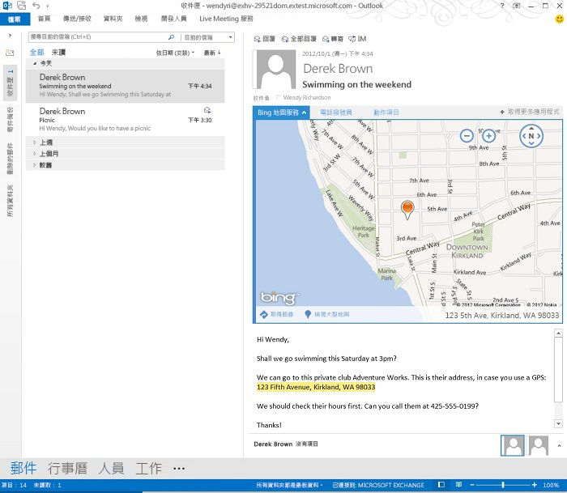

# 建立讀取格式的 Outlook 增益集

讀取增益集是在 Outlook 中的讀取窗格或讀取偵測器啟動的 Outlook 增益集。不像撰寫增益集 (使用者在建立郵件或約會時所啟動的 Outlook 增益集)，讀取增益集在使用者進行以下動作時可供使用︰

- 檢視電子郵件、會議邀請，會議回覆或會議取消。*
    
- 檢視使用者在其中為與會者的會議項目。
    
- 檢視使用者為其召集人的會議項目 (僅限 Outlook 2013 和 Exchange 2013 的 RTM 版本)。
    
     >**附註**  從 Office 2013 SP1 版本開始，如果使用者正在檢視使用者所安排的會議項目，僅撰寫增益集可以啟動且可以使用。 此案例中已不再提供讀取增益集。
* Outlook 不會在特定類型郵件的表單中啟用增益集讀取，包含其他郵件的附件項目、在 Outlook 的 [草稿] 或 [垃圾電子郵件] 資料夾中的項目，或以其他方式加密或保護的項目。

在每一個這些讀取案例中，當增益集的啟動條件實現時，Outlook 會啟動增益集，且使用者可以在[讀取窗格] 或讀取偵測器的增益集列中選取並開啟已啟動的增益集。圖 1 顯示當使用者在讀取包含地理地址的郵件時會啟動並開啟的 **Bing 地圖服務**增益集。

**圖 1.增益集窗格顯示包含地址的已選取 Outlook 郵件的作用中 Bing 地圖服務增益集**

## 可在讀取模式中使用的增益集類型

讀取增益集可以是下列類型的任何組合。

- [Outlook 的增益集命令](../outlook/add-in-commands-for-outlook.md)
    
- [內容相關的 Outlook 增益集](../outlook/contextual-outlook-add-ins.md)
    
- [自訂窗格 Outlook 增益集](../outlook/custom-pane-outlook-add-ins.md)
    

## 可用來讀取增益集的 API 功能

如需適用於 Office 的 JavaScript API 在讀取表單中提供給 Outlook 增益集的功能清單，請參閱[每個版本的郵件應用程式功能](http://msdn.microsoft.com/library/f34e2f44-8c9d-4e90-b1d7-3f29506adb92%28Office.15%29.aspx)中的表 1 及表 2。 

另請參閱：

- 如需在讀取表單啟動增益集，請參閱[指定資訊清單中的啟動規則](../outlook/manifests/activation-rules.md#specify-activation-rules-in-a-manifest)中的表 1。
    
- [使用規則運算式的啟用規則來顯示 Outlook 增益集](../outlook/use-regular-expressions-to-show-an-outlook-add-in.md)
    
- [使 Outlook 項目中的字串與已知的實體相符](../outlook/match-strings-in-an-item-as-well-known-entities.md)
    
- [從 Outlook 項目擷取實體字串](../outlook/extract-entity-strings-from-an-item.md)
    
- [從伺服器取得 Outlook 項目的附件](../outlook/get-attachments-of-an-outlook-item.md)
    

## 其他資源

- [開始使用 Office 365 的 Outlook 增益集](https://dev.outlook.com/MailAppsGettingStarted/GetStarted.aspx)
    
- [Outlook 增益集](../outlook/outlook-add-ins.md)
    
