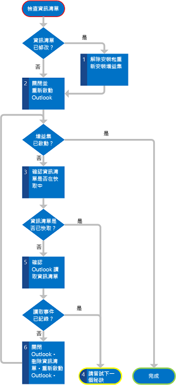

# <a name="troubleshoot-outlook-add-in-activation"></a>Outlook 增益集啟動的疑難排解


Outlook 增益集啟動是內容相關且根據增益集資訊清單中的啟動規則。當目前選取的項目條件滿足增益集的啟動規則時，主應用程式會啟動，並顯示 Outlook UI 中的增益集按鈕 (撰寫增益集為增益集選取範圍窗格，讀取增益集為增益集功能列)。不過，如果增益集未如預期啟用，您應該研究下列區域以找出可能的原因。

<a name="troubleshootingmailapps"></a>
## <a name="is-the-user-mailbox-on-a-version-of-exchange-server-that-is-at-least-exchange-2013"></a>使用者信箱的 Exchange Server 版本是否至少為 Exchange 2013？


首先，確定您在用來測試的使用者電子郵件帳戶的 Exchange Server 版本至少為 Exchange 2013。如果您使用的是 Exchange 2013 之後所發行的特定功能，請確定使用者帳戶為 Exchange 的適當版本。

您可以使用下列方法之一來確認 Exchange 2013 的版本：


- 請與 Exchange Server 系統管理員連絡。
    
- 如果您在 Outlook Web App 或裝置用 OWA 上測試增益集，在指令碼偵錯工具中 (例如， Internet Explorer 隨附的 JScript 偵錯工具)，尋找 **script** 標記的 **src** 屬性，其指定載入指令碼的位置。路徑應該包含子字串 **owa/15.0.516.x/owa2/...**，其中 **15.0.516.x** 表示 Exchange Server 的版本，例如 **15.0.516.2**。
    
- 或者，您可以使用 [Office.context.mailbox.diagnostics.hostVersion](../../reference/outlook/Office.context.mailbox.diagnostics.md) 屬性來確認版本。在 Outlook Web App 及裝置用 OWA 中，這個屬性會傳回 Exchange Server 的版本。
    
- 如果您可以在 Outlook 上測試增益集，可以使用下列使用 Outlook 物件模型和 Visual Basic 編輯器的簡單偵錯技巧︰
    
      1. 首先，請確認已啟用 Outlook 的巨集。依序選擇 [檔案]****、[選項]****、[信任中心]****、[信任中心設定]****、[巨集設定]****。確保在信任中心內選取 [所有巨集的通知]****。您在 Outlook 啟動期間應該也已選取 [啟用巨集]****。
    
      2. 在功能區的 [開發人員]**** 索引標籤上，選擇 [Visual Basic]****。
    
     >**附註**  找不到**開發人員**索引標籤嗎？請參閱[作法：在功能區顯示開發人員索引標籤](http://msdn.microsoft.com/en-us/library/ce7cb641-44f2-4a40-867e-a7d88f8e98a9%28Office.15%29.aspx)，以將它開啟。
      3. 在 Visual Basic 編輯器中，依序選擇 [檢視]****、[即時運算]**** 視窗。
    
      4. 在 [即時運算] 視窗中輸入下列項目來顯示 Exchange Server 的版本。傳回值的主要版本必須等於或大於 15。
    
        - 如果使用者的設定檔中只有一個 Exchange 帳戶：
        
            
            ?Session.ExchangeMailboxServerVersion
            
        
        - 如果相同的使用者設定檔中有多個 Exchange 帳戶：
        
            
            ?Session.Accounts.Item(emailAddress).ExchangeMailboxServerVersion
         
        
        - _emailAddress_ 代表包含使用者的主要 STMP 地址的字串。例如，如果使用者的主要 SMTP 地址為 randy@contoso.com，請如下鍵入︰
        
            
            ?Session.Accounts.Item("randy@contoso.com").ExchangeMailboxServerVersion
        


## <a name="is-the-add-in-disabled"></a>增益集是否已停用？


任何一種 Outlook 豐富型用戶端可以基於效能考量而停用增益集，包括超過 CPU 核心或記憶體的使用量臨界值、損毀的容錯，以及處理增益集的所有規則運算式的時間長度。在這種情況下，Outlook 豐富型用戶端會顯示其停用增益集的通知。 


 >**附註**  只有 Outlook 豐富型用戶端會監視資源使用狀況，但在 Outlook 豐富型用戶端中停用增益集也會在 Outlook Web App 及裝置用 OWA 中停用增益集。

使用下列方法之一來確認是否已停用增益集︰ 


- 在 Outlook Web App 中，直接登入電子郵件帳號，選擇 [設定] 圖示，然後選擇 [管理增益集]**** 以前往 Exchange 系統管理中心，您可以在其中確認增益集是否已啟用。
    
- 在 Outlook 中，移至 Backstage 檢視，然後選擇 [管理增益集]****。登入 Exchange 系統管理中心以確認增益集是否已啟用。
    
- 在 Outlook for Mac 中，在增益集列中選擇 [管理增益集]****。登入 Exchange 系統管理中心以確認增益集是否已啟用。
    

## <a name="does-the-tested-item-support-outlook-add-ins-is-the-selected-item-delivered-by-a-version-of-exchange-server-that-is-at-least-exchange-2013"></a>測試的項目是否支援 Outlook 增益集？Exchange Server 版本所提供的選取項目是否至少為 Exchange 2013？


如果 Outlook 增益集是讀取增益集，並且當使用者在檢視郵件 (包含電子郵件、會議邀請、回覆和取消) 或約會時應該啟用，即使這些項目通常會支援增益集，如果選取的項目是下列其中一項則為例外狀況︰


- 受資訊版權管理 (IRM) 保護。
    
- S/MIME 格式或以其他方式加密來保護。
    
- 草稿 (沒有指派給它的寄件者) 或在 Outlook 的 [草稿] 資料夾。
    
- 在 [垃圾電子郵件] 資料夾中。
    
- 傳遞報告或有郵件類別 IPM.Report.* 的通知，包括傳遞和未傳遞回報 (NDR) 報告，以及讀取、未讀取及延遲通知。
    
- 附加到另一則郵件或從檔案系統開啟的 .msg 檔案。
    
並且，因為約會一律以 RTF 格式儲存，指定 [BodyAsHTML](http://msdn.microsoft.com/en-us/library/bfb726cd-81b0-a8d5-644f-2ca90a5273fc%28Office.15%29.aspx) 的 **PropertyName** 值的 **ItemHasRegularExpressionMatch** 規則不會在以純文字或 RTF 格式儲存的約會或郵件上啟動增益集。

即使郵件項目並不是以上其中一個類型，如果項目不是由至少 Exchange 2013 的 Exchange Server 版本所傳送，則不會在項目上識別已知實體和屬性 (例如寄件者的 SMTP 地址)。依賴這些實體或屬性的任何啟動規則不會得到滿足且增益集不會啟用。

如果增益集是撰寫增益集，而且當使用者在撰寫郵件或會議邀請時應該要啟動，請確定項目不受 IRM 保護。


## <a name="is-the-add-in-manifest-installed-properly-and-does-outlook-have-a-cached-copy"></a>增益集資訊清單是否正確安裝，以及 Outlook 是否有快取的複本？


這種情況僅會套用至 Outlook for Windows。一般而言，當您安裝信箱的 Outlook 增益集時，Exchange Server 會從您指示的位置將增益集資訊清單複製到該 Exchange Server 上的信箱。每次 Outlook 啟動時，它會在下列位置讀取該信箱安裝的所有資訊清單到暫存的快取中︰ 

%LocalAppData%\Microsoft\Office\15.0\WEF 

例如，針對使用者 John，快取可能會位於 C：\Users\john\AppData\Local\Microsoft\Office\15.0\WEF。

如果增益集不會針對任何項目啟動，則可能未在 Exchange Server 上正確安裝資訊清單，或是 Outlook 在啟動時尚未正確讀取資訊清單。使用 Exchange 系統管理中心，確保增益集已安裝並針對您的信箱啟用，並重新開機 Exchange Server (如有必要)。

圖 1 顯示步驟的摘要，以驗證 Outlook 是否具有有效資訊清單的版本。 


**圖 1.驗證 Outlook 是否正確快取資訊清單步驟的流程圖表**

下列程序描述細節。


1. 如果您在 Outlook 開啟時已修改資訊清單，且您並非使用 Visual Studio 2012 或較新版的 Visual Studio 來開發增益集，您應該解除安裝增益集，並使用 Exchange 系統管理員中心重新安裝它。 
    
2. 重新啟動 Outlook 並測試 Outlook 現在是否會啟動增益集。
    
3. 如果 Outlook 不會啟動增益集，請檢查 Outlook 是否有正確快取的增益集資訊清單的複本。查看下列路徑：
    
    %LocalAppData%\Microsoft\Office\15.0\WEF
    
    您可以在下列子資料夾中找到資訊清單：
```
    \<insert your guid>\<insert base 64 hash>\Manifests\<ManifestID>_<ManifestVersion>
```
    
     >**Note**  The following is an example of a path to a manifest installed for a mailbox for the user John:
    
    C:\Users\john\appdata\Local\Microsoft\Office\15.0\WEF\{8D8445A4-80E4-4D6B-B7AC-D4E6AF594E73}\GoRshCWa7vW8+jhKmyiDhA==\Manifests\b3d7d9d5-6f57-437d-9830-94e2aaccef16_1.2
    
    Verify whether the manifest of the add-in you're testing is among the cached manifests.
    
4. 如果資訊清單是快取，請略過本節的其他部分，並遵循本章節考慮其他可能的原因。
    
5. 如果資訊清單不在快取中，請檢查 Outlook 是否確實成功從 Exchange Server 讀取資訊清單。若要這樣做，請使用 Windows 事件檢視器︰
    
      1. 在 [Windows 記錄檔]**** 下，選擇 [應用程式]****。
    
      2. 尋找合理的最近事件，其中事件識別碼等於 63，表示 Outlook 從 Exchange Server 下載資訊清單。
    
      3. 如果 Outlook 成功讀取資訊清單，記錄的事件應該有下列描述︰
    
         **Exchange 的 Web 服務要求 GetAppManifests 成功。**
    
        請略過本節的其他部分，並考慮本章節之後的其他可能原因。
    

    如需在 Windows 7 開啟事件檢視器的相關資訊，請參閱[開啟事件檢視器](http://windows.microsoft.com/en-US/windows7/Open-Event-Viewer)。
    
6. 如果您未看到成功的事件，請關閉 Outlook，並刪除下列路徑中的所有資訊清單︰
```
    %LocalAppData%\Microsoft\Office\15.0\WEF\<insert your guid>\<insert base 64 hash>\Manifests\
```
    Start Outlook and test whether Outlook now activates the add-in.
    
7. 如果 Outlook 不會啟動增益集，請回到步驟 3 再次驗證 Outlook 是否已正確讀取資訊清單。
    

## <a name="is-the-add-in-manifest-valid"></a>此增益集資訊清單是否有效？

請參閱[驗證與排解資訊清單的問題](../testing/troubleshoot-manifest.md)以對增益集資訊清單的問題進行偵錯。

## <a name="are-you-using-the-appropriate-activation-rules"></a>您是否使用適當的啟動規則？


自 Office 增益集資訊清單結構描述 1.1 版開始，您可以建立當使用者在撰寫表單 (撰寫增益集) 或讀取 (讀取增益集) 表單中時所啟動的增益集。請確定您為增益集應該在其中啟動的每種類型表單指定適當的啟動規則。例如，您可以僅使用 [ItemIs](http://msdn.microsoft.com/en-us/library/f7dac4a3-1574-9671-1eda-47f092390669%28Office.15%29.aspx) 規則並將 **FormType** 屬性設定為 **Edit** 或 **ReadOrEdit** 來啟動撰寫增益集，且不能使用任何其他類型的規則，例如撰寫增益集的 [ItemHasKnownEntity](http://msdn.microsoft.com/en-us/library/87e10fd2-eab4-c8aa-bec3-dff92d004d39%28Office.15%29.aspx) 和 [ItemHasRegularExpressionMatch](http://msdn.microsoft.com/en-us/library/bfb726cd-81b0-a8d5-644f-2ca90a5273fc%28Office.15%29.aspx) 規則。如需詳細資訊，請參閱 [Outlook 增益集的啟用規則](../outlook/manifests/activation-rules.md)。


## <a name="if-you-use-a-regular-expression-is-it-properly-specified"></a>如果您使用規則運算式，它是否正確指定？


因為在啟動規則中的規則運算式是讀取增益集 XML 資訊清單檔的一部分，如果規則運算式使用某些字元，請務必遵循 XML 處理器所支援的對應逸出序列。表1 列出這些特殊字元。 


**表 1.規則運算式的逸出序列**


|**字元**|**描述**|**要使用的逸出序列**|
|:-----|:-----|:-----|
|"|雙引號|&amp;quot;|
|&amp;|& 符號|&amp;amp;|
|'|' 單引號|&amp;apos;|
|<|小於符號|&amp;lt;|
|>|大於符號|&amp;gt;|

## <a name="if-you-use-a-regular-expression-is-the-read-add-in-activating-in-outlook-web-app-or-owa-for-devices-but-not-in-any-of-the-outlook-rich-clients"></a>如果您使用規則運算式，則讀取增益集是否會在 Outlook Web App 或裝置用 OWA，而不是在任一個 Outlook 豐富型用戶端中啟動？


Outlook 豐富型用戶端會使用不同於 Outlook Web App 和裝置用 OWA 所使用的規則運算式引擎。Outlook 豐富型用戶端會使用提供做為 Visual Studio 標準範本程式庫一部分的 C++ 規則運算式引擎。這個引擎遵守 ECMAScript 5 標準。Outlook Web App 和裝置用 OWA 使用屬於 JavaScript 的規則運算式評估 (由瀏覽器提供)，且支援 ECMAScript 5 的超集。 

儘管在大多數情況下，這些主應用程式會在啟用規則中尋找相同符合項目的相同規則運算式，但也有例外。例如，如果 regex 根據預先定義的字元類別包含自訂字元類別，則 Outlook 豐富型用戶端可能會傳回與 Outlook Web App 和裝置用 OWA 不同的結果。例如，包含簡短形式的字元類別 `[\d\w]` 的字元類別其中會傳回不同的結果。在此案例中，若要避免在不同的主機上有不同的結果，請改為使用`(\d|\w)`。

徹底測試您的規則運算式。如果它傳回不同的結果，請使用這兩個引擎重寫相容性的規則運算式。若要確認 Outlook 豐富型用戶端上的評估結果，請撰寫套用您要嘗試符合的文字範例的規則運算式的小型 C++ 程式。在 Visual Studio 上執行的 C++ 測試程式會使用標準樣板程式庫，執行相同的規則運算式時，會模擬 Outlook 豐富型用戶端的行為。若要確認Outlook Web App 或裝置用 OWA 的評估結果，請使用您最愛的 JavaScript 規則運算式測試器。


## <a name="if-you-use-an-itemis-itemhasattachment-or-itemhasregularexpressionmatch-rule-have-you-verified-the-related-item-property"></a>如果您使用 ItemIs、ItemHasAttachment 或 ItemHasRegularExpressionMatch 規則，是否已驗證相關的項目屬性？


如果您使用 **ItemHasRegularExpressionMatch** 啟用規則，請驗證 **PropertyName** 屬性的值是否如您選取的項目所預期。以下是偵錯對應屬性的一些祕訣︰


- 如果選取的項目是郵件，且您在 **PropertyName** 屬性中指定 **BodyAsHTML**，則開啟郵件，然後選擇 [檢視原始檔]**** 來驗證該項目的 HTML 表示中的郵件本文。
    
- 如果選取的項目是約會，或如果啟動規則在 **PropertyName** 中指定 **BodyAsPlaintext**，您可以在 Outlook for Windows 中使用 Outlook 物件模型和 Visual Basic 編輯器：
    
      1. 確定已啟用巨集且 [開發人員]**** 索引標籤會顯示在 Outlook 的功能區中。如果您不確定如何執行這項操作，請參閱[使用者信箱的 Exchange Server 版本是否至少為 Exchange 2013？](#troubleshootingmailapps)下的步驟 1 和 2。
    
      2. 在 Visual Basic 編輯器中，依序選擇 [檢視]****、[即時運算]**** 視窗。
    
      3. 輸入下列項目以根據案例顯示不同的屬性。 
    
      - Outlook 總管中選取的郵件或約會項目的 HTML 本文：
    
            
              ?ActiveExplorer.Selection.Item(1).HTMLBody
        


     - Outlook 總管中選取的郵件或約會項目的純文字本文：
    
            
              ?ActiveExplorer.Selection.Item(1).Body
            


      - 目前的 Outlook 總管中開啟的郵件或約會項目的 HTML 本文：
    
            
              ?ActiveInspector.CurrentItem.HTMLBody
        
      - 目前的 Outlook 總管中開啟的郵件或約會項目的純文字本文：
    
            
              ?ActiveInspector.CurrentItem.Body
            

如果 **ItemHasRegularExpressionMatch** 啟用規則指定 **Subject** 或 **SenderSMTPAddress**，或如果您使用 **ItemIs** 或 **ItemHasAttachment** 規則，而且您熟悉或想要使用 MAPI，您可以使用 [MFCMAPI](http://mfcmapi.codeplex.com/) 以確認您的規則所依賴的表 2 中的值。


**表 2.啟動規則及對應的 MAPI 內容**


|**規則的類型**|**確認這個 MAPI 屬性**|
|:-----|:-----|
|**ItemHasRegularExpressionMatch** 規則與 **Subject**|[PidTagSubject](http://msdn.microsoft.com/en-us/library/aa7ba4d9-c5e0-4ce7-a34e-65f675223bc9%28Office.15%29.aspx)|
|**ItemHasRegularExpressionMatch** 規則與 **SenderSMTPAddress**|[PidTagSenderSmtpAddress](http://msdn.microsoft.com/en-us/library/321cde5a-05db-498b-a9b8-cb54c8a14e34%28Office.15%29.aspx) 和 [PidTagSentRepresentingSmtpAddress](http://msdn.microsoft.com/en-us/library/5ed122a2-0967-4de3-a2ee-69f81ae77b16%28Office.15%29.aspx)|
|**ItemIs**|[PidTagMessageClass](http://msdn.microsoft.com/en-us/library/1e704023-1992-4b43-857e-0a7da7bc8e87%28Office.15%29.aspx)|
|**ItemHasAttachment**|[PidTagHasAttachments](http://msdn.microsoft.com/en-us/library/fd236d74-2868-46a8-bb3d-17f8365931b6%28Office.15%29.aspx)|
在驗證屬性值之後，您接著可以使用規則運算式評估工具來測試規則運算式是否在該值中找到相符項目。


## <a name="does-the-host-application-apply-all-the-regular-expressions-to-the-portion-of-the-item-body-as-you-expect"></a>主應用程式是否如預期般套用所有規則運算式至項目本文的部分？


本節套用至所有使用規則運算式 (尤其是適用於項目本文中的) 所有啟用規則，其大小可能會過大，且需要較長時間評估相符項目。您應該注意，即使啟動規則所遵循的項目屬性具有您預期的值，主應用程式可能無法在項目屬性的整個值上評估所有規則運算式。若要提供合理的效能並控制讀取增益集、Outlook、Outlook Web App 和裝置用 OWA 的過度資源使用狀況，觀察下列在執行階段的啟用規則中處理規則運算式的限制︰


- 評估的項目本文大小 -- 項目本文的部分有所限制，其中主應用程式會評估規則運算式。這些限制根據主應用程式、表單係數，以及項目本文的格式而定。See the details in Table 2 in請參閱 [適用於 Outlook 增益集的 JavaScript API 和啟動的限制](../outlook/limits-for-activation-and-javascript-api-for-outlook-add-ins.md)的表 2 中的詳細資料。
    
- 規則運算式的數字 -- Outlook 豐富型用戶端、Outlook Web App 和裝置用 OWA 每一個皆會傳回最多 50 個規則運算式相符項目。這些符合項目是唯一的，而且重複的相符項目不會計入此限制。請勿假設傳回的相符項目的任何順序，並且請勿假設 Outlook 豐富型用戶端中的順序會與 Outlook Web App 和裝置用 OWA 的順序相同。如果您預期在您的啟動規則中有許多規則運算式的相符項目，且您遺漏相符項目，您可能會超過此限制。
    
- 規則運算式相符項目的長度 -- 主應用程式會傳回的規則運算式相符項目的長度有所限制。主應用程式不包含超過上限的任何符合項目，且不會顯示任何警告訊息。您可以使用其他 regex 評估工具或獨立的 C++ 測試程式來確認您是否有超過這類限制的符合項目，以執行規則運算式。表 3 總結限制。如需詳細資訊，請參閱[適用於 Outlook 增益集的 JavaScript API 和啟動的限制](../outlook/limits-for-activation-and-javascript-api-for-outlook-add-ins.md)中的表 3。
    
    ** 3.規則運算式比對的長度限制**


|**regex 符合項目的長度限制**|**Outlook 豐富型用戶端**|**Outlook Web App 或裝置用 OWA**|
|:-----|:-----|:-----|
|項目本文是純文字|1.5 KB|3 KB|
|項目本文是 HTML|3 KB|3 KB|
- 在評估 Outlook 豐富型用戶端的讀取增益集的所有規則運算式所花費的時間︰根據預設，針對每個讀取增益集，Outlook 必須在 1 秒內完成評估其啟動規則中的所有規則運算式。否則，如果 Outlook 無法完成評估，Outlook 會重試最多三次並停用增益集。Outlook 會在訊息通知列中顯示增益集已停用。可藉由設定群組原則或登錄機碼來修改規則運算式可用的時間。 
    
     >**附註**  請注意，如果 Outlook 豐富型用戶端停用讀取增益集，則該Outlook 豐富型用戶端、Outlook Web App 和及裝置用 OWA 的相同信箱即無法使用讀取增益集。

## <a name="additional-resources"></a>其他資源


- [部署和安裝 Outlook 增益集以進行測試](../outlook/testing-and-tips.md)
    
- [Outlook 增益集的啟用規則](../outlook/manifests/activation-rules.md)
    
- [使用規則運算式的啟用規則來顯示 Outlook 增益集](../outlook/use-regular-expressions-to-show-an-outlook-add-in.md)
    
- [適用於 Outlook 增益集的 JavaScript API 和啟動的限制](../outlook/limits-for-activation-and-javascript-api-for-outlook-add-ins.md)
    
- [開啟事件檢視器](http://windows.microsoft.com/en-US/windows7/Open-Event-Viewer)
    
- [ItemHasAttachment complexType](http://msdn.microsoft.com/en-us/library/031db7be-8a25-5185-a9c3-93987e10c6c2%28Office.15%29.aspx)
    
- [ItemHasRegularExpressionMatch complexType](http://msdn.microsoft.com/en-us/library/bfb726cd-81b0-a8d5-644f-2ca90a5273fc%28Office.15%29.aspx)
    
- [ItemIs complexType](http://msdn.microsoft.com/en-us/library/926249ab-2d2f-39f5-1d73-fab1c989966f%28Office.15%29.aspx)
    
- [MailApp complexType](http://msdn.microsoft.com/en-us/library/696b9fcf-cd10-3f20-4d49-86d3690c887a%28Office.15%29.aspx)
    
- [驗證與排解資訊清單的問題](../testing/troubleshoot-manifest.md)
    

