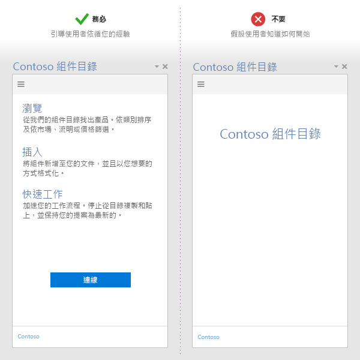
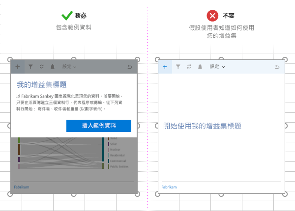
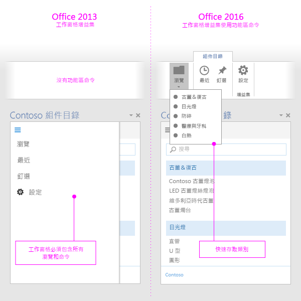

# 開發 Office 增益集的最佳做法

有效的增益集提供獨特且令人信服的功能，以視覺上吸引人的方式擴充 Office 應用程式。若要建立很棒的增益集，請為您的使用者提供吸引人的首次經驗、設計第一級的 UI 經驗，以及將增益集的效能最佳化。運用本文中所述的最佳做法，來建立可協助使用者快速且有效地完成其工作的增益集。

## 提供顯而易見的價值

- 建立可協助使用者快速且有效地完成工作的增益集。著重在對 Office 應用程式有意義的案例上。例如：
 - 以更少的中斷，讓核心編寫工作更快速而更輕鬆。
 - 在 Office 內啟用新案例。
 - 在 Office 主應用程式內嵌補的服務。
 - 改善 Office 經驗來提升生產力。
- 利用[吸引人的首次經驗](#create-an-engaging-first-run-experience)，確定增益集的價值對使用者來說立即顯而易見。
- 建立[有效的 Office 市集清單](http://msdn.microsoft.com/library/c66a6e6b-2e96-458f-8f8c-2a499fe942c9%28Office.15%29.aspx)。請在您的標題和描述中清楚說明增益集的優點。切勿仰賴您的品牌來說明增益集的用途。

## 建立吸引人的首次執行經驗

- 以高度可用而直覺式的首次體驗吸引新使用者。請注意，從市集下載增益集後，使用者仍會決定是否要使用或放棄它。

 - 清楚說明若要使用增益集，使用者需要採取的步驟。運用視訊、Placemat (佔位圖片)、分頁面板或其他資源來吸引使用者。

 - 啟動時強化增益集的價值主張，而不只是要求使用者登入。

 - 提供指引 UI 以引導使用者，並讓您的 UI 個人化。

    

  - 如果您的內容增益集繫結至使用者文件中的資料，請併入範例資料或範本，以向使用者顯示要使用的資料格式。

    

- 提供[免費試用](https://msdn.microsoft.com/en-us/library/dn456317.aspx#Anchor_1)。如果您的增益集需要訂閱，請提供一些無需訂閱就能使用的功能。

- 讓註冊簡單。預先填入資訊 (電子郵件、顯示名稱)，並略過電子郵件驗證。

- 避免快顯功能表。如果您必須使用它們，請引導使用者啟用您的快顯。

- 使用[單一登入 (SSO) 驗證](../outlook/authenticate-a-user-with-an-identity-token.md)。

如需說明當您開發初次執行體驗時可以套用的模式的範本，請參閱 [Office 增益集的 UX 設計模式](https://github.com/OfficeDev/Office-Add-in-UX-Design-Patterns-Code)。

## 使用增益集命令

- 使用[增益集命令](../design/add-in-commands.md)提供增益集的相關 UI 進入點。

- 使用命令來代表對使用者而言具有明顯和特定結果的特定動作。請勿在單一按鈕中結合多個動作。

- 提供精細的動作，讓增益集內的一般工作更有效率地執行。將完成動作所需的步驟數目降至最低。

- 針對擴充 Office 功能區的增益集︰
    - 如果提供的功能合適，請將命令放置在現有索引標籤 (插入、檢閱等等)。例如，如果您的增益集可以讓使用者插入媒體，將在 [插入] 索引標籤中加入群組。請注意，並非所有的索引標籤都可在所有的 Office 版本上使用。如需詳細資訊，請參閱 [Office 增益集的 XML 資訊清單](../overview/add-in-manifests.md)。 
    - 如果功能不適合放在另一個索引標籤，而且您的最上層命令少於六個，請將命令放在 [首頁] 索引標籤。如果增益集需要能夠跨 Office 版本 (例如桌面版 Office 和 Office Online) 運作，並且某個索引標籤不適用於所有版本 (例如，[設計] 索引標籤於 Office Online 中不存在)，您也可以加入命令到 [首頁] 索引標籤。  
    - 如果您有超過六個最上層命令，請將命令放在自訂索引標籤上。 
  - 命名您的群組，使其符合增益集的名稱。如果您有多個群組，請依據該群組中的命令提供的功能命名每個群組。
  - 請勿加入過多的按鈕來增加增益集的實際資產。

     >**請注意**  佔用太多空間的增益集可能無法通過 [Office 市集驗證](https://msdn.microsoft.com/en-us/library/jj220035.aspx)。

- 針對所有的圖示，請依照 [圖示設計的指導方針](../design/design-icons.md)進行。

- 提供也可以在不支援命令的主應用程式上運作的增益集版本。單一增益集資訊清單能夠同時在命令感知 (具有命令) 與非命令感知 (如工作窗格) 主應用程式中運作。

    

## 套用 UX 設計原則

- 請確定增益集的外觀及操作能夠補充 Office 經驗。使用 [Office UI 結構](https://dev.office.com/fabric)。

- 內容優先於 chrome。避免無法提升使用者經驗的多餘 UI 項目，最大化使用空間。

- 掌握使用者。確定使用者了解重要決策，並能輕鬆回復增益集執行的動作。

- 使用品牌標誌，可以促進信任以及為使用者定位。請勿過度使用品牌商標而讓使用者反彈或向使用者打廣告。

- 避免捲動。針對 1366 x 768 解析度最佳化。

- 請勿併入未授權的影像。

- 在增益集中使用[簡單明瞭的語言](../design/voice-guidelines.md)。

- 考慮[協助工具](../design/accessibility-guidelines.md) - 讓增益集方便所有的使用者與其互動，並納入輔助技術，例如螢幕助讀程式。

- 針對所有的平台和輸入法進行設計，包括滑鼠/鍵盤和[觸控](#optimize-for-touch)。請確定您的 UI 會對不同的尺寸回應。

如需當您開發增益集可以使用並自訂的套用設計原則的範本，請參閱 [Office 增益集的 UX 設計模式](https://github.com/OfficeDev/Office-Add-in-UX-Design-Patterns-Code)。

### 針對觸控最佳化

- 使用 [Context.touchEnabled](../../reference/shared/office.context.touchenabled.md) 屬性來偵測您的增益集在其上執行的主應用程式是否已啟用觸控功能。

     >**附註**  Outlook 中已不支援此屬性。
- 請確定所有控制項都已針對觸控互動而調整至適當大小。例如，按鈕具有足夠的觸控目標，而輸入方塊夠大，方便使用者進行輸入。

- 不要依賴非觸控式輸入方法，例如滑鼠停留或按一下滑鼠右鍵。

- 確定您的增益集在直向和橫向模式中都能運作。注意在觸控式裝置上，螢幕小鍵盤可能會遮住部分增益集畫面。

- 使用 [sideloading](../testing/sideload-an-office-add-in-on-ipad-and-mac.md) 在實際裝置上測試增益集。

 >**附註：**如果您對您的設計元素使用 [Office UI 結構](https://github.com/OfficeDev/Office-UI-Fabric)，這些元素中有很多都已處理妥善。

## 最佳化及監視增益集效能

- 建立快速 UI 回應的認知。增益集應該會在 500 毫秒或更少時間內載入。

- 請確定所有使用者互動可在一秒內回應。

-  提供長期執行作業的載入指標。

- 使用 CDN 來主控影像、資源和通用程式庫。從同一個位置載入盡可能多的檔案。

- 請遵循標準 Web 作法來最佳化您的網頁。在實際執行環境中，只使用程式庫的縮製版本。只載入您需要的資源，並最佳化載入資源的方式。

- 如果作業需要較長的執行時間，提供回饋機制給使用者。注意下表列出的臨界值。請參閱[Office 增益集的資源限制和效能最佳化](../../docs/develop/resource-limits-and-performance-optimization.md)

|**互動類別**|**目標**|**上限**|**人類的認知**|
|:-----|:-----|:-----|:-----|
|瞬間|<=50 毫秒|100 毫秒|不會感覺到延遲。|
|快速|50-100 毫秒|200 毫秒|稍微感覺到延遲。不需回饋機制。|
|一般|100-300 毫秒|500 毫秒|快，但稱不上快速。不需回饋機制。|
|有反應|300-500 毫秒|1 秒|不夠快，但仍算有反應。不需回饋機制。|
|不間斷|>500 毫秒|5 秒|等候時間中等，但不覺得有反應。可能需要回饋機制。|
|受限|>500 毫秒|10 秒|長，但還不至於離開去做其他事。可能需要回饋機制。|
|延伸|>500 毫秒|>10 秒|冗長，等候時會離開去做其他事。可能需要回饋機制。|
|持續很久|>5 毫秒|>1 分鐘|使用者肯定會離開去做其他事。|
- 監視您的服務健康狀況，並使用遙測來監視使用者是否成功。

## 行銷您的增益集

- 從您的網站發佈增益集到 [Office 市集](http://msdn.microsoft.com/library/ff075782-1303-4517-91cc-b3d730e9b9ae%28Office.15%29.aspx)，並[推廣它](http://msdn.microsoft.com/library/b19e21f8-76f5-44e1-9971-bef79cad4c71%28Office.15%29.aspx)。建立[有效的 Office 市集清單](http://msdn.microsoft.com/library/c66a6e6b-2e96-458f-8f8c-2a499fe942c9%28Office.15%29.aspx)。

- 使用簡潔且描述性的增益集標題。併入不超過 128 個字元。

- 撰寫關於增益集簡短而令人信服的描述。回答「此增益集能解決什麼問題？」的問題。

- 在標題與描述中傳達您的增益集的價值主張。不要依賴您的品牌。

- 建立網站以幫助使用者尋找和使用增益集。

