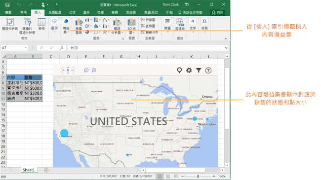
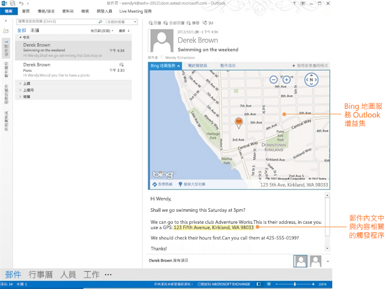
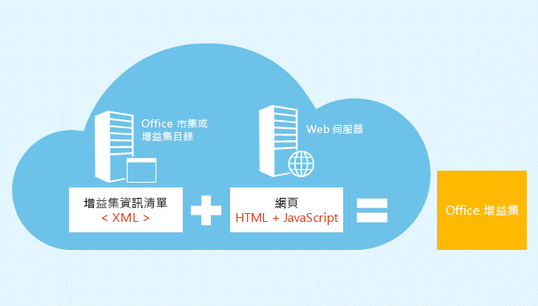
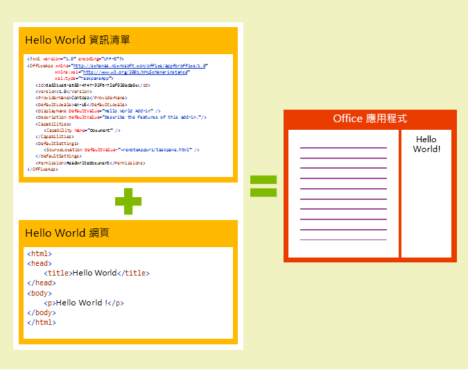

# Office 增益集平台概觀

Office 增益集使用 HTML、CSS 及 JavaScript 之類的 web 技術，讓您能夠擴充 Office 用戶端 (例如 Word、Excel、PowerPoint 及 Outlook)。 

您可以使用 Office 增益集來執行以下動作︰ 

-  **將新功能加入至 Office 用戶端** - 例如，藉由與 Office 文件與郵件項目互動、將外部資料帶入 Office、處理 Office 文件，以及將協力廠商功能公開至 Office 用戶端等其他許多功能，來加強 Word、Excel、PowerPoint 及 Outlook。 
    
-  **建立全新豐富的互動型物件，可將其內嵌於 Office 文件中** - 例如，地圖、圖表和互動式視覺效果，可讓使用者新增至自己的 Excel 試算表和 PowerPoint 簡報。
    
**Office 增益集可在多種 Office 版本上執行**包含 Office for Windows Desktop、Office Online、Mac 版 Office 以及 iPad 版 Office。

>**附註：**建立增益集時，如果您打算[發佈](../publish/publish.md)增益集至 Office 市集中，請確定您符合 [Office 市集驗證原則](https://msdn.microsoft.com/en-us/library/jj220035.aspx)。例如，若要通過驗證，增益集必須可以在所有的平台上運作，其平台支援您在資訊清單內 Requirements 元素中所定義的方法 (請參閱 [區段 4.12](https://msdn.microsoft.com/en-us/library/jj220035.aspx#Anchor_3))。

如需目前 Office 增益集受支援所在的高階檢視，請參閱 [Office 增益集主應用程式和平台可用性](http://dev.office.com/add-in-availability)頁面。 

## Office 增益集可以做什麼？

網頁能在瀏覽器中做的，Office 增益集幾乎都可以辦到，例如以下功能：

- 透過建立自訂功能區按鈕和索引標籤，以擴充 Office 原生 UI。

- 透過 HTML 和 JavaScript 提供互動式 UI 和自訂邏輯。
    
- 使用如 jQuery、Angular 和其他等 JavaScript 架構。
    
- 透過 HTTP 和 AJAX 連線到 REST 端點和 Web 服務。
    
- 執行伺服器端程式碼或邏輯，如果網頁是使用伺服器端指令碼語言 (如 ASP 或 PHP) 實作。
    

此外，Office 增益集可以透過 Office 增益集基礎結構提供的 [JavaScript API](../../docs/develop/understanding-the-javascript-api-for-office.md)，與 Office 應用程式和增益集使用者內容互動。 

## Office 增益集的類型

您可以建立下列類型的 Office 增益集：
 
- 可擴充功能的 Word、Excel 及 PowerPoint 增益集
- 可建立新物件的 Excel 及 PowerPoint 增益集
- 可擴充功能的 Outlook 增益集

### 可擴充功能的 Word、Excel 及 PowerPoint 增益集 
您可以**將新功能新增至** Word、Excel 或 PowerPoint，方法是使用[工作窗格增益集資訊清單](../design/add-in-commands.md)來登錄您的增益集。此資訊清單支援**兩種整合模式**：

- 增益集命令
- 可插入的工作窗格

####增益集命令
使用增益集命令來擴充 Office for Windows Desktop 與 Office Online 的 UI。例如，您可以在功能區或選取的操作功能表上新增**增益集的按鈕**，讓使用者能夠輕鬆地在 Office 中存取他們的增益集。命令按鈕可以啟動不同的動作，如**顯示具有自訂 HTML 的窗格 (或多個窗格)** 或**執行 JavaScript 函式**。我們建議您[觀賞這部 Channel9 影片](https://channel9.msdn.com/events/Build/2016/P551)，便可了解此功能更深入的概觀。

**內含在 Excel Desktop 中執行之命令的增益集**

**內含在 Excel Online 中執行之命令的增益集**

您也可以使用 **VersionOverrides** 在增益集資訊清單中定義您的命令。Office 平台負責將它們解譯至原生 UI。若要開始使用，請檢查在 GitHub 上的這些[範例](https://github.com/OfficeDev/Office-Add-in-Commands-Samples/)，並查看 [Excel、Word，和 PowerPoint 的增益集命令](../design/add-in-commands.md)

####可插入的工作窗格
尚未支援增益集命令的用戶端 (Office 2013、Office for Mac 和 Office for iPad) 會使用資訊清單中提供的 **DefaultUrl** 執行增益集作為**工作窗格**。可透過 [插入] 索引標籤的**我的增益集**功能表啟動增益集。 

>**重要事項︰**單一資訊清單可同時擁有兩種工作窗格增益集，一種可在不支援命令的用戶端中執行，以及可使用命令執行的版本。這可讓您擁有的單一增益集可在支援 Office 增益集的所有用戶端上運作。
 
###可建立新物件的 Excel 及 PowerPoint 增益集 

使用內容增益集資訊清單來整合**可在文件中嵌入的 web 型物件**。內容增益集讓您整合豐富、web 型資料視覺效果、嵌入媒體 (像是 YouTube 影片播放器或圖像藝廊) 和其他外部內容。

**內容增益集**

若要在 Excel 2013 或 Excel Online 中嘗試內容增益集，請安裝 [Bing 地圖服務](https://store.office.com/bing-maps-WA102957661.aspx?assetid=WA102957661)增益集。

### 可擴充功能的 Outlook 增益集

Outlook 增益集可擴充 Office 功能區，在您檢視或撰寫時也會在 Outlook 項目旁顯示內容。在讀取案例中 (使用者檢視收到的項目) 或在撰寫案例中 (使用者回覆或建立新項目)，這些增益集可以用在電子郵件訊息、會議邀請、會議回覆、會議取消或預約。 

Outlook 增益集可以存取項目的內容資訊，例如地址或追蹤識別碼，然後使用該資料來存取伺服器上以及來自 web 服務的其他資訊，來打造絕佳的使用者經驗。在大部分的情況下，Outlook 增益集不需修改即可在各種支援主應用程式上 (包括 Outlook、Outlook for Mac、Outlook Web App，和裝置的 OWA) 執行，來提供桌面、web、平板和行動裝置的完美體驗。

如需了解詳細資訊，請參閱 [Outlook 增益集](../outlook/outlook-add-ins.md)。

 >**附註**  Outlook 增益集需要至少為 Exchange 2013 或 Exchange Online 的版本，才能主控使用者的信箱。不支援 POP 和 IMAP 電子郵件帳戶。

**具有功能區上命令按鈕的 Outlook 增益集**

**關聯式 Outlook 增益集**

若要在 Outlook、Outlook for Mac，或 Outlook Web App 中嘗試 Outlook 增益集，請安裝 [Package Tracker](https://store.office.com/package-tracker-WA104162083.aspx?assetid=WA104162083) 增益集。

## Office 增益集的解析

Office 增益集的基本元件是 XML 資訊清單檔案和您自己的 web 應用程式。資訊清單會定義各種設定，包括如何將增益集與 Office 用戶端整合。您的 web 應用程式需要在 web 伺服器或 web 主控服務 (例如 [Microsoft Azure](../publish/host-an-office-add-in-on-microsoft-azure.md)) 上受到主控。

**資訊清單 + 網頁 = Office 增益集**

###資訊清單

資訊清單可指定增益集的設定及功能，例如下列：
    
- 增益集的顯示名稱、描述、識別碼、版本及預設地區設定。
    
- 增益集如何與 Office 整合：     
      - 若為可擴充 Word/Excel/PowerPoint/Outlook 的增益集：增益集用來公開功能 (例如功能區上的按鈕) 的原生擴充點。     
      - 若為可新增可嵌入物件的增益集：載入之預設網頁的物件 URL。
       
    
- 增益集的權限層級和資料存取需求。
    
如需詳細資訊，請參閱 [Office 增益集 XML 資訊清單](../../docs/overview/add-in-manifests.md)。

###Web 應用程式

相容 web 應用程式的版本至少為靜態的 HTML 網頁。頁面可在任何 web 伺服器或 web 主控服務 (例如 [Microsoft Azure](../publish/host-an-office-add-in-on-microsoft-azure.md)) 上受到主控。您可以在選擇的服務上主控您的 web 應用程式。  

最基本的 Office 增益集是由 Office 應用程式內顯示的靜態 HTML 網頁所組成，但不會與 Office 文件或任何其他網際網路資源進行互動。不過，因為它是 web 應用程式，您可以在用戶端和伺服器端使用主控提供者所支援的任何技術 (例如 ASP.net、PHP 或 Node.js)。若要與 Office 用戶端和文件互動，您可以使用我們提供的 office.js [JavaScript API](../../docs/develop/understanding-the-javascript-api-for-office.md)。 

**Hello World Office 增益集的元件**

### JavaScript API

Word 和 Excel JavaScript API 提供您可在 Office 增益集中使用之主應用程式特定的物件模型。這些 API 提供已知物件 (如段落和活頁簿) 的存取權，如此可讓您更輕鬆地建立 Word 或 Excel 的增益集。若要深入了解這些 API，請參閱 [Word 增益集](../word/word-add-ins-programming-overview.md)和 [Excel 增益集](../excel/excel-add-ins-javascript-programming-overview.md)。

適用於 Office 的 JavaScript API 包含用於建立增益集及與 Office 內容和 Web 服務互動的物件和成員。

如需有關適用於 Office 的 JavaScript API 的詳細資訊，請參閱[了解適用於 Office 的 JavaScript API](../../docs/develop/understanding-the-javascript-api-for-office.md) 和[適用於 Office 的 JavaScript API](../../reference/javascript-api-for-office.md) 參考。
    
## 其他資源

- [Office 增益集的設計指導方針](../../docs/design/add-in-design.md)
    
- [API 參照](../../docs/develop/understanding-the-javascript-api-for-office.md)
    
