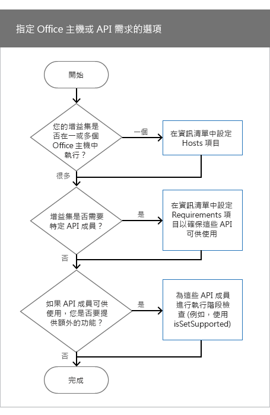

# <a name="specify-office-hosts-and-api-requirements"></a>指定 Office 主應用程式和 API 需求


若要讓 Office 增益集依預期運作，需取決於特定的 Office 主機、需求集合、API 成員或新版 API。例如，增益集可能︰

- 在單一 Office 應用程式 (Word 或 Excel) 或數個應用程式中執行。
    
- 只有某些版本的 Office 能使用 JavaScript API。例如，您可以在 Excel 2016 中執行的增益集中，使用 Excel JavaScript API。 
    
- 只在支援增益集使用的 API 成員的 Office 版本中執行。
    
這篇文章可協助您瞭解應選擇哪些選項，才能確保增益集如預期般運作，並盡可能接觸到最多觀眾。

>**附註︰**如需目前 Office 增益集受支援所在的高階檢視，請參閱 [Office 增益集主應用程式和平台可用性](http://dev.office.com/add-in-availability)頁面。 

下表列出本文全篇所討論的核心概念。


|**概念**|**描述**|
|:-----|:-----|
|Office 應用程式、Office 主應用程式、Office 主機或主機|用來執行增益集的 Office 應用程式。例如，Word、Word Online、Excel 等等。|
|平台|Office 主機的執行位置，例如 Office Online 或 Office for iPad。|
|需求集合|相關的 API 成員的命名群組。增益集使用需求集合來判斷 Office 主機是否支援增益集所使用的 API 成員。測試需求集合支援，比測試個別 API 成員支援更容易。需求集合支援會依 Office 主機和 Office 主機版本而異。 <br >需求集合是在資訊清單檔案中指定。當您在資訊清單中指定需求集合時，您會設定 Office 主機必須提供的 API 支援的最低層級，才能執行增益集。不支援資訊清單中指定的需求集合的 Office 主機無法執行增益集，且增益集不會顯示在<span class="ui">我的增益集</span>。這會限制您的增益集的可用位置。在使用執行階段檢查的程式碼中。如需需求集合的完整清單，請參閱 [Office 增益集需求集合](../../reference/office-add-in-requirement-sets.md)。|
|執行階段檢查|在執行階段執行測試，判斷執行增益集的 Office 主機是否支援增益集所使用的需求集合或方法。若要執行執行階段檢查，可使用 **if** 陳述式加上 **isSetSupported** 方法、需求集合，或不屬於需求集合的方法名稱。使用執行階段檢查以確保增益集接觸最廣泛的客戶。與需求集合不同，執行階段檢查不會指定 Office 主機必須提供的 API 支援最低層級，以便執行增益集。相反地，可使用 **if** 陳述式來決定是否支援 API 成員。如果是，可以在增益集中提供額外功能。使用執行階段檢查時，增益集一律會顯示在**我的增益集**中。|

## <a name="before-you-begin"></a>在您開始之前

增益集必須使用最新版的增益集資訊清單結構描述。如果在增益集中使用執行階段檢查，請確定使用最新的 JavaScript API for Office (office.js) 程式庫。


### <a name="specify-the-latest-add-in-manifest-schema"></a>指定最新的增益集資訊清單結構描述

增益集的資訊清單必須使用 1.1 版的增益集資訊清單結構描述。在增益集資訊清單中設定 **OfficeApp** 元素，如下所示。


```XML
<OfficeApp xmlns="http://schemas.microsoft.com/office/appforoffice/1.1" xmlns:xsi="http://www.w3.org/2001/XMLSchema-instance" xsi:type="TaskPaneApp">
```


### <a name="specify-the-latest-javascript-api-for-office-library"></a>指定最新的 JavaScript API for Office 程式庫


如果您使用執行階段檢查，請從內容傳遞網路 (CDN) 參考最新版的 JavaScript API for Office 程式庫。若要這麼做，請將下列 `script` 標記新增至您的 HTML。在 CDN URL 中使用 `/1/`，確保參考最新版 Office.js。


```HTML
<script src="https://appsforoffice.microsoft.com/lib/1/hosted/Office.js" type="text/javascript"></script>
```


## <a name="options-to-specify-office-hosts-or-api-requirements"></a>用於指定 Office 主機或 API 需求的選項

指定 Office 主機或 API 需求時，有幾個考慮因素。下圖顯示如何決定在增益集中使用哪一種技術。




- 如果增益集是在 Office 主機中執行，請在資訊清單中設定 **Hosts** 元素。如需詳細資訊，請參閱[設定 Hosts 元素](../../docs/overview/specify-office-hosts-and-api-requirements.md#set-the-hosts-element)。
    
- 若要設定最小需求集合或 API 成員，讓 Office 主機支援以執行增益集，請在資訊清單中設定 **Requirements** 元素。如需詳細資訊，請參閱[設定資訊清單中的 Requirements 元素](../../docs/overview/specify-office-hosts-and-api-requirements.md#set-the-requirements-element-in-the-manifest)。
    
- 如果您想要提供額外的功能 (如果 Office 主機中可使用特定的需求集合或 API 成員)，請在增益集的 JavaScript 程式碼中執行執行階段檢查。例如，若在 Excel 2016 中執行增益集，請從新的 JavaScript API for Excel 使用 API 成員以提供其他功能。如需詳細資訊，請參閱[在 JavaScript 程式碼中使用執行階段檢查](../../docs/overview/specify-office-hosts-and-api-requirements.md#use-runtime-checks-in-your-javascript-code)。
    

## <a name="set-the-hosts-element"></a>設定 Hosts 元素


若要在一個 Office 主應用程式中執行增益集，請在資訊清單中使用 **Hosts** 和 **Host** 元素。如果您未指定 **Hosts** 元素，增益集將在所有主應用程式中執行。

例如，下列 **Hosts** 和 **Host** 宣告會指定增益集將使用任何版本的 Excel，包括 Excel for Windows、Excel Online 和 Excel for iPad。


```XML
  <Hosts>
    <Host Name="Workbook" />
  </Hosts>
```

**Hosts** 元素可能包含一或多個 **Host** 元素。**Host** 元素可指定增益集需要的 Office 主機。**Name** 屬性是必要的，且可設定為下列一個值。


| 名稱          | Office 主應用程式                      |
|:--------------|:----------------------------------------------|
| 資料庫      | Access Web App                               |
| Document      | Word for Windows、Mac、iPad 及 Online        |
| 信箱       | Outlook for Windows、Mac、Web 及 Outlook.com | 
| Presentation  | PowerPoint for Windows、Mac、iPad 及 Online  |
| Project       | Project                                       |
| 活頁簿      | Excel Windows、Mac、iPad 及 Online           |

 >**附註：**`Name` 屬性可指定能執行增益集的 Office 主應用程式。Office 主機支援不同平台，而且可以在桌上型電腦、網頁瀏覽器、平板電腦和行動裝置上執行。您無法指定哪個平台可用來執行增益集。例如，如果您指定 `Mailbox`，Outlook 和 Outlook Web App 都可以用來執行增益集。 


## <a name="set-the-requirements-element-in-the-manifest"></a>設定資訊清單中的 Requirements 元素


**Requirements** 元素會指定執行增益集時，Office 主機必須支援的最小需求集合或 API 成員。**Requirements** 元素可指定用於增益集中的需求集合和個別方法。在 1.1 版增益集資訊清單結構描述中，**Requirements** 元素對所有增益集是選用的，Outlookadd 增益集除外。


 >**注意：**只能使用 **Requirements** 元素以指定增益集必須使用的關鍵需求集合或 API 成員。如果 Office 主機或平台不支援 **Requirements** 元素中指定的需求集合或 API 成員，增益集將不會在該主機或平台上執行，且不會顯示在**我的增益集**中。相反地，我們建議您將增益集設為可在 Office 主機的所有平台上執行，例如 Excel for Windows、Excel Online 和 Excel for iPad。若要使增益集能在_所有_ Office 主機和平台上使用，請使用執行階段檢查而非 **Requirements** 元素。

下列程式碼範例會顯示支援下列項目的所有 Office 主應用程式中載入的增益集：


-  **TableBindings** 需求集合，有 1.1 的最小版本。
    
-  **OOXML** 需求集合，有 1.1 的最小版本。
    
-  **Document.getSelectedDataAsync** 方法。
    


```XML
<Requirements>
   <Sets DefaultMinVersion="1.1">
      <Set Name="TableBindings" MinVersion="1.1"/>
      <Set Name="OOXML" MinVersion="1.1"/>
   </Sets>
   <Methods>
      <Method Name="Document.getSelectedDataAsync"/>
   </Methods>
</Requirements>
```

- **Requirements** 元素包含 **Sets** 和 **Methods** 子元素。
    
- **Sets** 元素可以包含一或多個 **Set** 元素。**DefaultMinVersion** 指定所有 **Set** 子元素的預設 **MinVersion** 值。
    
- **Set** 元素會指定執行增益集時，Office 主機必須支援的需求集合。**Name** 屬性會指定需求集合的名稱。**MinVersion** 指定需求集合的最小版本。**MinVersion** 會覆寫 **DefaultMinVersion** 的值。如需有關需求集合和 API 成員所屬的需求集合版本的詳細資訊，請參閱 [Office 增益集需求集合](../../reference/office-add-in-requirement-sets.md)。
    
- **Methods** 元素可以包含一或多個 **Method** 元素。您不能搭配使用 **Methods** 元素與 Outlook 增益集。
    
- **Method** 元素會指定執行增益集的 Office 主機中必須支援的個別方法。**Name** 屬性是必要的，並且指定與其父物件相符的方法名稱。
    

## <a name="use-runtime-checks-in-your-javascript-code"></a>在 JavaScript 程式碼中使用執行階段檢查


如果 Office 主機支援特定的需求集合，您可能想要在增益集中提供額外的功能。比方說，如果增益集是在 Word 2016 中執行，您可能會想要在現有的增益集中使用新的 Word JavaScript API。若要執行這項操作，請使用包含需求集合名稱的 **isSetSupported** 方法。**isSetSupported** 會在執行階段判斷執行增益集的 Office 主機是否支援需求集合。如果支援需求集合，**isSetSupported** 會傳回 **true** 並執行額外的程式碼，從該需求集合中使用 API 成員。如果 Office 主機不支援需求集合，**isSetSupported** 會傳回 **false**，並且不會執行額外程式碼。下列程式碼顯示要使用 **isSetSupported** 的語法。


```js
if (Office.context.requirements.isSetSupported(RequirementSetName , VersionNumber )
{
   // Code that uses API members from RequirementSetName .
}

```


-  _RequirementSetName_ (必要) 是表示需求集合名稱的字串。如需有關可用的需求集合詳細資訊，請參閱 [Office 增益集需求集合](../../reference/office-add-in-requirement-sets.md)。
    
-  _VersionNumber_ (選擇性) 是需求集合的版本。
    
在 Excel 2016 或 Word 2016 中，搭配使用 **isSetSupported** 與 **ExcelAPI** 或 **WordAPI** 需求集合。**isSetSupported** 方法，以及 **ExcelAPI** 和 **WordAPI** 需求集合，皆可從 CDN 的最新 Office.js 檔案中取得。如果不從 CDN 使用 Office.js，由於 **isSetSupported** 將是未定義，因此增益集可能會產生例外狀況。如需詳細資訊，請參閱[指定最新的 JavaScript API for Office 程式庫](../../docs/overview/specify-office-hosts-and-api-requirements.md#specify-the-latest-javascript-api-for-office-library)。 


 >**附註：**   **isSetSupported** 不適用於 Outlook 或 Outlook Web App。若要在 Outlook 或 Outlook Web App 中使用執行階段檢查，請使用[使用非需求集合中方法的執行階段檢查](../../docs/overview/specify-office-hosts-and-api-requirements.md#runtime-checks-using-methods-not-in-a-requirement-set)中所述的技術。

下列程式碼範例顯示增益集如何為可能支援不同需求集合或 API 成員的不同 Office 主機，提供不同的功能。


```js
if (Office.context.requirements.isSetSupported('WordApi', 1.1)
{
    // Run code that provides additional functionality using the JavaScript API for Word when the add-in runs in Word 2016.
}
else if (Office.context.requirements.isSetSupported('CustomXmlParts')
{
      // Run code that uses API members from the CustomXmlParts requirement set.
}
else 
{
    // Run additional code when the Office host is not Word 2016, and when the Office host does not support the CustomXmlParts requirement set.
}

```


## <a name="runtime-checks-using-methods-not-in-a-requirement-set"></a>使用非需求集合中方法的執行階段檢查


某些 API 成員不隸屬於需求集合。這只適用於 [JavaScript API for Office](../../reference/javascript-api-for-office.md) 命名空間的 API 成員 (Office. 下的任何內容)，不適用於隸屬於 Word JavaScript API (Word. 中的任何內容) 或 [Excel 增益集 JavaScript API 參考](https://msdn.microsoft.com/library/office/mt616490.aspx) (Excel. 中的任何內容) 命名空間的 API 成員。當增益集取決於非需求集合的方法時，您可以使用執行階段檢查來決定方法是否受 Office 主機支援，如下列程式碼範例所示。如需不屬於需求集合之方法的完整清單，請參閱 [Office 增益集需求集合](../../reference/office-add-in-requirement-sets.md)。


 >**附註**  我們建議您限制這種類型的執行階段檢查在增益集的程式碼中的使用。

下列程式碼範例會檢查主機是否支援 **document.setSelectedDataAsync**。


```js
if (Office.context.document.setSelectedDataAsync)
{
    // Run code that uses document.setSelectedDataAsync.
}
```


## <a name="additional-resources"></a>其他資源


- [Office 增益集的 XML 資訊清單](../../docs/overview/add-in-manifests.md)
    
- [Office 增益集需求集合](../../reference/office-add-in-requirement-sets.md)
    
- [Word-Add-in-Get-Set-EditOpen-XML ](https://github.com/OfficeDev/Word-Add-in-Get-Set-EditOpen-XML)
    
