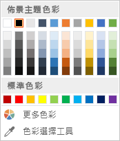
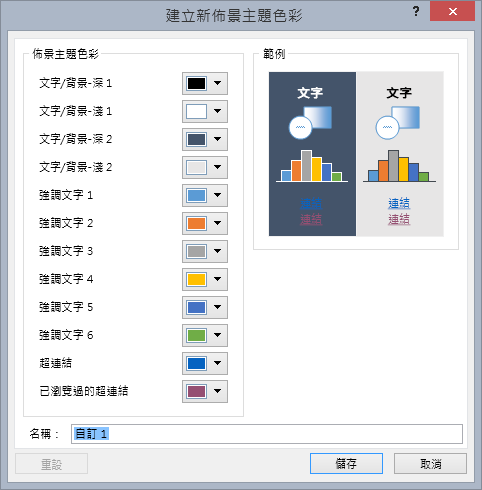
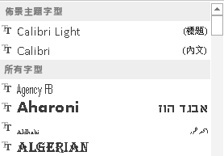
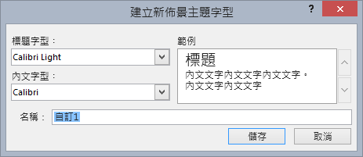
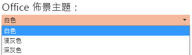
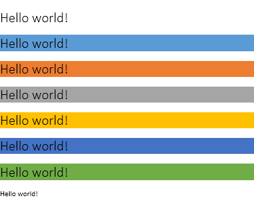
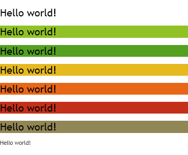
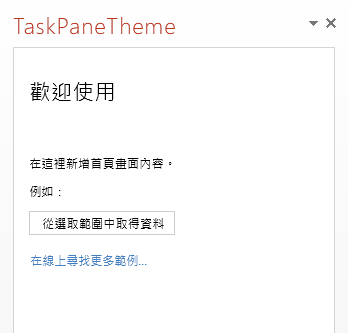
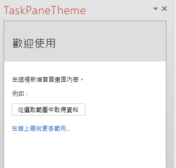
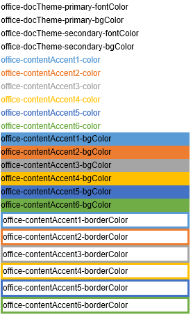

# <a name="use-document-themes-in-your-powerpoint-add-ins"></a>使用您 PowerPoint 增益集的文件佈景主題


[Office 佈景主題](https://support.office.com/en-US/Article/What-is-a-theme--7528ccc2-4327-4692-8bf5-9b5a3f2a5ef5)部分包含視覺上協調的字型和色彩集，您可以套用至簡報、 文件、工作表和電子郵件。若要套用或自訂 PowerPoint 中簡報的佈景主題，可使用功能區的 [設計] 索引標籤上的 [佈景主題] 和 [變數] 群組。PowerPoint 會指派包含預設 **Office 佈景主題**的新空白簡報，但您可以在 [設計] 索引標籤上選擇其他可用的佈景主題、從 Office.com 下載其他佈景主題，或建立並自訂自己的佈景主題。

使用 OfficeThemes.css，以兩種方式協助您設計協調 PowerPoint 的增益集：


-  **在 PowerPoint 的內容增益集中** 使用 OfficeThemes.css 的文件佈景主題類別來指定字型和色彩，以符合內容增益集插入之簡報的佈景主題；如果使用者變更或自訂簡報的佈景主題，字型和色彩將會動態更新。
    
-  **在 PowerPoint 的工作窗格增益集中** 使用 OfficeThemes.css 的 Office UI 佈景主題類別來指定 UI 中的相同字型和背景色彩，使工作窗格增益集符合內建工作窗格的色彩；且如果使用者變更 Office UI 佈景主題，這些色彩會動態更新。
    

### <a name="document-theme-colors"></a>文件佈景主題色彩

每個 Office 文件佈景主題定義 12 種色彩。當您使用色彩選擇器來設定簡報的字型、背景及其他色彩時，可使用其中十種色彩︰




若要在 PowerPoint 中檢視或自訂整組 12 種佈景主題色彩，在 [設計] 索引標籤的 [變數] 群組上，按一下 [其他] 下拉式清單，然後指向 [色彩]，再按一下 [自訂色彩] 來顯示 [建立新佈景主題色彩] 對話方塊︰




前四個色彩適用於文字和背景。使用淡色建立的文字一律會穿透深色，而使用深色建立的文字一律會穿透淡色。接下來是六個符號色彩，一律可在四種潛在的背景色彩上顯現。最後兩種色彩適用於超連結及已瀏覽過的超連結。


### <a name="document-theme-fonts"></a>文件佈景主題字型

每個 Office 文件佈景主題也會定義兩種字型，分別適用於標題和本文。PowerPoint 會使用這些字型來建構自動文字樣式。此外，**快速樣式**圖庫適用於文字，且**文字藝術師**會使用這些相同的佈景主題字型。使用字型選擇器選取字型時，這兩種字型會做為前兩個選項：




若要在 PowerPoint 中檢視或自訂佈景主題色彩，在 [設計] 索引標籤的 [變數] 群組上，按一下 [其他] 下拉式清單，然後指向 [字型]，再按一下 [自訂字型] 來顯示 [建立新佈景主題字型] 對話方塊。





### <a name="office-ui-theme-fonts-and-colors"></a>Office UI 佈景主題字型和色彩

Office 也能讓您在數個預先定義的佈景主題之間選擇，指定在所有 Office 應用程式的 UI 中使用的一些色彩和字型。若要這樣做，請使用 [檔案] > **[帳戶]** > **[Office 佈景主題]** 下拉式清單 (從任何 Office 應用程式)。




OfficeThemes.css 包含類別，您可以用在 PowerPoint 的工作窗格增益集，讓它們使用這些相同的字型和色彩。這可讓您設計符合內建工作窗格外觀的工作窗格和增益集。


## <a name="using-officethemes.css"></a>使用 OfficeThemes.css

將 OfficeThemes.css 檔案與 PowerPoint 的內容增益集搭配使用，可讓您協調增益集的外觀與套用至其目前執行之簡報的佈景主題。將 OfficeThemes.css 檔案與 PowerPoint 的工作窗格增益集搭配使用，可讓您協調增益集的外觀與 Office UI 的字型和色彩。


### <a name="adding-the-officethemes.css-file-to-your-project"></a>將 OfficeThemes.css 檔案加入至專案

請使用下列步驟來新增及參考 OfficeThemes.css 檔案至您的增益集專案。


### <a name="to-add-officethemes.css-to-your-visual-studio-project"></a>新增 OfficeThemes.css 專案至 Visual Studio 專案


1. 在 [方案總管] 中，以滑鼠右鍵按一下 _**project_name**_**Web** 專案中的 [Content] 資料夾，指向 [新增]，然後按一下 [樣式表]。
    
2. 命名新的樣式表 OfficeThemes。
    
     >**重要事項**  樣式表必須命名為 OfficeThemes，否則負責在使用者變更佈景主題時動態更新增益集字型和色彩的功能將無法運作。
3. 刪除檔案中的預設 **body** 類別 (`body {}`)，並複製及貼上下列的 CSS 程式碼到檔案。
    
```
  /* The following classes describe the common theme information for office documents */ /* Basic Font and Background Colors for text */ .office-docTheme-primary-fontColor { color:#000000; } .office-docTheme-primary-bgColor { background-color:#ffffff; } .office-docTheme-secondary-fontColor { color: #000000; } .office-docTheme-secondary-bgColor { background-color: #ffffff; } /* Accent color definitions for fonts */ .office-contentAccent1-color { color:#5b9bd5; } .office-contentAccent2-color { color:#ed7d31; } .office-contentAccent3-color { color:#a5a5a5; } .office-contentAccent4-color { color:#ffc000; } .office-contentAccent5-color { color:#4472c4; } .office-contentAccent6-color { color:#70ad47; } /* Accent color for backgrounds */ .office-contentAccent1-bgColor { background-color:#5b9bd5; } .office-contentAccent2-bgColor { background-color:#ed7d31; } .office-contentAccent3-bgColor { background-color:#a5a5a5; } .office-contentAccent4-bgColor { background-color:#ffc000; } .office-contentAccent5-bgColor { background-color:#4472c4; } .office-contentAccent6-bgColor { background-color:#70ad47; } /* Accent color for borders */ .office-contentAccent1-borderColor { border-color:#5b9bd5; } .office-contentAccent2-borderColor { border-color:#ed7d31; } .office-contentAccent3-borderColor { border-color:#a5a5a5; } .office-contentAccent4-borderColor { border-color:#ffc000; } .office-contentAccent5-borderColor { border-color:#4472c4; } .office-contentAccent6-borderColor { border-color:#70ad47; } /* links */ .office-a { color: #0563c1; } .office-a:visited { color: #954f72; } /* Body Fonts */ .office-bodyFont-eastAsian { } /* East Asian name of the Font */ .office-bodyFont-latin { font-family:"Calibri"; } /* Latin name of the Font */ .office-bodyFont-script { } /* Script name of the Font */ .office-bodyFont-localized { font-family:"Calibri"; } /* Localized name of the Font. Corresponds to the default font of the culture currently used in Office.*/ /* Headers Font */ .office-headerFont-eastAsian { } .office-headerFont-latin { font-family:"Calibri Light"; } .office-headerFont-script { } .office-headerFont-localized { font-family:"Calibri Light"; } /* The following classes define font and background colors for Office UI themes. These classes should only be used in task pane add-ins */ /* Basic Font and Background Colors for PPT */ .office-officeTheme-primary-fontColor { color:#b83b1d; } .office-officeTheme-primary-bgColor { background-color:#dedede; } .office-officeTheme-secondary-fontColor { color:#262626; } .office-officeTheme-secondary-bgColor { background-color:#ffffff; } 
```

4. 如果您使用 Visual Studio 以外的工具來建立增益集，請從步驟 3 將 CSS 程式碼複製到文字檔，確認將檔案儲存為 OfficeThemes.css。
    

### <a name="referencing-officethemes.css-in-your-add-in's-html-pages"></a>在增益集的 HTML 網頁中參考 OfficeThemes.css

若要在 OfficeThemes.css 檔案中使用 OfficeThemes.css 檔案，請新增 `<link>` 標記來參考網頁之 `<head>` 標記內部的 OfficeThemes.css 檔案 (例如 .html、.aspx 或 .php 檔案)，其實作下列格式的增益集 UI：


```HTML
<link href="<local_path_to_OfficeThemes.css> " rel="stylesheet" type="text/css" />
```

要在 Visual Studio 中執行這項操作，請依照下列步驟執行。


### <a name="to-reference-officethemes.css-in-your-add-in-for-powerpoint"></a>在 PowerPoint 的增益集中參考 OfficeThemes.css


1. 在 Visual Studio 2015 中，開啟或建立新的 **Office 增益集**專案。
    
2. 在實作增益集 UI 的 HTML 網頁，例如預設範本中的 Home.html，在參考 OfficeThemes.css 檔案的 `<head>` 標記中新增下列 `<link>` 標記：
    
```HTML
  <link href="../../Content/OfficeThemes.css" rel="stylesheet" type="text/css" />
```

如果您要使用 Visual Studio 以外的工具建立增益集，請將指定相對路徑之相同格式的 `<link>` 標記，新增至將使用增益集部署的 OfficeThemes.css 複本。


### <a name="using-officethemes.css-document-theme-classes-in-your-content-add-in's-html-page"></a>在內容增益集的 HTML 網頁中使用 OfficeThemes.css 文件佈景主題類別

以下顯示使用 OfficeTheme.css 文件佈景主題類別的內容增益集中的 HTML 簡單範例。如需對應到文件佈景主題中使用的 12 種色彩和 2 種字型的 OfficeThemes.css 類別詳細資訊，請參閱[內容增益集的佈景主題類別](#theme-classes-for-content-add-ins)。


```HTML
<body> <div id="themeSample" class="office-docTheme-primary-fontColor "> <h1 class="office-headerFont-latin">Hello world!</h1> <h1 class="office-headerFont-latin office-contentAccent1-bgColor">Hello world!</h1> <h1 class="office-headerFont-latin office-contentAccent2-bgColor">Hello world!</h1> <h1 class="office-headerFont-latin office-contentAccent3-bgColor">Hello world!</h1> <h1 class="office-headerFont-latin office-contentAccent4-bgColor">Hello world!</h1> <h1 class="office-headerFont-latin office-contentAccent5-bgColor">Hello world!</h1> <h1 class="office-headerFont-latin office-contentAccent6-bgColor">Hello world!</h1> <p class="office-bodyFont-latin office-docTheme-secondary-fontColor">Hello world!</p> </div> </body>
```

在執行階段，插入使用預設 **Office 佈景主題**的簡報時，內容增益集呈現如下︰




如果變更簡報來使用另一個佈景主題或自訂簡報的佈景主題，使用 OfficeThemes.css 類別指定的字型和色彩會動態更新，以對應到簡報的佈景主題的字型及色彩。如上所述使用相同的 HTML 範例，如果插入增益集的簡報使用 **Facet** 佈景主題，增益集會呈現下列類似外觀 ︰





### <a name="using-officethemes.css-office-ui-theme-classes-in-your-task-pane-add-in's-html-page"></a>在工作窗格增益集的 HTML 網頁中使用 OfficeThemes.css Office UI 佈景主題類別

除了文件佈景主題外，使用者可以使用 [檔案] > **[帳戶]** > **[Office 佈景主題]** 下拉式方塊，為所有 Office 應用程式自訂 Office 使用者介面的色彩配置。

下列會在使用 OfficeTheme.css 類別的工作窗格增益集中顯示 HTML 的簡單範例，以指定字型色彩和背景色彩。如需對應到 Office UI 佈景主題的字型和色彩的 OfficeThemes.css 類別詳細資訊，請參閱[工作窗格增益集的佈景主題類別](#theme-classes-for-task-pane-add-ins)。


```HTML
<body> <div id="content-header" class="office-officeTheme-primary-fontColor office-officeTheme-primary-bgColor"> <div class="padding"> <h1>Welcome</h1> </div> </div> <div id="content-main" class="office-officeTheme-secondary-fontColor office-officeTheme-secondary-bgColor"> <div class="padding"> <p>Add home screen content here.</p> <p>For example:</p> <button id="get-data-from-selection">Get data from selection</button> <p> <a target="_blank" class="office-a" href="https://go.microsoft.com/fwlink/?LinkId=276812"> Find more samples online... </a> </p> </div> </div> </body> 
```

使用 [檔案] > **[帳戶]** > **[Office 佈景主題]** 設定為 [白色]，在 PowerPoint 中執行時，工作窗格增益集如下所示︰




如果將 [OfficeTheme] 變更 [深灰色]，OfficeThemes.css 類別指定的色彩與字型會動態更新以呈現︰





## <a name="officetheme.css-classes"></a>OfficeTheme.css 類別


OfficeThemes.css 檔案包含兩組類別，您可與 PowerPoint 的內容和工作窗格增益集搭配使用。


### <a name="theme-classes-for-content-add-ins"></a>內容增益集的佈景主題類別


OfficeThemes.css 檔案會提供對應至文件佈景主題中使用的 2 種字型和 12 種色彩的類別。這些類別適用於 PowerPoint 的內容增益集，讓增益集的字型和色彩與其插入的簡報維持一致。


**內容增益集的佈景主題字型**


|**類別**|**描述**|
|:-----|:-----|
| `office-bodyFont-eastAsian`|本文字型的東亞名稱。|
| `office-bodyFont-latin`|本文字型的拉丁文名稱。預設「Calabri」|
| `office-bodyFont-script`|本文字型的指令碼名稱。|
| `office-bodyFont-localized`|本文字型的當地語系化名稱。根據 Office 中目前使用的文化來指定預設的字型名稱。|
| `office-headerFont-eastAsian`|標題字型的東亞語言名稱。|
| `office-headerFont-latin`|標題字型的拉丁文名稱。預設「Calabri Light」|
| `office-headerFont-script`|標題字型的指令碼名稱。|
| `office-headerFont-localized`|標題字型的當地語系化名稱。根據 Office 中目前使用的文化來指定預設的字型名稱。|

**內容增益集的佈景主題色彩**


|**類別**|**描述**|
|:-----|:-----|
| `office-docTheme-primary-fontColor`|主要字型色彩。預設 #000000|
| `office-docTheme-primary-bgColor`|主要字型的背景色彩。預設 #FFFFFF|
| `office-docTheme-secondary-fontColor`|次要字型色彩。預設 #000000|
| `office-docTheme-secondary-bgColor`|次要字型背景色彩。預設 #FFFFFF|
| `office-contentAccent1-color`|字型符號色彩 1。預設 #5B9BD5|
| `office-contentAccent2-color`|字型符號色彩 2。預設 #ED7D31|
| `office-contentAccent3-color`|字型符號色彩 3。預設 #A5A5A5|
| `office-contentAccent4-color`|字型符號色彩 4。預設 #FFC000|
| `office-contentAccent5-color`|字型符號色彩 5。預設 #4472C4|
| `office-contentAccent6-color`|字型符號色彩 6。預設 #70AD47|
| `office-contentAccent1-bgColor`|背景符號色彩 1。預設 #5B9BD5|
| `office-contentAccent2-bgColor`|背景符號色彩 2。預設 #ED7D31|
| `office-contentAccent3-bgColor`|背景符號色彩 3。預設 #A5A5A5|
| `office-contentAccent4-bgColor`|背景符號色彩 4。預設 #FFC000|
| `office-contentAccent5-bgColor`|背景符號色彩 5。預設 #4472C4|
| `office-contentAccent6-bgColor`|背景符號色彩 6。預設 #70AD47|
| `office-contentAccent1-borderColor`|框線符號色彩 1。預設 #5B9BD5|
| `office-contentAccent2-borderColor`|框線符號色彩 2。預設 #ED7D31|
| `office-contentAccent3-borderColor`|框線符號色彩 3。預設 #A5A5A5|
| `office-contentAccent4-borderColor`|框線符號色彩 4。預設 #FFC000|
| `office-contentAccent5-borderColor`|框線符號色彩 5。預設 #4472C4|
| `office-contentAccent6-borderColor`|框線符號色彩 6。預設 #70AD47|
| `office-a`|超連結色彩。預設值 #0563C1|
| `office-a:visited`|已瀏覽過的超連結色彩。預設 #954F72|
下列螢幕擷取畫面顯示使用預設的 Office 佈景主題時，指定給增益集文字的所有佈景主題色彩類別 (兩種超連結色彩除外) 的範例。





### <a name="theme-classes-for-task-pane-add-ins"></a>工作窗格增益集的佈景主題類別


OfficeThemes.css 檔案會提供對應到 4 種色彩的類別，這些色彩指定給 Office 應用程式 UI 佈景主題所使用的字型和背景。這些類別適用於 PowerPoint 的工作窗格增益集，讓增益集的色彩與 Office 中其他內建的工作窗格維持一致。


**工作窗格增益集的佈景主題字型和背景色彩**


|**類別**|**描述**|
|:-----|:-----|
| `office-officeTheme-primary-fontColor`|主要字型色彩。預設：#B83B1D|
| `office-officeTheme-primary-bgColor`|主要背景色彩。預設 #DEDEDE|
| `office-officeTheme-secondary-fontColor`|次要字型色彩。預設 #262626|
| `office-officeTheme-secondary-bgColor`|次要背景色彩。預設 #FFFFFF|

## <a name="additional-resources"></a>其他資源

- [建立 PowerPoint 的內容和工作窗格增益集](../powerpoint/powerpoint-add-ins.md)
