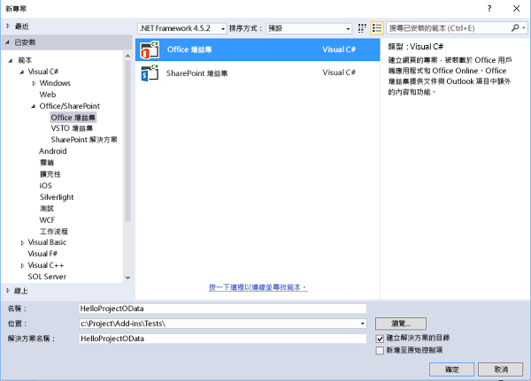
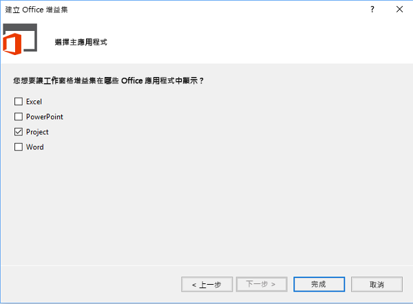
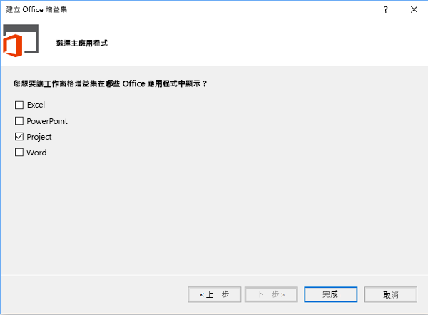
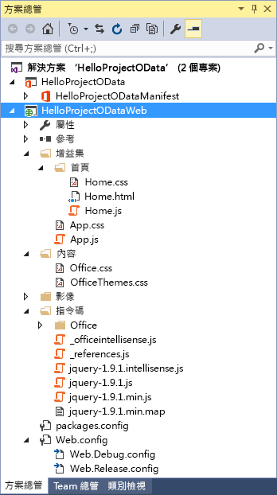
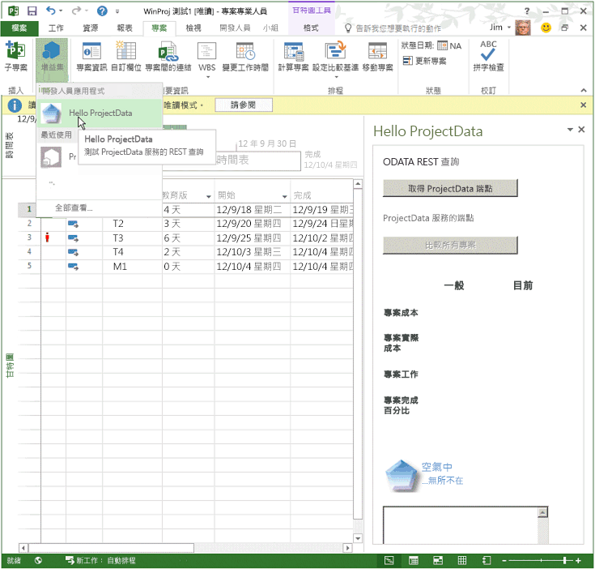
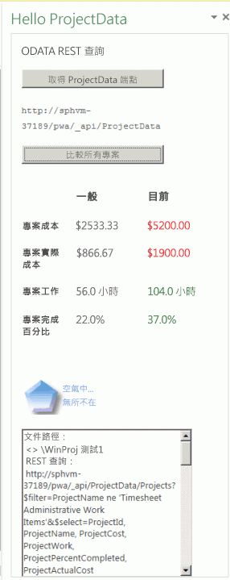
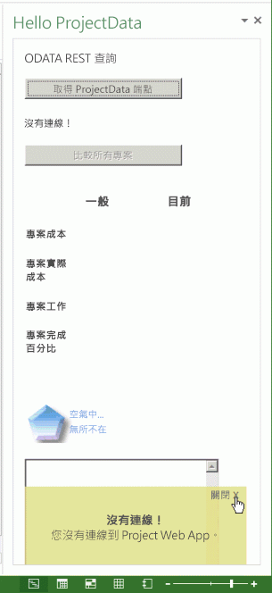
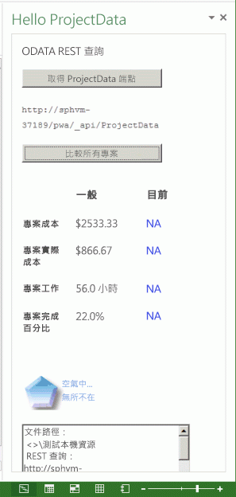

# <a name="create-a-project-add-in-that-uses-rest-with-an-on-premises-project-server-odata-service"></a>建立會以內部部署 Project Server OData 服務來使用 REST 的 Project 增益集

本文說明如何建置 Project Professional 2013 的工作窗格增益集，可將使用中專案中的成本和工作資料，與目前的 Project Web App 執行個體的所有專案平均值做比較。增益集使用 REST 與 jQuery 程式庫來存取 Project Server 2013 中的 **ProjectData** OData 報告服務。


本文的程式碼是根據 Microsoft Corporatio 的 Saurabh Sanghvi 和 Arvind Iyer 所開發的範例。

## <a name="prerequisites-for-creating-a-task-pane-add-in-that-reads-project-server-reporting-data"></a>建立讀取 Project Server 報告資料的工作窗格增益集的必要條件


以下是建立 Project 工作窗格增益集，在 Project Server 2013 的內部部署安裝中讀取 Project Web App 執行個體的 **ProjectData** 服務的必要條件。


- 請確定已在本機開發電腦上安裝最新的 Service Pack 和 Windows 更新。作業系統可為 Windows 7、Windows 8、Windows Server 2008 或 Windows Server 2012。
    
- 需要 Project Professional 2013 才能連線 Project Web App。開發電腦必須安裝 Project Professional 2013 才能使用 Visual Studio啟用 **F5** 偵錯。
    
     >**附註**  Project Standard 2013 還可以主控工作窗格增益集，但無法登入到 Project Web App。
- 隨附 Office Developer Tools for Visual Studio 的 Visual Studio 2015 包括用於建立 Office 和 SharePoint 增益集的範本。請確定您已安裝最新版的 Office 開發人員工具；請參閱 _Office 增益集和 SharePoint 下載_的[工具](http://msdn.microsoft.com/en-us/office/apps/fp123627.aspx)一節 。
    
- 本文的程序和程式碼範例可存取本機網域中 Project Server 2013 的 **ProjectData** 服務。本文中的 jQuery 方法不適用於 Project Online。
    
    驗證您的開發電腦可存取 **ProjectData** 服務。
    

### <a name="procedure-1-to-verify-that-the-projectdata-service-is-accessible"></a>程序 1.確定可存取 ProjectData 服務


1- 若要讓您的瀏覽器直接顯示 REST 查詢的 XML 資料，請關閉摘要讀取檢視。如需如何在 Internet Explorer 中執行這項操作的詳細資訊，請參閱[查詢專案報告資料的 OData 摘要](http://msdn.microsoft.com/library/3eafda3b-f006-48be-baa6-961b2ed9fe01%28Office.15%29.aspx)中的程序 1、步驟 4。
    
2- 使用瀏覽器與下列 URL 來查詢 **ProjectData** 服務：**http://ServerName /ProjectServerName /_api/ProjectData**。例如，如果 Project Web App 執行個體是 `http://MyServer/pwa`，瀏覽器會顯示下列結果︰
    
```xml
     <?xml version="1.0" encoding="utf-8"?>
        <service xml:base="http://myserver/pwa/_api/ProjectData/" 
        xmlns="http://www.w3.org/2007/app" 
        xmlns:atom="http://www.w3.org/2005/Atom">
        <workspace>
            <atom:title>Default</atom:title>
            <collection href="Projects">
                <atom:title>Projects</atom:title>
            </collection>
            <collection href="ProjectBaselines">
                <atom:title>ProjectBaselines</atom:title>
            </collection>
            <!-- ... and 33 more collection elements -->
        </workspace>
        </service>
```
3- 您可能必須提供您的網路認證才會看到結果。如果瀏覽器顯示「錯誤 403，拒絕存取」，則您可能沒有該 Project Web App 執行個體的登入權限，或發生需要系統管理員協助的網路問題。
    

## <a name="using-visual-studio-to-create-a-task-pane-add-in-for-project"></a>使用 Visual Studio 建立 Project 的工作窗格增益集

Office Developer Tools for Visual Studio 包括 Project 2013 的工作窗格增益集的範本。如果您建立名為 **HelloProjectOData** 的解決方案，該解決方案中含有下列兩個 Visual Studio 專案︰


- 增益集專案採用解決方案的名稱。它包含增益集的 XML 資訊清單檔並選定 .NET Framework 4.5。程序 3 顯示如何修改 **HelloProjectOData** 增益集之資訊清單的步驟  。
    
- Web 專案名為 **HelloProjectODataWeb**。它可以在工作窗格中包含網頁、JavaScript 檔案、CSS 檔案、影像、參考和 Web 內容的組態檔。Web 專案選定 .NET Framework 4。程序 4 和 5 顯示如何修改 Web 專案中的檔案，以建立 **HelloProjectOData** 增益集的功能。
    

### <a name="procedure-2-to-create-the-helloprojectodata-add-in-for-project"></a>程序 2.建立 Project 的 HelloProjectOData 增益集


1. 以系統管理員身分執行 Visual Studio 2015，然後在 [開始] 頁面上選擇 [新專案]****。
    
2. 在 [新專案]**** 對話方塊方塊中，依序展開 [範本]****、[Visual C#]**** 和 [Office/SharePoint]**** 節點，然後選取 [Office 增益集]****。在中間窗格的目標架構下拉式清單中選取 [.NET Framework 4.5.2]****，然後選取 [Office 增益集]**** (請參閱下一個螢幕擷取畫面)。
    
3. 若要將這兩個 Visual Studio 專案放在相同的目錄，請選取 [建立解決方案的目錄]****，然後瀏覽至您要的位置。
    
4. 在 [名稱]**** 欄位中鍵入 HelloProjectOData，然後選擇 [確定]****。
    
    **建立 Office 增益集**

    

5. 在 [選擇增益集類型]**** 對話方塊中，選取 [工作窗格]****，然後選擇 [下一步]**** (請參閱下一個螢幕擷取畫面)。
    
    **選擇要建立的增益集類型**

    

6. 在 [選擇主應用程式]**** 對話方塊中，清除 [專案]**** 核取方塊以外的所有核取方塊 (請參閱下一個螢幕擷取畫面)，然後選擇 [完成]****。
    
    **選擇主應用程式**

    
    
    Visual Studio 建立 **HelloProjectOdata** 專案和 **HelloProjectODataWeb** 專案。
    
**AddIn** 資料夾 (請參閱下一個螢幕擷取畫面) 包含自訂 CSS 樣式的 App.css 檔。在 **Home** 子資料夾中，Home.html 檔案包含 CSS 檔案的參考和增益集使用的 JavaScript 檔案，以及增益集的 HTML5 內容。此外，Home.js 檔適用於您自訂的 JavaScript 程式碼。**Scripts** 資料夾包含 jQuery 程式庫檔案。**Office** 子資料夾包括 JavaScript 程式庫 (例如 office.js 和 project-15.js)，加上 Office 增益集中標準字串的語言程式庫。在 **Content** 資料夾中，Office.css 檔案包含所有 Office 增益集的預設樣式。

**在方案總管中檢視預設的 Web 專案檔**



**HelloProjectOData** 專案的資訊清單是 HelloProjectOData.xml 檔案。您可以選擇性地修改資訊清單以新增增益集的說明、參考圖示、其他語言的資訊，及其他設定。程序 3 只會修改增益集顯示名稱和描述，並新增圖示。

如需資訊清單的詳細資訊，請參閱 [Office 增益集的 XML 資訊清單](../../docs/overview/add-in-manifests.md)和 [Office 增益集資訊清單的結構描述參考 (v1.1)](../overview/add-in-manifests.md)。


### <a name="procedure-3-to-modify-the-add-in-manifest"></a>程序 3.修改增益集資訊清單


1. 在 Visual Studio 中，開啟 HelloProjectOData.xml 檔案。
    
2. 預設的顯示名稱是 Visual Studio 專案的名稱 ("HelloProjectOData")。例如，將 **DisplayName** 元素的預設值變更為 "Hello ProjectData"。
    
3. 預設描述也是 "HelloProjectOData"。例如，將 Description 元素的預設值變更為 [測試 ProjectData 服務的 REST 查詢]。
    
4. 在功能區的 [專案]**** 索引標籤的 [Office 增益集]**** 下拉式清單中，新增要顯示的圖示。您可以在 Visual Studio 解決方案中加入圖示檔，或使用圖示的 URL。 

下列步驟示範如何將圖示檔加入至 Visual Studio 解決方案︰
    
1. 在 [方案總管]**** 中，移至名為 Images 的資料夾。
    
2. 若要顯示在 [Office 增益集]**** 下拉式清單中，圖示必須是 32 x 32 像素。例如，安裝 Project 2013 SDK，然後選擇 [Images]**** 資料夾，並從 SDK 中新增下列檔案︰`\Samples\Apps\HelloProjectOData\HelloProjectODataWeb\Images\NewIcon.png`
    
    Alternately, use your own 32 x 32 icon; or, copy the following image to a file named NewIcon.png, and then add that file to the  `HelloProjectODataWeb\Images` folder: 

3. 在 HelloProjectOData.xml 資訊清單中，在 **Description** 元素下方加入  **IconUrl** 元素，其中圖示 URL 的值是 32x32 圖示檔的相對路徑。例如，新增下面這一行︰**<IconUrl DefaultValue="~remoteAppUrl/Images/NewIcon.png" />**。HelloProjectOData.xml 資訊清單檔現在包含下列資訊 (您的 **Id** 值會不同)：

```XML
    <?xml version="1.0" encoding="UTF-8"?>
    <OfficeApp xmlns="http://schemas.microsoft.com/office/appforoffice/1.1" 
           xmlns:xsi="http://www.w3.org/2001/XMLSchema-instance" xsi:type="TaskPaneApp">
        <Id>c512df8d-a1c5-4d74-8a34-d30f6bbcbd82 </Id>
        <Version>1.0</Version>
        <ProviderName> [Provider name]</ProviderName>
        <DefaultLocale>en-US</DefaultLocale>
        <DisplayName DefaultValue="Hello ProjectData" />
        <Description DefaultValue="Test REST queries of the ProjectData service"/>
        <IconUrl DefaultValue="~remoteAppUrl/Images/NewIcon.png" />
    
        <Hosts>
            <Host Name="Project" />
        </Hosts>
        <DefaultSettings>
            <SourceLocation DefaultValue="~remoteAppUrl/AddIn/Home/Home.html" />
        </DefaultSettings>
        <Permissions>ReadWriteDocument</Permissions>
    </OfficeApp>
```

## <a name="creating-the-html-content-for-the-helloprojectodata-add-in"></a>建立 HelloProjectOData 增益集的 HTML 內容

**HelloProjectOData** 增益集是一個範例，包括偵錯和錯誤輸出；它並不適用於生產環境。在開始編碼 HTML 內容之前，設計增益集的 UI 和使用者體驗，並描繪與 HTML 程式碼互動的 JavaScript 函式。如需詳細資訊，請參閱 [Office 增益集的設計指導方針](../../docs/design/add-in-design.md)。 

工作窗格會在頂端顯示增益集顯示名稱，為資訊清單中 **DisplayName** 元素的值。HelloProjectOData.html 檔案中的 **body** 元素包含其他 UI 元素，如下所示︰

- 副標題可表示作業的一般功能或類型，例如 **ODATA REST QUERY**。
    
- [取得 ProjectData 端點]**** 按鈕會呼叫 **setOdataUrl** 函式來取得 **ProjectData** 服務的端點，並將它顯示在文字方塊中。如果 Project 未連線 Project Web App，增益集就會呼叫錯誤處理常式來顯示快顯錯誤訊息。
    
- 在增益集取得有效的 OData 端點之前，會停用 [比較所有專案]**** 按鈕。選取按鈕時，它會呼叫 **retrieveOData** 函式，其使用 REST 查詢，從 **ProjectData** 服務取得專案成本和工作資料。
    
- 資料表會顯示專案成本、實際成本、工作及完成百分比的平均值。資料表也會比較目前使用中專案值與平均值。如果目前的值大於所有專案的平均值，值會顯示成紅色。如果目前的值小於平均值，值會顯示成綠色。如果無法使用目前值，資料表格會顯示藍色的 **NA**。
    
    **retrieveOData** 函式呼叫 **parseODataResult** 函式，計算與顯示資料表的值。
    
     >**附註**  在這個範例中，從已發佈的值衍生使用中專案的成本和工作資料。如果您變更專案中的值，直到發佈專案後，**ProjectData** 服務才能反映該變更。


### <a name="procedure-4-to-create-the-html-content"></a>程序 4.建立 HTML 內容

1. 在 Home.html 檔案的 **head** 元素中，為增益集使用的 CSS 檔案加入任何其他 **link** 元素。Visual Studio 專案範本包括可使用於自訂 CSS 樣式的 App.css 檔案的連結。
    
2. 為增益集使用的 JavaScript 程式庫新增任何其他 **script** 元素。專案範本在 _Scripts_ 資料夾中包括 jQuery- **[version]**.js、office.js 和 MicrosoftAjax.js 檔案的連結。
    
     >**附註**  在部署增益集之前，將 office.js 參考和 jQuery 參考變更為內容傳遞網路 (CDN) 參考。CDN 參考提供最新的版本與較佳的效能。

    **HelloProjectOData** 增益集也會使用 SurfaceErrors.js 檔案，這會在快顯訊息中顯示錯誤。您可以從[使用文字編輯器來建立第一個 Project 2013 的工作窗格增益集](../project/create-your-first-task-pane-add-in-for-project-by-using-a-text-editor.md)的_強大的程式設計_一節中複製程式碼，然後在 **HelloProjectODataWeb** 專案 **Scripts\Office** 資料夾中新增 SurfaceErrors.js 檔案。
    
    下列為 **head** 元素的更新 HTML 程式碼，包含額外一行 SurfaceErrors.js 檔案的程式碼：
    
```html
      <!DOCTYPE html>
    <html>
    <head>
      <meta charset="UTF-8" />
      <meta http-equiv="X-UA-Compatible" content="IE=Edge" />
      <title>Test ProjectData Service</title>
    
      <link rel="stylesheet" type="text/css" href="../Content/Office.css" />
    
      <!-- Add your CSS styles to the following file -->
      <link rel="stylesheet" type="text/css" href="../Content/App.css" />
    
      <!-- Use the CDN reference to the mini-version of jQuery when deploying your add-in. -->
      <!--<script src="http://ajax.aspnetcdn.com/ajax/jquery/jquery-1.9.0.min.js"></script> -->
      <script src="../Scripts/jquery-1.7.1.js"></script>
    
      <!-- Use the CDN reference to office.js when deploying your add-in. -->
      <!--<script src="https://appsforoffice.microsoft.com/lib/1/hosted/office.js"></script>-->
    
      <!-- Use the local script references for Office.js to enable offline debugging -->
      <script src="../Scripts/Office/1.0/MicrosoftAjax.js"></script>
      <script src="../Scripts/Office/1.0/Office.js"></script>
    
      <!-- Add your JavaScript to the following files -->
      <script src="../Scripts/HelloProjectOData.js"></script>
      <script src="../Scripts/SurfaceErrors.js"></script>
    </head>
    <body>
    <!-- See the code in Step 3. -->
    </body>
    </html>
```

3. 在 **body** 元素中，從範本刪除現有的程式碼，然後新增使用者介面的程式碼。如果元素填入資料或由 jQuery 陳述式操作，元素必須包含唯一的 **id** 屬性。在下列程式碼中，jQuery 函式使用的 **button**、**span** 和 **td** (資料表儲存格定義) 元素的 **id** 屬性會以粗體字型顯示。
    
    下列的 HTML 新增圖形影像，可以是公司商標。您可以選擇使用所需的標誌或從 Project 2013 SDK 下載複製 NewLogo.png 檔案，然後使用  **方案總管**檔案新增到 `HelloProjectODataWeb\Images` 資料夾。
    


```HTML
      <body>
      <div id="SectionContent">
        <div id="odataQueries">
          ODATA REST QUERY
        </div>
        <div id="odataInfo">
          <button class="button-wide" onclick="setOdataUrl()">Get ProjectData Endpoint</button>
          <br /><br />
          <span class="rest" id="projectDataEndPoint">Endpoint of the 
            <strong>ProjectData</strong> service</span>
          <br />
        </div>
        <div id="compareProjectData">
          <button class="button-wide" disabled="disabled" id="compareProjects"
            onclick="retrieveOData()">Compare All Projects</button>
          <br />
        </div>
      </div>
      <div id="corpInfo">
        <table class="infoTable" aria-readonly="True" style="width: 100%;">
          <tr>
            <td class="heading_leftCol"></td>
            <td class="heading_midCol"><strong>Average</strong></td>
            <td class="heading_rightCol"><strong>Current</strong></td>
          </tr>
          <tr>
            <td class="row_leftCol"><strong>Project Cost</strong></td>
            <td class="row_midCol" id="AverageProjectCost">&amp;nbsp;</td>
            <td class="row_rightCol" id="CurrentProjectCost">&amp;nbsp;</td>
          </tr>
          <tr>
            <td class="row_leftCol"><strong>Project Actual Cost</strong></td>
            <td class="row_midCol" id="AverageProjectActualCost">&amp;nbsp;</td>
            <td class="row_rightCol" id="CurrentProjectActualCost">&amp;nbsp;</td>
          </tr>
          <tr>
            <td class="row_leftCol"><strong>Project Work</strong></td>
            <td class="row_midCol" id="AverageProjectWork">&amp;nbsp;</td>
            <td class="row_rightCol" id="CurrentProjectWork">&amp;nbsp;</td>
          </tr>
          <tr>
            <td class="row_leftCol"><strong>Project % Complete</strong></td>
            <td class="row_midCol" id="AverageProjectPercentComplete">&amp;nbsp;</td>
            <td class="row_rightCol" id="CurrentProjectPercentComplete">&amp;nbsp;</td>
          </tr>
        </table>
      </div>
      
      <br />
      <textarea id="odataText" rows="12" cols="40"></textarea>
    </body>
```


## <a name="creating-the-javascript-code-for-the-add-in"></a>建立增益集的 JavaScript 程式碼


Project 工作窗格增益集的範本包括預設的初始化程式碼，其目的是針對一般的 Office 2013 增益集中的文件資料，示範基本的取得和設定動作。由於 Project 2013 不支援寫入使用中專案的動作，且 **HelloProjectOData** 增益集不會使用 **getSelectedDataAsync** 方法，因此您可以刪除 **Office.initialize** 函式內的指令碼，並刪除預設的 HelloProjectOData.js 檔中的 **setData** 函式和 **getData** 函式。

JavaScript 包含 REST 查詢的全域常數，和幾個函式中使用的全域變數。[取得 ProjectData 端點]**** 按鈕會呼叫 **setOdataUrl** 函式以初始化全域變數，並判斷 Project 是否連線 Project Web App。

HelloProjectOData.js 檔案的其餘部分包括兩個函式︰使用者選取 [比較所有專案]**** 時所呼叫的 **retrieveOData** 函式；以及 **parseODataResult** 函式，可用來計算平均值，然後在比較資料表中填入色彩和單位的格式設定值。


### <a name="procedure-5-to-create-the-javascript-code"></a>程序 5.建立 JavaScript 程式碼


1. 刪除預設 HelloProjectOData.js 檔案中的所有程式碼，然後再新增全域變數和 **Office.initialize** 函式。全部大寫的變數名稱表示它們是常數；在這個範例中，它們稍後會搭配 **_pwa** 變數來建立 REST 查詢。
    
```js
      var PROJDATA = "/_api/ProjectData";
    var PROJQUERY = "/Projects?";
    var QUERY_FILTER = "$filter=ProjectName ne 'Timesheet Administrative Work Items'";
    var QUERY_SELECT1 = "&amp;$select=ProjectId, ProjectName";
    var QUERY_SELECT2 = ", ProjectCost, ProjectWork, ProjectPercentCompleted, ProjectActualCost";
    var _pwa;           // URL of Project Web App.
    var _projectUid;    // GUID of the active project.
    var _docUrl;        // Path of the project document.
    var _odataUrl = ""; // URL of the OData service: http[s]://ServerName /ProjectServerName /_api/ProjectData
    
    // The initialize function is required for all add-ins.
    Office.initialize = function (reason) {
        // Checks for the DOM to load using the jQuery ready function.
        $(document).ready(function () {
            // After the DOM is loaded, app-specific code can run.
        });
    }
```

2. 新增 **setOdataUrl** 和相關函式。**setOdataUrl** 函式呼叫 **getProjectGuid** 和 **getDocumentUrl** 來初始化全域變數。在 [getProjectFieldAsync](../../reference/shared/projectdocument.getprojectfieldasync.md) 方法中，_callback_ 參數的匿名函式可啟用 [比較所有專案]**** 按鈕，方式是在 jQuery 程式庫中使用 **removeAttr** 方法，然後顯示 **ProjectData** 服務的 URL。如果 Project 未連線 Project Web App，函式會擲回錯誤來顯示快顯錯誤訊息。SurfaceErrors.js 檔案包含 **throwError** 方法。
    
     >**附註**  如果您在 Project Server 電腦上執行 Visual Studio，若要使用 **F5** 偵錯，將初始化 **_pwa** 全域變數那行程式碼之後的程式碼取消註解。若要啟用在 Project Server 電腦上偵錯時使用 jQuery **ajax** 方法，您必須設定 PWA URL 的 **localhost** 值。如果您在遠端電腦上執行 Visual Studio，則不需要 **localhost** URL。在您部署增益集之前，請先註解化該程式碼。

```js
      function setOdataUrl() {
        Office.context.document.getProjectFieldAsync(
            Office.ProjectProjectFields.ProjectServerUrl,
            function (asyncResult) {
                if (asyncResult.status == Office.AsyncResultStatus.Succeeded) {
                    _pwa = String(asyncResult.value.fieldValue);
    
                    // If you debug with Visual Studio on a local Project Server computer, 
                    // uncomment the following lines to use the localhost URL.
                    //var localhost = location.host.split(":", 1);
                    //var pwaStartPosition = _pwa.lastIndexOf("/");
                    //var pwaLength = _pwa.length - pwaStartPosition;
                    //var pwaName = _pwa.substr(pwaStartPosition, pwaLength);
                    //_pwa = location.protocol + "//" + localhost + pwaName;
    
                    if (_pwa.substring(0, 4) == "http") {
                        _odataUrl = _pwa + PROJDATA;
                        $("#compareProjects").removeAttr("disabled");
                        getProjectGuid();
                    }
                    else {
                        _odataUrl = "No connection!";
                        throwError(_odataUrl, "You are not connected to Project Web App.");
                    }
                    getDocumentUrl();
                    $("#projectDataEndPoint").text(_odataUrl);
                }
                else {
                    throwError(asyncResult.error.name, asyncResult.error.message);
                }
            }
        );
    }

    // Get the GUID of the active project.
    function getProjectGuid() {
        Office.context.document.getProjectFieldAsync(
            Office.ProjectProjectFields.GUID,
            function (asyncResult) {
                if (asyncResult.status == Office.AsyncResultStatus.Succeeded) {
                    _projectUid = asyncResult.value.fieldValue;
                }
                else {
                    throwError(asyncResult.error.name, asyncResult.error.message);
                }
            }
        );
    }
    
    // Get the path of the project in Project web app, which is in the form <>\ProjectName .
    function getDocumentUrl() {
        _docUrl = "Document path:\r\n" + Office.context.document.url;
    }
```

3. 新增 **retrieveOData** 函數，它會串連 REST 查詢的值，接著再呼叫  jQuery 中的 **ajax** 函式，從 **ProjectData** 服務取得要求的資料。**support.cors** 變數可使用 **ajax** 函式來啟用跨原始來源資源共用 (CORS)。如果遺漏 **support.cors** 陳述式，或將其設為 **false**，則 **ajax** 函式會傳回**未傳輸**錯誤。
    
     >**附註**  下列程式碼搭配使用 Project Server 2013 內部部署安裝。針對 Project Online，您可以使用 OAuth 進行 Token 型驗證。如需詳細資訊，請參閱[解決 Office 增益集中的相同原始來源原則的限制](../../docs/develop/addressing-same-origin-policy-limitations.md)。

    在 **ajax** 呼叫中，您可以使用 _headers_ 參數或 _beforeSend_ 參數。_complete_ 參數是匿名函式，因此其範圍與 **retrieveOData** 中的變數範圍相同。函式 _complete_ 參數會在 **odataText** 控制項中顯示結果，並呼叫 **parseODataResult** 方法來剖析及顯示 JSON 回應。_error_ 參數會指定已命名的 **getProjectDataErrorHandler** 函式，這會將錯誤訊息寫入 **odataText** 控制項，並使用 **throwError** 方法，以顯示快顯訊息。
    


```js
      /****************************************************************
    * Functions to get and parse the Project Server reporting data.
    *****************************************************************/
    
    // Get data about all projects on Project Server, 
    // by using a REST query with the ajax method in jQuery.
    function retrieveOData() {
        var restUrl = _odataUrl + PROJQUERY + QUERY_FILTER + QUERY_SELECT1 + QUERY_SELECT2;
        var accept = "application/json; odata=verbose";
        accept.toLocaleLowerCase();
    
        // Enable cross-origin scripting (required by jQuery 1.5 and later).
        // This does not work with Project Online.
        $.support.cors = true;
    
        $.ajax({
            url: restUrl,
            type: "GET",
            contentType: "application/json",
            data: "",      // Empty string for the optional data.
            //headers: { "Accept": accept },
            beforeSend: function (xhr) {
                xhr.setRequestHeader("ACCEPT", accept);
            },
            complete: function (xhr, textStatus) {
                // Create a message to display in the text box.
                var message = "\r\ntextStatus: " + textStatus +
                    "\r\nContentType: " + xhr.getResponseHeader("Content-Type") +
                    "\r\nStatus: " + xhr.status +
                    "\r\nResponseText:\r\n" + xhr.responseText;
    
                // xhr.responseText is the result from an XmlHttpRequest, which 
                // contains the JSON response from the OData service.
                parseODataResult(xhr.responseText, _projectUid);
    
                // Write the document name, response header, status, and JSON to the odataText control.
                $("#odataText").text(_docUrl);
                $("#odataText").append("\r\nREST query:\r\n" + restUrl);
                $("#odataText").append(message);
    
                if (xhr.status != 200 &amp;&amp; xhr.status != 1223 &amp;&amp; xhr.status != 201) {
                    $("#odataInfo").append("<div>" + htmlEncode(restUrl) + "</div>");
                }
            },
            error: getProjectDataErrorHandler
        });
    }
    
    function getProjectDataErrorHandler(data, errorCode, errorMessage) {
        $("#odataText").text("Error code: " + errorCode + "\r\nError message: \r\n"
          + errorMessage);
        throwError(errorCode, errorMessage);
    }
```

4. 新增 **parseODataResult** 方法，可還原序列化和處理來自 OData 服務的 JSON 回應。**parseODataResult** 方法會將成本和工作資料的平均值計算至一或兩個小數點精確度、使用正確的色彩來格式化值並新增單位 (**$**、**hrs** 或 **%**)，然後在指定的資料表儲存格中顯示值。
    
    如果使用中專案的 GUID 符合 **ProjectId** 的值，**myProjectIndex** 變數會設為專案索引。如果 **myProjectIndex** 表示使用中專案已在 Project Server 上發佈，**parseODataResult** 方法會格式化並顯示該專案的成本與工作資料。如果使用中的專案尚未發佈，使用中專案的值會顯示成藍色的 **NA**。
    


```js
      // Calculate the average values of actual cost, cost, work, and percent complete   
    // for all projects, and compare with the values for the current project.
    function parseODataResult(oDataResult, currentProjectGuid) {
        // Deserialize the JSON string into a JavaScript object.
        var res = Sys.Serialization.JavaScriptSerializer.deserialize(oDataResult);
        var len = res.d.results.length;
        var projActualCost = 0;
        var projCost = 0;
        var projWork = 0;
        var projPercentCompleted = 0;
        var myProjectIndex = -1;
        for (i = 0; i < len; i++) {
            // If the current project GUID matches the GUID from the OData query,  
            // store the project index.
            if (currentProjectGuid.toLocaleLowerCase() == res.d.results[i].ProjectId) {
                myProjectIndex = i;
            }
            projCost += Number(res.d.results[i].ProjectCost);
            projWork += Number(res.d.results[i].ProjectWork);
            projActualCost += Number(res.d.results[i].ProjectActualCost);
            projPercentCompleted += Number(res.d.results[i].ProjectPercentCompleted);
        }
        var avgProjCost = projCost / len;
        var avgProjWork = projWork / len;
        var avgProjActualCost = projActualCost / len;
        var avgProjPercentCompleted = projPercentCompleted / len;
        
        // Round off cost to two decimal places, and round off other values to one decimal place.
        avgProjCost = avgProjCost.toFixed(2);
        avgProjWork = avgProjWork.toFixed(1);
        avgProjActualCost = avgProjActualCost.toFixed(2);
        avgProjPercentCompleted = avgProjPercentCompleted.toFixed(1);
        
        // Display averages in the table, with the correct units. 
        document.getElementById("AverageProjectCost").innerHTML = "$"
            + avgProjCost;
        document.getElementById("AverageProjectActualCost").innerHTML
            = "$" + avgProjActualCost;
        document.getElementById("AverageProjectWork").innerHTML
            = avgProjWork + " hrs";
        document.getElementById("AverageProjectPercentComplete").innerHTML
            = avgProjPercentCompleted + "%";
            
        // Calculate and display values for the current project.
        if (myProjectIndex != -1) {
            var myProjCost = Number(res.d.results[myProjectIndex].ProjectCost);
            var myProjWork = Number(res.d.results[myProjectIndex].ProjectWork);
            var myProjActualCost = Number(res.d.results[myProjectIndex].ProjectActualCost);
            var myProjPercentCompleted =
              Number(res.d.results[myProjectIndex].ProjectPercentCompleted);
              
            myProjCost = myProjCost.toFixed(2);
            myProjWork = myProjWork.toFixed(1);
            myProjActualCost = myProjActualCost.toFixed(2);
            myProjPercentCompleted = myProjPercentCompleted.toFixed(1);
            
            document.getElementById("CurrentProjectCost").innerHTML = "$" + myProjCost;
            
            if (Number(myProjCost) <= Number(avgProjCost)) {
                document.getElementById("CurrentProjectCost").style.color = "green"
            }
            else {
                document.getElementById("CurrentProjectCost").style.color = "red"
            }
            
            document.getElementById("CurrentProjectActualCost").innerHTML = "$" + myProjActualCost;
            
            if (Number(myProjActualCost) <= Number(avgProjActualCost)) {
                document.getElementById("CurrentProjectActualCost").style.color = "green"
            }
            else {
                document.getElementById("CurrentProjectActualCost").style.color = "red"
            }
            
            document.getElementById("CurrentProjectWork").innerHTML = myProjWork + " hrs";
            
            if (Number(myProjWork) <= Number(avgProjWork)) {
                document.getElementById("CurrentProjectWork").style.color = "red"
            }
            else {
                document.getElementById("CurrentProjectWork").style.color = "green"
            }
            
            document.getElementById("CurrentProjectPercentComplete").innerHTML = myProjPercentCompleted + "%";
            
            if (Number(myProjPercentCompleted) <= Number(avgProjPercentCompleted)) {
                document.getElementById("CurrentProjectPercentComplete").style.color = "red"
            }
            else {
                document.getElementById("CurrentProjectPercentComplete").style.color = "green"
            }
        }
        else {
            document.getElementById("CurrentProjectCost").innerHTML = "NA";
            document.getElementById("CurrentProjectCost").style.color = "blue"
            
            document.getElementById("CurrentProjectActualCost").innerHTML = "NA";
            document.getElementById("CurrentProjectActualCost").style.color = "blue"
            
            document.getElementById("CurrentProjectWork").innerHTML = "NA";
            document.getElementById("CurrentProjectWork").style.color = "blue"
            
            document.getElementById("CurrentProjectPercentComplete").innerHTML = "NA";
            document.getElementById("CurrentProjectPercentComplete").style.color = "blue"
        }
    }
```


## <a name="testing-the-helloprojectodata-add-in"></a>測試 HelloProjectOData 增益集


若要使用 Visual Studio 2015 來測試和偵錯 **HelloProjectOData** 增益集，Project Professional 2013 必須安裝在開發電腦上。若要啟用不同的測試案例，請確定可以選擇為本機電腦上的檔案開啟 Project，或將 Project 與 Project Web App 連線。例如，執行下列步驟︰


1. 在功能區的 [檔案]**** 索引標籤上，選擇 Backstage 檢視的 [資訊]**** 索引標籤，然後選擇 [管理帳戶]****。
    
2. 在 [Project Web App 帳戶]**** 對話方塊中，除了本機的**電腦**帳戶外，[可用帳戶]**** 清單還能擁有多個 Project Web App 帳戶。在 [啟動時]**** 區段中，選取 [選擇一個帳戶]****。
    
3. 關閉 Project，使 Visual Studio 可啟動它以偵錯增益集。
    
基本測試應包括下列各項︰


- 從 Visual Studio 執行增益集，然後從包含成本和工作資料的 Project Web App 中開啟已發佈的專案。確認增益集顯示 **ProjectData** 端點，並在資料表中正確顯示成本與工作資料。您可以使用 **odataText** 控制項的輸出來檢查 REST 查詢及其他資訊。
    
- 再次執行增益集，您可在啟動 Project 時，於 [登入]**** 對話方塊中選擇本機電腦設定檔。開啟本機的 .mpp 檔案，然後測試增益集。確認當您嘗試取得 **ProjectData** 端點時，增益集顯示錯誤訊息。
    
- 重新執行增益集來建立專案，其中包含具有成本和工作資料的工作。您可以將專案儲存到 Project Web App，但不要發佈它。確認增益集顯示 Project Server 的資料，但針對目前的專案顯示 **NA**。
    

### <a name="procedure-6-to-test-the-add-in"></a>程序 6.測試增益集


1. 執行 Project Professional 2013，連線 Project Web App，然後建立測試專案。將工作指派給本機資源或企業資源，設定一些工作的完成百分比的各種值，然後發佈專案。結束 Project，可讓 Visual Studio 啟動 Project 來偵錯增益集。
    
2. 在 Visual Studio 中，按下 **F5**。登入 Project Web App，然後開啟前一個步驟所建立的專案。您可以在唯讀模式或編輯模式下開啟專案。
    
3. 在功能區的 [專案]**** 索引標籤，於 [Office 增益集]**** 下拉式清單中選取 [Hello ProjectData]**** (見圖 4)。[比較所有專案]**** 按鈕應該停用。
    
    **圖 4.啟動 HelloProjectOData 增益集**

    

4. 在 [Hello ProjectData]**** 工作窗格中，選取 [取得 ProjectData 端點]****。**projectDataEndPoint** 行應顯示 **ProjectData** 服務的 URL，且必須啟用 [比較所有專案]**** 按鈕 (見圖 5)。
    
5. 選取 [比較所有專案]****。增益集從 **ProjectData** 服務擷取資料時可能會暫停，然後應該會在資料表中顯示格式化的平均值和目前值。
    
    ** 圖 5.檢視 REST 查詢的結果**

    

6. 檢查文字方塊中的輸出。它應該會顯示文件路徑、REST 查詢、 狀態資訊，以及呼叫 **ajax** 和 **parseODataResult** 所導出的 JSON 結果。輸出有助於瞭解、建立和偵錯 **parseODataResult** 方法中的程式碼，例如 `projCost += Number(res.d.results[i].ProjectCost);`。
    
    為了清楚起見，下列是針對 Project Web App 執行個體中的三個專案，在文字中加入分行符號及空格的輸出範例︰
    


```
          Document path: <>\WinProj test1
    
        REST query:
        http://sphvm-37189/pwa/_api/ProjectData/Projects?$filter=ProjectName ne 'Timesheet Administrative Work Items'
            &amp;$select=ProjectId, ProjectName, ProjectCost, ProjectWork, ProjectPercentCompleted, ProjectActualCost
        
        textStatus: success
        ContentType: application/json;odata=verbose;charset=utf-8
        Status: 200
        
        ResponseText:
        {"d":{"results":[
        {"__metadata":
            {"id":"http://sphvm-37189/pwa/_api/ProjectData/Projects(guid'ce3d0d65-3904-e211-96cd-00155d157123')",
            "uri":"http://sphvm-37189/pwa/_api/ProjectData/Projects(guid'ce3d0d65-3904-e211-96cd-00155d157123')",
            "type":"ReportingData.Project"},
            "ProjectId":"ce3d0d65-3904-e211-96cd-00155d157123",
            "ProjectActualCost":"0.000000",
            "ProjectCost":"0.000000",
            "ProjectName":"Task list created in PWA",
            "ProjectPercentCompleted":0,
            "ProjectWork":"16.000000"},
        {"__metadata":
            {"id":"http://sphvm-37189/pwa/_api/ProjectData/Projects(guid'c31023fc-1404-e211-86b2-3c075433b7bd')",
            "uri":"http://sphvm-37189/pwa/_api/ProjectData/Projects(guid'c31023fc-1404-e211-86b2-3c075433b7bd')",
            "type":"ReportingData.Project"},
            "ProjectId":"c31023fc-1404-e211-86b2-3c075433b7bd",
            "ProjectActualCost":"700.000000",
            "ProjectCost":"2400.000000",
            "ProjectName":"WinProj test 2",
            "ProjectPercentCompleted":29,
            "ProjectWork":"48.000000"},
        {"__metadata":
            {"id":"http://sphvm-37189/pwa/_api/ProjectData/Projects(guid'dc81fbb2-b801-e211-9d2a-3c075433b7bd')",
            "uri":"http://sphvm-37189/pwa/_api/ProjectData/Projects(guid'dc81fbb2-b801-e211-9d2a-3c075433b7bd')",
            "type":"ReportingData.Project"},
            "ProjectId":"dc81fbb2-b801-e211-9d2a-3c075433b7bd",
            "ProjectActualCost":"1900.000000",
            "ProjectCost":"5200.000000",
            "ProjectName":"WinProj test1",
            "ProjectPercentCompleted":37,
            "ProjectWork":"104.000000"}
        ]}}
```

7. 停止偵錯 (按下 **Shift + F5**)，然後再按 **F5** 以執行 Project 的新執行個體。在 [登入]**** 對話框中，選取本機**電腦**設定檔 (非 Project Web App)。建立或開啟本機 project.mpp 檔案，開啟 [Hello ProjectData]**** 工作窗格，然後再選取 [取得 ProjectData 端點]****。增益集應該會顯示**沒有連線!** 錯誤 (見圖 6)，且 [比較所有專案]**** 按鈕應保持停用。
    
    **圖 6.在沒有 Project Web App 連線的情況下使用增益集**

    

8. 停止偵錯，然後再按 **F5**。登入 Project Web App，然後建立一個包含成本和工作資料的專案。您可以儲存專案，但不要發佈它。
    
    在 **Hello ProjectData** 工作窗格中，當選取 [比較所有專案]****，您應該會在 **** [目前] 欄的欄位看見藍色的 **NA** (看圖 7)。
    

    **圖 7.比較未發佈的專案與其他專案**

    

即使您的增益集在前一個測試中運作正常，也應該執行其他測試。例如：

- 從 Project Web App 開啟沒有工作之成本或工作資料的專案。您應該會在 [目前]**** 資料行的欄位中看到零值。
    
- 測試沒有工作的專案。
    
- 如果修改並發佈增益集，您應該使用已發佈的增益集重新執行類似的測試。如需其他考量，請參閱[後續步驟](#next-steps)。
    

 >**附註**  在 **ProjectData** 服務的一個查詢中可傳回的資料量有限制；資料量隨實體而不同。例如，**Projects** 實體集的每個查詢的預設上限為 100 個專案，但 **Risks** 實體集的預設限制為 200。對於實際執行安裝，應該修改 **HelloProjectOData** 範例中的程式碼，以啟用 100 個以上專案的查詢。如需詳細資訊，請參閱[後續步驟](#next-steps)和[查詢專案報告資料的 OData 摘要](http://msdn.microsoft.com/library/3eafda3b-f006-48be-baa6-961b2ed9fe01%28Office.15%29.aspx)。


## <a name="example-code-for-the-helloprojectodata-add-in"></a>HelloProjectOData 增益集的程式碼範例


 **HelloProjectOData.html 檔案** 下列程式碼位於 **HelloProjectODataWeb** 專案的 `Pages\HelloProjectOData.html` 檔案︰


```html
    <!DOCTYPE html>
    <html>
    <head>
      <meta charset="UTF-8" />
      <meta http-equiv="X-UA-Compatible" content="IE=Edge" />
      <title>Test ProjectData Service</title>
    
      <link rel="stylesheet" type="text/css" href="../Content/Office.css" />
    
      <!-- Add your CSS styles to the following file -->
      <link rel="stylesheet" type="text/css" href="../Content/App.css" />
    
      <!-- Use the CDN reference to the mini-version of jQuery when deploying your add-in. -->
      <!--<script src="http://ajax.aspnetcdn.com/ajax/jquery/jquery-1.9.0.min.js"></script> -->
      <script src="../Scripts/jquery-1.7.1.js"></script>
    
      <!-- Use the CDN reference to Office.js when deploying your add-in -->
      <!--<script src="https://appsforoffice.microsoft.com/lib/1/hosted/office.js"></script>-->
    
      <!-- Use the local script references for Office.js to enable offline debugging -->
      <script src="../Scripts/Office/1.0/MicrosoftAjax.js"></script>
      <script src="../Scripts/Office/1.0/Office.js"></script>
    
      <!-- Add your JavaScript to the following files -->
      <script src="../Scripts/HelloProjectOData.js"></script>
      <script src="../Scripts/SurfaceErrors.js"></script>
    </head>
    <body>
      <div id="SectionContent">
        <div id="odataQueries">
          ODATA REST QUERY
        </div>
        <div id="odataInfo">
          <button class="button-wide" onclick="setOdataUrl()">Get ProjectData Endpoint</button>
          <br />
          <br />
          <span class="rest" id="projectDataEndPoint">Endpoint of the 
            <strong>ProjectData</strong> service</span>
          <br />
        </div>
        <div id="compareProjectData">
          <button class="button-wide" disabled="disabled" id="compareProjects"
            onclick="retrieveOData()">
            Compare All Projects</button>
          <br />
        </div>
      </div>
      <div id="corpInfo">
        <table class="infoTable" aria-readonly="True" style="width: 100%;">
          <tr>
            <td class="heading_leftCol"></td>
            <td class="heading_midCol"><strong>Average</strong></td>
            <td class="heading_rightCol"><strong>Current</strong></td>
          </tr>
          <tr>
            <td class="row_leftCol"><strong>Project Cost</strong></td>
            <td class="row_midCol" id="AverageProjectCost">&amp;nbsp;</td>
            <td class="row_rightCol" id="CurrentProjectCost">&amp;nbsp;</td>
          </tr>
          <tr>
            <td class="row_leftCol"><strong>Project Actual Cost</strong></td>
            <td class="row_midCol" id="AverageProjectActualCost">&amp;nbsp;</td>
            <td class="row_rightCol" id="CurrentProjectActualCost">&amp;nbsp;</td>
          </tr>
          <tr>
            <td class="row_leftCol"><strong>Project Work</strong></td>
            <td class="row_midCol" id="AverageProjectWork">&amp;nbsp;</td>
            <td class="row_rightCol" id="CurrentProjectWork">&amp;nbsp;</td>
          </tr>
          <tr>
            <td class="row_leftCol"><strong>Project % Complete</strong></td>
            <td class="row_midCol" id="AverageProjectPercentComplete">&amp;nbsp;</td>
            <td class="row_rightCol" id="CurrentProjectPercentComplete">&amp;nbsp;</td>
          </tr>
        </table>
      </div>
      
      <br />
      <textarea id="odataText" rows="12" cols="40"></textarea>
    </body>
    </html>
```

    **HelloProjectOData.js file** The following code is in the `Scripts\Office\HelloProjectOData.js` file of the **HelloProjectODataWeb** project:


```js
    /* File: HelloProjectOData.js
    * JavaScript functions for the HelloProjectOData example task pane app.
    * October 2, 2012
    */
    
    var PROJDATA = "/_api/ProjectData";
    var PROJQUERY = "/Projects?";
    var QUERY_FILTER = "$filter=ProjectName ne 'Timesheet Administrative Work Items'";
    var QUERY_SELECT1 = "&amp;$select=ProjectId, ProjectName";
    var QUERY_SELECT2 = ", ProjectCost, ProjectWork, ProjectPercentCompleted, ProjectActualCost";
    var _pwa;           // URL of Project Web App.
    var _projectUid;    // GUID of the active project.
    var _docUrl;        // Path of the project document.
    var _odataUrl = ""; // URL of the OData service: http[s]://ServerName /ProjectServerName /_api/ProjectData
    
    // The initialize function is required for all add-ins.
    Office.initialize = function (reason) {
        // Checks for the DOM to load using the jQuery ready function.
        $(document).ready(function () {
            // After the DOM is loaded, app-specific code can run.
        });
    }
    
    // Set the global variables, enable the Compare All Projects button,
    // and display the URL of the ProjectData service.
    // Display an error if Project is not connected with Project Web App.
    function setOdataUrl() {
        Office.context.document.getProjectFieldAsync(
            Office.ProjectProjectFields.ProjectServerUrl,
            function (asyncResult) {
                if (asyncResult.status == Office.AsyncResultStatus.Succeeded) {
                    _pwa = String(asyncResult.value.fieldValue);
    
                    // If you debug with Visual Studio on a local Project Server computer, 
                    // uncomment the following lines to use the localhost URL.
                    //var localhost = location.host.split(":", 1);
                    //var pwaStartPosition = _pwa.lastIndexOf("/");
                    //var pwaLength = _pwa.length - pwaStartPosition;
                    //var pwaName = _pwa.substr(pwaStartPosition, pwaLength);
                    //_pwa = location.protocol + "//" + localhost + pwaName;
    
                    if (_pwa.substring(0, 4) == "http") {
                        _odataUrl = _pwa + PROJDATA;
                        $("#compareProjects").removeAttr("disabled");
                        getProjectGuid();
                    }
                    else {
                        _odataUrl = "No connection!";
                        throwError(_odataUrl, "You are not connected to Project Web App.");
                    }
                    getDocumentUrl();
                    $("#projectDataEndPoint").text(_odataUrl);
                }
                else {
                    throwError(asyncResult.error.name, asyncResult.error.message);
                }
            }
        );
    }
    
    // Get the GUID of the active project.
    function getProjectGuid() {
        Office.context.document.getProjectFieldAsync(
            Office.ProjectProjectFields.GUID,
            function (asyncResult) {
                if (asyncResult.status == Office.AsyncResultStatus.Succeeded) {
                    _projectUid = asyncResult.value.fieldValue;
                }
                else {
                    throwError(asyncResult.error.name, asyncResult.error.message);
                }
            }
        );
    }
    
    // Get the path of the project in Project web app, which is in the form <>\ProjectName .
    function getDocumentUrl() {
        _docUrl = "Document path:\r\n" + Office.context.document.url;
    }
    
    /****************************************************************
    * Functions to get and parse the Project Server reporting data.
    *****************************************************************/
    
    // Get data about all projects on Project Server, 
    // by using a REST query with the ajax method in jQuery.
    function retrieveOData() {
        var restUrl = _odataUrl + PROJQUERY + QUERY_FILTER + QUERY_SELECT1 + QUERY_SELECT2;
        var accept = "application/json; odata=verbose";
        accept.toLocaleLowerCase();
    
        // Enable cross-origin scripting (required by jQuery 1.5 and later).
        // This does not work with Project Online.
        $.support.cors = true;
    
        $.ajax({
            url: restUrl,
            type: "GET",
            contentType: "application/json",
            data: "",      // Empty string for the optional data.
            //headers: { "Accept": accept },
            beforeSend: function (xhr) {
                xhr.setRequestHeader("ACCEPT", accept);
            },
            complete: function (xhr, textStatus) {
                // Create a message to display in the text box.
                var message = "\r\ntextStatus: " + textStatus +
                    "\r\nContentType: " + xhr.getResponseHeader("Content-Type") +
                    "\r\nStatus: " + xhr.status +
                    "\r\nResponseText:\r\n" + xhr.responseText;
    
                // xhr.responseText is the result from an XmlHttpRequest, which 
                // contains the JSON response from the OData service.
                parseODataResult(xhr.responseText, _projectUid);
    
                // Write the document name, response header, status, and JSON to the odataText control.
                $("#odataText").text(_docUrl);
                $("#odataText").append("\r\nREST query:\r\n" + restUrl);
                $("#odataText").append(message);
    
                if (xhr.status != 200 &amp;&amp; xhr.status != 1223 &amp;&amp; xhr.status != 201) {
                    $("#odataInfo").append("<div>" + htmlEncode(restUrl) + "</div>");
                }
            },
            error: getProjectDataErrorHandler
        });
    }
    
    function getProjectDataErrorHandler(data, errorCode, errorMessage) {
        $("#odataText").text("Error code: " + errorCode + "\r\nError message: \r\n"
          + errorMessage);
        throwError(errorCode, errorMessage);
    }
    
    // Calculate the average values of actual cost, cost, work, and percent complete   
    // for all projects, and compare with the values for the current project.
    function parseODataResult(oDataResult, currentProjectGuid) {
        // Deserialize the JSON string into a JavaScript object.
        var res = Sys.Serialization.JavaScriptSerializer.deserialize(oDataResult);
        var len = res.d.results.length;
        var projActualCost = 0;
        var projCost = 0;
        var projWork = 0;
        var projPercentCompleted = 0;
        var myProjectIndex = -1;
    
        for (i = 0; i < len; i++) {
            // If the current project GUID matches the GUID from the OData query,  
            // then store the project index.
            if (currentProjectGuid.toLocaleLowerCase() == res.d.results[i].ProjectId) {
                myProjectIndex = i;
            }
            projCost += Number(res.d.results[i].ProjectCost);
            projWork += Number(res.d.results[i].ProjectWork);
            projActualCost += Number(res.d.results[i].ProjectActualCost);
            projPercentCompleted += Number(res.d.results[i].ProjectPercentCompleted);
    
        }
        var avgProjCost = projCost / len;
        var avgProjWork = projWork / len;
        var avgProjActualCost = projActualCost / len;
        var avgProjPercentCompleted = projPercentCompleted / len;
    
        // Round off cost to two decimal places, and round off other values to one decimal place.
        avgProjCost = avgProjCost.toFixed(2);
        avgProjWork = avgProjWork.toFixed(1);
        avgProjActualCost = avgProjActualCost.toFixed(2);
        avgProjPercentCompleted = avgProjPercentCompleted.toFixed(1);
    
        // Display averages in the table, with the correct units. 
        document.getElementById("AverageProjectCost").innerHTML = "$"
            + avgProjCost;
        document.getElementById("AverageProjectActualCost").innerHTML
            = "$" + avgProjActualCost;
        document.getElementById("AverageProjectWork").innerHTML
            = avgProjWork + " hrs";
        document.getElementById("AverageProjectPercentComplete").innerHTML
            = avgProjPercentCompleted + "%";
    
        // Calculate and display values for the current project.
        if (myProjectIndex != -1) {
    
            var myProjCost = Number(res.d.results[myProjectIndex].ProjectCost);
            var myProjWork = Number(res.d.results[myProjectIndex].ProjectWork);
            var myProjActualCost = Number(res.d.results[myProjectIndex].ProjectActualCost);
            var myProjPercentCompleted = Number(res.d.results[myProjectIndex].ProjectPercentCompleted);
    
            myProjCost = myProjCost.toFixed(2);
            myProjWork = myProjWork.toFixed(1);
            myProjActualCost = myProjActualCost.toFixed(2);
            myProjPercentCompleted = myProjPercentCompleted.toFixed(1);
    
            document.getElementById("CurrentProjectCost").innerHTML = "$" + myProjCost;
    
            if (Number(myProjCost) <= Number(avgProjCost)) {
                document.getElementById("CurrentProjectCost").style.color = "green"
            }
            else {
                document.getElementById("CurrentProjectCost").style.color = "red"
            }
    
            document.getElementById("CurrentProjectActualCost").innerHTML = "$" + myProjActualCost;
    
            if (Number(myProjActualCost) <= Number(avgProjActualCost)) {
                document.getElementById("CurrentProjectActualCost").style.color = "green"
            }
            else {
                document.getElementById("CurrentProjectActualCost").style.color = "red"
            }
    
            document.getElementById("CurrentProjectWork").innerHTML = myProjWork + " hrs";
    
            if (Number(myProjWork) <= Number(avgProjWork)) {
                document.getElementById("CurrentProjectWork").style.color = "red"
            }
            else {
                document.getElementById("CurrentProjectWork").style.color = "green"
            }
    
            document.getElementById("CurrentProjectPercentComplete").innerHTML = myProjPercentCompleted + "%";
    
            if (Number(myProjPercentCompleted) <= Number(avgProjPercentCompleted)) {
                document.getElementById("CurrentProjectPercentComplete").style.color = "red"
            }
            else {
                document.getElementById("CurrentProjectPercentComplete").style.color = "green"
            }
        }
        else {    // The current project is not published.
            document.getElementById("CurrentProjectCost").innerHTML = "NA";
            document.getElementById("CurrentProjectCost").style.color = "blue"
    
            document.getElementById("CurrentProjectActualCost").innerHTML = "NA";
            document.getElementById("CurrentProjectActualCost").style.color = "blue"
    
            document.getElementById("CurrentProjectWork").innerHTML = "NA";
            document.getElementById("CurrentProjectWork").style.color = "blue"
    
            document.getElementById("CurrentProjectPercentComplete").innerHTML = "NA";
            document.getElementById("CurrentProjectPercentComplete").style.color = "blue"
        }
    }
```

 **App.css 檔案** 下列程式碼位於 **HelloProjectODataWeb** 專案的 `Content\App.css` 檔案︰


```
/*
*  File: App.css for the HelloProjectOData app.
*  Updated: 10/2/2012
*/
 
body
{
    font-size: 11pt;
}
h1 
{
    font-size: 22pt;
}
h2 
{
    font-size: 16pt;
}

/******************************************************************
Code label class
******************************************************************/

.rest 
{
    font-family: 'Courier New';
    font-size: 0.9em;
}

/******************************************************************
Button classes
******************************************************************/

.button-wide {
    width: 210px;
    margin-top: 2px;
}
.button-narrow 
{
    width: 80px;
    margin-top: 2px;
}

/******************************************************************
Table styles
******************************************************************/

.infoTable
{
    text-align: center; 
    vertical-align: middle
}
.heading_leftCol
{
    width: 20px;
    height: 20px;
}
.heading_midCol
{
    width: 100px;
    height: 20px;
    font-size: medium; 
    font-weight: bold; 
}
.heading_rightCol
{
    width: 101px;
    height: 20px;
    font-size: medium; 
    font-weight: bold; 
}
.row_leftCol
{
    width: 20px;
    font-size: small; 
    font-weight: bold; 
}
.row_midCol
{
    width: 100px;
}
.row_rightCol
{
    width: 101px;
}
.logo
{
    width: 135px;
    height: 53px;
}
```

 **SurfaceErrors.js 檔案** 您可以從[使用文字編輯器來建立第一個 Project 2013 的工作窗格增益集](../project/create-your-first-task-pane-add-in-for-project-by-using-a-text-editor.md)的_強大的程式設計_一節中複製 SurfaceErrors.js 檔案的程式碼。


## <a name="next-steps"></a>後續步驟


如果 **HelloProjectOData** 是 Office 市集中銷售的實際執行增益集，或在 SharePoint 增益集目錄中散佈，它會以不同的方式設計。例如，文字方塊中沒有偵錯輸出，且可能沒有按鈕可取得 **ProjectData** 端點。您也必須重新撰寫 **retireveOData** 函式來處理具有 100 個以上專案的 Project Web App 執行個體。

增益集應包含其他錯誤檢查，加上擷取和說明或顯示邊緣案例的邏輯。例如，如果 Project Web App 執行個體具有平均持續時間為五天，且平均成本為 $2400 的 1000 個專案，且使用中專案是唯一具有持續時間超過 20 天的專案，則成本和工作比較會失真。可能與頻率圖形一起顯示。您可以新增選項來顯示持續時間、比較類似長度的專案，或比較來自相同或不同部門的專案。或者，您也可以設法讓使用者從欄位清單選取以顯示。

若為 **ProjectData** 服務的其他查詢，查詢字串長度會有限制，這會影響查詢可從父集合到子集合的物件所採取的步驟數比方說，**專案**到**工作**到工作項目執行兩步驟查詢，但三步驟查詢，例如**專案**到**工作**到**工作分派**到工作分派項目，可能會超過預設的最大 URL 長度。如需詳細資訊，請參閱[查詢專案報告資料的 OData 摘要](http://msdn.microsoft.com/library/3eafda3b-f006-48be-baa6-961b2ed9fe01%28Office.15%29.aspx)。

如果您修改 **HelloProjectOData** 增益集以用於生產環境，請執行下列步驟︰


- 在 HelloProjectOData.html 檔案中，為獲得更佳效能，將 office.js 參考從本機專案變更為 CDN 參考︰
    
```HTML
  <script src="https://appsforoffice.microsoft.com/lib/1/hosted/office.js"></script>
```

- 重新撰寫 **retrieveOData** 函式以啟用超過 100 個專案的查詢。例如，您可以使用 `~/ProjectData/Projects()/$count` 查詢取得專案數目，並在 REST 查詢中使用 _$skip_ 運算子和 _$top_ 運算子以取得專案資料。在迴圈中執行多個查詢，然後平均每個查詢的資料。專案資料的每個查詢格式為 `~/ProjectData/Projects()?skip= [numSkipped]&amp;$top=100&amp;$filter=[filter]&amp;$select=[field1,field2, ???????]`。
    
    For more information, see [OData System Query Options Using the REST Endpoint](http://msdn.microsoft.com/library/8a938b9b-7fdb-45a3-a04c-4d2d5cf2e353.aspx). You can also use the [Set-SPProjectOdataConfiguration](http://technet.microsoft.com/library/jj219516%28v=office.15%29.aspx) command in Windows PowerShell to override the default page size for a query of the **Projects** entity set (or any of the 33 entity sets). See [ProjectData - Project OData service reference](http://msdn.microsoft.com/library/1ed14ee9-1a1a-4960-9b66-c24ef92cdf6b%28Office.15%29.aspx).
    
- 若要部署增益集，請參閱[發佈 Office 增益集](../publish/publish.md)。
    

## <a name="additional-resources"></a>其他資源


- [Project 的工作窗格增益集](../project/project-add-ins.md)
    
- [使用文字編輯器來建立第一個 Project 2013 的工作窗格增益集](../project/create-your-first-task-pane-add-in-for-project-by-using-a-text-editor.md)
    
- [ProjectData - Project OData 服務參考](http://msdn.microsoft.com/library/1ed14ee9-1a1a-4960-9b66-c24ef92cdf6b%28Office.15%29.aspx)
    
- [Office 增益集的 XML 資訊清單](../../docs/overview/add-in-manifests.md)
    
- [發佈 Office 增益集](../publish/publish.md)
    
