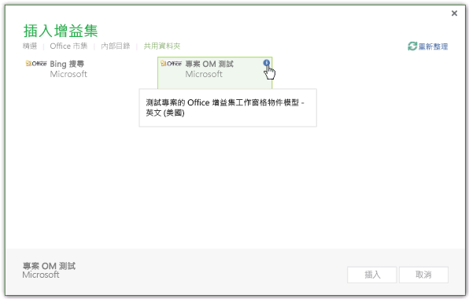
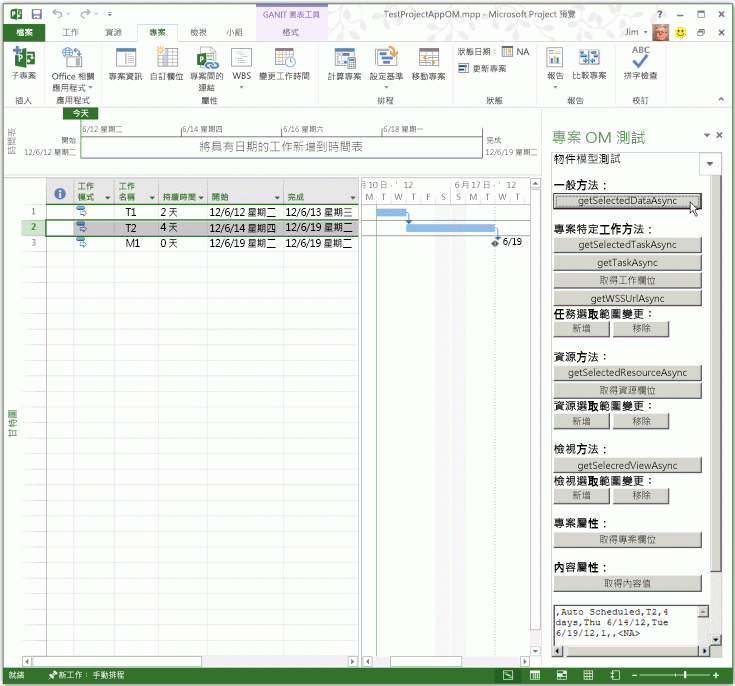
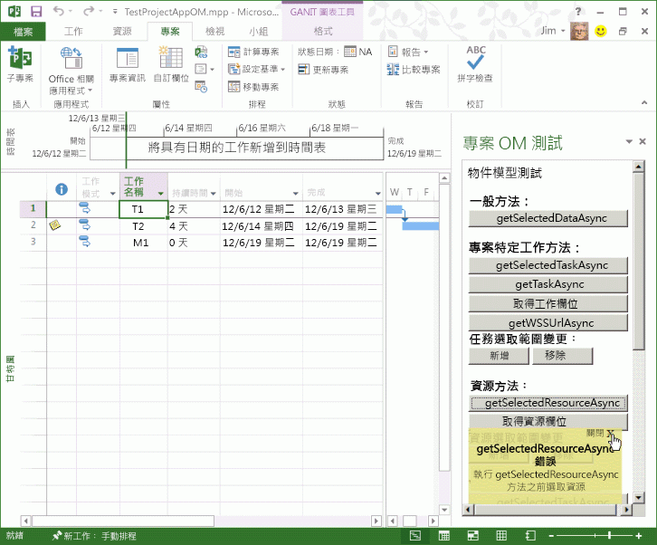

# 使用文字編輯器來建立第一個 Project 2013 的工作窗格增益集

您可以使用 Visual Studio 2015 來建立複雜的 Web 應用程式，或使用文字編輯器來建立本機增益集的檔案，藉此建立 Project Standard 2013 或 Project Professional 2013 的工作窗格增益集。 本文說明如何建立簡單增益集，以使用指向檔案共用上 HTML 檔案的 XML 資訊清單。 專案 OM 測試範例增益集會測試使用增益集之物件模型的部分 JavaScript 函式。 在 Project 2013 中使用 [信任中心]**** 來註冊包含資訊清單檔案的檔案共用時，您可以從功能區的 [專案]**** 索引標籤中開啟工作窗格增益集。 (本文中的程式碼範例是根據 Arvind Iyer, Microsoft Corporation 的測試應用程式。)

Project 2013 使用其他 Microsoft Office 2013 用戶端所使用的相同增益集資訊清單結構描述，且幾乎使用相同的 JavaScript API。本文所述增益集的完整程式碼可從 Project 2013 SDK 的 `Samples\Apps` 子目錄取得。

專案 OM 測試範例增益集可以取得工作的 GUID，及應用程式和使用中專案的屬性。如果 Project Professional 2013 開啟 SharePoint 程式庫中的專案，增益集可顯示專案的 URL。[Project 2013 SDK 下載](https://www.microsoft.com/en-us/download/details.aspx?id=30435%20)包含完整的原始程式碼。當您解壓縮及安裝 Project2013SDK.msi 檔案中的 SDK 和範例時，請參閱資訊清單檔的 `\Samples\Apps\Copy_to_AppManifests_FileShare` 子目錄和原始程式碼的 `\Samples\Apps\Copy_to_AppSource_FileShare` 子目錄。JSOMCall.html 範例會使用隨附的 office.js 檔和 project-15.js 檔中的 JavaScript 函式。您可以使用對應的偵錯檔案 (office.debug.js 和 project-15.debug.js) 來檢查函式。如需在 Office 增益集中使用 JavaScript 的介紹，請參閱[了解適用於 Office 的 JavaScript API](../../docs/develop/understanding-the-javascript-api-for-office.md)。

## 程序 1.建立增益集資訊清單檔案


- 在本機目錄中建立 XML 檔案。XML 檔案包含 **OfficeApp** 元素和子元素，[Office 增益集的 XML 資訊清單](../../docs/overview/add-in-manifests.md)中有說明。例如，建立名為 JSOM_SimpleOMCalls.xml 的檔案，其中包含下列 XML (變更 **Id** 元素的 GUID 值)。
    
```XML
     <?xml version="1.0" encoding="utf-8"?>
   <OfficeApp xmlns="http://schemas.microsoft.com/office/appforoffice/1.1" 
              xmlns:xsi="http://www.w3.org/2001/XMLSchema-instance" 
              xsi:type="TaskPaneApp">
     <Id>93A26520-9414-492F-994B-4983A1C7A607</Id>
     <Version>15.0</Version>
     <ProviderName>Microsoft</ProviderName>
     <DefaultLocale>en-us</DefaultLocale>
     <DisplayName DefaultValue="Project OM Test">
       <Override Locale="fr-fr" Value="Le Project OM Test"/>
     </DisplayName>
     <Description DefaultValue="Test the task pane add-in object model for Project - English (US)">
       <Override Locale="fr-fr" Value="Test the task pane add-in object model for Project - French (France)"/>
     </Description>
     <Hosts>
       <Host Name="Project"/>
       <Host Name="Workbook"/>
       <Host Name="Document"/>
     </Hosts>
    <DefaultSettings>
       <SourceLocation DefaultValue="\\ServerName\AppSource\JSOMCall.html">
         <Override Locale="fr-fr" Value="\\ServerName\AppSource\JSOMCall.html"/>
       </SourceLocation>
     </DefaultSettings>
     <Permissions>ReadWriteDocument</Permissions>
     <IconUrl DefaultValue="http://officeimg.vo.msecnd.net/_layouts/images/general/office_logo.jpg">
       <Override Locale="fr-fr" Value="http://officeimg.vo.msecnd.net/_layouts/images/general/office_logo.jpg"/>
     </IconUrl>
     <AllowSnapshot>true</AllowSnapshot>
   </OfficeApp>
```


    For Project, the  **OfficeApp** element must include the `xsi:type="TaskPaneApp"` attribute value. The **Id** element is a GUID. The **SourceLocation** value must be a file share path or a SharePoint URL for the add-in HTML source file or the web application that runs in the task pane. For an explanation of the other elements in manifest file, see [Task pane add-ins for Project](../project/project-add-ins.md).
    
程序 2 會顯示如何建立 JSOM_SimpleOMCalls.xml 資訊清單為 Project 測試增益集所指定的 HTML 檔案。HTML 檔案中指定的按鈕會呼叫相關的 JavaScript 函式。您可在 HTML 檔案中加入 JavaScript 函式，或將它們放在獨立的 .js 檔案中。

## 程序 2.建立專案 OM 測試增益集的來源檔案


1. 使用 JSOM_SimpleOMCalls.xml 資訊清單中 **SourceLocation** 元素所指定的名稱來建立 HTML 檔案。例如，在 `C:\Project\AppSource` 目錄中建立 theJSOMCall.html 檔案。雖然您可以使用簡單的文字編輯器來建立來源檔案，但使用 Visual Studio 2015 更容易，它會使用特定的文件類型 (例如 HTML 和 JavaScript) 並具有其他編輯輔助功能。如果您還沒有完成 [Project 的工作窗格增益集](../project/project-add-ins.md) 中說明的 Bing 搜尋範例，程序 3 顯示如何建立資訊清單指定的 `\\ServerName\AppSource` 檔案共用。
    
    JSOMCall.html 檔案為 AJAX 功能使用常見的 MicrosoftAjax.js 檔案，並為 Microsoft Office 2013 應用程式中的增益集功能使用 Office.js 檔案。
    


```HTML
  <!DOCTYPE html>
<html>
<head>
    <title>Project OM Sample Code</title>
    <meta http-equiv="X-UA-Compatible" content="IE=Edge" />
    <script type="text/javascript" src="MicrosoftAjax.js"></script>

    <!-- Use the CDN reference to office.js when deploying your add-in. -->
    <!-- <script src="https://appsforoffice.microsoft.com/lib/1/hosted/Office.js"></script> -->
    <script type="text/javascript" src="Office.js"></script>
    <script type="text/javascript" src="JSOM_Sample.js"></script>
</head>
<body>
    <div id="Common_JSOM_API">
        OBJECT MODEL TESTS
    </div>

    <textarea id="text" rows="6" cols="25">This is the text result.</textarea>
</body>
</html>
```


    The  **textarea** element specifies a text box that shows results of the JavaScript functions.
    
     >**Note**  For the Project OM Test sample to work, copy the following files from the Project 2013 SDK download to the same directory as the JSOMCall.html file: Office.js, Project-15.js, and MicrosoftAjax.js.

    Step 2 adds the JSOM_Sample.js file for specific functions that the Project OM Test sample add-in uses. In later steps, you will add other HTML elements for buttons that call JavaScript functions.
    
2. 在 JSOMCall.html 檔案的相同目錄中建立名為 JSOM_Sample.js 的 JavaScript 檔案。下列程式碼會藉由使用 Office.js 檔案中的函式來取得應用程式的內容和文件資訊。**text** 物件是 HTML 檔案中 **textarea** 控制項的識別碼。
    
    **_projDoc** 變數以 **ProjectDocument** 物件初始化。 程式碼包含一些簡單的錯誤處理函式，以及取得應用程式內容和專案文件內容屬性的 **getContextValues** 函式。 如需專案 JavaScript 物件模型的詳細資訊，請參閱 [JavaScript API for Office](../../reference/javascript-api-for-office.md)。
    


```js
  /*
* JavaScript functions for the Project OM Test example app
* in the Project 2013 SDK.
*/

var _projDoc;
var _app;
var taskGuid;
var resourceGuid;

// The initialize function is required for all add-ins.
Office.initialize = function (reason) {
    // Checks for the DOM to load using the jQuery ready function.
    $(document).ready(function () {
        // After the DOM is loaded, app-specific code can run.
        _projDoc = Office.context.document;
        _app = Office.context;
    });
}

function logError(errorText) {
    text.value = "Error in " + errorText;
}

function logEventError(erroneousEvent) {
    logError("event " + erroneousEvent);
}

function logMethodError(methodName, errorName, errorMessage) {
    logError(methodName + " method.\nError name: " + errorName + "\nMessage: " + errorMessage);
}

// . . . Add other JavaScript functions here.

function getContextValues() {
    getDocumentUrl();
    getDocumentMode();
    getApplicationContentLanguage();
    getApplicationDisplayLanguage();
}

function getDocumentUrl() {
    text.value ="Document URL:\n" +_projDoc.url;
}

function getDocumentMode() {
    var docMode = _projDoc.mode;
    text.value = text.value + "\n\nDocument mode: " + docMode;
}

function getApplicationContentLanguage() {
    text.value = text.value + "\nApp language: " + _app.contentLanguage;
}

function getApplicationDisplayLanguage() {
    text.value = text.value + "\nDisplay language: " + _app.displayLanguage;
}
```


    For information about the functions in the Office.debug.js file, see [JavaScript API for Office](../../reference/javascript-api-for-office.md). For example, the  **getDocumentUrl** function gets the URL or file path of the open project.
    
3. 新增 JavaScript 函式來呼叫 Office.js 和 Project-15.js 中的非同步函式，以取得選取的資料︰
    
      - 例如，**getSelectedDataAsync** 是 Office.js 中的一般函式，可針對選取的資料取得未格式化的文字。如需詳細資訊，請參閱 [AsyncResult 物件](../../reference/shared/asyncresult.md)。
    
  - Project-15.js 中的 **GetSelectedTaskAsync** 函式可取得選定工作的 GUID。同樣地，**getSelectedResourceAsync** 函式會取得所選取資源的 GUID。如果在未選取工作或資源時呼叫這些函式，函式會顯示未定義的錯誤。
    
  - **getTaskAsync** 函式會取得工作名稱和分派資源的名稱。如果工作位於同步的 SharePoint 工作清單中，**getTaskAsync** 會取得 SharePoint 清單中的工作識別碼；否則 SharePoint 工作識別碼為 0。
    
     >**附註**  供示範之用，範例程式碼會包含錯誤。 如果 **taskGuid** 並未定義，**getTaskAsync** 功能錯誤關閉。 如果您取得有效的工作 GUID，然後選取不同的工作，**getTaskAsync** 函式會取得 **getSelectedTaskAsync** 函式最近作業的工作資料。
  -  **getTaskFields**、**getResourceFields** 和 **getProjectFields** 都是本機函式，可呼叫 **getTaskFieldAsync**、**getResourceFieldAsync** 或 **getProjectFieldAsync** 多次來取得工作或資源的指定欄位。在 project-15.debug.js 檔中，**ProjectTaskFields** 列舉和 **ProjectResourceFields** 列舉會顯示支援哪些欄位。
    
  - **getSelectedViewAsync** 函式會取得檢視的類型 (定義在 project-15.debug.js 中的 **ProjectViewTypes** 列舉) 和檢視的名稱。
    
  - 如果專案已經與 SharePoint 工作清單同步，**getWSSUrlAsync** 函式會取得 URL 和工作清單的名稱。如果專案未與 SharePoint 工作清單同步，**getWSSUrlAsync** 函式錯誤會關閉。
    
     >**附註**  若要取得工作清單的名稱與 SharePoint URL，我們建議您使用 **getProjectFieldAsync** 函式搭配 [ProjectProjectFields](../../reference/shared/projectprojectfields-enumeration.md) 列舉中的 **WSSUrl** 和 **WSSList** 常數。

    下列程式碼中的每一個函式都包含 `function (asyncResult)` 所指定的匿名函式，也就是取得非同步結果的回呼。 除了匿名函式之外，您可以使用已命名函式，協助進行複雜增益集的維護。
    


```js
  // Get the data in the selected cells of the grid in the active view.
function getSelectedDataAsync() {
    _projDoc.getSelectedDataAsync(
        Office.CoercionType.Text,
        { ValueFormat: "Formatted" },
        function (asyncResult) {
            if (asyncResult.status == Office.AsyncResultStatus.Succeeded)
                text.value = asyncResult.value;
            else
                logMethodError("getSelectedDataAsync", asyncResult.error.name,
                               asyncResult.error.message);
        }
    );
}

// Get the GUID of the selected task.
function getSelectedTaskAsync() {
    _projDoc.getSelectedTaskAsync(function (asyncResult) {
        if (asyncResult.status == Office.AsyncResultStatus.Succeeded) {
            text.value = asyncResult.value;
            taskGuid = asyncResult.value;
        }
        else {
            logMethodError("getSelectedTaskAsync", asyncResult.error.name,
                               asyncResult.error.message);
        }
    });
}

// Get the GUID of the selected resource.
function getSelectedResourceAsync() {
    _projDoc.getSelectedResourceAsync(function (asyncResult) {
        if (asyncResult.status == Office.AsyncResultStatus.Succeeded) {
            text.value = asyncResult.value;
            resourceGuid = asyncResult.value;
        }
        else {
            logMethodError("getSelectedResourceAsync", asyncResult.error.name,
                               asyncResult.error.message);
        }
    });
}

// Get data for the specified task.
function getTaskAsync() {
    if (taskGuid != undefined) {
        _projDoc.getTaskAsync(
            taskGuid,
            function (asyncResult) {
                if (asyncResult.status === Office.AsyncResultStatus.Failed) {
                    logMethodError("getTaskAsync", asyncResult.error.name,
                               asyncResult.error.message);
                } else {
                    var taskInfo = asyncResult.value;
                    var taskOutput = "Task name: " + taskInfo.taskName +
                                     "\nGUID: " + taskGuid +
                                     "\nWSS Id: " + taskInfo.wssTaskId +
                                     "\nResourceNames: " + taskInfo.resourceNames;
                    text.value = taskOutput;
                }
            }
        );
    } else {
        text.value = 'Task GUID not valid:\n' + taskGuid;
    } 
}

// Get additional data for task fields.
function getTaskFields() {
    text.value = "";

    _projDoc. getTaskFieldAsync(taskGuid, Office.ProjectTaskFields.Name,
        function (asyncResult) {
            if (asyncResult.status == Office.AsyncResultStatus.Succeeded) {
                text.value = text.value + "Name: "
                    + asyncResult.value.fieldValue + "\n";
            }
            else {
                logMethodError("getTaskFieldAsync", asyncResult.error.name,
                               asyncResult.error.message);
            }
        }
    );

    _projDoc.getTaskFieldAsync(taskGuid, Office.ProjectTaskFields.ID,
        function (asyncResult) {
            if (asyncResult.status == Office.AsyncResultStatus.Succeeded) {
                text.value = text.value + "ID: "
                    + asyncResult.value.fieldValue + "\n";
            }
            else {
                logMethodError("getTaskFieldAsync", asyncResult.error.name,
                               asyncResult.error.message);
            }
        }
    );

    _projDoc.getTaskFieldAsync(taskGuid, Office.ProjectTaskFields.Start,
        function (asyncResult) {
            if (asyncResult.status == Office.AsyncResultStatus.Succeeded) {
                text.value = text.value + "Start: "
                    + asyncResult.value.fieldValue + "\n";
            }
            else {
                logMethodError("getTaskFieldAsync", asyncResult.error.name,
                               asyncResult.error.message);
            }
        }
    );

    _projDoc.getTaskFieldAsync(taskGuid, Office.ProjectTaskFields.Duration,
        function (asyncResult) {
            if (asyncResult.status == Office.AsyncResultStatus.Succeeded) {
                text.value = text.value + "Duration: "
                    + asyncResult.value.fieldValue + "\n";
            }
            else {
                logMethodError("getTaskFieldAsync", asyncResult.error.name,
                               asyncResult.error.message);
            }
        }
    );

    _projDoc.getTaskFieldAsync(taskGuid, Office.ProjectTaskFields.Priority,
        function (asyncResult) {
            if (asyncResult.status == Office.AsyncResultStatus.Succeeded) {
                text.value = text.value + "Priority: "
                    + asyncResult.value.fieldValue + "\n";
            }
            else {
                logMethodError("getTaskFieldAsync", asyncResult.error.name,
                               asyncResult.error.message);
            }
        }
    );

    _projDoc.getTaskFieldAsync(taskGuid, Office.ProjectTaskFields.Notes,
        function (asyncResult) {
            if (asyncResult.status == Office.AsyncResultStatus.Succeeded) {
                text.value = text.value + "Notes: "
                    + asyncResult.value.fieldValue + "\n";
            }
            else {
                logMethodError("getTaskFieldAsync", asyncResult.error.name,
                               asyncResult.error.message);
            }
        }
    ); 
}

// Get data for the specified resource fields.
function getResourceFields() {
    text.value = "";

    _projDoc.getResourceFieldAsync(resourceGuid, Office.ProjectResourceFields.Name,
        function (asyncResult) {
            if (asyncResult.status == Office.AsyncResultStatus.Succeeded) {
                text.value = text.value + "Resource name: " + asyncResult.value.fieldValue + "\n";
            }
            else {
                logMethodError("getResourceFieldAsync", asyncResult.error.name,
                               asyncResult.error.message);
            }
        }
    );

    _projDoc.getResourceFieldAsync(resourceGuid, Office.ProjectResourceFields.Cost,
        function (asyncResult) {
            if (asyncResult.status == Office.AsyncResultStatus.Succeeded) {
                text.value = text.value + "Cost: " + asyncResult.value.fieldValue + "\n";
            }
            else {
                logMethodError("getResourceFieldAsync", asyncResult.error.name,
                               asyncResult.error.message);
            }
        }
    );

    _projDoc.getResourceFieldAsync(resourceGuid, Office.ProjectResourceFields.StandardRate,
        function (asyncResult) {
            if (asyncResult.status == Office.AsyncResultStatus.Succeeded) {
                text.value = text.value + "Standard Rate: " + asyncResult.value.fieldValue + "\n";
            }
            else {
                logMethodError("getResourceFieldAsync", asyncResult.error.name, asyncResult.error.message);
            }
        }
    );

    _projDoc.getResourceFieldAsync(resourceGuid, Office.ProjectResourceFields.ActualCost,
        function (asyncResult) {
            if (asyncResult.status == Office.AsyncResultStatus.Succeeded) {
                text.value = text.value + "Actual Cost: " + asyncResult.value.fieldValue + "\n";
            }
            else {
                logMethodError("getResourceFieldAsync", asyncResult.error.name, asyncResult.error.message);
            }
        }
    );

    _projDoc.getResourceFieldAsync(resourceGuid, Office.ProjectResourceFields.ActualWork,
        function (asyncResult) {
            if (asyncResult.status == Office.AsyncResultStatus.Succeeded) {
                text.value = text.value + "Actual Work: " + asyncResult.value.fieldValue + "\n";
            }
            else {
                logMethodError("getResourceFieldAsync", asyncResult.error.name,
                               asyncResult.error.message);
            }
        }
    );

    _projDoc.getResourceFieldAsync(resourceGuid, Office.ProjectResourceFields.Units,
        function (asyncResult) {
            if (asyncResult.status == Office.AsyncResultStatus.Succeeded) {
                text.value = text.value + "Units: " + asyncResult.value.fieldValue + "\n";
            }
            else {
                logMethodError("getResourceFieldAsync", asyncResult.error.name,
                               asyncResult.error.message);
            }
        }
    );
}

// Get the URL and list name of the synchronized SharePoint task list.
// Recommended: use getProjectField instead.
function getWSSUrlAsync() {
    _projDoc.getWSSUrlAsync(function (asyncResult) {
        if (asyncResult.status == Office.AsyncResultStatus.Succeeded) {
            text.value = "SharePoint URL:\n" + asyncResult.value.serverUrl
                + "\nList name: " + asyncResult.value.listName;
        }
        else {
            logMethodError("getWSSUrlAsync", asyncResult.error.name, asyncResult.error.message);
        }
    });
}

// Get the type and name of the selected view.
function getSelectedViewAsync() {
    _projDoc.getSelectedViewAsync(function (asyncResult) {
        text.value = "View type: " + asyncResult.value.viewType
            + "\nName: " + asyncResult.value.viewName;
    });
}

// Get information about the active project.
function getProjectFields() {
    text.value = "";

    _projDoc.getProjectFieldAsync(Office.ProjectProjectFields.GUID,
        function (asyncResult) {
            if (asyncResult.status == Office.AsyncResultStatus.Succeeded) {
                text.value = text.value + "Project GUID: " + asyncResult.value.fieldValue + "\n";
            }
            else {
                logMethodError("getProjectFieldAsync", asyncResult.error.name, asyncResult.error.message);
            }
        }
    );

    _projDoc.getProjectFieldAsync(Office.ProjectProjectFields.Start,
        function (asyncResult) {
            if (asyncResult.status == Office.AsyncResultStatus.Succeeded) {
                text.value = text.value + "\nStart: " + asyncResult.value.fieldValue + "\n";
            }
            else {
                logMethodError("getProjectFieldAsync", asyncResult.error.name, asyncResult.error.message);
            }
        }
    );

    _projDoc.getProjectFieldAsync(Office.ProjectProjectFields.Finish,
        function (asyncResult) {
            if (asyncResult.status == Office.AsyncResultStatus.Succeeded) {
                text.value = text.value + "\nFinish: " + asyncResult.value.fieldValue + "\n";
            }
            else {
                logMethodError("getProject " + errorText);
            }
        }
    );

    _projDoc.getProjectFieldAsync(Office.ProjectProjectFields.CurrencyDigits,
        function (asyncResult) {
            if (asyncResult.status == Office.AsyncResultStatus.Succeeded) {
                text.value = text.value + "\nCurrency digits: " + asyncResult.value.fieldValue + "\n";
            }
            else {
                logMethodError("getProjectFieldAsync", asyncResult.error.name, asyncResult.error.message);
            }
        }
    );


    _projDoc.getProjectFieldAsync(Office.ProjectProjectFields.CurrencySymbol,
        function (asyncResult) {
            if (asyncResult.status == Office.AsyncResultStatus.Succeeded) {
                text.value = text.value + "Currency symbol: " + asyncResult.value.fieldValue + "\n";
            }
            else {
                logMethodError("getProjectFieldAsync", asyncResult.error.name, asyncResult.error.message);
            }
        }
    );

    _projDoc.getProjectFieldAsync(Office.ProjectProjectFields.CurrencySymbolPosition,
        function (asyncResult) {
            if (asyncResult.status == Office.AsyncResultStatus.Succeeded) {
                text.value = text.value + "\nSymbol position: " + asyncResult.value.fieldValue + "\n";
            }
            else {
                logMethodError("getProjectFieldAsync", asyncResult.error.name, asyncResult.error.message);
            }
        }
    );

    _projDoc.getProjectFieldAsync(Office.ProjectProjectFields.ProjectServerUrl,
        function (asyncResult) {
            if (asyncResult.status == Office.AsyncResultStatus.Succeeded) {
                text.value = text.value + "\nProject web app URL:\n  " + asyncResult.value.fieldValue + "\n";
            }
            else {
                logMethodError("getProjectFieldAsync", asyncResult.error.name, asyncResult.error.message);
            }
        }
    );

    _projDoc.getProjectFieldAsync(Office.ProjectProjectFields.WSSUrl,
        function (asyncResult) {
            if (asyncResult.status == Office.AsyncResultStatus.Succeeded) {
                text.value = text.value + "\nSharePoint URL:\n  " + asyncResult.value.fieldValue + "\n";
            }
            else {
                logMethodError("getProjectFieldAsync", asyncResult.error.name, asyncResult.error.message);
            }
        }
    );

    _projDoc.getProjectFieldAsync(Office.ProjectProjectFields.WSSList,
        function (asyncResult) {
            if (asyncResult.status == Office.AsyncResultStatus.Succeeded) {
                text.value = text.value + "\nSharePoint list: " + asyncResult.value.fieldValue + "\n";
            }
            else {
                logMethodError("getProjectFieldAsync", asyncResult.error.name, asyncResult.error.message);
            }
        }
    );
}
```

4. 新增 JavaScript 事件處理常式回呼和函式來登錄工作選取範圍、資源選取範圍，及檢視選取範圍變更事件處理常式，並取消登錄事件處理常式。**manageEventHandlerAsync** 函式會根據 _operation_ 參數來加入或移除指定的事件處理常式。作業可能會 **addHandlerAsync** 或 **removeHandlerAsync**。
    
    **manageTaskEventHandler**、**manageResourceEventHandler** 和 **manageViewEventHandler** 函式可以新增或移除事件處理常式，由 _docMethod_ 參數所指定。
    


```js
  // Task selection changed event handler.
function onTaskSelectionChanged(eventArgs) {
    text.value = "In task selection change event handler";
}

// Resource selection changed event handler.
function onResourceSelectionChanged(eventArgs) {
    text.value = "In Resource selection changed event handler";
}

// View selection changed event handler.
function onViewSelectionChanged(eventArgs) {
    text.value = "In View selection changed event handler";
}

// Add or remove the specified event handler.
function manageEventHandlerAsync(eventType, handler, operation, onComplete) {
    _projDoc[operation]   //The operation is addHandlerAsync or removeHandlerAsync.
    (
        eventType,
        handler,
        function (asyncResult) {
            if (onComplete) {
                onComplete(asyncResult, operation);
            } else {
                var message = "Operation: " + operation;
                message = message + "\nStatus: " + asyncResult.status + "\n";
                text.value = message;
            }
        }
    );
}

// Write the asyncResult status from the manageEventHandlerAsync function (optional). 
function onComplete(asyncResult, operation) {
    var message = "In onComplete function for " + operation;
    message = message + "\nStatus: " + asyncResult.status;
    text.value = message;
}

// Add or remove a task selection changed event handler.
function manageTaskEventHandler(docMethod) {
    manageEventHandlerAsync(
        Office.EventType.TaskSelectionChanged,      // The task selection changed event.
        onTaskSelectionChanged,                     // The event handler.
        docMethod,                // The Office.Document method to add or remove an event handler.
        onComplete                // Manages the successful asyncResult data (optional).
    );
}

// Add or remove a resource selection changed event handler.
function manageResourceEventHandler(docMethod) {
    manageEventHandlerAsync(
        Office.EventType.ResourceSelectionChanged,  // The resource selection changed event.
        onResourceSelectionChanged,                 // The event handler.
        docMethod,                // The Office.Document method to add or remove an event handler.
        onComplete                // Manages the successful asyncResult data (optional).
    );
}

// Add or remove a view selection changed event handler.
function manageViewEventHandler(docMethod) {
    manageEventHandlerAsync(
        Office.EventType.ViewSelectionChanged,      // The view selection changed event.
        onViewSelectionChanged,                     // The event handler.
        docMethod,                // The Office.Document method to add or remove an event handler.
        onComplete                // Manages the successful asyncResult data (optional).
    );
}
```

5. 對於 HTML 文件的本文，加入呼叫 JavaScript 函式進行測試的按鈕。例如，在常見 JSOM API 的 **div** 元素中，加入會呼叫一般 **getSelectedDataAsync** 函式的輸入按鈕。
    
```HTML
  <body>
    <div id="Common_JSOM_API">
    OBJECT MODEL TESTS
    <br /><br />       
    <strong>General function:</strong>
    <br />
    <input id="Button5" class="button-wide" type="button" onclick="getSelectedDataAsync()" 
        value="getSelectedDataAsync" />
    </div>
   <!--  more code . . .  -->
```

6. 新增 **div** 區段，其中包含用於特定專案工作函式及 **TaskSelectionChanged** 事件的按鈕。
    
```HTML
  <div id="ProjectSpecificTask">
  <br />
  <strong>Project-specific task methods:</strong><br />
  <button class="button-wide" onclick="getSelectedTaskAsync()">getSelectedTaskAsync</button><br />
  <button class="button-wide" onclick="getTaskAsync()">getTaskAsync</button><br />
  <button class="button-wide" onclick="getTaskFields()">Get Task Fields</button><br />
  <button class="button-wide" onclick="getWSSUrlAsync()">getWSSUrlAsync</button>
  <strong>Task selection changed:</strong>
  <button class="button-narrow" onclick="manageTaskEventHandler('addHandlerAsync')">Add</button>
  <button class="button-narrow" onclick="manageTaskEventHandler('removeHandlerAsync')">Remove</button>         
</div>
```

7. 新增 **div**，包含用於資源方法和事件、檢視方法和事件、專案屬性和內容屬性的按鈕
    
```HTML
  <div id="ResourceMethods">
  <br />
  <strong>Resource methods:</strong>
  <button class="button-wide" onclick="getSelectedResourceAsync()">getSelectedResourceAsync</button><br />
  <button class="button-wide" onclick="getResourceFields()">Get Resource Fields</button><br />
  <strong>Resource selection changed:</strong>
  <button class="button-narrow" onclick="manageResourceEventHandler('addHandlerAsync')">Add</button>
  <button class="button-narrow" onclick="manageResourceEventHandler('removeHandlerAsync')">Remove</button>
</div>
<div id="ViewMethods">
  <br />
  <strong>View method:</strong>
  <button class="button-wide" onclick="getSelectedViewAsync()">getSelectedViewAsync</button><br />
  <strong>View selection changed:</strong>
  <button class="button-narrow" onclick="manageViewEventHandler('addHandlerAsync')">Add</button>
  <button class="button-narrow" onclick="manageViewEventHandler('removeHandlerAsync')">Remove</button>         
</div>
<div id="ProjectMethods">
  <br />
  <strong>Project properties:</strong>
  <button class="button-wide" onclick="getProjectFields()">Get Project Fields</button><br />
</div>
<div id="ContextVariables">
  <br />
  <strong>Context properties:</strong>
  <button class="button-wide" onclick="getContextValues()">Get Context Values</button>
</div>
```

8. 若要設定按鈕元素的格式，請加入 CSS **style** 元素。例如，將下列新增為 **head** 元素的子項。
    
```HTML
  <style type="text/css">
    .button-wide
    {
        width: 210px;
        margin-top: 2px;
    }
    .button-narrow
    {
        width: 80px;
        margin-top: 2px;
    }
</style>
```


     >**Note**  The  **Task Pane Add-in (Project)** template in Visual Studio 2015 includes default .css files for a common look and feel of add-ins.
程序 3 顯示如何安裝及使用專案 OM 測試增益集功能。

## 程序 3.安裝與使用專案 OM 測試增益集


1. 為包含 JSOM_SimpleOMCalls.xml 資訊清單的目錄建立檔案共用。您可以在本機電腦，或透過網路存取的遠端電腦上，建立檔案共用。例如，如果資訊清單位於本機電腦的 `C:\Project\AppManifests` 目錄，請執行下列命令︰
    
```
  Net share AppManifests=C:\Project\AppManifests
```

    
2. 為包含專案 OM 測試增益集的 HTML 和 JavaScript 檔案的目錄，建立檔案共用。確定檔案共用路徑符合 JSOM_SimpleOMCalls.xml 資訊清單中指定的路徑。例如，如果檔案位於本機電腦的 `C:\Project\AppSource` 目錄，請執行下列命令︰
    
```
  net share AppSource=C:\Project\AppSource
```

3. 在 [專案] 中，開啟 [專案選項]**** 對話方塊，選擇 [信任中心]****，然後選擇 [信任中心設定]****。
    
    [Project 的工作窗格增益集](../project/project-add-ins.md) 中也說明註冊增益集的程序，以及其他資訊。
    
4. 在 [信任中心]**** 對話方塊的左窗格中，選擇 [受信任的增益集目錄]****。
    
5. 如果您已經新增 Bing 搜尋增益集的 `\\ServerName\AppManifests` 路徑，請跳過這個步驟。 否則在 [受信任的增益集目錄]**** 窗格中，於 [目錄 URL]**** 文字方塊中加入 `\\ServerName\AppManifests` 路徑，選擇 [新增目錄]****，啟用網路共用做為預設來源 (見圖 1)，然後選擇 [確定]****。
    
    **圖 1. 新增增益集資訊清單的網路檔案共用**

    

6. 新增增益集或變更原始程式碼後，重新啟動專案。 在 [專案]**** 功能區中，選擇 [Office 增益集]**** 下拉功能表，然後選擇 [全部查看]****。 在 [插入增益集]**** 對話方塊方塊中，選擇 [共用資料夾]**** (見圖 2)，選取 [專案 OM 測試]****，然後選擇 [插入]****。 專案 OM 測試增益集在工作窗格中啟動。
    
    **圖 2. 啟動檔案共用上的專案 OM 測試增益集**

    

7. 在 [專案] 中，建立並儲存一個至少有兩個工作的簡單專案。 例如，建立名為 T1、T2 的工作，以及名為 M1 的里程碑，再將工作持續時間與前置者設為與圖 3 中的設定類似。 選擇功能區上的 [專案]**** 索引標籤，選取工作 T2 的整個資料列，然後在工作窗格中選擇 [getSelectedDataAsync]**** 按鈕。 圖 3 顯示在 [專案 OM 測試]**** 增益集的文字方塊中選取的資料。
    
    **圖 3. 使用專案 OM 測試增益集**

    

8. 在第一件工作的 [持續時間]**** 資料行中選取儲存格，然後選擇 [專案 OM 測試]**** 增益集的 [getSelectedDataAsync]**** 按鈕。 **getSelectedDataAsync** 函式會設定文字方塊值來顯示 `2 days`。 
    
9. 選取全部三個工作的三個 [持續時間]**** 儲存格。 **getSelectedDataAsync** 函式會針對不同資料列中選取的儲存格，傳回以分號分隔的文字值，例如，`2 days;4 days;0 days`。
    
    **getSelectedDataAsync** 函式會針對單一資料列中選取的儲存格，傳回以逗號分隔的文字值。 例如在圖 3 中，已選取工作 T2 的整個資料列。 當您選擇 **getSelectedDataAsync**，文字方塊會顯示下列︰`,Auto Scheduled,T2,4 days,Thu 6/14/12,Tue 6/19/12,1,,<NA>`
    
    **Indicators** 資料行和 **Resource Names** 資料行皆是空的，所以這些資料行會在文字陣列中顯示為空值。 **Add New Column** 儲存格的值為 `<NA>`。
    
10. 選取工作 T2 資料列中任一儲存格，或選取工作 T2 的整個資料列，然後選擇 **getSelectedTaskAsync**。 文字方塊顯示工作 GUID 值，例如 `{25D3E03B-9A7D-E111-92FC-00155D3BA208}`。 專案會將該值儲存在 [專案 OM 測試]**** 增益集的全域 **taskGuid** 變數。
    
11. 選擇 [getTaskAsync]****。 如果 **taskGuid** 變數包含工作 T2 的 GUID，文字方塊會顯示工作資訊。 **ResourceNames** 值是空的。
    
    建立兩個本機資源 R1 和 R2，將它們各以 50% 指派給工作 T2，然後再次選擇 **getTaskAsync**。 在文字方塊中的結果會包含資源資訊。 如果工作位於同步的 SharePoint 工作清單中，結果也會包含 SharePoint 工作識別碼。
    


```
  Task name: T2
GUID: {25D3E03B-9A7D-E111-92FC-00155D3BA208}
WSS Id: 0
ResourceNames: R1[50%],R2[50%]
```

12. 選擇 [取得工作欄位]**** 按鈕。 **getTaskFields** 函式會針對工作名稱、索引、開始日期、持續時間、優先順序及工作附註呼叫 **getTaskfieldAsync** 函式多次。
    
```
  Name: T2
ID: 2
Start: Thu 6/14/12
Duration: 4d
Priority: 500
Notes: This is a note for task T2. It is only a test note. If it had been a real note, there would be some real information.
```

13. 選擇 [getWSSUrlAsync]**** 按鈕。 如果專案是下列類型之一，結果會顯示工作清單 URL 和名稱。
    
      - 匯入至 Project Server 的 SharePoint 工作清單。
    
  - 匯入至 Project Professional，然後存回 SharePoint (不使用 Project Server) 的 SharePoint 工作清單。
    
     >**附註**  如果 Windows Server 電腦上安裝 Project Professional，若要能夠將專案存回 SharePoint 中，您可以使用**伺服器管理員**來新增**桌面體驗**功能。

    如果專案是本機專案，或您使用 Project Professional 開始由 Project Server 管理的專案，**getWSSUrlAsync** 方法會顯示未定義的錯誤。
    


```
  SharePoint URL: http://ServerName
List name: Test task list
```

14. 在 [TaskSelectionChanged 事件]**** 區段中選擇 [新增]**** 按鈕，呼叫 **manageTaskEventHandler** 函式以註冊工作選取範圍變更的事件，並在文字方塊中傳回 `In onComplete function for addHandlerAsync Status: succeeded`。 選取不同的工作；文字方塊會顯示 `In task selection changed event handler`，也就是工作選取範圍變更的事件之回呼函式輸出。 選擇 [移除]**Remove** 按鈕來取消登錄事件處理常式。
    
15. 若要使用資源方法，請先選取檢視，如 [資源工作表]****、[資源使用量]**** 或 [資源表單]****，然後選取該檢視中的資源。 選擇 [getSelectedResourceAsync]**** 來初始化 **resourceGuid** 變數，然後選擇 [取得資源欄位]****，為資源屬性呼叫 **getResourceFieldAsync** 多次。 您也可以新增或移除資源選取範圍變更的事件處理常式。
    
```
  Resource name: R1
Cost: $800.00
Standard Rate: $50.00/h
Actual Cost: $0.00
Actual Work: 0h
Units: 100%
```

16. 選擇 [getSelectedViewAsync]**** 以顯示使用中檢視的類型和名稱。 您也可以新增或移除檢視選取範圍變更的事件處理常式。 例如，如果 [資源表單]**** 是作用中檢視，**getSelectedViewAsync** 函式會在文字方塊中顯示下列資訊︰
    
```
  View type: 6
Name: Resource Form
```

17. 選擇 [取得專案欄位]****，為使用中專案的不同屬性呼叫 **getProjectFieldAsync** 函式多次。 若是從 Project Web App 開啟專案，**getProjectFieldAsync** 函式可以取得 Project Web App 執行個體的 URL。
    
```
  Project GUID: 9845922E-DAB4-E111-8AF3-00155D3BA208

Start: Tue 6/12/12
Finish: Tue 6/19/12

Currency digits: 2
Currency symbol: $
Symbol position: 0

Project web app URL:
  http://servername/pwa
```

18. 選擇 [取得內容值]**** 按鈕以取得文件和正在執行增益集的應用程式的屬性，方法是取得 **Office.Context.document** 物件和 **Office.context.application** 物件的屬性。 例如，如果 Project1.mpp 檔案位於本機電腦桌面時，文件 URL 是 `C:\Users\UserAlias\Desktop\Project1.mpp`。 如果 .mpp 檔案位於 SharePoint 程式庫，則值是文件的 URL。 如果您使用 Project Professional 2013，從 Project Web App 開啟名為 Project1 的專案，則文件 URL 是 `<>\Project1`。
    
```
  Document URL:
<>\Project1
Document mode: readWrite
App language: en-US
Display language: en-US
```

19. 編輯原始程式碼之後，您可以關閉並重新啟動專案來重新整理增益集。 在 [專案]**** 功能區中，[Office 增益集]**** 下拉式清單會維護最近使用的增益集清單。
    

## 範例


Project 2013 SDK 下載在 JSOMCall.html 檔、JSOM_Sample.js 檔，以及相關的 Office.js、Office.debug.js、Project-15.js 和 Project-15.debug.js 檔中包含完整的程式碼。下列是 JSOMCall.html 檔中的程式碼。


```HTML
<!DOCTYPE html>
<html>
    <head>
        <title>Project OM Sample Code</title>
        <meta http-equiv="X-UA-Compatible" content="IE=Edge"/>

        <script type="text/javascript" src="MicrosoftAjax.js"></script>

        <!-- Use the CDN reference to office.js when deploying your add-in. -->
        <!-- <script src="https://appsforoffice.microsoft.com/lib/1/hosted/Office.js"></script> -->
        <script type="text/javascript" src="Office.js"></script>
        <script type="text/javascript" src="JSOM_Sample.js"></script>

        <style type="text/css">           
            .button-wide {
                width: 210px;
                margin-top: 2px;
            }
            .button-narrow 
            {
                width: 80px;
                margin-top: 2px;
            }
        </style>
    </head>

    <body>
      <div id="Common_JSOM_API">
        OBJECT MODEL TESTS
        <br /><br />       
        <strong>General method:</strong>
        <br />
        <input id="Button5" class="button-wide" type="button" onclick="getSelectedDataAsync()" 
            value="getSelectedDataAsync" />
      </div>

      <div id="ProjectSpecificTask">
        <br />
        <strong>Project-specific task methods:</strong><br />
        <button class="button-wide" onclick="getSelectedTaskAsync()">getSelectedTaskAsync</button><br />
        <button class="button-wide" onclick="getTaskAsync()">getTaskAsync</button><br />
        <button class="button-wide" onclick="getTaskFields()">Get Task Fields</button><br />
        <button class="button-wide" onclick="getWSSUrlAsync()">getWSSUrlAsync</button>
        <strong>Task selection changed:</strong>
        <button class="button-narrow" onclick="manageTaskEventHandler('addHandlerAsync')">Add</button>
        <button class="button-narrow" onclick="manageTaskEventHandler('removeHandlerAsync')">Remove</button>         
      </div>
<div id="ResourceMethods">
  <br />
  <strong>Resource methods:</strong>
  <button class="button-wide" onclick="getSelectedResourceAsync()">getSelectedResourceAsync</button><br />
  <button class="button-wide" onclick="getResourceFields()">Get Resource Fields</button><br />
  <strong>Resource selection changed:</strong>
  <button class="button-narrow" onclick="manageResourceEventHandler('addHandlerAsync')">Add</button>
  <button class="button-narrow" onclick="manageResourceEventHandler('removeHandlerAsync')">Remove</button>
</div>
<div id="ViewMethods">
  <br />
  <strong>View method:</strong>
  <button class="button-wide" onclick="getSelectedViewAsync()">getSelectedViewAsync</button><br />
  <strong>View selection changed:</strong>
  <button class="button-narrow" onclick="manageViewEventHandler('addHandlerAsync')">Add</button>
  <button class="button-narrow" onclick="manageViewEventHandler('removeHandlerAsync')">Remove</button>         
</div>
<div id="ProjectMethods">
  <br />
  <strong>Project properties:</strong>
  <button class="button-wide" onclick="getProjectFields()">Get Project Fields</button><br />
</div>
<div id="ContextVariables">
  <br />
  <strong>Context properties:</strong>
  <button class="button-wide" onclick="getContextValues()">Get Context Values</button>
</div>

      <br />
      <textarea id="text" rows="10" cols="25">This is the text result.</textarea>
    </body>
</html
```


## 穩定的程式設計


**專案 OM 測試**增益集是一個範例，示範 Project-15.js 和 Office.js 檔中 Project 2013 的一些 JavaScript 函式使用方式。此範例僅供測試，並且不包含健全的錯誤檢查。例如，如果您不選取資源並執行 **getSelectedResourceAsync** 函式，**resourceGuid** 變數未初始化，且呼叫 **getResourceFieldAsync** 會傳回錯誤。若為實際執行增益集，您應該檢查特定的錯誤並略過結果、隱藏不適用的功能，或通知使用者來選擇檢視，並在使用函式前先設定有效的選取範圍。

對於簡單範例，下列程式碼中的錯誤輸出包含 **actionMessage** 變數，指定要避免 **getSelectedResourceAsync** 函式發生錯誤所採取的動作。


```js
function logError(errorText) {
    text.value = "Error in " + errorText;
}

function logMethodError(methodName, errorName, errorMessage, actionMessage) {
    logError(methodName + " method.\nError name: " + errorName
        + "\nMessage: " + errorMessage
        + "\n\nAction: " + actionMessage);
}
// Get the GUID of the selected resource.
function getSelectedResourceAsync() {
    _projDoc.getSelectedResourceAsync(function (asyncResult) {
        if (asyncResult.status == Office.AsyncResultStatus.Succeeded) {
            text.value = asyncResult.value;
            resourceGuid = asyncResult.value;
        }
        else {
            var actionMessage = "Select a resource before running the getSelectedResourceAsync method.";
            logMethodError("getSelectedResourceAsync", asyncResult.error.name,
                               asyncResult.error.message, actionMessage);
        }
    });
}
```

使用 Visual Studio 2015 時更容易開發增益集，您可以在其中設定中斷點以協助偵錯 JavaScript 程式碼，並快速整合常見的錯誤處理常式。 例如，Project 2013 SDK 下載中的 **HelloProject_OData** 範例包括使用 JQuery 程式庫來顯示快顯錯誤訊息的 SurfaceErrors.js 檔。 圖 4 顯示「吐司」通知中的錯誤訊息。 這個範例也包括 Office vsdoc.js 檔案，在 Office.js file 和 Project-15.js file 檔中提供 Intellisense for JavaScript 函式。

SurfaceErrors.js 檔中的下列程式碼包含建立 **Toast** 物件的 **throwError** 函式。


```js
/*
 * Show error messages in a "toast" notification.
 */

// Throws a custom defined error.
function throwError(errTitle, errMessage) {
    try {
        // Define and throw a custom error.
        var customError = { name: errTitle, message: errMessage }
        throw customError;
    }
    catch (err) {
        // Catch the error and display it to the user.
        Toast.showToast(err.name, err.message);
    }
}

// Add a dynamically-created div "toast" for displaying errors to the user.
var Toast = {

    Toast: "divToast",
    Close: "btnClose",
    Notice: "lblNotice",
    Output: "lblOutput",

    // Show the toast with the specified information.
    showToast: function (title, message) {

        if (document.getElementById(this.Toast) == null) {
            this.createToast();
        }

        document.getElementById(this.Notice).innerText = title;
        document.getElementById(this.Output).innerText = message;

        $("#" + this.Toast).hide();
        $("#" + this.Toast).show("slow");
    },

    // Create the display for the toast.
    createToast: function () {
        var divToast;
        var lblClose;
        var btnClose;
        var divOutput;
        var lblOutput;
        var lblNotice;

        // Create the container div.
        divToast = document.createElement("div");
        var toastStyle = "background-color:rgba(220, 220, 128, 0.80);" +
            "position:absolute;" +
            "bottom:0px;" +
            "width:90%;" +
            "text-align:center;" +
            "font-size:11pt;";
        divToast.setAttribute("style", toastStyle);
        divToast.setAttribute("id", this.Toast);

        // Create the close button.
        lblClose = document.createElement("div");
        lblClose.setAttribute("id", this.Close);
        var btnStyle = "text-align:right;" +
            "padding-right:10px;" +
            "font-size:10pt;" +
            "cursor:default";
        lblClose.setAttribute("style", btnStyle);
        lblClose.appendChild(document.createTextNode("CLOSE "));

        btnClose = document.createElement("span");
        btnClose.setAttribute("style", "cursor:pointer;");
        btnClose.setAttribute("onclick", "Toast.close()");
        btnClose.innerText = "X";
        lblClose.appendChild(btnClose);

        // Create the div to contain the toast title and message.
        divOutput = document.createElement("div");
        divOutput.setAttribute("id", "divOutput");
        var outputStyle = "margin-top:0px;";
        divOutput.setAttribute("style", outputStyle);

        lblNotice = document.createElement("span");
        lblNotice.setAttribute("id", this.Notice);
        var labelStyle = "font-weight:bold;margin-top:0px;";
        lblNotice.setAttribute("style", labelStyle);

        lblOutput = document.createElement("span");
        lblOutput.setAttribute("id", this.Output);

        // Add the child nodes to the toast div.
        divOutput.appendChild(lblNotice);
        divOutput.appendChild(document.createElement("br"));
        divOutput.appendChild(lblOutput);
        divToast.appendChild(lblClose);
        divToast.appendChild(divOutput);

        // Add the toast div to the document body.
        document.body.appendChild(divToast);
    },

    // Close the toast.
    close: function () {
        $("#" + this.Toast).hide("slow");
    }
}
```

若要使用 **throwError** 函式，請在 JSOMCall.html 檔中包括 JQuery 程式庫和 SurfaceErrors.js 指令碼，然後在 **logMethodError** 之類的其他 JavaScript 函式中新增 **throwError** 呼叫。


 >**附註**  在部署增益集之前，將 office.js 參考和 jQuery 參考變更為內容傳遞網路 (CDN) 參考。CDN 參考提供最新的版本與較佳的效能。


```HTML
<!DOCTYPE html>
<html>
<head>
    <title>Project OM Sample Code</title>
    <meta http-equiv="X-UA-Compatible" content="IE=Edge" />

    <script type="text/javascript" src="MicrosoftAjax.js"></script>

    <!-- Use the CDN reference to Office.js and jQuery when deploying your add-in. -->
    <!-- <script src="https://appsforoffice.microsoft.com/lib/1/hosted/Office.js"></script> -->
    <script type="text/javascript" src="Office.js"></script>
    <script type="text/javascript" src="http://ajax.microsoft.com/ajax/jQuery/jquery-1.9.0.min.js"></script>

    <script type="text/javascript" src="JSOM_Sample.js"></script>
    <script type="text/javascript" src="SurfaceErrors.js"></script>

    <!-- . . . INVALID USE OF SYMBOLS
</head>

```


```js
function logMethodError(methodName, errorName, errorMessage, actionMessage) {
    logError(methodName + " method.\nError name: " + errorName
        + "\nMessage: " + errorMessage
        + "\n\nAction: " + actionMessage);

    throwError(methodName + " error", actionMessage);
}
```


**圖 4. SurfaceErrors.js 檔案中的函式可以顯示快顯通知**




## 其他資源


- [Project 的工作窗格增益集](../project/project-add-ins.md)
    
- [了解適用於增益集的 JavaScript API](../develop/understanding-the-javascript-api-for-office.md)
    
- [JavaScript API for Office 增益集](../../reference/javascript-api-for-office.md)

- [Office 增益集資訊清單的結構描述參考 (v1.1)](../overview/add-in-manifests.md)     
    
- [Project 2013 SDK 下載](https://www.microsoft.com/en-us/download/details.aspx?id=30435%20)
    
