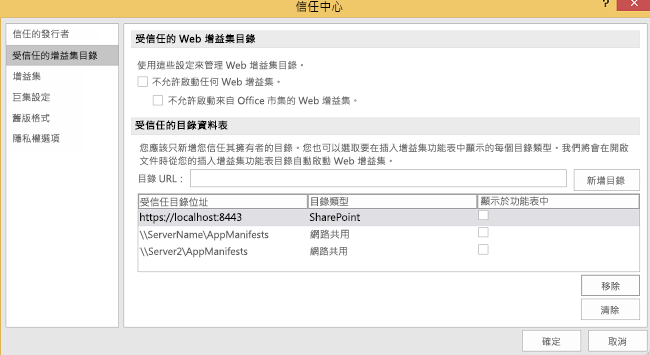
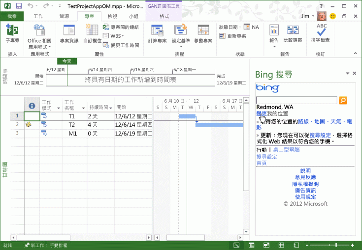

# <a name="task-pane-add-ins-for-project"></a>Project 的工作窗格增益集


Project Standard 2013 和 Project Professional 2013 兩者均含有工作窗格增益集的支援。您可以執行為 Word 2013 或 Excel 2013 開發的一般工作窗格增益集。您也可以開發自訂增益集來處理 Project 中的選取事件，並將工作、資源、檢視，及專案中的其他儲存格層級資料，與 SharePoint 清單、SharePoint 增益集、Web 組件、Web 服務和企業應用程式予以整合。

 >**附註**[Project 2013 SDK 下載](https://www.microsoft.com/en-us/download/details.aspx?id=30435%20)包含範例增益集，顯示如何使用 Project 的增益集物件模型，以及如何使用 OData 服務在 Project Server 2013 中報告資料。當您解壓縮和安裝 SDK 時，請參閱 `\Samples\Apps\` 子目錄。

如簡介 Office 增益集簡介，請參閱 [Office 增益集平台概觀](../../docs/overview/office-add-ins.md)。

## <a name="add-in-scenarios-for-project"></a>Project 的增益集案例


專案經理可使用 Project 工作窗格增益集來協助管理專案活動。不需離開 Project 並開啟另一個應用程式來搜尋常用的資訊，專案經理可以直接存取 Project 內的資訊。工作窗格增益集中的內容可為感應式、根據選定的工作、資源、檢視，或甘特圖、工作使用狀況檢視或資源使用狀況檢視的儲存格中的其他資料。


 >**附註**  使用 Project Professional 2013，您可以開發工作窗格增益集來存取內部部署安裝的 Project Server 2013、Project Online，及內部部署或線上 SharePoint 2013。Project Standard 2013 不支援直接整合 Project Server 資料，或與 Project Server 同步的 SharePoint 工作清單。

Project 的增益集案例包括：


-  **專案排程** 檢視可能影響排程之相關專案的資料。工作窗格增益集可以整合 Project Server 2013 中其他專案的相關資料。例如，您可以檢視部門的專案和里程碑日期集合，或檢視根據選定自訂欄位之其他專案所指定的資料。
    
-  **資源管理** 檢視 Project Server 2013 中的完整資源集區，或根據指定技術的子集，包括成本資料及資源可用性，以協助選取適當的資源。
    
-  **推進及批准** 使用工作窗格增益集中的 Web 應用程式，更新或檢視來自外部企業資源規劃 (ERP) 應用程式、時程表系統或會計應用程式的資料。或者，建立自訂狀態核准網頁組件，以便在 Project Web App 和 Project Professional 2013 中使用。
    
-  **小組通訊** 從專案內容中的工作窗格增益集，直接與小組成員和資源通訊。或者，您也可以輕鬆地自行維護一組即時線上備忘稿，以便在專案中工作。
    
-  **工作套件** 在 SharePoint 程式庫和線上範本集合中搜尋指定類型的專案範本。例如，尋找建構專案的範本，並將其新增至您的專案範本集合。
    
-  **相關項目** 檢視中繼資料、文件和專案計劃中特定工作的相關訊息。例如，您可以使用 Project Professional 2013 來管理從 SharePoint 工作清單中匯入的專案，同時仍同步工作清單與專案中的變更。工作窗格增益集可以顯示 Project 未針對 SharePoint 清單中的工作匯入的其他欄位或中繼資料。
    
-  **使用 Project Server 物件模型** 將 Project Server 介面 (PSI) 或 Project Server 的用戶端物件模型 (CSOM) 的方法，與選定工作的 GUID 搭配使用。例如，增益集的 Web 應用程式可以讀取並更新選定工作和資源的推進資料，或整合外部時程表應用程式。
    
-  **取得報告資料** 使用代表性狀態傳輸 (REST)、JavaScript 或 LINQ 查詢，針對 Project Web App 中的報告資料表，在 OData 服務中尋找選取的工作或資源的相關資訊。使用 OData 服務的查詢可以使用 Project Server 2013 的線上或內部部署安裝來完成。
    
    例如，請參閱[建立會以內部部署 Project Server OData 服務來使用 REST 的 Project 增益集](../project/create-a-project-add-in-that-uses-rest-with-an-on-premises-odata-service.md)
    

## <a name="developing-project-add-ins"></a>開發 Project 增益集


Project 增益集的 JavaScript 程式庫包含  **Office** 命名空間別名的副檔名，讓開發人員存取 Project 應用程式與工作、資源的屬性，並在專案中檢視。Project-15.js 檔中的 JavaScript 程式庫延伸，是在使用 Visual Studio 2015 建立的 Project 增益集中使用。Project 2013 SDK 下載也提供 Office.js、Office.debug.js，Project-15.js、Project-15.debug.js 及相關的檔案。

若要建立增益集，您可以使用簡單的文字編輯器來建立 HTML 網頁和相關的 JavaScript 檔案、CSS 檔案和 REST 查詢。除了 HTML 網頁或 Web 應用程式，增益集需要 XML 資訊清單檔案進行設定。專案可以使用資訊清單檔案，其中包含指定為 **TaskPaneExtension** 的 **type** 屬性。資訊清單檔案可由多個 Office 2013 用戶端應用程式使用，或者您可以建立 Project 2013 的特定資訊清單檔案。如需詳細資訊，請參閱 _Office 增益集平台概觀_的[開發的基本概念](../../docs/overview/office-add-ins.md)一節。

對於複雜的自訂應用程式，且為了更容易偵錯，我們建議您使用 Visual Studio 2015 來開發增益集的網站。Visual Studio 2015 包含增益集專案的範本，您可以在其中選擇增益集種類 (工作窗格、內容或郵件) 和主應用程式 (Project、Word、Excel 或 Outlook)。如需整合 Project Online 資料的範例，請參閱 MSDN 上專案程式設計部落格中的[將 Project 工作窗格增益集連線至 PWA](http://blogs.msdn.com/b/project_programmability/archive/2012/11/02/connecting-a-project-task-pane-app-to-pwa.aspx)。

安裝 Project 2013 SDK 下載時，`\Samples\Apps\` 子目錄包含下列範例增益集︰


-  **Bing 搜尋︰**BingSearch.xml 資訊清單檔會指向行動裝置的 Bing 搜尋網頁。由於網際網路已存在 Bing Web 應用程式，因此 [Bing 搜尋] 增益集不會使用其他原始程式碼檔案，或 Project 的增益集物件模型。
    
-  **專案 OM 測試：**整合的 JSOM_SimpleOMCalls.xml 資訊清單檔和 JSOM_Call.html 檔範例可測試 Project 2013 中物件模型和增益集功能。HTML 檔案會參考 JSOM_Sample.js 檔案，但具有使用主要功能之 Office.js 檔和 Project-15.js 檔的 JavaScript 函式。SDK 下載包括所有必要的原始程式碼檔案，和專案 OM 測試增益集的資訊清單 XML 檔案。[使用文字編輯器來建立第一個 Project 2013 的工作窗格增益集](../project/create-your-first-task-pane-add-in-for-project-by-using-a-text-editor.md)說明了開發和安裝專案 OM 測試範例。
    
-  **HelloProject_OData：**這是從作用中專案摘要資料之 Project Professional 2013 的 Visual Studio 解決方案，例如成本、工作及完成百分比，然後將之與儲存使用中專案的 Project Web App 執行個體中的所有發佈的專案平均做比較。開發、安裝及測試範例，其使用 REST 通訊協定與 Project Web App 中的 **ProjectData** 服務，如[建立會以內部部署 Project Server OData 服務來使用 REST 的 Project 增益集](../project/create-a-project-add-in-that-uses-rest-with-an-on-premises-odata-service.md)所述。
    

### <a name="creating-an-add-in-manifest-file"></a>建立增益集資訊清單檔


資訊清單檔會指定增益集網頁或 Web 應用程式的 URL，增益集種類 (Project 的工作窗格)、其他語言及地區設定之內容的選擇性 URL，及其他屬性。


### <a name="procedure-1-to-create-the-add-in-manifest-file-for-bing-search"></a>程序 1.建立 Bing 搜尋的增益集資訊清單檔案


- 在本機目錄中建立 XML 檔案。XML 檔案包含 **OfficeApp** 元素和子元素，[Office 增益集的 XML 資訊清單](../../docs/overview/add-in-manifests.md)中有說明。例如，建立名為 BingSearch.xml 且包含下列 XML 的檔案。
    
```XML
   <?xml version="1.0" encoding="utf-8"?>
 <OfficeApp xmlns="http://schemas.microsoft.com/office/appforoffice/1.0" 
            xmlns:xsi="http://www.w3.org/2001/XMLSchema-instance" 
           xsi:type="TaskPaneApp">
   <Id>1234-5678</Id>
   <Version>15.0</Version>
   <ProviderName>Microsoft</ProviderName>
   <DefaultLocale>en-us</DefaultLocale>
   <DisplayName DefaultValue="Bing Search">
   </DisplayName>
   <Description DefaultValue="Search selected data on Bing">
   </Description>
   <IconUrl DefaultValue="http://officeimg.vo.msecnd.net/_layouts/images/general/office_logo.jpg">
   </IconUrl>
   <Capabilities>
     <Capability Name="Project"/>
   </Capabilities>
   <DefaultSettings>
     <SourceLocation DefaultValue="http://m.bing.com">
     </SourceLocation>
   </DefaultSettings>
   <Permissions>ReadWriteDocument</Permissions>
 </OfficeApp>
```

- 以下是增益集資訊清單中的必要元素︰
  - 在 **OfficeApp** 元素中，`xsi:type="TaskPaneApp"` 屬性指定增益集是工作窗格類型。
  - **Id** 元素是 UUID，且必須是唯一的。
  - **Version** 元素是增益集的版本。**ProviderName** 元素是提供增益集的公司或開發人員的名稱。 **DefaultLocale** 元素指定資訊清單中字串的預設地區設定。
  - [DisplayName]**** 元素是 Project 2013 功能區的 [檢視]**** 索引標籤中，[工作窗格增益集]**** 下拉式清單中顯示的名稱。值最多可以包含 32 個字元。
  - **Description** 元素包含預設地區設定的增益集描述。值最多可以包含 2000 個字元。
  - **Capabilities** 元素包含指定主應用程式的一或多個 **Capability** 子元素。
  - **DefaultSettings** 元素包含 **SourceLocation** 元素，其指定檔案共用上 HTML 檔案的路徑，或增益集使用之網頁的 URL。工作窗格增益集會忽略 **RequestedHeight** 元素和 **RequestedWidth** 元素。
  - **IconUrl** 是選擇性元素。它可以是檔案共用上的圖示，或 Web 應用程式中圖示的 URL。
    
- (選擇性) 新增具有其他地區設定之值的 **Override** 元素。例如，下列資訊清單會提供 **DisplayName**、**Description**、**IconUrl** 和 **SourceLocation** 之法文值的 **Override** 元素。
    
```XML
   <?xml version="1.0" encoding="utf-8"?>
 <OfficeApp xmlns="http://schemas.microsoft.com/office/appforoffice/1.0" 
            xmlns:xsi="http://www.w3.org/2001/XMLSchema-instance" 
           xsi:type="TaskPaneApp">
   <Id>1234-5678</Id>
   <Version>15.0</Version>
   <ProviderName>Microsoft</ProviderName>
   <DefaultLocale>en-us</DefaultLocale>
   <DisplayName DefaultValue="Bing Search">
     <Override Locale="fr-fr" Value="Bing Search"/>
   </DisplayName>
   <Description DefaultValue="Search selected data on Bing">
     <Override Locale="fr-fr" Value="Search selected data on Bing"></Override>
   </Description>
   <IconUrl DefaultValue="http://officeimg.vo.msecnd.net/_layouts/images/general/office_logo.jpg">
     <Override Locale="fr-fr" Value="http://officeimg.vo.msecnd.net/_layouts/images/general/office_logo.jpg"/>
   </IconUrl>
   <Capabilities>
     <Capability Name="Project"/>
   </Capabilities>
   <DefaultSettings>
     <SourceLocation DefaultValue="http://m.bing.com">
       <Override Locale="fr-fr" Value="http://m.bing.com"/>
     </SourceLocation>
   </DefaultSettings>
   <Permissions>ReadWriteDocument</Permissions>
 </OfficeApp>
```


## <a name="installing-project-add-ins"></a>安裝 Project 增益集


在 Project 2013 中，您可以在檔案共用或私用增益集目錄中，將增益集安裝為獨立解決方案。您也可以在公用 Office 市集中檢閱並購買增益集。

一個檔案共用可以有多個增益集資訊清單 XML 檔案和子目錄。您可以新增或移除資訊清單的目錄位置和目錄，方法是在 Project 2013 中使用 [信任中心]**** 的 [受信任的增益集目錄]**** 索引標籤。若要在 Project 中顯示增益集，資訊清單中的 **SourceLocation** 元素必須指向現有的網站或 HTML 來源檔案。


 >**附註**  Internet Explorer 9 或更新版本必須安裝，但不一定是預設瀏覽器。Office 增益集需要 Internet Explorer 9 中的元件。預設瀏覽器可為 Internet Explorer 9、Safari 5.0.6、Firefox 5、Chrome 13 或其中一個瀏覽器的更新版本。

在程序 2 中，Bing 搜尋增益集會安裝在 Project 2013 安裝所在的本機電腦上。不過，因為增益集基礎結構並不直接使用本機檔案路徑，例如 `C:\Project\AppManifests`，因此您可以在本機電腦上建立網路共用。如果您喜歡，您可以在遠端電腦上建立檔案共用。


### <a name="procedure-2-to-install-the-bing-search-add-in"></a>程序 2.安裝 Bing 搜尋增益集


1. 建立增益集資訊清單的本機目錄。例如，建立 `C:\Project\AppManifests` 目錄。
    
2. 共用 `C:\Project\AppManifests` 目錄 asAppManifests，讓檔案共用的網路路徑成為 `\\ServerName\AppManifests`。
    
3. 將 BingSearch.xml 資訊清單檔案複製到 `C:\Project\AppManifests` 目錄。
    
4. 在 Project 2013 中，開啟 [專案選項]**** 對話方塊，選擇 [信任中心]****，然後選擇 [信任中心設定]****。
    
5. 在 [信任中心]**** 對話方塊的左窗格中，選擇 [受信任的增益集目錄]****。
    
6. 在 [受信任的增益集目錄]**** 窗格中 (見圖 1)，於 [目錄 Url]**** 文字方塊中加入 `\\ServerName\AppManifests` 路徑，選擇 [新增目錄]****，然後選擇 [確定]****。
    
     >**附註**  圖 1 在 [受信任目錄位址] ****清單顯示 2 個檔案共用和 1 個私人目錄的假設 URL。只能有一個檔案共用可以是預設的檔案共用，且只有一個目錄的 URL 可以是預設目錄。例如，如果您設定 `\\Server2\AppManifests` 為預設值，專案會清除 `\\ServerName\AppManifests` [預設]**** 核取方塊。如果您變更預設選項時，可以選擇 [清除]**** 來移除已安裝的增益集，然後再重新啟動專案。如果您在專案開啟時，將增益集新增到預設檔案共用或 SharePoint 目錄，您應該重新啟動專案。

    **圖 1.使用信任中心以新增增益集資訊清單目錄**

    

7. 在 [專案]**** 功能區中，選擇 [Office 增益集]**** 下拉功能表，然後選擇 [全部查看]****。在 [插入增益集]**** 對話方塊中，選擇 [共用資料夾]**** (見圖 2)。
    
    **圖 2.啟動檔案共用上的增益集**

    

8. 選取 [Bing 搜尋] 增益集，然後選擇 [插入]****。
    
Bing 搜尋增益集顯示在工作窗格中，如圖 3 所示。您可以手動調整工作窗格大小，並使用 Bing 搜尋增益集。

**圖 3.使用 Bing 搜尋增益集**




## <a name="distributing-project-add-ins"></a>散發 Project 增益集


您可以透過檔案共用散發增益集、SharePoint 程式庫中的增益集目錄，或 Office 市集中的 Project 增益集。如需詳細資訊，請參閱[發佈 Office 增益集](../publish/publish.md)。


## <a name="additional-resources"></a>其他資源


- [Office 增益集平台概觀](../../docs/overview/office-add-ins.md)
    
- [Office 增益集的 XML 資訊清單](../../docs/overview/add-in-manifests.md)
    
- [適用於 Office 的 JavaScript API](../../reference/javascript-api-for-office.md)
    
- [使用文字編輯器來建立第一個 Project 2013 的工作窗格增益集](../project/create-your-first-task-pane-add-in-for-project-by-using-a-text-editor.md)
    
- [建立會以內部部署 Project Server OData 服務來使用 REST 的 Project 增益集](../project/create-a-project-add-in-that-uses-rest-with-an-on-premises-odata-service.md)
    
- [將 Project 工作窗格增益集連線至 PWA](http://blogs.msdn.com/b/project_programmability/archive/2012/11/02/connecting-a-project-task-pane-app-to-pwa.aspx)
    
- [Project 2013 SDK 下載](https://www.microsoft.com/en-us/download/details.aspx?id=30435%20)
    
