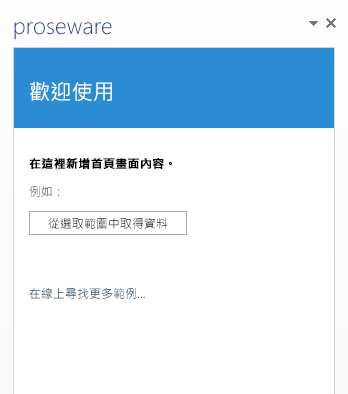

# 在 Microsoft Azure 上主控 Office 增益集

最簡單的 Office 增益集是由 XML 資訊清單檔和 HTML 網頁組成。XML 資訊清單檔描述增益集的特性，例如它的名稱、可執行哪些 Office 用戶端應用程式，和增益集的 HTML 網頁的 URL。HTML 網頁會包含在 Office 增益集網站中，當使用者安裝並執行您的增益集時會看到它，並可與它互動。 

您可以在眾多 Web 主控平台上主控 Office 增益集的網站，包括 Azure。若要在 Azure 上主控 Office 增益集，需要將 Office 增益集發佈至 Azure 網站。 

本主題假設您沒有使用 Azure 的經驗。當您完成時，您會有簡單的 Office 增益集，其具有在 Azure 上主控的網站。您將學習︰

- 如何將受信任的增益集目錄加入至 Office 2013
    
- 如何使用 Visual Studio 2015 或 Azure 管理入口網站，在 Azure 中建立網站
    
- 如何在 Azure 網站上發佈和主控 Office 增益集
    

**Azure 上主控的 Office 增益集網站**

## 設定包含 Azure SDK for .NET、Azure 訂閱及 Office 2013 的開發電腦

1. 從 [Azure 下載頁面](http://azure.microsoft.com/en-us/downloads/)安裝 Azure SDK for .NET。如果您沒有安裝 Visual Studio，會與 SDK 一起安裝 Visual Studio Express for Web。
    
    - 在 [語言]**** 下選擇 [.NET]****。
    
    - 如果已經安裝 Visual Studio，請選擇符合 Visual Studio 版本的 Azure .NET SDK 版本。
    
    - 當系統詢問您是否要執行或儲存安裝可執行檔，請選擇 [執行]****。
    
    - 在 [Web 平台安裝程式] 視窗中，選擇 [安裝]****。
    
2. 如果您尚未安裝，請安裝 Office 2013。 
    
     >**附註：**您可以取得[一個月的試用版](http://office.microsoft.com/en-us/try/?WT%2Eintid1=ODC%5FENUS%5FFX101785584%5FXT104056786)。
3. 取得您的 Azure 帳戶。
    
     >**附註：**如果您是 MSDN 訂閱者，[您的 MSDN 訂閱會包含 Azure 訂閱](http://www.windowsazure.com/en-us/pricing/member-offers/msdn-benefits/)。如果您不是 MSDN 訂閱者，您仍然可以[移至 Windows Azure 網站免費試用 Azure](https://azure.microsoft.com/en-us/pricing/free-trial/)。 

為簡化逐步解說並將重點放在搭配使用 Azure 與 Office 增益集，您會將本機檔案共用作為受信任的目錄，您將在其中儲存增益集的 XML 資訊清單檔。對於想要在一家或多家企業中使用的增益集，您可以將增益集資訊清單檔存放在 SharePoint 中，或將增益集發佈至 Office 市集。 

## 步驟 1：建立網路檔案共用來主控增益集資訊清單檔

1. 在開發電腦上開啟 [檔案總管] (如果使用 Windows 7 或較早版本的 Windows，則為 [Windows 檔案總管])。
    
2. 在 C:\ 磁碟機上按一下滑鼠右鍵，然後選擇 [新增]**** > **[資料夾]**。
    
3. 將新資料夾命名為 AddinManifests。
    
4. 在 [AddinManifests] 資料夾上按一下滑鼠右鍵，然後選擇 **[共用者]** > ** > [特定人士]**。
    
5. 在 [檔案共用]**** 中，選擇向下鍵，再選擇 [所有人]**** > **[新增]** > **[共用]**。
    

## 步驟 2：將檔案共用新增至受信任的增益集目錄，讓 Office 用戶端應用程式信任您用來安裝 Office 增益集的位置

1.  啟動 Word 2013 和建立文件。(雖然我們在這個範例中使用 Word 2013，但您可以使用任何支援 Office 增益集的 Office 應用程式，如 Excel、Outlook、PowerPoint 或 Project 2013。)
    
2.  選擇 [檔案]**** > **[選項]**。
    
3.  在 [Word 選項]**** 中，選擇 [信任中心]****，然後選擇 [信任中心設定]****。 
    
4.  在 [信任中心]****，按一下 [受信任的增益集目錄]****。輸入您稍早建立的檔案共用的通用命名慣例 (UNC) 路徑，以作為**目錄 URL**。例如，\\YourMachineName\AddinManifests。然後選擇 [新增目錄]****。 
    
5. 選取 [顯示於功能表中]**** 核取方塊。當您在受信任的增益集目錄的共用上儲存增益集的 XML 資訊清單檔時，增益集會出現在 [Office 增益集]**** 對話方塊的 [共用資料夾]**** 中 。
    

## 步驟 3：在 Azure 中建立網站

有幾種方式可讓您建立空 Azure 網站。如果使用 Visual Studio 2015，請依照[使用 Visual Studio 2015](../publish/host-an-office-add-in-on-microsoft-azure.md#using-visual-studio-2015) 的步驟，從 Visual Studio IDE 中建立 Azure 網站。您也可以依照[使用 Azure 管理入口網站](../publish/host-an-office-add-in-on-microsoft-azure.md#using-the-azure-management-portal)中的步驟來建立 Azure 網站。

### 使用 Visual Studio 2015

1. 在 Visual Studio 的 [檢視]**** 功能表中，選擇 [伺服器總管]****。以滑鼠右鍵按一下 [Azure]****，然後選擇 [連線到 Microsoft Azure 訂閱]****。遵循指示來連接 Azure 訂閱。
    
2. 在 Visual Studio 中，在 [伺服器總管]**** 中展開 [Azure]****，以滑鼠右鍵按一下 [應用程式服務]****，然後選擇 [建立新的 Web 應用程式]****。
    
3. 在 [在 Windows Azure 上建立 Web 應用程式]**** 對話方塊中，提供這項資訊︰
    
      - 輸入網站的唯一 **Web 應用程式名稱**。Azure 會驗證網站名稱在跨 azurewebsites.net 網域是唯一的。
    
  - 選擇您用來授權此網站建立的 **    App Service 方案**。如果建立新計劃，您也需要命名它。
    
  - 為您的網站選擇**資源群組**。如果建立新群組，您也需要命名它。
    
  - 選擇您適合的地理**區域**。
    
  - 針對**資料庫伺服器︰**，接受預設值 [沒有資料庫]****，然後選擇 [建立]****。
    

    新的網站隨即出現在伺服器總管****中的 **Azure** 的 [應用程式服務]**** 下的所選擇資源群組下。
    
4. 以滑鼠右鍵按一下新網站，然後選擇 [在瀏覽器中檢視]****。您的瀏覽器會開啟，並顯示包含「這個網站已成功建立」訊息的網頁。
    
5. 在瀏覽器網址列中，將網站的 URL 變為使用 HTTPS，然後按 **Enter** 來確認已啟用 HTTPS 通訊協定。Office 增益集模型需要增益集來使用 HTTPS 通訊協定。
    
6. 在 Visual Studio 2015 中，以滑鼠右鍵按一下 [伺服器總管]**** 中的新網站，選擇 [下載發佈設定檔]****，然後將設定檔儲存到您的電腦。發佈設定檔包含您的認證，並可讓您[步驟 5：將您的 Office 增益集發佈至 Azure 網站](../publish/host-an-office-add-in-on-microsoft-azure.md#step-5-publish-your-office-add-in-to-the-azure-website)。
    

### 使用 Azure 管理入口網站

1. 使用您的 Azure 帳戶登入 [Azure 管理入口網站](https://manage.windowsazure.com/)。
    
2. 選擇 [新增]**** > **[運算]** > **[WEB 應用程式]** > **[快速建立]**。 
    
3. 在 [URL]**** 下，輸入唯一的網站名稱來完成網站的 URL。管理入口網站會驗證網站名稱在跨 azurewebsites.net 網域是唯一的。
    
4. 選擇您的網站適合的地理**區域**。
    
5. 選擇 [建立 WEB 應用程式]****。Azure 管理入口網站會建立網站，並重新導向至可查看網站狀態的**網站**頁面。
    
    網站狀態為**執行**時，在**名稱**資料行下選擇網站 URL。您的瀏覽器會開啟，並顯示包含**已建立您的 Web 應用程式!** 訊息的網頁。 
    
    在瀏覽器網址列中，將網站的 URL 變為使用 HTTPS，然後按 **Enter** 來確認已啟用 HTTPS 通訊協定。Office 增益集模型需要增益集來使用 HTTPS 通訊協定。
    
6. 在 [Web 應用程式]**** 頁面上，選擇新網站。
    
7. 在 [發佈您的應用程式]**** 下選擇 [下載發佈設定檔]****，將發佈設定檔儲存至您的電腦。請記住檔案名稱和位置，因為您稍後會用到。
    
    發佈設定檔包含您的認證，並可讓您安全地發佈到 Azure。 
    

## 步驟 4：在 Visual Studio 中建立 Office 增益集

1. 以系統管理員身份啟動 Visual Studio。
    
2. 選擇 [檔案]**** > **[新增]** > **[專案]**。
    
3. 在 [範本]**** 下，展開 [Visual C#]**** (或 [Visual Basic]****)，展開 [Office/SharePoint]****，然後選擇 [Office 增益集]****。
    
4. 選擇 [Office 增益集]****，然後選擇 [確定]**** 接受預設設定。
    
5. 出現 [建立 Office 增益集]**** 時，保留工作窗格增益集的預設選擇，然後選擇 [下一步]****。
    
6. 在下一個頁面上，清除 Word 以外的所有核取方塊，然後選擇 [完成]****。
    
隨即建立基本 Office 增益集，並準備好發佈到 Azure。因為我們把焦點放在如何發佈至 Azure，因此您不會針對在 Visual Studio 中使用標準 Office 增益集範本所建立的範例增益集進行任何變更。

## 步驟 5：將您的 Office 增益集發佈至 Azure 網站

1. 在 Visual Studio 中開啟增益集範例，在 [方案總管]**** 中展開解決方案節點，讓您看到解決方案的兩個專案。
    
2. 在 Web 專案上按一下滑鼠右鍵，然後選擇 [發佈]****。 
    
    Web 專案會包含 Office 增益集網站檔案，因此這是您發佈到 Azure 的專案。
    
3. 在 [發佈 Web]**** 中，選擇 [匯入]****。 
    
4. 在 [匯入發佈設定]**** 中選擇 [瀏覽]****，然後瀏覽至您在本主題先前用來儲存發佈設定檔的位置。選擇 [確定]**** 匯入您的設定檔。
    
5. 在 [發佈 Web]**** 的 [連接]**** 索引標籤上，接受預設值並選擇 [下一步]****。 
    
    再次選擇 [下一步] **** 以接受預設的設定。
    
6. 在 [預覽]**** 索引標籤上，選擇 [開始預覽]****。預覽會顯示將發佈至 Azure 網站之 Web 專案的所有檔案。
    
7. 選擇 [發佈]****。Visual Studio 會將 Office 增益集的 Web 專案發佈到您的 Azure 網站。 
    
8. 當 Visual Studio 完成發佈 Web 專案時，您的瀏覽器會開啟，並顯示內含「這個 Web 應用程式已順利建立」文字的網頁。這是網站目前的預設網頁。
    
    若要查看您的增益集網頁，將 URL 變更為使用 https:，然後新增增益集的預設 HTML 頁面的路徑。例如，變更的 URL 看起來應該像 https://YourDomain.azurewebsites.net/Addin/Home/Home.html。這確認您的增益集網站現在由 Azure 主控。複製這個 URL，當您於本主題稍後步驟編輯增益集資訊清單檔案時會需要它。
    

## 步驟 6：編輯增益集資訊清單檔以指向 Azure 上的 Office 增益集

1. 在 [方案總管]**** 中開啟 Office 增益集範例的 Visual Studio，展開解決方案以顯示兩個專案。
    
2. 展開 [Office 增益集] 專案，例如 **OfficeAdd-in1**，在資訊清單資料夾上按一下滑鼠右鍵，再選擇 [開啟]****。顯示增益集資訊清單的屬性頁。
    
3. 對於 [來源位置︰]****，輸入在發佈增益集後，於先前的步驟中複製的增益集之主要 HTML 網頁的 URL，例如，https://YourDomain.azurewebsites.net/Addin/Home/Home.html。 
    
4. 選擇 [檔案]****，然後選擇 [全部儲存]****。關閉增益集資訊清單的屬性頁。
    
5. 回到 [方案總管]****，在資訊清單資料夾上按一下滑鼠右鍵，然後選擇 [在檔案總管中開啟資料夾]****。
    
6. 複製增益集資訊清單檔，例如 OfficeAdd-in1.xml。 
    
7. 瀏覽至您在本主題稍早建立的網路檔案共用，並在資料夾中貼上資訊清單檔。
    

## 步驟 7：在 Office 用戶端應用程式中插入並執行增益集

1. 啟動 Word 並開啟新文件。
    
2. 在功能區上，選擇 [插入]**** > **[我的應用程式]**，然後選擇 [全部查看]****。
    
3. 在 [適用於 Office 相關應用程式]**** 對話方塊中，選擇 [共用資料夾]****。搭配 Office 增益集模型的 Office 用戶端應用程式會掃描列為受信任的增益集目錄的資料夾，並在對話方塊中顯示增益集。您會看到增益集範例的圖示。
    
4. 選擇增益集的圖示，然後選擇 [插入]****。增益集隨即會插入用戶端應用程式的側邊。
    
5. 測試增益集正在運作，方法是在文件中建立一些文字，然後選取文字，再選擇 [從選取範圍中取得資料]****。
    

## 其他資源

- [發佈 Office 增益集](../publish/publish.md)
    
- [使用 Visual Studio 封裝增益集以準備發佈](../publish/package-your-add-in-using-visual-studio.md)
    
