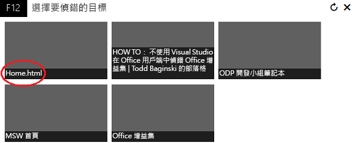
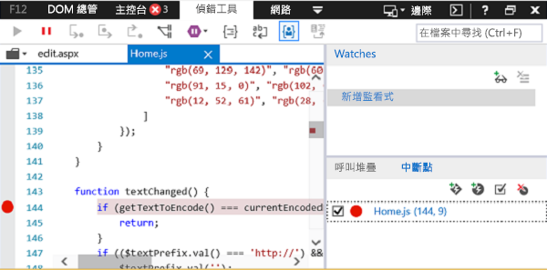
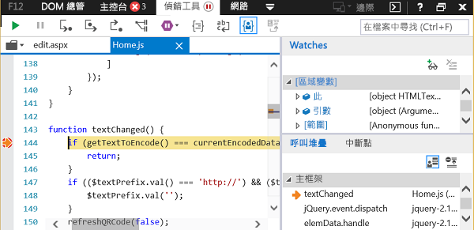

# 在 Windows 10 上使用 F12 開發人員工具偵錯增益集

Windows 10 隨附的 F12 開發者工具可協助您偵錯、測試和加速您的網頁。如果您不想要使用 IDE (例如 Visual Studio)，或如果您需要調查問題，同時在 IDE 外部執行增益集，您也可以使用它們開發和偵錯 Office 增益集。您可以在執行增益集後，啟動 F12 開發人員工具。

本文顯示如何從 Windows 10 的 F12 開發人員工具中，使用偵錯工具來測試您的 Office 增益集。您可以測試來自 Office 市集的增益集，或者您從其他位置新增的增益集。F12 工具會在個別的視窗中顯示，並且不使用 Visual Studio。

 >**附註**  偵錯工具是 Windows 10 和 Internet Explorer 上 F12 開發人員工具的一部分。較早版本 Windows 中不包含偵錯工具。 

### 必要條件

您需要下列軟體︰

- F12 開發人員工具，隨附於 Windows 10。 
    
- 裝載增益集的 Office 用戶端應用程式。 
    
- 您的增益集。 
    
### 使用偵錯工具

這個範例會使用 Word，及 Office 市集的可用增益集。

1. 開啟 Word，然後選擇空白文件。 
    
2. 在 **插入** 索引標籤中，在 [增益集] 群組、[市集] 中，選取「QR4Office」增益集。(您可以從市集或增益集類別目錄載入任何增益集。)
    
3. 啟動對應到您的 Office 版本的 F12 開發工具︰
    
      - 若為 32 位元版本的 Office，請使用 C:\Windows\System32\F12\F12Chooser.exe
    
  - 若為 64 位元版本的 Office，請使用 C:\Windows\SysWOW64\F12\F12Chooser.exe
    

    當您啟動 F12Chooser 時，另一個名為 [選擇要偵錯的目標] 視窗就會顯示可能要偵錯的應用程式。 選取您感興趣的應用程式。 如果您撰寫自己的增益集，請選取具有增益集部署，可能是 localhost URL 的網站。 
    
    例如，選取 **home.html**。 
    
    

4. 在 F12 視窗中，選取您想要偵錯的檔案。
    
    若要選取檔案，請選擇**指令碼** (左) 窗格上的資料夾圖示。 下拉式清單顯示可用的檔案。 選取 home.js。
    
5. 設定中斷點。
    
    若要在 home.js 中設定中斷點，選擇位於 _textChanged_ 函式的第 144 行。 您會在資料行左邊，以及**呼叫堆疊和中斷點** (右下) 窗格中的對應資料行看到一個紅點。 如需其他設定中斷點的方法，請參閱[使用偵錯工具檢查正執行的 JavaScript](https://msdn.microsoft.com/library/dn255007%28v=vs.85%29.aspx)。 
    
    

6. 執行增益集來觸發中斷點。
    
    選擇 [QR4Office] 窗格上半部的 [URL] 文字方塊來變更文字。 在偵錯工具的**呼叫堆疊和中斷點**窗格中，您會看到已經觸發中斷點，並顯示各種不同的資訊。 您可能需要重新整理 F12 工具，以查看結果。
    
    

## 其他資源

- [使用偵錯工具檢查正在執行的 JavaScript](https://msdn.microsoft.com/library/dn255007%28v=vs.85%29.aspx)
    
- [使用 F12 開發人員工具](https://msdn.microsoft.com/en-us/library/bg182326%28v=vs.85%29.aspx)
    
