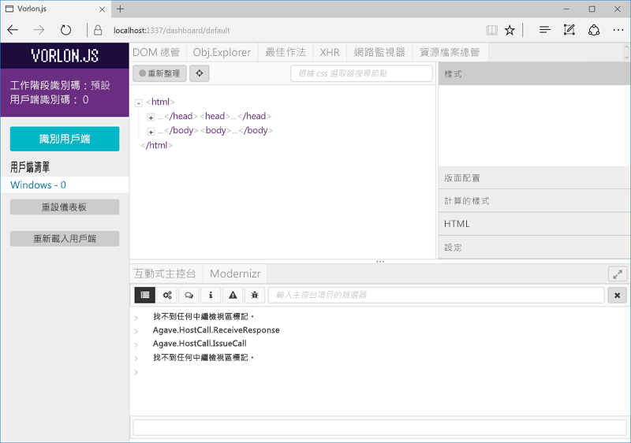

# <a name="debug-office-add-ins-on-ipad-and-mac"></a>在 iPad 和 Mac 上偵錯 Office 增益集

您可以在 Windows 上使用 Visual Studio 來開發並偵錯增益集，但您無法使用它來偵錯 iPad 或 Mac 上的增益集。由於增益集是使用 HTML 和 Javascript 開發，因此設計為跨平台使用，但不同瀏覽器呈現 HTML 的方式可能有細微差異。本文說明如何偵錯 iPad 或 Mac 上執行的增益集。 

## <a name="debugging-with-vorlonjs"></a>以 Vorlon.js 偵錯 

Vorlon.JS 是網頁的偵錯工具，類似於 F12 工具。它是設計來遠端工作，可以讓您在不同的裝置上偵錯網頁。如需詳細資訊，請參閱 [Vorlon 網站](http://www.vorlonjs.com)。  

### <a name="install-and-set-up-up-vorlonjs-on-a-mac-or-ipad"></a>在 Mac 或 iPad 上安裝及設定 Vorlon.JS 

1.    以系統管理員身分登入裝置。

2.    如果尚未安裝 [Node.js](https://nodejs.org)，則進行安裝。 

2.    開啟 [終端機]**** 視窗，然後輸入命令 `npm i -g vorlon`。工具是安裝至 `/usr/local/lib/node_modules/vorlon`。

### <a name="configure-vorlonjs-to-use-https"></a>設定 Vorlon.JS 以使用 HTTPS

若要使用 Vorlon.JS 偵錯應用程式，您從已知的位置將 `<script>` 標記新增至載入 Vorlon.JS 指令碼的應用程式起始頁面 (如需詳細資訊，請參閱下列程序)。增益集需要 HTTPS 通訊協定；也就是 SSL。它們使用的擴充和任何指令碼必須是從 HTTPS 伺服器託管，包括 Vorlon.JS 指令碼。因此，您必須設定 Vorlon.JS 以使用 SSL，以便使用 Vorlon.JS 與增益集。 

4.    在 [Finder]**** 中，請移至 `/usr/local/lib/node_modules/vorlon`，開啟 `/Server` 資料夾的內容功能表 (按一下滑鼠右鍵)，然後選取 [取得資訊]****。

5.    選擇 [伺服器資訊]**** 視窗右下角中的掛鎖圖示，以解除鎖定資料夾。

6. 在視窗的 [共用和權限]**** 區段中，將 [人員]**** 群組的 [權限]**** 設定為 [讀取 & 寫入]****。

7. 再次選擇掛鎖圖示以重新鎖定******資料夾。

8. 回到 [Finder]****，展開 `/Server` 子資料夾，以滑鼠右鍵按一下檔案 `config.json`，然後選取 [取得資訊]****。

9. 在 [config.json 資訊]**** 視窗中，以您針對其父系 `/Server` 資料夾所做的完全相同方式，變更檔案的權限。請務必重新鎖定並關閉視窗。

10. 回到 [Finder]****，以滑鼠右鍵按一下檔案 `config.json`，選取 [開啟檔案]****，然後選取 [TextEdit]****。該檔案會在文字編輯器中開啟。

11. 將 **useSSL** 屬性的值變更為 `true`。

12. 在 [外掛程式]**** 區段中，尋找**識別碼**為 `OFFICE` 且**名稱**為 `Office Addin` 的外掛程式。如果外掛程式的**已啟用**屬性尚未為 `true`，請將其設定為 `true`。

13. 儲存檔案並且關閉編輯器。

5.    在 [Finder]**** 中，導覽至 `/usr/local/lib/node_modules/vorlon`，以滑鼠右鍵按一下 `Server` 子資料夾，然後選取 [New terminal at folder]****。 
    
7.    在 [終端機]**** 視窗中，輸入 `sudo vorlon`。系統會提示您輸入系統管理員密碼。Vorlon 伺服器隨即啟動。保持 [終端機]**** 視窗開啟。

6.    開啟瀏覽器視窗並移至 `https://localhost:1337`，也就是 Vorlon.JS 介面。出現提示時，選擇 [永遠]**** 以信任安全性憑證。 

    >**附註：**如果沒有看到提示，您可能需要手動信任憑證。憑證檔案是 `/usr/local/lib/node_modules/vorlon/Server/cert/server.crt`。請嘗試下列步驟。如果您遇到困難，請參閱 Macintosh 或 iPad 的說明。 
    >
    >1. 關閉瀏覽器視窗，並且在執行 Vorlon 伺服器的 [終端機]**** 視窗中，使用 Control-C 來停止伺服器。
    >2. 在 [Finder]**** 中，以滑鼠右鍵按一下 `server.crt` 檔案，然後選取 [Keychain 存取]****。[Keychain 存取]**** 視窗隨即開啟。
    >2. 在左側的 [Keychain]**** 清單中，選取 [登入]**** (如果尚未選取的話)，然後在 [類別]**** 區段中選取 [憑證]****。會列出憑證 **localhost**。
    >3. 以滑鼠右鍵按一下憑證 **localhost**，然後選取 [取得資訊]****。[localhost]**** 視窗隨即開啟。
    >4. 在 [信任]**** 區段中，開啟標示為 [使用這個憑證時]**** 的選擇器，然後選取 [永遠信任]****。 
    >5. 關閉 [localhost]**** 視窗。如果動作成功，[Keychain 存取]**** 視窗中的 **localhost** 憑證，在其圖示上的藍色圈圈中有白色十字。

### <a name="configure-the-add-in-for-vorlonjs-debugging"></a>設定增益集以進行 Vorlon.JS 偵錯

1. 將下列指令碼標記新增至增益集的 Home.html 檔 (或主要 HTML 檔案) 的 `<head>` 區段︰
```    
<script src="https://localhost:1337/vorlon.js"></script>    
```  

2. 將增益集 Web 應用程式部署到可以從 Mac 或 iPad 存取的 Web 伺服器，例如 Azure 網站。 

3. 更新所有位置之增益集的 URL，在其中 URL 顯示在增益集資訊清單中。

4. 將增益集資訊清單複製到 Mac 或 iPad 的下列資料夾︰`/Users/{your_name_on_the_device}/Library/Containers/com.microsoft.{host_name}/Data/Documents/wef`，其中 *{host_name}* 是 Word、Excel、PowerPoint 或 Outlook。

### <a name="inspect-an-add-in-in-vorlonjs"></a>檢查 Vorlon.JS 中的增益集

1. 如果 Vorlon 伺服器未執行，在 [Finder]**** 中，導覽至 `/usr/local/lib/node_modules/vorlon`，以滑鼠右鍵按一下 `Server` 子資料夾，然後選取 [New terminal at folder]****。 
    
7.    在 [終端機]**** 視窗中，輸入 `sudo vorlon`。系統會提示您輸入系統管理員密碼。Vorlon 伺服器隨即啟動。保持 [終端機]**** 視窗開啟。

6.    開啟瀏覽器視窗並移至 `https://localhost:1337`，也就是 Vorlon.JS 介面。

7. 側載增益集。如果是 Excel、PowerPoint 或 Word，如[在 iPad 和 Mac 上側載 Office 增益集](https://dev.office.com/docs/add-ins/testing/sideload-an-office-add-in-on-ipad-and-mac)中所述將其側載。如果是 Outlook 增益集，如[側載 Outlook 增益集進行測試](https://dev.office.com/docs/add-ins/testing/sideload-outlook-add-ins-for-testing)中所述將其側載。如果增益集未使用增益集命令，它會立即開啟。否則，請選擇按鈕以開啟增益集。根據 Office 主應用程式的組建，按鈕會在 [首頁]**** 索引標籤或 [增益集]**** 索引標籤上。

增益集將會在 Vorlon.JS (Vorlon.JS 介面的左邊) 中的用戶端清單中顯示為 **{OS} - n**，n** 為某個數字，{OS}** 是裝置類型，例如 "Macintosh"。 



Vorlon 工具有各種外掛程式。目前已啟用的外掛程式會顯示為工具頂端的索引標籤。(您可以藉由選擇左邊的齒輪圖示來啟用更多的外掛程式。)這些外掛程式類似 F12 工具中的功能。例如，您可以反白顯示 DOM 元素、執行命令等等。如需詳細資訊，請參閱 [Vorlon 文件核心外掛程式](http://vorlonjs.com/documentation/#console) 

**Office 增益集**外掛程式會新增 Office.js 的額外功能，例如瀏覽物件模型、執行 Office.js 呼叫，以及讀取物件屬性的值。如需指示，請參閱[偵錯 Office 增益集的 VorlonJS 外掛程式](https://blogs.msdn.microsoft.com/mim/2016/02/18/vorlonjs-plugin-for-debugging-office-addin/)。

>**附註：**無法在 Vorlon.JS 中設定中斷點。

## <a name="clearing-the-office-applications-cache-on-a-mac-or-ipad"></a>清除 Mac 或 iPad 上的 Office 應用程式快取

基於效能考量，Office for Mac 中通常會快取增益集。一般而言，會藉由重新載入增益集來清除快取。如果相同文件中有多個增益集存在，在重新載入時自動清除快取的程序可能不可靠。 

在 Mac 上，您可以手動清除快取，方法是刪除 `/Users/{your_name_on_the_device}/Library/Containers/com.Microsoft.OsfWebHost/Data/` 資料夾中的所有項目。 

在 iPad 上，您可以在增益集中從 JavaScript 呼叫 `window.location.reload(true)`以強制重新載入。或者，您可以重新安裝 Office。
