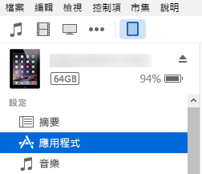
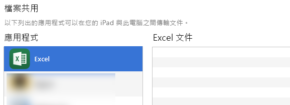
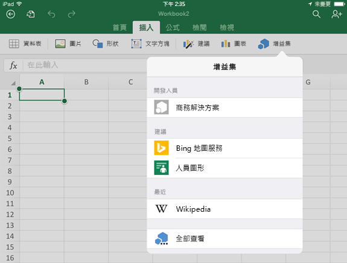
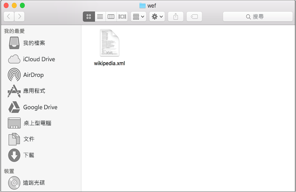
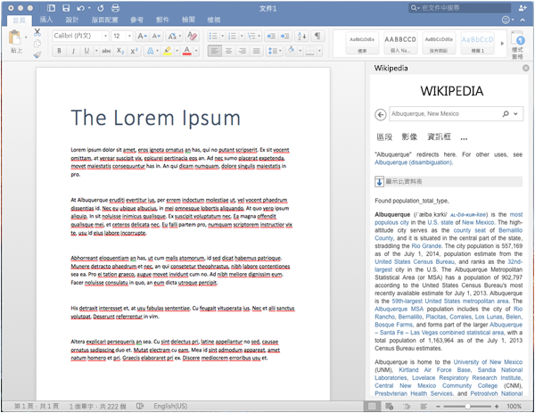

# 在 iPad 和 Mac 上側載 Office 增益集來進行測試

若要查看如何在 Office for iOS 上執行增益集，您可以使用 iTunes 將增益集的資訊清單側載到 iPad，或直接在 Office for Mac 中側載增益集的資訊清單。這個動作不會讓您設定中斷點，及偵錯正在執行之增益集的程式碼，但您可以檢查其行為，並驗證 UI 可重複使用及適當呈現。 

## Office for iOS 的必要條件

- 安裝 [iTunes](http://www.apple.com/itunes/download/) 的 Windows 或 Mac 電腦。
    
- 安裝 [Excel for iPad](https://itunes.apple.com/us/app/microsoft-excel/id586683407?mt=8)，且執行 iOS 8.2 或更新版本的 iPad，以及一條同步纜線。
    
- 您要測試增益集的資訊清單 .xml 檔。
    

## Office for Mac 的必要條件

- 安裝 [Office for Mac](https://products.office.com/en-us/buy/compare-microsoft-office-products?tab=omac)，且執行 OS X v10.10 "Yosemite" 或更新版本的 Mac。
    
- Word for Mac 15.18 版 (160109)。
   
- Excel for Mac 15.19 版 (160206)。

- PowerPoint for Mac 15.24 版 (160614)
    
- 您要測試增益集的資訊清單 .xml 檔。
    

## 在 Excel 或 Word for iPad 上側載增益集

1. 使用同步纜線將 iPad 連接到電腦。若是第一次將 iPad 連接到電腦，系統會提示您：**信任這台電腦？**選擇 [信任] 以繼續。

2. 在 iTunes 中，選擇功能表列下方的 [iPad] 圖示。
    
    ![iTunes 中的 [iPad] 圖示](../../images/4ea35904-252e-45b4-88ad-14840d502bad.png)

3. 在 iTunes 左側的 [設定] 下方，選擇 [應用程式]。
    
    

4. 在 iTunes 右側，向下捲動到 [檔案共用]，然後選擇 [增益集] 資料行中的 [Excel] 或 [Word]。
    
    

5. 在 [Excel] 或 [Word 文件] 資料行底部，選擇 [新增檔案]，然後選取您想要側載的增益集的資訊清單 .xml 檔案。 
    
6. 在您的 iPad 上開啟 Excel 或 Word 應用程式。如果 Excel 或 Word 應用程式已在執行中，請選擇 [家用] 按鈕，然後關閉並重新啟動應用程式。
    
7. 開啟文件。
    
8. 在 [插入] 索引標籤上選擇 [增益集]。您的側載增益集可在 [增益集] UI 的 [開發人員] 標題下用來插入。
    
    

## 在 Office for Mac 上側載增益集

> **附註：**若要側載 Outlook 2016 for Mac 增益集，請參閱[側載 Outlook 增益集來進行測試](sideload-outlook-add-ins-for-testing.md)。

1. 開啟 [終端機] 並前往下列其中一個資料夾，您將在其中儲存增益集的資訊清單檔案。如果 `wef` 資料夾不存在於您的電腦上，請建立它。
    
    - 對於 Word：`/Users/<username>/Library/Containers/com.microsoft.Word/Data/documents/wef`    
    - 對於 Excel：`/Users/<username>/Library/Containers/com.microsoft.Excel/Data/documents/wef`
    - 對於 PowerPoint：`/Users/<username>/Library/Containers/com.microsoft.Powerpoint/Data/documents/wef`
    
2. 使用命令 `open .` (包括句點)，在 **Finder** 中開啟資料夾。將增益集的資訊清單檔案複製到這個資料夾。
    
    

3. 開啟 Word，然後開啟文件。如果已經在執行，請重新啟動 Word。
    
4. 在 Word 中，選擇 [插入] > [增益集] > [我的增益集] (下拉功能表)，然後選擇增益集。
    
    

  > **重要事項：**側載的增益集將不會出現在 [我的增益集] 對話方塊中。它們只會顯示在下拉式功能表 ([我的增益集] 右邊的小型向下箭號) 中。側載的增益集會顯示此清單的「開發人員增益集」標題下方。 
    
5. 確認在 Word 中已顯示增益集。
    
    
    
> **附註：**基於效能考量，Office for Mac 中通常會快取增益集。若在開發增益集時需要強制重新載入，您可以清除 Users/<usr>/Library/Containers/com.Microsoft.OsfWebHost/Data/ 資料夾。 

## 其他資源

- [在 iPad 和 Mac 上偵錯 Office 增益集](../testing/debug-office-add-ins-on-ipad-and-mac.md)
    
