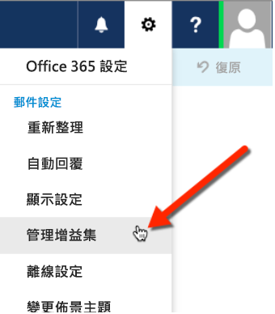

# 側載 Outlook 增益集來進行測試

您可以使用側載來安裝 Office 增益集進行測試，而不必先將它放入增益集目錄。

 >**附註**  您也可以側載其他 Office 套件應用程式的增益集。如需詳細資訊，請參閱[側載 Office 增益集來進行測試](create-a-network-shared-folder-catalog-for-task-pane-and-content-add-ins.md)。

## 若要側載 Outlook 增益集

1. 移至 [Outlook Web App](https://outlook.office365.com)。
    
2. 選擇右上方區段中的齒輪圖示，並選取 [管理增益集]。
    
    

3. 在 [管理增益集] 頁面上，選取 **+** 圖示，然後選取 [從檔案中新增]。
    
    ![管理指向 [從檔案新增] 選項的增益集螢幕擷取畫面](../../images/c0161290-c65a-45d2-9fc7-b54283e13e6f.PNG)

4. 找出並安裝自訂增益集的資訊清單檔。在安裝期間接受所有提示。
    
完成時，選取現有的電子郵件，您會在包含增益集的電子郵件標頭下方看到水平列。接下來，建立電子郵件，然後選擇 [增益集] (或 [應用程式]) 功能表項目以顯示工作窗格。選取增益集，它會出現在工作窗格中。

    
